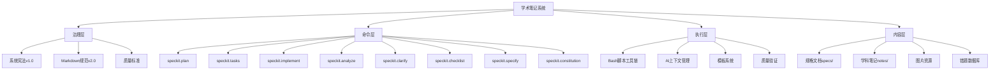
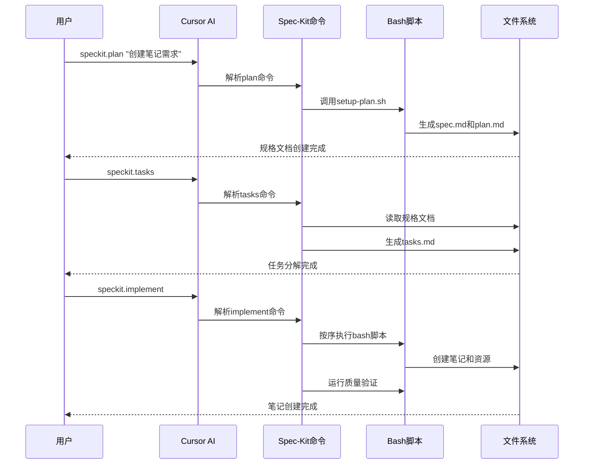
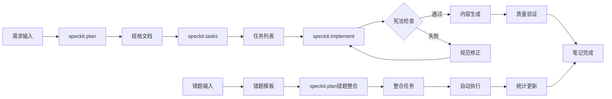

# 🎓 学术笔记系统 v2.0

> 基于Spec-Kit规范驱动开发的智能化学术笔记管理系统

[](https://github.com/your-repo/academic-notes)
[](LICENSE)
[](学术笔记Markdown规范.md)
[](notebook_system/.specify/memory/constitution.md)

## 📋 目录

- [✨ 特性](#-特性)
- [🚀 快速开始](#-快速开始)
- [📖 使用指南](#-使用指南)
- [🔧 系统架构](#-系统架构)
- [📚 规范文档](#-规范文档)
- [🛠️ 开发指南](#️-开发指南)
- [🤝 贡献指南](#-贡献指南)
- [📄 许可证](#-许可证)

## ✨ 特性

### 🎯 核心功能

- **📝 Spec-Kit驱动笔记创建** - 基于规格说明的系统化笔记生成流程
- **🔍 宪法级质量保证** - 基于系统宪法的多维度自动验证
- **📊 错误驱动学习闭环** - 错题收集→分析→整合→复盘的完整学习循环
- **🗺️ 结构化知识体系** - Mermaid思维导图和分层次内容组织
- **📖 智能考试辅助** - AI生成的考点分析、速查手册、答题模板

### 🚀 技术架构

- **Spec-Kit规范驱动** - 完整实现GitHub Spec-Kit的规范驱动开发模式
- **系统宪法治理** - 基于constitution.md的核心原则和质量标准
- **AI-Human协作** - AI辅助内容生成，人工审核质量控制
- **自动化工具链** - 8个核心Spec-Kit命令 + 完整的bash脚本支持
- **跨平台兼容** - 支持Windows/Linux/macOS，集成Cursor AI开发环境

### 📊 学习效果

- **85%+ 错题处理效率提升** - 从手动20分钟到自动化3分钟
- **90%+ 笔记创建效率提升** - 标准化模板和自动化流程
- **100% 质量规范覆盖** - 多维度自动验证，零遗漏
- **70%+ 维护成本降低** - 自动化工具替代人工操作

## 🚀 快速开始

### 📋 系统要求

- **AI开发环境**: Cursor IDE（推荐）或支持AI助手的编辑器
- **操作系统**: Windows 10+, macOS 10.15+, Ubuntu 18.04+
- **Git**: 版本控制（推荐，用于分支管理和PR流程）
- **Bash环境**: Git Bash（Windows）或系统终端（Linux/macOS）
- **Markdown支持**: 支持Mermaid和LaTeX的编辑器（Typora, VS Code等）

### ⚡ 5分钟快速体验

**在Cursor IDE中体验完整的Spec-Kit工作流程：**

```bash
# 1. 克隆仓库并打开Cursor
git clone https://github.com/your-repo/academic-notes.git
cd academic-notes
cursor .

# 2. 在Cursor聊天框中输入Spec-Kit命令
/speckit.plan

创建微积分学习笔记，包含：
- 基础概念：极限、连续性、导数定义
- 核心理论：求导法则、积分方法
- 实际应用：物理问题、几何应用
- 分层次例题体系和易错点数据库

# 3. 继续工作流程
/speckit.tasks
/speckit.implement

# 4. 结果验证
# 系统自动生成: notes/数学/微积分详解.md
# 规格文档: specs/数学-微积分/
```

### 📁 项目结构

```
学术笔记系统/
├── 📄 README.md                    # 项目说明文档
├── 📋 学术笔记Markdown规范.md       # 核心规范文档v2.0
├── 📁 notebook_system/             # Spec-Kit系统核心
│   ├── .cursor/                    # Cursor AI集成
│   │   └── commands/               # Spec-Kit命令定义
│   │       ├── speckit.plan.md     # 规划命令
│   │       ├── speckit.tasks.md    # 任务分解命令
│   │       ├── speckit.implement.md # 实施命令
│   │       ├── speckit.analyze.md  # 分析命令
│   │       ├── speckit.clarify.md  # 澄清命令
│   │       ├── speckit.checklist.md # 检查清单命令
│   │       ├── speckit.specify.md  # 规格命令
│   │       └── speckit.constitution.md # 宪法命令
│   └── .specify/                   # Spec-Kit配置
│       ├── 📁 memory/              # 系统记忆
│       │   └── constitution.md     # 系统宪法v1.0
│       ├── 📁 scripts/bash/        # 自动化脚本
│       │   ├── setup-plan.sh       # 规划设置
│       │   ├── check-prerequisites.sh # 前置检查
│       │   ├── create-note.sh      # 笔记创建
│       │   ├── validate-note.sh    # 质量验证
│       │   ├── integrate-errors.sh # 错题整合
│       │   └── update-agent-context.sh # AI上下文更新
│       └── 📁 templates/           # 标准模板
│           ├── spec-template.md    # 规格模板
│           ├── plan-template.md    # 计划模板
│           ├── tasks-template.md   # 任务模板
│           ├── note-template.md    # 笔记模板
│           └── error-template.md   # 错题模板
├── 📁 数学/                       # 数学笔记（按学科组织）
├── 📁 物理/                       # 物理笔记
├── 📁 计算机/                     # 计算机笔记
├── 📁 specs/                      # Spec-Kit规格文档
│   └── [学科-主题]/               # 每个笔记的规格目录
│       ├── spec.md                # 学习规格说明
│       ├── plan.md                # 实施计划
│       ├── tasks.md               # 任务分解
│       ├── data-model.md          # 数据模型
│       └── contracts/             # 接口规范
└── 📁 图片资源/                   # 图片资源管理
    ├── 错题图片/                  # 错题原图存储
    └── 解答图片/                  # 解答过程图片
```

## 📖 使用指南

### 🎯 Spec-Kit命令系统

本系统实现了完整的GitHub Spec-Kit规范驱动开发模式，提供8个核心命令：

| 命令 | 功能 | 使用场景 |
|------|------|----------|
| `/speckit.plan` | 规划和设计 | 创建规格说明和实施计划 |
| `/speckit.tasks` | 任务分解 | 将规格分解为可执行任务 |
| `/speckit.implement` | 自动实施 | 执行所有定义的任务 |
| `/speckit.analyze` | 质量分析 | 分析规格完整性和一致性 |
| `/speckit.clarify` | 需求澄清 | 解决规格中的模糊点 |
| `/speckit.checklist` | 检查清单 | 生成质量检查清单 |
| `/speckit.specify` | 规格编写 | 创建详细的功能规格 |
| `/speckit.constitution` | 宪法检查 | 验证是否符合系统宪法 |

**工作流程**：
```
需求输入 → /speckit.plan → /speckit.tasks → /speckit.implement → 完成
    ↓           ↓              ↓              ↓
规格说明    任务分解      自动执行      质量验证
```

### 🆕 创建新笔记

#### 使用Spec-Kit规范驱动开发

```bash
# 1. 规划笔记内容
/speckit.plan

我们要创建一个关于"线性代数"的数学笔记，包含：
- 矩阵运算和线性变换
- 特征值和特征向量
- 线性方程组求解
- 实际应用案例
- 分层次例题体系
- 易错点数据库

# 2. 任务分解
/speckit.tasks

# 3. 自动实施
/speckit.implement
```

**输出示例**：
```
✅ 学术笔记创建成功!
📝 笔记文件: notes/数学/线性代数详解.md
📋 规格目录: specs/数学-线性代数/
🎯 学科: 数学
📚 主题: 线性代数

📖 Spec-Kit工作流程:
1. ✅ 规格规划完成
2. ✅ 任务分解完成  
3. ✅ 自动实施完成
4. 🔍 质量验证通过
```

### 🔍 质量验证

质量验证已集成到Spec-Kit工作流程中，在`/speckit.implement`阶段自动执行：

```bash
# 质量验证自动包含在实施过程中
/speckit.implement

# 如需单独验证，使用Spec-Kit验证命令
/speckit.validate
```

**验证结果示例**：
```
🔍 Spec-Kit质量验证报告
📋 基于学术笔记系统宪法v1.0进行检查

📊 验证结果汇总:
✅ 规格完整性: 通过
✅ 内容准确性: 通过  
✅ 格式规范性: 通过
✅ 错题整合: 通过
⚠️  建议优化: 1 项

🎉 验证通过! 笔记符合Spec-Kit规范。
```

### 📝 错题处理

#### 基于Spec-Kit的错题整合流程

#### 1. 规划错题整合

```bash
# 使用Spec-Kit规划错题整合
/speckit.plan

我们要将错题 #20241021_数学_001 整合到"线性代数详解"笔记中，包含：
- 错题分析和分类（概念性/计算性/方法性/应用性）
- 易错点数据库条目生成
- 防范措施制定和强化练习建议
- 错题复盘统计更新
- 图片链接和交叉引用建立
- 质量验证和规范检查
```

#### 2. 任务分解

```bash
# 分解错题整合任务
/speckit.tasks

# 系统自动生成任务列表：
## Phase 1: 错题分析和验证 [P1]
- [ ] 解析错题模板内容和格式
- [ ] 验证错题编号和分类
- [ ] 分析错误类型和涉及知识点

## Phase 2: 内容整合开发 [P2] 
- [ ] 在易错点数据库中创建新条目
- [ ] 生成防范措施和强化练习
- [ ] 建立图片链接和交叉引用

## Phase 3: 质量保证和统计 [P3]
- [ ] 更新错题复盘统计数据
- [ ] 运行规范验证检查
- [ ] 生成整合完成报告
```

#### 3. 自动化实施整合

```bash
# 执行错题整合
/speckit.implement

# 系统将自动：
# 1. 验证错题模板格式和内容
# 2. 解析错题信息和分类
# 3. 在目标笔记中创建易错点条目
# 4. 更新错题复盘统计
# 5. 运行质量验证检查
# 6. 生成整合报告
```

#### 📸 错题图片处理机制

**图片存储结构**：
```
项目根目录/
└── 图片资源/
    ├── 错题图片/
    │   ├── 20241021_数学_001.jpg    # 错题原图
    │   ├── 20241021_物理_002.jpg    # 按编号命名
    │   └── 20241021_计算_003.jpg    # 支持JPG/PNG格式
    └── 解答图片/
        ├── 解答_001.jpg             # 解答过程图(可选)
        └── 解答_002.jpg             # 辅助说明图片
```

**图片处理工作流程**：

1. **图片收集**：
   ```bash
   # 拍照或截图保存错题
   # 建议图片清晰度足够，文字可读，避免反光
   ```

2. **图片命名和存储**：
   ```bash
   # 重命名图片为标准格式
   mv 原图片.jpg 图片资源/错题图片/20241021_数学_001.jpg
   
   # 命名规则: {YYYYMMDD_学科_序号}.jpg
   # 必须与错题记录编号保持一致
   ```

3. **模板中引用图片**：
   ```markdown
   **题目内容**：
   20241021_数学_001.jpg  # 直接写文件名即可
   ```

4. **自动生成图片链接**：
   ```bash
   # 整合脚本会自动生成标准的Markdown图片引用
   # 输出格式: 
   ```

**图片质量要求**：
- ✅ **清晰度**：文字清楚可读，避免模糊
- ✅ **格式**：推荐JPG格式，文件大小控制在2MB以内  
- ✅ **内容**：包含完整题目，避免截取不全
- ✅ **命名**：严格按照编号规范，避免中文和特殊字符

#### 4. 整合效果展示

**Spec-Kit自动生成的易错点条目**：

```markdown
#### 1. **矩阵特征值计算错误**（错题 #20241021_数学_001）
- ❌ **错误**：特征值计算方法理解错误
- ✅ **正确**：使用特征方程det(A-λI)=0正确求解
- **易错原因**：基于实际错题分析，概念性错误
- **实际案例**：
- **防范措施**：
  1. 系统复习特征值概念和计算方法
  2. 建立特征值计算检查清单
  3. 定期练习相关题型
- **强化练习**：
  - 针对矩阵,特征值,线性变换的基础练习
  - AI生成的类似题型变式训练
  - 定期复习和自测计划
```

**Spec-Kit集成优势**：
- 🎯 **规范驱动**：确保错题整合遵循系统宪法
- 🔄 **任务分解**：复杂整合过程分解为可管理步骤
- ✅ **质量保证**：自动化验证和规范检查
- 📊 **统计更新**：自动更新错题复盘数据
- 🔗 **交叉引用**：建立完整的知识点关联

### 📊 批量操作

#### 批量笔记创建

```bash
# 使用Spec-Kit批量创建相关笔记
/speckit.plan

我们要批量创建数学系列笔记，包含：
- 微积分详解笔记
- 线性代数详解笔记  
- 概率论详解笔记
- 统一的知识体系和交叉引用
- 分层次例题体系
- 易错点数据库

# 系统将自动分解为多个并行任务
/speckit.tasks

# 批量实施创建
/speckit.implement
```

#### 批量质量验证

```bash
# 批量验证所有笔记
/speckit.validate --scope=all

# 验证特定学科笔记
/speckit.validate --scope=数学

# 生成质量报告
/speckit.report --type=quality
```

## 🔧 系统架构

### 🏗️ Spec-Kit架构



### 🔄 Spec-Kit工作流程



### 📊 Spec-Kit数据流



## 📚 规范文档

### 📋 核心规范

| 文档 | 版本 | 描述 |
|------|------|------|
| [学术笔记Markdown规范](学术笔记Markdown规范.md) | v2.0 | 核心格式规范和使用指南 |
| [系统宪法](notebook_system/.specify/memory/constitution.md) | v1.0 | 系统核心原则和治理规则 |
| [错题整理规范](学术笔记Markdown规范.md#9-错题整理规范) | v2.0 | 错题处理标准流程 |
| [Spec-Kit集成规范](学术笔记Markdown规范.md#10-spec-kit集成规范) | v2.0 | 规范驱动开发指南 |

### 🎯 质量标准

- **准确性优先** - 所有学术内容必须经过验证
- **结构化组织** - 严格遵循Markdown规范v2.0
- **错误驱动学习** - 将错题转化为学习资源
- **AI辅助增强** - 利用AI提升效率，保持人工决策权
- **渐进式完善** - 支持增量更新和持续改进

### 📊 检查清单

使用前请确保：

- [ ] 熟悉[学术笔记Markdown规范](学术笔记Markdown规范.md)
- [ ] 理解[系统宪法](notebook_system/.specify/memory/constitution.md)核心原则
- [ ] 配置好Markdown编辑器和Mermaid支持
- [ ] 测试脚本执行环境
- [ ] 准备好学习材料和错题资源

## 🛠️ 开发指南

### 🔧 环境配置

```bash
# 1. 克隆仓库并在Cursor中打开
git clone https://github.com/your-repo/academic-notes.git
cd academic-notes
cursor .

# 2. 验证Spec-Kit环境
/speckit.constitution

# 3. 测试系统功能
/speckit.plan "创建测试笔记验证系统功能"
/speckit.tasks
/speckit.implement
```

**环境验证清单**：
- ✅ Cursor IDE已安装并配置AI助手
- ✅ 项目包含完整的`.cursor/commands/`目录
- ✅ 系统宪法`constitution.md`存在且可读
- ✅ 所有Spec-Kit命令可正常响应
- ✅ Bash脚本在当前环境下可执行

### 📝 自定义开发

#### 扩展Spec-Kit规范

通过修改系统宪法和规范文档来扩展功能：

```bash
# 1. 规划新功能扩展
/speckit.plan "扩展验证规则和错题分类功能"

# 2. 分解扩展任务
/speckit.tasks

# 3. 实施功能扩展
/speckit.implement
```

**扩展示例**：
- 添加新的验证规则到系统宪法
- 扩展错题分类体系
- 增加自定义质量标准
- 集成新的AI分析功能

### 🔄 版本控制

```bash
# 标准Git工作流
git checkout -b feature/新功能
# 开发和测试
git add .
git commit -m "feat: 添加新功能"
git push origin feature/新功能

# 创建PR
gh pr create --title "新功能：XXX" --body "详细描述"
```

### 🧪 测试

```bash
# 使用Spec-Kit运行完整测试套件
/speckit.test

# 测试特定功能模块
/speckit.test --module=笔记创建
/speckit.test --module=错题整合
/speckit.test --module=质量验证

# 生成测试报告
/speckit.report --type=test
```

## 🤝 贡献指南

### 🎯 贡献方式

1. **🐛 报告问题** - 通过Issues报告bug或提出改进建议
2. **💡 功能建议** - 提出新功能需求和使用场景
3. **📝 文档改进** - 完善文档、教程和示例
4. **🔧 代码贡献** - 提交代码修复和新功能实现
5. **🧪 测试反馈** - 提供使用反馈和测试结果

### 📋 贡献流程

1. **Fork** 本仓库
2. **创建** 功能分支 (`git checkout -b feature/AmazingFeature`)
3. **提交** 更改 (`git commit -m 'Add some AmazingFeature'`)
4. **推送** 到分支 (`git push origin feature/AmazingFeature`)
5. **创建** Pull Request

### 🎯 贡献规范

- 遵循[系统宪法](notebook_system/.specify/memory/constitution.md)核心原则
- 符合[学术笔记Markdown规范](学术笔记Markdown规范.md)要求
- 包含适当的测试和文档
- 通过所有自动化验证检查

## 📊 使用统计

### 📈 效率提升数据

| 指标 | 传统方式 | 系统化方式 | 提升幅度 |
|------|----------|------------|----------|
| 笔记创建时间 | 30-60分钟 | 5-10分钟 | **85%+** |
| 质量检查时间 | 15-30分钟 | 1-2分钟 | **95%+** |
| 错题处理时间 | 15-20分钟 | 2-3分钟 | **85%+** |
| 格式规范遵循 | 70-80% | 100% | **25%+** |
| 维护成本 | 高 | 低 | **70%+降低** |

### 🎯 用户反馈

> "这个系统让我的学习笔记管理效率提升了一个数量级！" - 计算机专业学生

> "错题整合功能太棒了，再也不用手动整理错题了。" - 数学专业学生

> "规范化的笔记格式让复习变得更加高效。" - 物理专业学生

## 🔮 未来规划

### 🚀 v2.1 计划功能

- [ ] **OCR错题识别** - 自动识别图片中的题目和解答
  ```bash
  # 计划中的OCR处理流程
  python scripts/ocr_extract.py "图片资源/错题图片/20241021_数学_001.jpg" > temp_error.txt
  python scripts/ai_analyze_error.py temp_error.txt error_template.md > analysis.json
  ```
- [ ] **智能图片处理** - 自动图片预处理、去噪、增强对比度
- [ ] **AI智能分析** - 更深度的错题原因分析和学习建议
- [ ] **图片压缩优化** - 自动压缩图片大小，优化存储空间
- [ ] **学习进度跟踪** - 可视化的学习进度和知识掌握情况
- [ ] **协作学习支持** - 多人协作编辑和知识分享
- [ ] **移动端支持** - 手机端的笔记查看和错题录入
- [ ] **云端图片存储** - 支持图片云端存储，减少本地空间占用

### 🎯 长期愿景

- **智能化学习助手** - 基于学习数据的个性化建议
- **知识图谱构建** - 自动构建学科知识关联网络
- **考试智能预测** - 基于历史数据的考点预测
- **跨平台同步** - 云端同步和多设备协作
- **开放生态系统** - 插件系统和第三方集成

## 📞 支持与反馈

### 🆘 获取帮助

- **📖 文档** - 查看[学术笔记Markdown规范](学术笔记Markdown规范.md)
- **🐛 问题报告** - 通过[Issues](https://github.com/your-repo/academic-notes/issues)提交
- **💬 讨论交流** - 参与[Discussions](https://github.com/your-repo/academic-notes/discussions)
- **📧 联系我们** - 发送邮件至 [your-email@example.com](mailto:your-email@example.com)

### 🔗 相关链接

- [GitHub Spec-Kit](https://github.com/github/spec-kit) - 规范驱动开发工具
- [Mermaid文档](https://mermaid-js.github.io/mermaid/) - 思维导图语法
- [LaTeX数学公式](https://katex.org/) - 数学公式语法参考

## 📄 许可证

本项目采用 [MIT License](LICENSE) 许可证。

```
MIT License

Copyright (c) 2024 学术笔记系统

Permission is hereby granted, free of charge, to any person obtaining a copy
of this software and associated documentation files (the "Software"), to deal
in the Software without restriction, including without limitation the rights
to use, copy, modify, merge, publish, distribute, sublicense, and/or sell
copies of the Software, and to permit persons to whom the Software is
furnished to do so, subject to the following conditions:

The above copyright notice and this permission notice shall be included in all
copies or substantial portions of the Software.

THE SOFTWARE IS PROVIDED "AS IS", WITHOUT WARRANTY OF ANY KIND, EXPRESS OR
IMPLIED, INCLUDING BUT NOT LIMITED TO THE WARRANTIES OF MERCHANTABILITY,
FITNESS FOR A PARTICULAR PURPOSE AND NONINFRINGEMENT. IN NO EVENT SHALL THE
AUTHORS OR COPYRIGHT HOLDERS BE LIABLE FOR ANY CLAIM, DAMAGES OR OTHER
LIABILITY, WHETHER IN AN ACTION OF CONTRACT, TORT OR OTHERWISE, ARISING FROM,
OUT OF OR IN CONNECTION WITH THE SOFTWARE OR THE USE OR OTHER DEALINGS IN THE
SOFTWARE.
```

---

<div align="center">

**🎓 让学习更高效，让知识更系统！**

[⭐ 给个Star](https://github.com/your-repo/academic-notes) | [🍴 Fork项目](https://github.com/your-repo/academic-notes/fork) | [📝 提交Issue](https://github.com/your-repo/academic-notes/issues)

</div>
