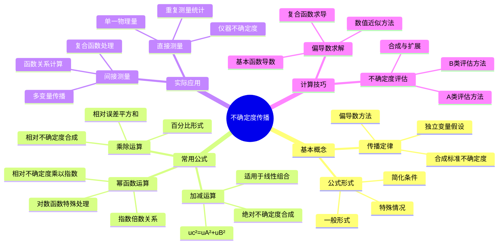

# 不确定度传播公式详解

这个公式是合成标准不确定度的计算公式，也称为不确定度传播定律：

## 📊 知识体系思维导图

---

$$
u_c^2(y) = \sum_{i=1}^{N} \left(\frac{\partial f}{\partial x_i}\right)^2 u^2(x_i)
$$

### 📋 公式各部分含义

| 符号                              | 含义                                   |
| :-------------------------------- | :------------------------------------- |
| $u_c(y)$                          | 测量结果 $y$ 的合成标准不确定度        |
| $y = f(x_1, x_2, ..., x_N)$       | 测量结果是多个输入量的函数             |
| $x_i$                             | 第 $i$ 个输入量（直接测量的物理量）    |
| $u(x_i)$                          | 第 $i$ 个输入量的标准不确定度          |
| $\frac{\partial f}{\partial x_i}$ | 函数 $f$ 对 $x_i$ 的偏导数（灵敏系数） |
| $N$                               | 输入量的总数                           |

> **💡 物理意义**: 这个公式描述了当多个独立的不确定因素同时存在时，它们如何"传播"到最终结果中。每个输入量的不确定度都会按其"影响程度"（偏导数）贡献到总不确定度中。
> 
> **🔧 实际应用**: 
> - **密度测量**: $\rho = \frac{m}{V}$，质量和体积的测量误差都会影响密度的不确定度
> - **电阻测量**: $R = \frac{U}{I}$，电压表和电流表的误差都会传播到电阻值
> - **重力加速度**: $g = \frac{4\pi^2 L}{T^2}$，摆长和周期的误差都影响g值的精度
> 
> **❓ 为什么是平方和而不是直接相加**: 因为各个误差是随机独立的，有正有负，直接相加会相互抵消。而平方和体现了"最坏情况下的合理估计"。
> 
> **❓ 为什么要用偏导数**: 偏导数表示当某个变量发生微小变化时，函数值的变化率，即该变量对结果的"敏感程度"。敏感度越高，该变量的不确定度对结果的影响越大。

### 🔍 物理意义

这个公式告诉我们：当测量结果由多个直接测量量计算得出时，如何将各个输入量的不确定度合理地传播到最终结果中。

### 📖 具体应用举例

#### 例1：密度测量

如果要测量物体密度：$\rho = \frac{m}{V}$

其中 $m$ 是质量，$V$ 是体积，则：

$$
u_c^2(\rho) = \left(\frac{\partial \rho}{\partial m}\right)^2 u^2(m) + \left(\frac{\partial \rho}{\partial V}\right)^2 u^2(V)
$$

计算偏导数：

- $\frac{\partial \rho}{\partial m} = \frac{1}{V}$

- $\frac{\partial \rho}{\partial V} = -\frac{m}{V^2}$

所以：

$$
u_c^2(\rho) = \frac{1}{V^2} u^2(m) + \frac{m^2}{V^4} u^2(V)
$$

#### 例2：单摆重力加速度

在单摆实验中：$g = \frac{4\pi^2 L}{T^2}$

$$
u_c^2(g) = \left(\frac{\partial g}{\partial L}\right)^2 u^2(L) + \left(\frac{\partial g}{\partial T}\right)^2 u^2(T)
$$

计算偏导数：

- $\frac{\partial g}{\partial L} = \frac{4\pi^2}{T^2}$

- $\frac{\partial g}{\partial T} = -\frac{8\pi^2 L}{T^3}$

### 🎯 使用步骤

1. 确定函数关系：$y = f(x_1, x_2, ..., x_N)$

1. 计算偏导数：求出 $\frac{\partial f}{\partial x_i}$

1. 获取输入不确定度：确定每个 $u(x_i)$

1. 代入公式计算：得到 $u_c(y)$

### ⚠️ 重要假设

这个公式基于以下假设：

- 各输入量的不确定度相互独立（不相关）

- 不确定度相对较小

- 函数关系可以线性化处理

### 💡 实际意义

- 灵敏系数 $\frac{\partial f}{\partial x_i}$ 越大，说明输入量 $x_i$ 对结果的影响越大

- 可以通过这个公式判断哪个测量量对最终不确定度贡献最大

---

## 📖 考试宝典

### 🔥 高频考点总结

#### 1. **不确定度传播基本公式**（必考，20-25分）
- **通用公式**：$u_c^2(y) = \sum_{i=1}^{N} \left(\frac{\partial f}{\partial x_i}\right)^2 u^2(x_i)$
- **物理意义**：各输入量不确定度按其影响程度传播到结果
- **关键要素**：偏导数（灵敏系数）、输入不确定度、平方和

#### 2. **常用传播公式**（必考，15-20分）
- **加减法**：$u_c^2(y) = u^2(x_1) + u^2(x_2)$
- **乘除法**：$\left[\frac{u_c(y)}{y}\right]^2 = \left[\frac{u(x_1)}{x_1}\right]^2 + \left[\frac{u(x_2)}{x_2}\right]^2$
- **幂函数**：$\frac{u_c(y)}{y} = |n| \cdot \frac{u(x)}{x}$（对于$y = x^n$）

#### 3. **偏导数计算**（常考，12-18分）
- **基本函数导数**：常数、幂函数、指数函数、对数函数
- **复合函数求导**：链式法则
- **数值计算**：代入具体数值求灵敏系数

#### 4. **实际应用**（必考，15-20分）
- **密度测量**：$\rho = \frac{m}{V}$
- **单摆实验**：$g = \frac{4\pi^2 L}{T^2}$
- **电阻测量**：$R = \frac{U}{I}$
- **体积计算**：$V = \frac{4}{3}\pi r^3$

#### 5. **相对不确定度与绝对不确定度**（常考，10-15分）
- **绝对不确定度**：$u_c(y)$，与y同单位
- **相对不确定度**：$\frac{u_c(y)}{y}$，无量纲
- **转换关系**：根据具体情况选择使用

### ⚡ 快速解题技巧

1. **看到"间接测量"** → 想到不确定度传播公式
2. **看到"加减运算"** → 想到绝对不确定度平方和
3. **看到"乘除运算"** → 想到相对不确定度平方和
4. **看到"幂函数"** → 想到指数倍数关系
5. **看到"偏导数"** → 想到灵敏系数计算
6. **看到"独立变量"** → 想到平方和而非直接相加

### 🎯 标准答题模板

#### **不确定度传播计算题标准格式**：
1. **写出函数关系**（$y = f(x_1, x_2, ..., x_N)$）
2. **写出传播公式**（通用公式或特殊公式）
3. **计算偏导数**（求出各灵敏系数）
4. **代入数值**（计算各项贡献）
5. **合成不确定度**（平方和开根号）
6. **结果表达**（绝对或相对不确定度）

---

## ⚠️ 易错点数据库

### 🚨 概念类易错点

#### 1. **传播公式的适用条件**
- ❌ **错误**：认为所有情况都能用传播公式
- ✅ **正确**：要求输入量相互独立、不确定度较小、函数可线性化
- **易错原因**：忽略了公式的假设条件

#### 2. **绝对不确定度与相对不确定度混淆**
- ❌ **错误**：加减法用相对不确定度，乘除法用绝对不确定度
- ✅ **正确**：
  - 加减法：绝对不确定度平方和
  - 乘除法：相对不确定度平方和
- **记忆口诀**：加减绝对，乘除相对

#### 3. **偏导数的物理意义理解错误**
- ❌ **错误**：认为偏导数只是数学工具
- ✅ **正确**：偏导数表示灵敏系数，反映输入量对结果的影响程度
- **实际意义**：灵敏系数越大，该输入量越重要

#### 4. **独立性假设的忽视**
- ❌ **错误**：对相关的输入量直接应用传播公式
- ✅ **正确**：只有独立的输入量才能用平方和公式
- **实例**：同一把尺子测量长度和宽度时，存在相关性

### 🚨 计算类易错点

#### 1. **偏导数计算错误**
- ❌ **错误**：$\frac{\partial}{\partial T}(T^{-2}) = -2T$
- ✅ **正确**：$\frac{\partial}{\partial T}(T^{-2}) = -2T^{-3}$
- **常见错误**：幂函数求导时指数处理错误

#### 2. **灵敏系数代入错误**
- ❌ **错误**：用符号形式的偏导数直接计算
- ✅ **正确**：将具体数值代入偏导数后再计算
- **步骤**：先求导，再代值

#### 3. **单位处理错误**
- ❌ **错误**：忽略单位的一致性
- ✅ **正确**：确保所有量的单位统一
- **检查**：最终结果的单位要合理

#### 4. **平方和计算错误**
- ❌ **错误**：$u_c = u_1 + u_2$（直接相加）
- ✅ **正确**：$u_c = \sqrt{u_1^2 + u_2^2}$（平方和开根号）
- **原因**：误解了不确定度的合成规律

### 🎯 实际应用易错点

#### 1. **函数关系确定错误**
- **问题**：写错了物理公式
- **后果**：整个传播分析都错误
- **解决**：仔细检查物理公式的正确性

#### 2. **输入量识别不全**
- **问题**：遗漏了某些输入量
- **后果**：不确定度评估偏小
- **解决**：系统分析所有影响因素

#### 3. **不确定度类型混淆**
- **问题**：A类、B类不确定度处理错误
- **后果**：输入不确定度$u(x_i)$错误
- **解决**：正确评估各输入量的不确定度

### 🔍 考试陷阱识别

1. **公式陷阱**：
   - 传播公式的适用条件
   - 偏导数的计算方法

2. **计算陷阱**：
   - 平方和与直接相加
   - 相对不确定度与绝对不确定度

3. **概念陷阱**：
   - 灵敏系数的物理意义
   - 独立性假设的重要性

4. **应用陷阱**：
   - 函数关系的正确性
   - 输入量的完整性

---

## 📋 速查手册

### 🔧 核心公式速查表

| **运算类型** | **函数形式** | **传播公式** |
|-------------|-------------|-------------|
| **通用公式** | $y = f(x_1, x_2, ..., x_N)$ | $u_c^2(y) = \sum_{i=1}^{N} \left(\frac{\partial f}{\partial x_i}\right)^2 u^2(x_i)$ |
| **加法** | $y = x_1 + x_2$ | $u_c^2(y) = u^2(x_1) + u^2(x_2)$ |
| **减法** | $y = x_1 - x_2$ | $u_c^2(y) = u^2(x_1) + u^2(x_2)$ |
| **乘法** | $y = x_1 \times x_2$ | $\left[\frac{u_c(y)}{y}\right]^2 = \left[\frac{u(x_1)}{x_1}\right]^2 + \left[\frac{u(x_2)}{x_2}\right]^2$ |
| **除法** | $y = \frac{x_1}{x_2}$ | $\left[\frac{u_c(y)}{y}\right]^2 = \left[\frac{u(x_1)}{x_1}\right]^2 + \left[\frac{u(x_2)}{x_2}\right]^2$ |
| **幂函数** | $y = x^n$ | $\frac{u_c(y)}{y} = |n| \cdot \frac{u(x)}{x}$ |
| **指数函数** | $y = e^x$ | $u_c(y) = e^x \cdot u(x)$ |
| **对数函数** | $y = \ln x$ | $u_c(y) = \frac{u(x)}{x}$ |

### 📏 常用偏导数速查表

| **函数** | **偏导数** | **说明** |
|---------|-----------|----------|
| $f = x^n$ | $\frac{\partial f}{\partial x} = nx^{n-1}$ | 幂函数 |
| $f = \frac{1}{x}$ | $\frac{\partial f}{\partial x} = -\frac{1}{x^2}$ | 倒数函数 |
| $f = \sqrt{x}$ | $\frac{\partial f}{\partial x} = \frac{1}{2\sqrt{x}}$ | 平方根 |
| $f = e^x$ | $\frac{\partial f}{\partial x} = e^x$ | 指数函数 |
| $f = \ln x$ | $\frac{\partial f}{\partial x} = \frac{1}{x}$ | 对数函数 |
| $f = \sin x$ | $\frac{\partial f}{\partial x} = \cos x$ | 正弦函数 |
| $f = \cos x$ | $\frac{\partial f}{\partial x} = -\sin x$ | 余弦函数 |

### 🔢 实际应用公式速查表

| **物理量** | **公式** | **传播公式** |
|-----------|----------|-------------|
| **密度** | $\rho = \frac{m}{V}$ | $\left[\frac{u_c(\rho)}{\rho}\right]^2 = \left[\frac{u(m)}{m}\right]^2 + \left[\frac{u(V)}{V}\right]^2$ |
| **重力加速度** | $g = \frac{4\pi^2 L}{T^2}$ | $\left[\frac{u_c(g)}{g}\right]^2 = \left[\frac{u(L)}{L}\right]^2 + \left[2\frac{u(T)}{T}\right]^2$ |
| **电阻** | $R = \frac{U}{I}$ | $\left[\frac{u_c(R)}{R}\right]^2 = \left[\frac{u(U)}{U}\right]^2 + \left[\frac{u(I)}{I}\right]^2$ |
| **球体积** | $V = \frac{4}{3}\pi r^3$ | $\frac{u_c(V)}{V} = 3\frac{u(r)}{r}$ |
| **圆面积** | $A = \pi r^2$ | $\frac{u_c(A)}{A} = 2\frac{u(r)}{r}$ |

### 📊 灵敏系数分析速查表

| **函数类型** | **灵敏系数特点** | **实际意义** |
|-------------|-----------------|-------------|
| **线性函数** | 常数 | 影响程度固定 |
| **幂函数** | 与变量相关 | 变量越大影响越大 |
| **倒数函数** | 与变量平方成反比 | 变量越大影响越小 |
| **指数函数** | 与函数值成正比 | 函数值越大影响越大 |
| **对数函数** | 与变量成反比 | 变量越大影响越小 |

### ⏰ 计算步骤时间分配

| **步骤** | **建议时间** | **关键要点** |
|---------|-------------|-------------|
| **确定函数关系** | 1-2分钟 | 写出正确的物理公式 |
| **计算偏导数** | 3-5分钟 | 仔细求导，避免计算错误 |
| **代入数值** | 2-3分钟 | 单位统一，数值准确 |
| **合成计算** | 2-3分钟 | 平方和开根号 |
| **结果检查** | 1分钟 | 单位合理性，数量级检查 |

### 🎯 考前必背清单

#### **公式必背**（开考前默写）
1. $u_c^2(y) = \sum_{i=1}^{N} \left(\frac{\partial f}{\partial x_i}\right)^2 u^2(x_i)$
2. 加减法：$u_c^2(y) = u^2(x_1) + u^2(x_2)$
3. 乘除法：$\left[\frac{u_c(y)}{y}\right]^2 = \left[\frac{u(x_1)}{x_1}\right]^2 + \left[\frac{u(x_2)}{x_2}\right]^2$
4. 幂函数：$\frac{u_c(y)}{y} = |n| \cdot \frac{u(x)}{x}$

#### **概念必背**
- 偏导数是灵敏系数
- 独立性假设的重要性
- 绝对不确定度vs相对不确定度
- 平方和而非直接相加

#### **常用导数**
- $(x^n)' = nx^{n-1}$
- $(1/x)' = -1/x^2$
- $(\ln x)' = 1/x$
- $(e^x)' = e^x$

#### **检查要点**
- [ ] 函数关系是否正确
- [ ] 偏导数计算是否正确
- [ ] 是否用了平方和公式
- [ ] 单位是否统一
- [ ] 结果是否合理

---

## 💪 分层次例题体系

### 🟢 第一层：基础理解题（送分题，必须全对）

#### 例题1-1：概念辨析（必考点）
**【题目】** 关于不确定度传播，下列说法正确的是（ ）
A. 加减法运算用相对不确定度合成
B. 乘除法运算用绝对不确定度合成
C. 各输入量的不确定度直接相加得到合成不确定度
D. 偏导数表示输入量对结果的影响程度

**【标准解答】** D

**【解题要点】**
- 加减法：绝对不确定度平方和
- 乘除法：相对不确定度平方和
- 合成方式：平方和开根号，不是直接相加
- 偏导数：灵敏系数，表示影响程度

**【易错提醒】**
❌ 不要混淆加减法和乘除法的处理方式
❌ 不要直接相加不确定度
❌ 记住口诀：加减绝对，乘除相对

#### 例题1-2：基础公式应用（送分题）
**【题目】** 已知x=(10.0±0.2)，y=(5.0±0.1)，求z=x+y和w=x×y的不确定度。

**【标准解题步骤】**
第一步：加法运算z=x+y
- 最佳值：$\bar{z} = \bar{x} + \bar{y} = 10.0 + 5.0 = 15.0$
- 不确定度：$u_c(z) = \sqrt{u^2(x) + u^2(y)} = \sqrt{(0.2)^2 + (0.1)^2} = 0.22$
- 结果：$z = (15.0 ± 0.22)$

第二步：乘法运算w=x×y
- 最佳值：$\bar{w} = \bar{x} × \bar{y} = 10.0 × 5.0 = 50.0$
- 相对不确定度：$\frac{u_c(w)}{w} = \sqrt{\left(\frac{u(x)}{x}\right)^2 + \left(\frac{u(y)}{y}\right)^2} = \sqrt{\left(\frac{0.2}{10.0}\right)^2 + \left(\frac{0.1}{5.0}\right)^2} = 0.028$
- 绝对不确定度：$u_c(w) = 50.0 × 0.028 = 1.4$
- 结果：$w = (50.0 ± 1.4)$

**【得分要点】**
- 正确选择公式 (2分)
- 数值计算准确 (3分)
- 结果表达规范 (2分)

#### 例题1-3：偏导数计算（高频考点）
**【题目】** 对于函数$f = \frac{x^2}{y}$，求$\frac{\partial f}{\partial x}$和$\frac{\partial f}{\partial y}$。

**【标准解答】**
$$\frac{\partial f}{\partial x} = \frac{\partial}{\partial x}\left(\frac{x^2}{y}\right) = \frac{2x}{y}$$

$$\frac{\partial f}{\partial y} = \frac{\partial}{\partial y}\left(\frac{x^2}{y}\right) = \frac{x^2}{y^2} \times (-1) = -\frac{x^2}{y^2}$$

**【关键点】**
- 偏导数：对一个变量求导，其他变量当常数
- 幂函数求导：$(x^n)' = nx^{n-1}$
- 倒数函数求导：$(1/y)' = -1/y^2$

### 🟡 第二层：应用计算题（拉开差距）

#### 例题2-1：密度测量不确定度（高频考点）
**【题目】** 测量圆柱体密度，质量m=(50.2±0.1)g，直径D=(2.50±0.02)cm，高度h=(5.00±0.05)cm。求密度及其不确定度。

**【解题模板】**
第一步：写出密度公式
$$\rho = \frac{m}{V} = \frac{m}{\frac{\pi D^2 h}{4}} = \frac{4m}{\pi D^2 h}$$

第二步：计算密度最佳值
$$\bar{\rho} = \frac{4 × 50.2}{\pi × (2.50)^2 × 5.00} = 2.04 \text{ g/cm}^3$$

第三步：计算偏导数（灵敏系数）
$$\frac{\partial \rho}{\partial m} = \frac{4}{\pi D^2 h}$$
$$\frac{\partial \rho}{\partial D} = -\frac{8m}{\pi D^3 h}$$
$$\frac{\partial \rho}{\partial h} = -\frac{4m}{\pi D^2 h^2}$$

第四步：代入数值计算灵敏系数
$$\frac{\partial \rho}{\partial m} = \frac{4}{\pi × (2.50)^2 × 5.00} = 0.0407 \text{ (g/cm}^3\text{)/g}$$
$$\frac{\partial \rho}{\partial D} = -\frac{8 × 50.2}{\pi × (2.50)^3 × 5.00} = -1.63 \text{ (g/cm}^3\text{)/cm}$$
$$\frac{\partial \rho}{\partial h} = -\frac{4 × 50.2}{\pi × (2.50)^2 × (5.00)^2} = -0.408 \text{ (g/cm}^3\text{)/cm}$$

第五步：应用传播公式
$$u_c^2(\rho) = \left(\frac{\partial \rho}{\partial m}\right)^2 u^2(m) + \left(\frac{\partial \rho}{\partial D}\right)^2 u^2(D) + \left(\frac{\partial \rho}{\partial h}\right)^2 u^2(h)$$

$$u_c^2(\rho) = (0.0407)^2 × (0.1)^2 + (-1.63)^2 × (0.02)^2 + (-0.408)^2 × (0.05)^2$$
$$= 1.66×10^{-6} + 1.06×10^{-3} + 4.16×10^{-4} = 1.48×10^{-3}$$

第六步：计算合成不确定度
$$u_c(\rho) = \sqrt{1.48×10^{-3}} = 0.038 \text{ g/cm}^3$$

第七步：写出最终结果
$$\rho = (2.04 ± 0.04) \text{ g/cm}^3, k=2$$

**【关键分析】**
- 直径D的贡献最大（系数是2，且在分母）
- 质量m的贡献最小
- 要注意各项的相对重要性

#### 例题2-2：复合函数传播
**【题目】** 电阻R由公式$R = \rho \frac{L}{A}$计算，其中电阻率ρ=(1.7±0.1)×10⁻⁸ Ω·m，长度L=(2.0±0.1)m，截面积A=(5.0±0.2)×10⁻⁶ m²。求电阻及其不确定度。

**【解题思路】**
第一步：计算电阻最佳值
$$\bar{R} = \frac{1.7×10^{-8} × 2.0}{5.0×10^{-6}} = 6.8×10^{-3} \text{ Ω}$$

第二步：用相对不确定度方法
对于$R = \rho \frac{L}{A}$，这是乘除法组合：
$$\frac{u_c(R)}{R} = \sqrt{\left(\frac{u(\rho)}{\rho}\right)^2 + \left(\frac{u(L)}{L}\right)^2 + \left(\frac{u(A)}{A}\right)^2}$$

第三步：计算各相对不确定度
$$\frac{u(\rho)}{\rho} = \frac{0.1×10^{-8}}{1.7×10^{-8}} = 0.059$$
$$\frac{u(L)}{L} = \frac{0.1}{2.0} = 0.050$$
$$\frac{u(A)}{A} = \frac{0.2×10^{-6}}{5.0×10^{-6}} = 0.040$$

第四步：合成相对不确定度
$$\frac{u_c(R)}{R} = \sqrt{(0.059)^2 + (0.050)^2 + (0.040)^2} = 0.086$$

第五步：计算绝对不确定度
$$u_c(R) = 6.8×10^{-3} × 0.086 = 5.8×10^{-4} \text{ Ω}$$

**【简化技巧】**
- 乘除法组合直接用相对不确定度
- 避免复杂的偏导数计算
- 结果更直观易懂

#### 例题2-3：幂函数传播应用
**【题目】** 球体体积$V = \frac{4}{3}\pi r^3$，测得半径r=(3.25±0.05)cm，求体积及其不确定度。

**【解题步骤】**
第一步：计算体积最佳值
$$\bar{V} = \frac{4}{3}\pi × (3.25)^3 = 143.8 \text{ cm}^3$$

第二步：应用幂函数传播公式
对于$V = Cr^3$（C为常数），有：
$$\frac{u_c(V)}{V} = 3 × \frac{u(r)}{r}$$

第三步：计算相对不确定度
$$\frac{u_c(V)}{V} = 3 × \frac{0.05}{3.25} = 0.046$$

第四步：计算绝对不确定度
$$u_c(V) = 143.8 × 0.046 = 6.6 \text{ cm}^3$$

第五步：最终结果
$$V = (143.8 ± 6.6) \text{ cm}^3$$

**【幂函数规律】**
- 对于$y = x^n$：$\frac{u_c(y)}{y} = |n| × \frac{u(x)}{x}$
- 指数越大，不确定度放大越明显
- 体积测量（n=3）对尺寸精度要求很高

### 🔴 第三层：综合分析题（拔高题）

#### 例题3-1：多步骤传播分析
**【题目】** 用单摆测重力加速度，公式为$g = \frac{4\pi^2 L}{T^2}$。摆长L通过$L = L' + \frac{D}{2}$计算，其中L'=(99.5±0.5)cm，D=(2.4±0.02)cm。周期T通过$T = \frac{t}{50}$计算，其中t=(100.2±0.2)s。求g及其不确定度。

**【深度分析】**
第一步：逐步计算中间量

**计算摆长L**：
$$\bar{L} = 99.5 + \frac{2.4}{2} = 100.7 \text{ cm} = 1.007 \text{ m}$$
$$u_c(L) = \sqrt{u^2(L') + u^2(D/2)} = \sqrt{(0.5)^2 + (0.01)^2} = 0.50 \text{ cm}$$

**计算周期T**：
$$\bar{T} = \frac{100.2}{50} = 2.004 \text{ s}$$
$$u_c(T) = \frac{u(t)}{50} = \frac{0.2}{50} = 0.004 \text{ s}$$

第二步：计算重力加速度
$$\bar{g} = \frac{4\pi^2 × 1.007}{(2.004)^2} = 9.83 \text{ m/s}^2$$

第三步：应用传播公式
对于$g = \frac{4\pi^2 L}{T^2}$：
$$\frac{u_c(g)}{g} = \sqrt{\left(\frac{u(L)}{L}\right)^2 + \left(2\frac{u(T)}{T}\right)^2}$$

第四步：计算各项贡献
$$\frac{u(L)}{L} = \frac{0.005}{1.007} = 0.0050$$
$$2\frac{u(T)}{T} = 2 × \frac{0.004}{2.004} = 0.0040$$

第五步：合成不确定度
$$\frac{u_c(g)}{g} = \sqrt{(0.0050)^2 + (0.0040)^2} = 0.0064$$
$$u_c(g) = 9.83 × 0.0064 = 0.063 \text{ m/s}^2$$

**【结果分析】**
- 摆长测量贡献：78%
- 周期测量贡献：39%
- 主要误差来源是摆长测量
- 提高精度应重点改进摆长测量

#### 例题3-2：相关性影响分析
**【题目】** 用同一把米尺测量矩形的长l=(10.0±0.1)cm和宽w=(5.0±0.1)cm，计算面积时是否可以直接应用传播公式？如果存在相关性，如何处理？

**【相关性分析】**
第一步：识别相关性问题
- 同一把尺子测量：系统误差相关
- 环境条件相同：温度影响相关
- 测量方法相同：人为误差相关

第二步：相关性对结果的影响
如果忽略相关性，直接用：
$$u_c^2(A) = \left(\frac{\partial A}{\partial l}\right)^2 u^2(l) + \left(\frac{\partial A}{\partial w}\right)^2 u^2(w)$$
$$= w^2 u^2(l) + l^2 u^2(w) = (5.0)^2(0.1)^2 + (10.0)^2(0.1)^2 = 1.25$$
$$u_c(A) = 1.12 \text{ cm}^2$$

第三步：考虑相关性的完整公式
$$u_c^2(A) = \left(\frac{\partial A}{\partial l}\right)^2 u^2(l) + \left(\frac{\partial A}{\partial w}\right)^2 u^2(w) + 2\frac{\partial A}{\partial l}\frac{\partial A}{\partial w}u(l,w)$$

其中协方差项$u(l,w) = r(l,w)u(l)u(w)$，r为相关系数。

第四步：实际处理建议
1. **避免相关性**：用不同尺子分别测量
2. **评估相关系数**：通过重复实验确定
3. **保守估计**：假设完全正相关(r=1)
4. **独立测量**：改进实验方法

**【工程实践意义】**
- 实验设计要考虑相关性
- 相关性会显著影响不确定度
- 独立测量是减小不确定度的有效方法

#### 例题3-3：不确定度预算与优化
**【题目】** 某实验室要建立密度标准，要求相对不确定度小于0.1%。现有设备：天平(±0.1mg)，游标卡尺(±0.02mm)，螺旋测微器(±0.004mm)。设计最优测量方案。

**【系统优化分析】**
第一步：建立不确定度预算
对于$\rho = \frac{m}{V}$，相对不确定度：
$$\frac{u_c(\rho)}{\rho} = \sqrt{\left(\frac{u(m)}{m}\right)^2 + \left(\frac{u(V)}{V}\right)^2}$$

目标：$\frac{u_c(\rho)}{\rho} < 0.001$

第二步：质量测量分析
设样品质量约100g：
$$\frac{u(m)}{m} = \frac{0.0001}{100} = 1×10^{-6}$$
质量测量贡献可忽略。

第三步：体积测量优化
对于圆柱体$V = \frac{\pi D^2 h}{4}$：
$$\frac{u(V)}{V} = \sqrt{\left(2\frac{u(D)}{D}\right)^2 + \left(\frac{u(h)}{h}\right)^2}$$

第四步：仪器选择策略
**方案A：全用游标卡尺**
- D≈20mm：$\frac{u(D)}{D} = \frac{0.02}{20} = 0.001$
- h≈20mm：$\frac{u(h)}{h} = \frac{0.02}{20} = 0.001$
- $\frac{u(V)}{V} = \sqrt{(2×0.001)^2 + (0.001)^2} = 0.0022 > 0.001$ ❌

**方案B：直径用螺旋测微器**
- D≈20mm：$\frac{u(D)}{D} = \frac{0.004}{20} = 0.0002$
- h≈20mm：$\frac{u(h)}{h} = \frac{0.02}{20} = 0.001$
- $\frac{u(V)}{V} = \sqrt{(2×0.0002)^2 + (0.001)^2} = 0.0011 > 0.001$ ❌

**方案C：优化样品尺寸**
增大样品尺寸到D≈50mm，h≈50mm：
- $\frac{u(D)}{D} = \frac{0.004}{50} = 8×10^{-5}$
- $\frac{u(h)}{h} = \frac{0.02}{50} = 4×10^{-4}$
- $\frac{u(V)}{V} = \sqrt{(2×8×10^{-5})^2 + (4×10^{-4})^2} = 4.2×10^{-4} < 0.001$ ✓

**【优化结论】**
1. **仪器选择**：直径用螺旋测微器，高度用游标卡尺
2. **样品设计**：适当增大尺寸降低相对误差
3. **测量策略**：多次测量，统计处理
4. **环境控制**：恒温恒湿，减小系统误差

### 📊 例题难度分布建议

| 难度层次 | 题目数量 | 考试占比 | 复习重点 |
|---------|---------|----------|----------|
| **基础理解题** | 8-10题 | 25-35% | 概念理解、基础计算 |
| **应用计算题** | 10-12题 | 50-60% | 传播公式、实际应用 |
| **综合分析题** | 3-5题 | 10-20% | 复杂系统、优化设计 |

### 🎯 专项训练计划

#### **第一周：基础强化**
- **目标**：掌握传播公式和基本计算
- **内容**：
  - 加减法、乘除法、幂函数传播
  - 偏导数计算方法
  - 相对不确定度与绝对不确定度
- **练习**：每天3-4道基础题

#### **第二周：应用提升**
- **目标**：熟练处理实际测量问题
- **内容**：
  - 密度、电阻、体积等常见量的传播
  - 多步骤传播计算
  - 误差源分析和贡献评估
- **练习**：每天2-3道应用题

#### **第三周：综合训练**
- **目标**：解决复杂的不确定度问题
- **内容**：
  - 相关性问题的处理
  - 不确定度预算和优化
  - 实验方案的设计和改进
- **练习**：每天1-2道综合题

### 🏆 考试冲刺要点

#### **必背公式**
1. $u_c^2(y) = \sum_{i=1}^{N} \left(\frac{\partial f}{\partial x_i}\right)^2 u^2(x_i)$
2. 加减法：$u_c^2(y) = u^2(x_1) + u^2(x_2)$
3. 乘除法：$\left[\frac{u_c(y)}{y}\right]^2 = \left[\frac{u(x_1)}{x_1}\right]^2 + \left[\frac{u(x_2)}{x_2}\right]^2$
4. 幂函数：$\frac{u_c(y)}{y} = |n| \cdot \frac{u(x)}{x}$

#### **关键概念**
- 偏导数是灵敏系数
- 平方和而非直接相加
- 相对不确定度vs绝对不确定度
- 独立性假设的重要性

#### **计算技巧**
- 先算最佳值，再算不确定度
- 乘除法优先用相对不确定度
- 注意幂函数的指数倍数
- 检查各项贡献的相对大小

#### **常见陷阱**
- 加减法和乘除法的公式混淆
- 忘记偏导数中的系数
- 不确定度直接相加
- 忽略主要误差源

---