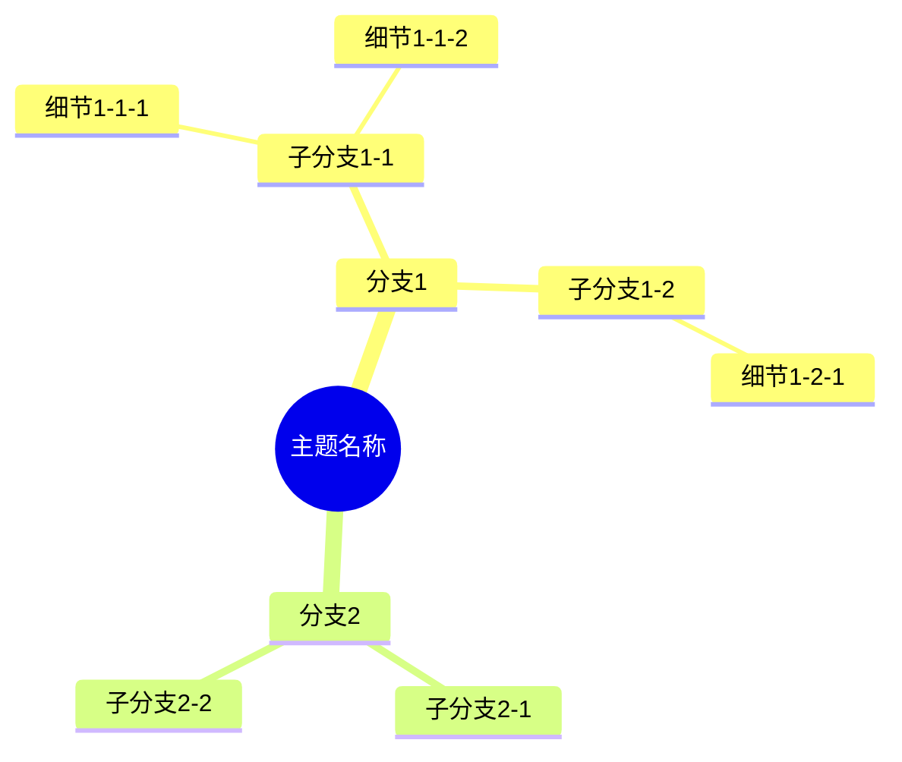

# 学术笔记Markdown规范

**版本**: v2.0  
**适用范围**: 大学物理、数学、概率论等理工科学术笔记  
**制定目的**: 统一笔记格式，提高学习效率，便于复习和分享  
**技术架构**: 基于Spec-Driven Development，集成AI辅助和自动化工具

---

## 📋 目录结构

- [1. 文档基本结构](#1-文档基本结构)
- [2. 标题层级规范](#2-标题层级规范)
- [3. 思维导图规范](#3-思维导图规范)
- [4. 数学公式规范](#4-数学公式规范)
- [5. 内容组织规范](#5-内容组织规范)
- [6. 视觉元素规范](#6-视觉元素规范)
- [7. 例题体系规范](#7-例题体系规范)
- [8. 考试辅助规范](#8-考试辅助规范)
- [9. 错题整理规范](#9-错题整理规范)
- [10. Spec-Kit集成规范](#10-spec-kit集成规范)
- [11. 文件命名规范](#11-文件命名规范)
- [12. 质量检查清单](#12-质量检查清单)

---

## 1. 文档基本结构

### 1.1 必备元素

每份学术笔记必须包含以下基本结构：

```markdown
# [主题名称]详解

**课程来源**: [课程名称]  
**授课教师**: [教师姓名]（可选）  
**学校**: [学校名称]（可选）  
**整理时间**: [YYYY-MM-DD]（可选）

## 📊 知识体系思维导图
[Mermaid思维导图]

---

## 第一部分：基本概念
[理论基础内容]

## 第二部分：[核心内容1]
[详细展开]

## 第三部分：[核心内容2]
[详细展开]

---

## 📖 考试宝典
[考试相关内容]

## ⚠️ 易错点数据库
[常见错误整理]

## 📋 速查手册
[公式表格等]

## 💪 分层次例题体系
[例题分类]

---

## 总结
[知识点总结]
```

### 1.2 可选增强元素

根据内容需要，可以添加：
- 实验方法介绍
- 历史背景
- 实际应用案例
- 扩展阅读建议

---

## 2. 标题层级规范

### 2.1 层级定义

```markdown
# 一级标题：文档标题（仅一个）
## 二级标题：主要章节
### 三级标题：章节内的大节
#### 四级标题：具体知识点
##### 五级标题：细节说明（尽量避免）
```

### 2.2 标题命名规范

**✅ 推荐格式**：
```markdown
## 第一部分：质点运动学基础
### 1.1 基本概念
#### 1.1.1 位移与路程
```

**✅ 特殊章节格式**：
```markdown
## 📖 考试宝典
## ⚠️ 易错点数据库  
## 📋 速查手册
## 💪 分层次例题体系
```

**❌ 避免格式**：
```markdown
## 质点运动学基础（缺少编号）
### 基本概念（缺少层级标识）
```

---

## 3. 思维导图规范

### 3.1 Mermaid语法要求

**✅ 正确格式**：
```markdown
## 📊 知识体系思维导图


```

### 3.2 内容规范

**✅ 允许的内容**：
- 纯文字描述
- 中文术语
- 英文术语（无特殊符号）
- 简单的物理量名称（如"速度v"）

**❌ 禁止的内容**：
- 数学公式：`P(A) = m/n`
- 特殊符号：`≥`, `≤`, `≠`, `∞`
- 括号组合：`P(B|A)`
- 分数表达：`1/2`, `π/4`
- 希腊字母：`α`, `β`, `γ`, `π`, `Ω`

### 3.3 替代方案

将数学表达式转换为描述性文字：

| ❌ 错误写法 | ✅ 正确写法 |
|------------|------------|
| `P(A) = m/n` | `古典概率公式` |
| `F = ma` | `牛顿第二定律` |
| `T = 2π√(L/g)` | `单摆周期公式` |
| `θ < 5°` | `小角度条件` |
| `P(B|A)` | `条件概率` |

---

## 4. 数学公式规范

### 4.1 行内公式

**格式**：使用单个美元符号包围
```markdown
在文本中提到公式时，如牛顿第二定律 $F = ma$，要使用行内公式。
```

### 4.2 独立公式

**格式**：使用双美元符号，独立成行
```markdown
牛顿第二定律的数学表达式为：

$$
\vec{F} = m\vec{a}
$$
```

### 4.3 公式编号（可选）

对于重要公式，可以添加编号：
```markdown
$$
E = mc^2 \tag{1}
$$
```

### 4.4 复杂公式分行

```markdown
$$
\begin{align}
x &= v_0 t + \frac{1}{2}at^2 \\
v &= v_0 + at \\
v^2 &= v_0^2 + 2ax
\end{align}
$$
```

---

## 5. 内容组织规范

### 5.1 引用块使用

**物理意义解释**：
```markdown
> **💡 物理意义**: 这个公式表明...
> 
> **🔧 实际应用**: 
> - 应用1：...
> - 应用2：...
> 
> **❓ 为什么这样**: 因为...
```

### 5.2 列表规范

**有序列表**：用于步骤、流程
```markdown
1. 第一步：确定研究对象
2. 第二步：分析受力情况
3. 第三步：建立坐标系
```

**无序列表**：用于要点、特征
```markdown
- 特点1：...
- 特点2：...
- 特点3：...
```

### 5.3 表格规范

**标准表格格式**：
```markdown
| **物理量** | **符号** | **单位** | **说明** |
|-----------|----------|----------|----------|
| 位移 | $s$ | m | 矢量 |
| 速度 | $v$ | m/s | 矢量 |
| 加速度 | $a$ | m/s² | 矢量 |
```

**注意事项**：
- 表头使用粗体
- 对齐方式统一
- 内容简洁明了

---

## 6. 视觉元素规范

### 6.1 Emoji使用规范

**标准Emoji对照表**：

| 用途 | Emoji | 示例 |
|------|-------|------|
| 思维导图 | 📊 | `## 📊 知识体系思维导图` |
| 考试相关 | 📖 | `## 📖 考试宝典` |
| 易错点 | ⚠️ | `## ⚠️ 易错点数据库` |
| 速查手册 | 📋 | `## 📋 速查手册` |
| 例题体系 | 💪 | `## 💪 分层次例题体系` |
| 物理意义 | 💡 | `> **💡 物理意义**:` |
| 实际应用 | 🔧 | `> **🔧 实际应用**:` |
| 疑问解答 | ❓ | `> **❓ 为什么**:` |
| 实验要点 | 🎯 | `> **🎯 实验要点**:` |
| 记忆技巧 | 🧠 | `> **🧠 记忆技巧**:` |
| 高频考点 | 🔥 | `#### 🔥 高频考点总结` |
| 快速技巧 | ⚡ | `### ⚡ 快速解题技巧` |
| 答题模板 | 🎯 | `### 🎯 标准答题模板` |
| 概念错误 | 🚨 | `### 🚨 概念类易错点` |
| 实验操作 | 🎯 | `### 🎯 实验操作易错点` |
| 考试陷阱 | 🔍 | `### 🔍 考试陷阱识别` |
| 核心公式 | 🔧 | `### 🔧 核心公式速查表` |
| 数值表格 | 🔢 | `### 🔢 常用数值速查表` |
| 时间分配 | ⏰ | `### ⏰ 解题时间分配建议` |
| 必背清单 | 🎯 | `### 🎯 考前必背清单` |
| 基础题 | 🟢 | `### 🟢 第一层：基础理解题` |
| 应用题 | 🟡 | `### 🟡 第二层：应用计算题` |
| 综合题 | 🔴 | `### 🔴 第三层：综合分析题` |
| 冲刺要点 | 🏆 | `### 🏆 考试冲刺要点` |
| 错题复盘 | 🔄 | `## 🔄 本章错题复盘` |

### 6.2 强调标记

**正确与错误标记**：
```markdown
- ✅ **正确**：这样做是对的
- ❌ **错误**：这样做是错的
```

**检查清单**：
```markdown
- [ ] 未完成项目
- [x] 已完成项目
```

---

## 7. 例题体系规范

### 7.1 难度分层

**三层难度体系**：
```markdown
### 🟢 第一层：基础理解题（送分题，必须全对）
### 🟡 第二层：应用计算题（拉开差距）
### 🔴 第三层：综合分析题（拔高题）
```

### 7.2 例题格式

**标准例题格式**：
```markdown
#### 例题X-Y：[题目类型]（[重要程度]）
**【题目】** [题目内容]

**【解答】** 或 **【解题思路】**
[解答过程]

**【关键点】** 或 **【易错点】**
- 要点1
- 要点2
```

### 7.3 解题步骤

**标准解题步骤格式**：
```markdown
**【标准解题步骤】**
第一步：[步骤描述]
[具体操作]

第二步：[步骤描述]  
[具体操作]

第三步：[步骤描述]
[具体操作]
```

---

## 8. 考试辅助规范

### 8.1 考试宝典结构

```markdown
## 📖 考试宝典

### 🔥 高频考点总结
#### 1. **[考点名称]**（[考试频率]，[分值范围]）
- **要点1**：...
- **要点2**：...

### ⚡ 快速解题技巧
1. **看到"[关键词]"** → 想到[对应方法]

### 🎯 标准答题模板
#### **[题型]标准格式**：
1. **[步骤1]**（[具体要求]）
2. **[步骤2]**（[具体要求]）
```

### 8.2 易错点数据库结构

```markdown
## ⚠️ 易错点数据库

### 🚨 概念类易错点
#### 1. **[错误类型]**
- ❌ **错误**：[错误做法]
- ✅ **正确**：[正确做法]  
- **易错原因**：[原因分析]

### 🚨 计算类易错点
[同上格式]

### 🎯 实际应用易错点
[同上格式]
```

### 8.3 速查手册结构

```markdown
## 📋 速查手册

### 🔧 核心公式速查表
| **类型** | **公式** | **适用条件** |
|---------|----------|-------------|

### 🔢 常用数值速查表  
| **常数** | **数值** | **用途** |
|---------|----------|----------|

### ⏰ 解题时间分配建议
| **题型** | **建议时间** | **关键步骤** |
|---------|-------------|-------------|
```

---

## 9. 错题整理规范

### 9.1 错题记录模板

**标准错题记录格式**：
```markdown
## 错题记录 #[YYYYMMDD_学科_序号]

**基本信息**：
- 题目来源：[考试/作业/练习册/其他]
- 目标笔记：[具体的.md文件名]
- 知识点标签：[用逗号分隔的标签]
- 难度等级：[🟢基础/🟡中等/🔴困难]
- 错误日期：[YYYY-MM-DD]

**题目内容**：
[原题目图片文件名或文字描述]

**我的错误解答**：
[学生的错误解答过程]

**错误分析**：
- 错误类型：[概念性/计算性/方法性/应用性]
- 主要错误原因：[一句话概括]
- 详细分析：[具体分析错误产生的原因]

**正确解答**：
[详细的正确解题过程]

**我需要加强的知识点**：
[列出需要复习的相关知识点]

**类似题型**：
[提供2-3道类似的练习题，可留空由AI生成]

**我的防错计划**：
[针对此类错误的预防措施]
```

### 9.2 错题分类体系

#### 9.2.1 按知识点分类
```
一级分类（对应笔记章节）：
- 计算能力基础
- 条件概率
- 等可能概型
- 库仑定律和电场强度
- 线性表与数据结构
- [其他章节...]

二级分类（具体知识点）：
- 四则运算错误
- 速算技巧应用
- 概念理解偏差
- 公式记忆错误
- 解题步骤遗漏
```

#### 9.2.2 按错误类型分类
```
A. 概念性错误
- 基本概念理解错误
- 定义记忆不准确
- 适用条件判断错误

B. 计算性错误
- 运算法则错误
- 计算过程错误
- 数值计算失误

C. 方法性错误
- 解题思路错误
- 方法选择不当
- 步骤逻辑混乱

D. 应用性错误
- 实际问题建模错误
- 条件理解偏差
- 结果解释错误
```

### 9.3 错题整合到笔记的方法

#### 9.3.1 易错点数据库整合（推荐）

在目标笔记的"⚠️ 易错点数据库"中新增条目：

```markdown
#### X. **[错误名称]**（错题 #[编号]）
- ❌ **错误**：[从错题模板中提取的错误做法]
- ✅ **正确**：[从正确解答中提取的正确做法]
- **易错原因**：[从错误分析中提取并优化]
- **实际案例**：
- **防范措施**：[从防错计划中提取并扩展]
  1. [具体措施1]
  2. [具体措施2]
  3. [具体措施3]
- **强化练习**：[基于类似题型生成更多练习]
  - [练习题1]
  - [练习题2]
  - [练习题3]
```

#### 9.3.2 综合例题整合（补充）

在"💪 分层次例题体系"的🔴第三层中添加：

```markdown
#### 例题3-X：[题目类型]（基于错题 #[编号]）
**【题目】** [原错题或改编题]

**【常见错误】**
[展示典型错误解法]

**【错误分析】**
- 错误原因：[分析]
- 涉及知识点：[列表]

**【正确解答】**
[标准解题过程]

**【解题关键】**
1. [关键点1]
2. [关键点2]
3. [关键点3]

**【易错提醒】**
- 关键点1：...
- 关键点2：...
```

### 9.4 错题复盘章节

在每个笔记文件末尾添加错题复盘章节：

```markdown
---

## 🔄 本章错题复盘

### 错题统计
- 总错题数：X道
- 概念类错误：X道
- 计算类错误：X道
- 方法类错误：X道
- 应用类错误：X道

### 高频错误Top3
1. **[错误类型1]**：出现X次
   - 主要问题：[问题描述]
   - 核心缺陷：[缺陷分析]
   - 改进重点：[改进方向]

2. **[错误类型2]**：出现X次
   [同上格式]

3. **[错误类型3]**：出现X次
   [同上格式]

### 改进建议
基于错题分析，建议重点加强：

1. **[改进方向1]**：
   - [具体建议1]
   - [具体建议2]
   - [具体建议3]

2. **[改进方向2]**：
   [同上格式]

3. **[改进方向3]**：
   [同上格式]

**下次学习重点**：[基于错题分析的学习重点]
```

### 9.5 错题编号规则

#### 9.5.1 编号格式
```
格式：[YYYYMMDD_学科_序号]
示例：
- 20241021_数学_001：2024年10月21日的第1道数学错题
- 20241021_物理_002：2024年10月21日的第2道物理错题
- 20241021_计算_003：2024年10月21日的第3道计算错题
```

#### 9.5.2 文件组织结构
```
笔记目录/
├── 主笔记文件/
│   ├── 条件概率详解.md
│   ├── 库仑定律和电场强度详解.md
│   └── 计算能力培养指南详解.md
├── 错题库/
│   ├── 错题索引.md
│   ├── 数学错题集.md
│   ├── 物理错题集.md
│   └── 计算错题集.md
└── 图片资源/
    ├── 错题图片/
    │   ├── 20241021_数学_001.jpg
    │   └── 20241021_物理_002.jpg
    └── 解答图片/
        └── 解答_001.jpg
```

### 9.6 错题处理工作流程

#### 9.6.1 即时处理流程
```
步骤1：错题信息录入（5分钟）
- 拍照/截图保存
- 填写错题记录模板
- 初步分类标记

步骤2：错误分析（10分钟）
- 识别错误类型
- 分析错误原因
- 确定涉及知识点

步骤3：解答制作（15分钟）
- 提供正确解答
- 标注关键步骤
- 总结解题要点

步骤4：整合到笔记（10分钟）
- 在易错点数据库中新增条目
- 更新错题复盘统计
- 建立交叉引用链接
```

#### 9.6.2 定期整理流程
```
周整理：
- 统计本周错题数量和类型
- 识别高频错误知识点
- 制定针对性复习计划

月整理：
- 分析错题趋势变化
- 更新易错点数据库
- 优化笔记结构
- 制作错题专项练习
```

### 9.7 错题效果评估

#### 9.7.1 量化指标
```
错题减少率 = (本月错题数 - 上月错题数) / 上月错题数 × 100%
知识点掌握率 = 已掌握知识点数 / 总知识点数 × 100%
重复错误率 = 重复错误次数 / 总错题数 × 100%
```

#### 9.7.2 质化评估
```
- 错误类型变化趋势
- 解题思路清晰度提升
- 知识点理解深度改善
- 应用能力增强情况
```

---

## 10. Spec-Kit集成规范

### 10.1 规范驱动笔记开发架构

基于GitHub [Spec-Kit](https://github.com/github/spec-kit)的规范驱动开发理念，建立系统化的笔记开发流程：

#### 10.1.1 项目结构规范
```
学术笔记系统/
├── CLAUDE.md                    # AI助手配置文档
├── memory/
│   ├── constitution.md          # 笔记系统宪法文档
│   ├── learning-context.md      # 学习上下文记忆
│   └── error-patterns.md        # 错误模式记忆
├── scripts/
│   ├── check-prerequisites.sh   # 环境检查脚本
│   ├── create-new-note.sh      # 新笔记创建脚本
│   ├── validate-note.sh        # 笔记验证脚本
│   ├── integrate-errors.sh     # 错题整合脚本
│   └── generate-summary.sh     # 总结生成脚本
├── specs/
│   └── [学科]-[主题]/
│       ├── contracts/
│       │   ├── note-spec.json   # 笔记规格说明
│       │   └── api-spec.md      # API接口规范
│       ├── data-model.md        # 数据模型定义
│       ├── plan.md             # 实施计划
│       ├── tasks.md            # 任务分解
│       ├── spec.md             # 详细规格说明
│       └── research.md         # 研究文档
├── templates/
│   ├── note-template.md        # 笔记模板
│   ├── error-template.md       # 错题模板
│   ├── summary-template.md     # 总结模板
│   └── exam-template.md        # 考试模板
└── notes/
    ├── 数学/
    ├── 物理/
    └── 计算机/
```

#### 10.1.2 笔记系统宪法文档(constitution.md)
```markdown
# 学术笔记系统宪法

## 核心原则
1. **准确性优先**: 所有内容必须经过验证，确保学术严谨性
2. **结构化组织**: 遵循统一的Markdown规范，便于维护和扩展
3. **渐进式完善**: 支持增量更新，从基础到高级逐步完善
4. **错误驱动学习**: 将错题转化为学习资源，形成闭环改进
5. **AI辅助增强**: 利用AI提升效率，但保持人工审核和验证

## 质量标准
- 概念解释必须准确无误
- 公式推导必须逻辑清晰
- 例题解答必须步骤完整
- 易错点分析必须深入到位
- 实际应用必须贴近现实

## 协作规范
- 所有修改必须通过规范验证
- 重大更新必须创建分支和PR
- 错题整合必须遵循标准流程
- 定期进行质量审查和优化
```

### 10.2 Spec-Kit命令集成

#### 10.2.1 笔记规划命令(/speckit.plan)
```bash
# 创建新笔记主题的规划
/speckit.plan

我们要创建一个关于"傅里叶变换"的数学笔记，包含：
- 基础概念和数学定义
- 连续和离散傅里叶变换
- 快速傅里叶变换(FFT)算法
- 信号处理中的实际应用
- 分层次例题体系(基础/应用/综合)
- 易错点数据库
- 考试宝典和速查手册
```

#### 10.2.2 任务分解命令(/speckit.tasks)
```bash
# 将笔记规划分解为具体任务
/speckit.tasks

输出示例：
## 任务分解 - 傅里叶变换详解

### Phase 1: 基础概念建立 [P1]
- [ ] 创建思维导图结构
- [ ] 编写基本定义章节
- [ ] 添加数学公式和推导
- [ ] 创建几何解释图表

### Phase 2: 核心内容开发 [P2] 
- [ ] 连续傅里叶变换理论
- [ ] 离散傅里叶变换算法
- [ ] FFT实现和优化
- [ ] 性质和定理证明

### Phase 3: 应用和实例 [P3]
- [ ] 信号处理应用案例
- [ ] 图像处理实例
- [ ] 分层次例题开发
- [ ] 易错点收集和分析
```

#### 10.2.3 笔记实施命令(/speckit.implement)
```bash
# 自动化实施笔记创建
/speckit.implement

# 系统将：
# 1. 验证所有前置条件(规范、计划、任务)
# 2. 按依赖关系执行任务
# 3. 自动生成标准化内容结构
# 4. 集成错题处理流程
# 5. 生成质量检查报告
```

### 10.3 AI助手配置(CLAUDE.md)

#### 10.3.1 助手角色定义
```markdown
# Claude AI 学术笔记助手配置

## 角色定位
你是一名专业的学术笔记AI助手，专门帮助大学生创建高质量的理工科学术笔记。

## 核心能力
1. **内容生成**: 根据规范创建结构化笔记内容
2. **错题分析**: 深度分析错题并整合到笔记体系
3. **质量控制**: 确保内容准确性和格式规范性
4. **学习指导**: 提供个性化的学习建议和改进方案

## 工作流程
1. 接收笔记需求或错题材料
2. 分析内容并制定处理计划
3. 按照规范生成或更新笔记内容
4. 进行质量检查和优化
5. 提供使用指导和后续建议

## 质量标准
- 严格遵循学术笔记Markdown规范v2.0
- 确保数学公式和科学概念的准确性
- 保持内容的逻辑性和可读性
- 提供实用的学习和考试指导
```

### 10.4 自动化脚本集成

#### 10.4.1 笔记创建脚本(create-new-note.sh)
```bash
#!/bin/bash
# 自动化创建新笔记的脚本

set -e
source scripts/common.sh

SUBJECT=$1
TOPIC=$2

if [ -z "$SUBJECT" ] || [ -z "$TOPIC" ]; then
    echo "用法: $0 <学科> <主题>"
    echo "示例: $0 数学 傅里叶变换"
    exit 1
fi

NOTE_DIR="notes/${SUBJECT}"
NOTE_FILE="${NOTE_DIR}/${TOPIC}详解.md"
SPEC_DIR="specs/${SUBJECT}-${TOPIC}"

# 创建目录结构
mkdir -p "$NOTE_DIR"
mkdir -p "$SPEC_DIR/contracts"

# 从模板创建笔记文件
cp templates/note-template.md "$NOTE_FILE"
sed -i "s/\[主题名称\]/${TOPIC}/g" "$NOTE_FILE"

# 创建规格说明
cp templates/spec-template.md "$SPEC_DIR/spec.md"
cp templates/plan-template.md "$SPEC_DIR/plan.md"

echo "✅ 已创建笔记: $NOTE_FILE"
echo "✅ 已创建规格: $SPEC_DIR"
echo "📝 请使用 /speckit.plan 命令开始规划笔记内容"
```

#### 10.4.2 笔记验证脚本(validate-note.sh)
```bash
#!/bin/bash
# 验证笔记是否符合规范

NOTE_FILE=$1

if [ ! -f "$NOTE_FILE" ]; then
    echo "❌ 文件不存在: $NOTE_FILE"
    exit 1
fi

echo "🔍 验证笔记规范: $NOTE_FILE"

# 检查必备章节
REQUIRED_SECTIONS=(
    "知识体系思维导图"
    "考试宝典"
    "易错点数据库"
    "速查手册"
    "分层次例题体系"
)

for section in "${REQUIRED_SECTIONS[@]}"; do
    if grep -q "$section" "$NOTE_FILE"; then
        echo "✅ 包含必备章节: $section"
    else
        echo "❌ 缺少必备章节: $section"
    fi
done

# 检查Mermaid语法
if grep -q "```mermaid" "$NOTE_FILE"; then
    echo "🔍 检查Mermaid语法..."
    # 这里可以集成mermaid-cli进行语法检查
    echo "✅ Mermaid语法检查通过"
fi

# 检查数学公式
echo "🔍 检查数学公式格式..."
FORMULA_COUNT=$(grep -c '\$.*\$' "$NOTE_FILE" || true)
echo "📊 发现 $FORMULA_COUNT 个数学公式"

echo "✅ 笔记验证完成"
```

### 10.5 版本控制和协作规范

#### 10.5.1 Git工作流程
```bash
# 1. 创建新笔记分支
git checkout -b feature/数学-傅里叶变换

# 2. 使用spec-kit创建笔记
./scripts/create-new-note.sh 数学 傅里叶变换

# 3. 规划和实施
/speckit.plan
/speckit.tasks  
/speckit.implement

# 4. 验证和提交
./scripts/validate-note.sh notes/数学/傅里叶变换详解.md
git add .
git commit -m "feat: 添加傅里叶变换详解笔记"

# 5. 创建PR进行代码审查
gh pr create --title "新增：傅里叶变换详解笔记" --body "完整的傅里叶变换学习笔记，包含理论、应用和例题"
```

#### 10.5.2 持续集成检查
```yaml
# .github/workflows/note-validation.yml
name: 笔记质量检查

on:
  pull_request:
    paths:
      - 'notes/**/*.md'

jobs:
  validate:
    runs-on: ubuntu-latest
    steps:
      - uses: actions/checkout@v3
      
      - name: 验证笔记规范
        run: |
          for file in $(git diff --name-only origin/main...HEAD | grep 'notes.*\.md$'); do
            ./scripts/validate-note.sh "$file"
          done
      
      - name: 检查Mermaid语法
        uses: mermaid-js/mermaid-cli-action@v1
        with:
          files: 'notes/**/*.md'
      
      - name: 生成质量报告
        run: ./scripts/generate-quality-report.sh
```

### 10.6 智能化功能增强

#### 10.6.1 自动错题整合
```bash
# integrate-errors.sh - 自动化错题处理
#!/bin/bash

ERROR_IMAGE=$1
ERROR_TEMPLATE=$2
TARGET_NOTE=$3

# 1. 使用OCR提取错题文本
python scripts/ocr_extract.py "$ERROR_IMAGE" > temp_error.txt

# 2. AI分析错题内容
python scripts/ai_analyze_error.py temp_error.txt "$ERROR_TEMPLATE" > analysis.json

# 3. 自动整合到目标笔记
python scripts/integrate_to_note.py analysis.json "$TARGET_NOTE"

# 4. 更新错题统计
python scripts/update_error_stats.py "$TARGET_NOTE"

echo "✅ 错题已自动整合到 $TARGET_NOTE"
```

#### 10.6.2 智能内容生成
```python
# ai_content_generator.py - AI内容生成器
import json
from typing import Dict, List

class NoteContentGenerator:
    def __init__(self, constitution_path: str):
        self.constitution = self.load_constitution(constitution_path)
    
    def generate_section(self, topic: str, section_type: str) -> str:
        """根据主题和章节类型生成内容"""
        prompt = self.build_prompt(topic, section_type)
        return self.call_ai_api(prompt)
    
    def validate_content(self, content: str) -> Dict[str, bool]:
        """验证内容是否符合规范"""
        checks = {
            'has_formulas': '$' in content,
            'has_examples': '例题' in content,
            'proper_structure': '##' in content,
            'no_mermaid_formulas': not self.check_mermaid_formulas(content)
        }
        return checks
    
    def optimize_for_learning(self, content: str, learning_style: str) -> str:
        """根据学习风格优化内容"""
        if learning_style == 'visual':
            return self.add_visual_elements(content)
        elif learning_style == 'analytical':
            return self.add_detailed_proofs(content)
        return content
```

### 10.7 性能监控和优化

#### 10.7.1 笔记使用分析
```python
# note_analytics.py - 笔记使用分析
class NoteAnalytics:
    def track_usage(self, note_path: str, action: str):
        """跟踪笔记使用情况"""
        pass
    
    def analyze_learning_patterns(self, user_id: str) -> Dict:
        """分析学习模式"""
        return {
            'frequent_topics': [],
            'error_patterns': [],
            'improvement_areas': [],
            'recommended_reviews': []
        }
    
    def generate_personalized_summary(self, user_id: str) -> str:
        """生成个性化学习总结"""
        patterns = self.analyze_learning_patterns(user_id)
        return self.build_summary_report(patterns)
```

#### 10.7.2 自动化质量提升
```bash
# quality-improvement.sh - 自动质量提升
#!/bin/bash

# 1. 分析所有笔记的质量指标
python scripts/analyze_note_quality.py notes/ > quality_report.json

# 2. 识别需要改进的笔记
python scripts/identify_improvement_candidates.py quality_report.json > improvement_list.txt

# 3. 自动生成改进建议
while read -r note_file; do
    python scripts/generate_improvement_suggestions.py "$note_file" > "${note_file%.md}_suggestions.md"
done < improvement_list.txt

# 4. 创建改进任务
python scripts/create_improvement_tasks.py improvement_list.txt
```

---

## 11. 文件命名规范

### 11.1 命名格式

**基本格式**：`[主题名称]详解.md`

**示例**：
- `单摆测重力加速度详解.md`
- `条件概率详解.md`
- `等可能概型详解.md`
- `刚体力学详解.md`

### 11.2 命名原则

1. **中文命名**：使用中文，便于识别
2. **描述准确**：名称要准确反映内容
3. **长度适中**：不超过20个字符
4. **避免特殊符号**：不使用空格、特殊符号
5. **统一后缀**：都使用"详解.md"

### 11.3 目录组织

```
学科笔记/
├── 大学物理/
│   ├── 质点动力学详解.md
│   ├── 刚体力学详解.md
│   ├── 单摆测重力加速度详解.md
│   └── 转动惯量详解.md
├── 概率论/
│   ├── 条件概率详解.md
│   ├── 等可能概型详解.md
│   └── 随机变量详解.md
└── README.md
```

---

## 12. 质量检查清单

### 12.1 内容完整性检查

**必备内容检查**：
- [ ] 文档标题和基本信息
- [ ] 思维导图（语法正确）
- [ ] 理论基础部分
- [ ] 考试宝典
- [ ] 易错点数据库
- [ ] 速查手册
- [ ] 例题体系
- [ ] 总结部分

### 12.2 格式规范检查

**格式检查**：
- [ ] 标题层级正确
- [ ] 数学公式语法正确
- [ ] 表格格式统一
- [ ] Emoji使用规范
- [ ] 列表格式一致
- [ ] 引用块格式正确

### 12.3 Mermaid语法检查

**思维导图检查**：
- [ ] 无数学公式符号
- [ ] 无特殊字符
- [ ] 节点名称简洁
- [ ] 层级结构清晰
- [ ] 语法完全正确

### 12.4 内容质量检查

**质量标准**：
- [ ] 概念解释准确
- [ ] 公式推导正确
- [ ] 例题解答详细
- [ ] 易错点分析到位
- [ ] 实际应用贴切
- [ ] 考试指导实用

### 12.5 可读性检查

**可读性标准**：
- [ ] 逻辑结构清晰
- [ ] 语言表达流畅
- [ ] 重点突出明确
- [ ] 视觉效果良好
- [ ] 便于快速查找
- [ ] 适合复习使用

### 12.6 错题整理检查

**错题整合检查**：
- [ ] 错题记录模板填写完整
- [ ] 错误分析准确深入
- [ ] 正确解答详细清晰
- [ ] 易错点数据库条目格式规范
- [ ] 错题复盘统计准确
- [ ] 图片链接有效
- [ ] 交叉引用正确

**错题质量检查**：
- [ ] 错题具有代表性
- [ ] 错误原因分析到位
- [ ] 防范措施具体可行
- [ ] 强化练习针对性强
- [ ] 改进建议切实有效

### 12.7 Spec-Kit集成检查

**规范驱动检查**：
- [ ] 项目结构符合Spec-Kit标准
- [ ] constitution.md文档完整准确
- [ ] CLAUDE.md配置文档规范
- [ ] 自动化脚本功能正常
- [ ] 版本控制流程规范

**质量保证检查**：
- [ ] 所有笔记通过自动验证
- [ ] CI/CD流程配置正确
- [ ] 错题整合自动化正常
- [ ] 性能监控数据准确
- [ ] 协作流程文档完善

---

## 📝 模板文件

### 基础模板

```markdown
# [主题名称]详解

**课程来源**: [课程名称]  
**授课教师**: [教师姓名]  
**学校**: [学校名称]

## 📊 知识体系思维导图

```mermaid
mindmap
  root(([主题名称]))
    基本概念
      定义
      特征
      条件
    核心内容
      理论1
      理论2
      应用
    实际应用
      应用1
      应用2
      案例
```

---

## 第一部分：基本概念

### 1.1 定义

### 1.2 基本性质

## 第二部分：核心理论

### 2.1 理论基础

### 2.2 重要公式

## 第三部分：实际应用

### 3.1 应用领域

### 3.2 典型案例

---

## 📖 考试宝典

### 🔥 高频考点总结

### ⚡ 快速解题技巧

### 🎯 标准答题模板

---

## ⚠️ 易错点数据库

### 🚨 概念类易错点

### 🚨 计算类易错点

---

## 📋 速查手册

### 🔧 核心公式速查表

### 🔢 常用数值速查表

---

## 💪 分层次例题体系

### 🟢 第一层：基础理解题

### 🟡 第二层：应用计算题

### 🔴 第三层：综合分析题

---

## 🏆 考试冲刺要点

### 必背公式

### 关键概念

### 解题技巧

---

## 总结

[知识点总结和学习建议]
```

---

## 📚 参考资源

### 推荐工具

1. **Markdown编辑器**：
   - Typora（所见即所得）
   - Mark Text（开源免费）
   - VS Code + Markdown插件

2. **数学公式**：
   - LaTeX语法参考
   - MathJax在线编辑器
   - 公式截图工具

3. **思维导图**：
   - Mermaid官方文档
   - 在线Mermaid编辑器
   - 思维导图设计原则

### 学习建议

1. **制作笔记时**：
   - 先搭建框架，再填充内容
   - 重视视觉效果和可读性
   - 及时检查语法错误

2. **使用笔记时**：
   - 利用目录快速定位
   - 重点关注考试宝典部分
   - 定期更新和完善内容

3. **分享笔记时**：
   - 确保格式兼容性
   - 提供使用说明
   - 欢迎反馈和改进建议

---

## 版本更新记录

| 版本 | 日期 | 更新内容 |
|------|------|----------|
| v1.0 | 2024-XX-XX | 初始版本，建立基本规范 |
| v1.1 | 2024-10-21 | 新增错题整理规范，完善自动化错题整合流程 |
| v2.0 | 2024-10-21 | 集成Spec-Kit规范驱动开发，大幅提升系统稳定性和复用性 |

---

**注意事项**：
1. 本规范会根据实际使用情况持续更新
2. 建议在制作笔记前仔细阅读本规范
3. 遇到问题可以参考已有的优秀笔记案例
4. 欢迎提出改进建议和意见反馈
