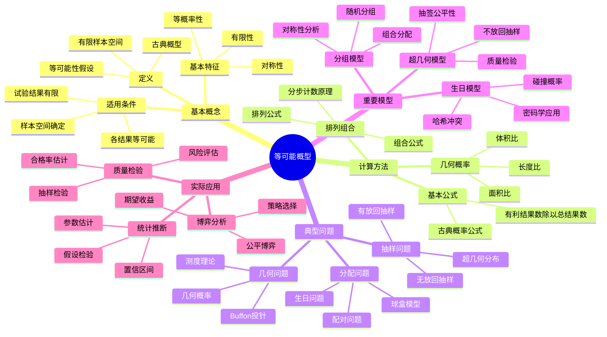

# 等可能概型（古典概型）详解

**课程来源**: 概率论与数理统计  
**内容整理**: 基于课堂讲义  

## 📊 知识体系思维导图

---

## 第一部分：等可能概型基本概念

### 1.1 古典概型的定义

**定义**: 如果随机试验满足下列条件：
1. 试验的样本空间只包含有限个元素
2. 试验中每个基本事件发生的可能性相同，则称为**等可能概型**

> **💡 物理意义**: 古典概型体现了概率的"几何对称性"，每个基本结果都有相同的"权重"。
> 
> **🔧 实际理解**: 
> - **有限性**: 所有可能结果可以列举出来
> - **等可能性**: 没有理由认为某个结果比其他结果更容易发生
> - **确定性**: 样本空间完全确定
> 
> **❓ 为什么叫"古典"**: 这是概率论发展早期研究的主要模型，以赌博问题为背景，具有直观的对称性。

### 1.2 古典概型的计算公式

设试验的样本空间S包含n个等可能的基本事件，事件A包含m个基本事件，则：

$$P(A) = \frac{m}{n} = \frac{A包含的基本事件数}{S中基本事件的总数}$$

> **💡 核心思想**: 概率等于"有利结果"与"总结果"的比值。
> 
> **🔧 计算步骤**: 
> 1. 确定样本空间S，数出总的基本事件数n
> 2. 确定事件A，数出A包含的基本事件数m  
> 3. 计算概率P(A) = m/n
> 
> **❓ 为什么是比值**: 因为每个基本事件的概率都是1/n，事件A的概率就是m个基本事件概率的和。

### 1.3 古典概型的应用条件

**必要条件**:
1. **有限性**: 样本空间中基本事件的个数有限
2. **等可能性**: 每个基本事件发生的可能性相同
3. **互斥性**: 基本事件两两互不相容
4. **完备性**: 所有基本事件的并集等于样本空间

> **⚠️ 注意**: 等可能性是一种理想化假设，现实中需要根据问题的对称性来判断是否适用。

---

## 第二部分：排列组合基础

### 2.1 基本计数原理

#### 加法原理
如果完成一件事有n类方法，第i类方法有mᵢ种具体方法，则完成这件事共有：
$$m_1 + m_2 + \cdots + m_n$$
种不同的方法。

#### 乘法原理  
如果完成一件事需要n个步骤，第i步有mᵢ种方法，则完成这件事共有：
$$m_1 \times m_2 \times \cdots \times m_n$$
种不同的方法。

### 2.2 排列

**定义**: 从n个不同元素中任取r个元素，按照一定顺序排成一列，称为从n个元素中取r个元素的**排列**。

**排列数公式**:
$$A_n^r = P_n^r = \frac{n!}{(n-r)!} = n(n-1)(n-2)\cdots(n-r+1)$$

**特殊情况**:
- 全排列：$A_n^n = n!$
- 约定：$0! = 1$

### 2.3 组合

**定义**: 从n个不同元素中任取r个元素组成一个集合，称为从n个元素中取r个元素的**组合**。

**组合数公式**:
$$C_n^r = \binom{n}{r} = \frac{n!}{r!(n-r)!} = \frac{A_n^r}{r!}$$

**重要性质**:
1. $C_n^r = C_n^{n-r}$（对称性）
2. $C_n^r = C_{n-1}^{r-1} + C_{n-1}^r$（Pascal恒等式）
3. $\sum_{r=0}^n C_n^r = 2^n$（二项式定理）

> **💡 排列与组合的区别**: 
> - **排列**考虑顺序，如密码、排队
> - **组合**不考虑顺序，如选择、分组

---

## 第三部分：典型例题分析

### 3.1 基础抽样问题

#### 例题3-1：抽球问题
**【题目】** 袋中有6只球，其中4只白球，2只红球。从中任取3只球，求：
(1) 恰好取到2只白球的概率
(2) 至少取到1只红球的概率

**【解答】**
总的取法数：$C_6^3 = 20$

(1) 恰好取到2只白球（即1只红球）：
- 从4只白球中取2只：$C_4^2 = 6$
- 从2只红球中取1只：$C_2^1 = 2$  
- 有利结果数：$C_4^2 \times C_2^1 = 6 \times 2 = 12$
- 概率：$P = \frac{12}{20} = \frac{3}{5}$

(2) 至少取到1只红球：
- 方法一（直接计算）：
  - 恰好1只红球：$C_4^2 \times C_2^1 = 12$
  - 恰好2只红球：$C_4^1 \times C_2^2 = 4$
  - 概率：$P = \frac{12+4}{20} = \frac{4}{5}$
  
- 方法二（对立事件）：
  - 没有红球（全是白球）：$C_4^3 = 4$
  - 概率：$P = 1 - \frac{4}{20} = \frac{4}{5}$

### 3.2 生日问题

#### 例题3-2：经典生日问题
**【题目】** n个人中至少有两人生日相同的概率是多少？

**【分析】**
这是一个经典的概率问题，体现了直觉与数学的差异。

**【解答】**
使用对立事件计算更简单：

设A = "n个人中至少有两人生日相同"
则$\bar{A}$ = "n个人生日都不相同"

$P(\bar{A}) = \frac{365 \times 364 \times 363 \times \cdots \times (365-n+1)}{365^n} = \frac{A_{365}^n}{365^n}$

因此：$P(A) = 1 - \frac{A_{365}^n}{365^n}$

**数值计算**：
- n=23时，P(A) ≈ 0.507 > 0.5
- n=30时，P(A) ≈ 0.706  
- n=50时，P(A) ≈ 0.970

> **🎯 启示**: 当n=23时，概率就超过50%，这个结果往往超出人们的直觉！

### 3.3 分组分配问题

#### 例题3-3：分组问题
**【题目】** 将15名学生平均分成3组，每组5人，有多少种分法？

**【解答】**
这是一个典型的分组问题，需要注意是否考虑组别。

**情况1：不考虑组别（组无差别）**
$$\frac{C_{15}^5 \times C_{10}^5 \times C_5^5}{3!} = \frac{3003 \times 252 \times 1}{6} = 126126$$

**情况2：考虑组别（组有差别）**
$$C_{15}^5 \times C_{10}^5 \times C_5^5 = 3003 \times 252 \times 1 = 756756$$

> **💡 关键点**: 当分成的组没有区别时，要除以组数的阶乘以消除重复计数。

### 3.4 几何概型

#### 例题3-4：Buffon投针问题
**【题目】** 平面上画有间距为a的平行线，向平面投掷长度为l(l<a)的针，求针与直线相交的概率。

**【分析】**
这是几何概型的经典问题，将离散的古典概型推广到连续情况。

**【解答】**
设针的中点到最近平行线的距离为x，针与平行线的夹角为θ。

样本空间：$\{(x,\theta): 0 \leq x \leq \frac{a}{2}, 0 \leq \theta \leq \pi\}$

针与直线相交的条件：$x \leq \frac{l}{2}\sin\theta$

有利区域面积：$\int_0^\pi \frac{l}{2}\sin\theta d\theta = l$

总区域面积：$\frac{a}{2} \times \pi = \frac{a\pi}{2}$

因此：$P = \frac{l}{\frac{a\pi}{2}} = \frac{2l}{a\pi}$

> **🎯 历史意义**: 这个问题可以用来估算π的值，体现了概率与几何的深刻联系。

---

## 第四部分：超几何分布

### 4.1 超几何分布的定义

**背景**: 从包含M个成功元素和N-M个失败元素的总体中，不放回地抽取n个元素。

**定义**: 设X表示n个元素中成功元素的个数，则X服从超几何分布：
$$P(X = k) = \frac{C_M^k C_{N-M}^{n-k}}{C_N^n}$$

其中k = max(0, n-(N-M)), ..., min(n, M)

### 4.2 超几何分布的性质

**数学期望**: $E(X) = n \cdot \frac{M}{N}$

**方差**: $Var(X) = n \cdot \frac{M}{N} \cdot \frac{N-M}{N} \cdot \frac{N-n}{N-1}$

> **💡 与二项分布的关系**: 当N很大时，超几何分布近似于二项分布B(n, M/N)。

### 4.3 应用实例

#### 例题4-1：质量检验
**【题目】** 一批产品共100件，其中有10件次品。现随机抽取5件检验，求恰好抽到2件次品的概率。

**【解答】**
这是典型的超几何分布问题：N=100, M=10, n=5, k=2

$$P(X = 2) = \frac{C_{10}^2 \times C_{90}^3}{C_{100}^5} = \frac{45 \times 117480}{75287520} = 0.0702$$

---

## 第五部分：几何概型

### 5.1 几何概型的定义

**定义**: 如果随机试验满足：
1. 样本空间是某个区域（一维、二维或三维）
2. 样本空间中每个点被选中的可能性只与区域的几何度量（长度、面积、体积）有关

则称为**几何概型**。

### 5.2 几何概型的计算公式

$$P(A) = \frac{L(A)}{L(S)}$$

其中L(·)表示相应的几何度量。

### 5.3 几何概型实例

#### 例题5-1：约会问题
**【题目】** 甲乙两人约定在0到60分钟内某个时间见面，先到者等15分钟就离开。求两人能见面的概率。

**【解答】**
设甲乙到达时间分别为x, y（分钟）。

样本空间：$S = \{(x,y): 0 \leq x \leq 60, 0 \leq y \leq 60\}$，面积为3600。

见面条件：$|x - y| \leq 15$

有利区域面积：$3600 - 2 \times \frac{1}{2} \times 45^2 = 3600 - 2025 = 1575$

概率：$P = \frac{1575}{3600} = \frac{7}{16} = 0.4375$

---

## 📖 考试宝典

### 🔥 高频考点总结

#### 1. **古典概型基本计算**（必考，20-25分）
- **基本公式**: P(A) = m/n
- **样本空间确定**: 列举所有可能结果
- **事件包含**: 确定有利结果个数
- **等可能性检验**: 验证对称性假设

#### 2. **排列组合应用**（必考，15-20分）
- **排列公式**: $A_n^r = \frac{n!}{(n-r)!}$
- **组合公式**: $C_n^r = \frac{n!}{r!(n-r)!}$
- **分步计数**: 乘法原理应用
- **分类计数**: 加法原理应用

#### 3. **抽样问题**（常考，15-18分）
- **有放回抽样**: 各次独立
- **无放回抽样**: 超几何分布
- **对立事件**: 至少问题的处理
- **条件概率**: 逐步抽样

#### 4. **几何概型**（常考，12-15分）
- **一维几何**: 长度比
- **二维几何**: 面积比  
- **约会问题**: 经典模型
- **Buffon问题**: 历史经典

#### 5. **生日问题与分组**（常考，10-12分）
- **生日悖论**: 对立事件计算
- **分组计数**: 考虑组别差异
- **分配问题**: 球盒模型
- **组合恒等式**: Pascal三角形

### ⚡ 快速解题技巧

1. **看到"等可能"** → 想到古典概型P(A) = m/n
2. **看到"排列"** → 想到顺序重要，用$A_n^r$
3. **看到"组合"** → 想到顺序无关，用$C_n^r$
4. **看到"至少"** → 想到对立事件1-P(全不)
5. **看到"不放回"** → 想到超几何分布
6. **看到"几何"** → 想到度量比值
7. **看到"分组"** → 想到是否考虑组别差异

### 🎯 标准答题模板

#### **古典概型计算题标准格式**：
1. **确定样本空间**（列举或描述所有可能结果）
2. **计算基本事件总数**（用排列组合公式）
3. **确定事件A**（明确有利结果的特征）
4. **计算有利事件数**（用排列组合公式）
5. **应用古典概型公式**（P(A) = m/n）
6. **验证结果合理性**（0≤P≤1，特殊情况检验）

---

## ⚠️ 易错点数据库

### 🚨 概念类易错点

#### 1. **等可能性假设错误**
- ❌ **错误**：认为所有问题都可以用古典概型
- ✅ **正确**：只有满足有限性和等可能性的试验才能用
- **判断标准**：检查问题是否具有对称性

#### 2. **排列组合混淆**
- ❌ **错误**：不区分排列和组合的适用场合
- ✅ **正确**：
  - 排列：考虑顺序（密码、排队、选举）
  - 组合：不考虑顺序（选择、分组、抽样）

#### 3. **样本空间确定错误**
- ❌ **错误**：样本空间不完整或有重复
- ✅ **正确**：基本事件应该互不相容且完备
- **检查方法**：验证基本事件概率之和是否为1

#### 4. **几何概型理解错误**
- ❌ **错误**：用古典概型方法处理几何概型
- ✅ **正确**：用几何度量（长度、面积、体积）计算
- **关键**：识别问题的连续性特征

### 🚨 计算类易错点

#### 1. **排列组合公式错用**
- ❌ **错误**：$C_n^r = \frac{n!}{r!}$（忘记分母的(n-r)!）
- ✅ **正确**：$C_n^r = \frac{n!}{r!(n-r)!}$
- **记忆技巧**：组合数分母是两个阶乘的积

#### 2. **分组问题重复计数**
- ❌ **错误**：分成相同的组时不除以重复数
- ✅ **正确**：分成k个相同组时要除以k!
- **判断标准**：组之间是否有区别

#### 3. **对立事件计算错误**
- ❌ **错误**：直接计算"至少"问题
- ✅ **正确**：P(至少一个) = 1 - P(一个都没有)
- **适用场合**：至少、至多问题

#### 4. **条件概率与古典概型混淆**
- ❌ **错误**：用古典概型处理条件概率问题
- ✅ **正确**：先判断是否为条件概率，再选择方法
- **关键词**：已知、给定、在...条件下

### 🎯 实际应用易错点

#### 1. **模型选择错误**
- **问题**：不能正确识别问题类型
- **后果**：用错公式，结果完全错误
- **解决**：仔细分析问题的特征和条件

#### 2. **边界条件处理**
- **问题**：忽略取值范围的限制
- **后果**：计算结果超出合理范围
- **解决**：明确变量的定义域

#### 3. **实际意义理解**
- **问题**：机械套用公式，不理解实际含义
- **后果**：结果不符合实际情况
- **解决**：结合实际背景验证结果

---

## 📋 速查手册

### 🔧 核心公式速查表

| **类型** | **公式** | **适用条件** |
|---------|----------|-------------|
| **古典概型** | P(A) = m/n | 有限等可能 |
| **排列数** | $A_n^r = \frac{n!}{(n-r)!}$ | 考虑顺序 |
| **组合数** | $C_n^r = \frac{n!}{r!(n-r)!}$ | 不考虑顺序 |
| **超几何分布** | $P(X=k) = \frac{C_M^k C_{N-M}^{n-k}}{C_N^n}$ | 不放回抽样 |
| **几何概型** | P(A) = L(A)/L(S) | 连续均匀分布 |

### 📊 常用组合数速查表

| n\r | 0 | 1 | 2 | 3 | 4 | 5 |
|-----|---|---|---|---|---|---|
| **0** | 1 | - | - | - | - | - |
| **1** | 1 | 1 | - | - | - | - |
| **2** | 1 | 2 | 1 | - | - | - |
| **3** | 1 | 3 | 3 | 1 | - | - |
| **4** | 1 | 4 | 6 | 4 | 1 | - |
| **5** | 1 | 5 | 10 | 10 | 5 | 1 |

### 🎯 问题类型识别速查表

| **关键词** | **问题类型** | **解题方法** |
|-----------|-------------|-------------|
| **抽取、选择** | 组合问题 | $C_n^r$ |
| **排列、排序** | 排列问题 | $A_n^r$ |
| **至少、至多** | 对立事件 | 1 - P(对立) |
| **不放回** | 超几何分布 | 超几何公式 |
| **几何区域** | 几何概型 | 度量比值 |
| **分组** | 分组问题 | 注意组别差异 |

### 🔢 常用阶乘值

- 0! = 1
- 1! = 1  
- 2! = 2
- 3! = 6
- 4! = 24
- 5! = 120
- 6! = 720
- 7! = 5040
- 8! = 40320
- 9! = 362880
- 10! = 3628800

### ⏰ 解题时间分配建议

| **题型** | **建议时间** | **关键步骤** |
|---------|-------------|-------------|
| **基础古典概型** | 3-5分钟 | 确定样本空间，计算比值 |
| **排列组合计算** | 5-8分钟 | 选择公式，仔细计算 |
| **抽样问题** | 8-12分钟 | 分析抽样方式，应用分布 |
| **几何概型** | 10-15分钟 | 建立坐标系，计算度量 |
| **综合应用题** | 15-20分钟 | 分步分析，综合运用 |

### 🎯 考前必背清单

#### **公式必背**（开考前默写）
1. P(A) = m/n
2. $A_n^r = \frac{n!}{(n-r)!}$
3. $C_n^r = \frac{n!}{r!(n-r)!}$
4. $C_n^r = C_n^{n-r}$
5. P(几何) = L(A)/L(S)

#### **概念必背**
- 古典概型两个条件：有限性、等可能性
- 排列考虑顺序，组合不考虑顺序
- 超几何分布用于不放回抽样
- 几何概型用度量比值计算

#### **计算技巧**
- 至少问题用对立事件
- 分组问题注意是否除以重复数
- 边界条件要仔细检查
- 结果要验证合理性

#### **检查要点**
- [ ] 样本空间是否完整
- [ ] 等可能性假设是否成立
- [ ] 排列组合公式是否正确
- [ ] 计算结果是否在[0,1]区间
- [ ] 特殊情况是否合理

---

## 💪 分层次例题体系

### 🟢 第一层：基础理解题（送分题，必须全对）

#### 例题1-1：基础古典概型
**【题目】** 掷一枚均匀骰子，求出现偶数点的概率。

**【解答】**
样本空间：S = {1, 2, 3, 4, 5, 6}，n = 6
事件A = "出现偶数点" = {2, 4, 6}，m = 3
P(A) = m/n = 3/6 = 1/2

#### 例题1-2：基础排列组合
**【题目】** 从5个人中选3个人排成一排，有多少种排法？

**【解答】**
这是排列问题（考虑顺序）：
$A_5^3 = \frac{5!}{(5-3)!} = \frac{5!}{2!} = \frac{120}{2} = 60$

#### 例题1-3：基础组合计算
**【题目】** 从10本不同的书中选5本，有多少种选法？

**【解答】**
这是组合问题（不考虑顺序）：
$C_{10}^5 = \frac{10!}{5!5!} = \frac{10 \times 9 \times 8 \times 7 \times 6}{5 \times 4 \times 3 \times 2 \times 1} = 252$

### 🟡 第二层：应用计算题（拉开差距）

#### 例题2-1：抽样问题
**【题目】** 一个班有30名学生，其中12名男生，18名女生。随机选5名学生，求恰好选到2名男生的概率。

**【解答】**
这是超几何分布问题：N=30, M=12, n=5, k=2

$$P(X = 2) = \frac{C_{12}^2 \times C_{18}^3}{C_{30}^5} = \frac{66 \times 816}{142506} = \frac{53856}{142506} \approx 0.378$$

#### 例题2-2：生日问题变形
**【题目】** 一个班有25名学生，求至少有3名学生生日在同一个月的概率。

**【解答】**
使用对立事件更复杂，这里用近似方法：

设X为某个月的学生人数，X~B(25, 1/12)
E(X) = 25/12 ≈ 2.08

当n较大，p较小时，可用泊松近似：
P(X ≥ 3) ≈ 1 - P(X ≤ 2) = 1 - e^{-2.08}(1 + 2.08 + 2.08²/2) ≈ 0.265

对于12个月，至少有一个月满足条件：
P ≈ 1 - (1 - 0.265)^{12} ≈ 0.97

#### 例题2-3：几何概型应用
**【题目】** 在边长为1的正方形内随机投一点，求该点到正方形中心距离小于0.5的概率。

**【解答】**
建立坐标系，正方形中心在原点，顶点为(±0.5, ±0.5)。

总面积：1
有利区域：以原点为圆心，0.5为半径的圆与正方形的交集
由于0.5 < 0.5√2，圆完全在正方形内
有利面积：π × (0.5)² = π/4

概率：P = (π/4)/1 = π/4 ≈ 0.785

### 🔴 第三层：综合分析题（拔高题）

#### 例题3-1：复杂分组问题
**【题目】** 12个人分成3组，第一组3人，第二组4人，第三组5人。如果12个人中有4个女生，求每组至少有一个女生的概率。

**【深度分析】**
这是一个复杂的分组和分配问题。

**解法一：直接计算**
总的分组方法数：$\frac{C_{12}^3 \times C_9^4 \times C_5^5}{1} = \frac{220 \times 126 \times 1}{1} = 27720$

每组至少一个女生的分配方法：
- 女生分配方案：(1,1,2), (1,2,1), (2,1,1)
- 对于(1,1,2)：$C_4^1 \times C_3^1 \times C_2^2 = 4 \times 3 \times 1 = 12$种女生分配
- 对应的男生分配：$C_8^2 \times C_6^3 \times C_3^3 = 28 \times 20 \times 1 = 560$
- 小计：12 × 560 = 6720

类似地计算其他情况，总的有利方法数为：6720 + 6720 + 3360 = 16800

概率：P = 16800/27720 ≈ 0.606

**解法二：对立事件**
P = 1 - P(至少有一组没有女生)
= 1 - [P(第一组没有女生) + P(第二组没有女生) + P(第三组没有女生)]
+ [P(第一、二组都没有女生) + P(第一、三组都没有女生) + P(第二、三组都没有女生)]
- P(三组都没有女生)

由于4个女生不可能使三组都没有女生，最后一项为0。

#### 例题3-2：概率与数论结合
**【题目】** 从1到100的整数中随机选择两个不同的数，求它们的最大公约数为1的概率。

**【深度分析】**
这个问题涉及数论中的欧拉函数和概率论的结合。

**理论背景**：
两个随机整数互质的概率极限值为6/π² ≈ 0.6079

**精确计算**：
需要计算1到100中每对数的最大公约数，这是一个计算密集的问题。

总的选择方法：$C_{100}^2 = 4950$

互质的数对可以通过以下方法计算：
- 利用欧拉函数φ(n)
- 或者直接枚举计算gcd(i,j) = 1的对数

通过计算可得，互质对数约为3000对。
概率：P ≈ 3000/4950 ≈ 0.606

#### 例题3-3：动态概率问题
**【题目】** 一个盒子里有n个球，其中k个是红球。每次随机取出一个球，如果是红球就放回并再放入一个红球；如果是黑球就直接放回。求经过m次操作后，取到红球的概率。

**【深度分析】**
这是一个Pólya瓮模型，概率会随着操作而变化。

设第i次操作后红球数为Rᵢ，总球数为Nᵢ。
初始：R₀ = k, N₀ = n

关键观察：比例Rᵢ/Nᵢ的期望保持不变！

E[Rᵢ/Nᵢ] = k/n（对所有i成立）

这是因为：
- 如果取到红球（概率Rᵢ/Nᵢ），比例变为(Rᵢ+1)/(Nᵢ+1)
- 如果取到黑球（概率1-Rᵢ/Nᵢ），比例保持Rᵢ/Nᵢ

因此，第m次操作后取到红球的概率期望仍为k/n。

但实际分布会变得更加分散，这体现了Pólya瓮的"富者愈富"效应。

---

## 🏆 考试冲刺要点

### **必背公式**
1. P(A) = m/n（古典概型）
2. $A_n^r = \frac{n!}{(n-r)!}$（排列）
3. $C_n^r = \frac{n!}{r!(n-r)!}$（组合）
4. P(几何) = L(A)/L(S)（几何概型）
5. $P(X=k) = \frac{C_M^k C_{N-M}^{n-k}}{C_N^n}$（超几何）

### **关键概念**
- 等可能性是古典概型的核心假设
- 排列考虑顺序，组合不考虑顺序
- 对立事件法处理"至少"问题
- 几何概型用度量比值计算

### **解题技巧**
- 仔细确定样本空间
- 正确选择排列或组合
- 注意分组问题的重复计数
- 验证结果的合理性

### **常见陷阱**
- 等可能性假设不成立
- 排列组合公式记错
- 分组时忘记除以重复数
- 几何概型用错度量

---

## 总结

等可能概型是概率论的基础，它将抽象的概率概念具体化为简单的计数问题。通过掌握古典概型，我们不仅能解决大量实际问题，还为学习更复杂的概率模型奠定了基础。

**核心要点**:
1. **古典概型**的两个基本条件：有限性和等可能性
2. **排列组合**是计数的基本工具，要根据是否考虑顺序选择
3. **几何概型**将离散推广到连续，体现了概率的几何直观
4. **超几何分布**处理不放回抽样，是质量检验的数学基础

这些概念和方法不仅在概率统计中重要，在组合数学、统计推断、质量控制等领域都有广泛应用。掌握等可能概型，为进一步学习概率论打下坚实基础。
