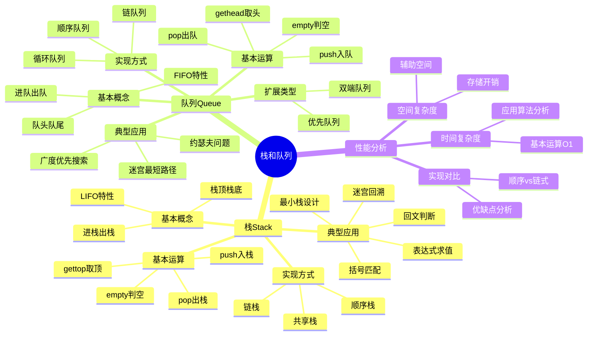

# 栈和队列详解

**课程来源**: 数据结构与算法  
**适用专业**: 计算机科学与技术、软件工程  
**整理时间**: 2024-10-13

## 📊 知识体系思维导图



---

## 第一部分：栈(Stack)

### 1.1 栈的基本概念

**定义**: 栈是一种只能在同一端进行插入或删除操作的线性表。

> **💡 核心特性**: 
> - **LIFO原则**: Last-In, First-Out（后进先出）
> - **单端操作**: 只能在栈顶进行插入和删除
> - **受限线性表**: 是线性表的特殊形式
> 
> **🔧 基本术语**: 
> - **栈顶(top)**: 允许插入和删除的一端
> - **栈底(bottom)**: 另一端，固定不变
> - **进栈/入栈(push)**: 插入操作
> - **退栈/出栈(pop)**: 删除操作
> 
> **❓ 为什么叫"栈"**: 类似于现实中的盘子堆叠，只能从顶部取放盘子。

### 1.2 栈的抽象数据类型(ADT)

```
ADT Stack {
    数据对象: D = {ai | 0≤i≤n-1, n≥0}
    数据关系: R = {<ai, ai+1> | ai, ai+1 ∈ D, i=0,1,...,n-2}
    基本运算:
        InitStack(&S)      // 初始化栈
        empty(S)           // 判断栈是否为空
        push(&S, e)        // 元素e入栈
        pop(&S, &e)        // 栈顶元素出栈
        gettop(S)          // 获取栈顶元素但不删除
        display(S)         // 输出栈中所有元素
} ADT Stack
```

### 1.3 栈的实现方式

#### 1.3.1 顺序栈(Sequential Stack)

**实现原理**: 使用数组存储栈元素，用一个指针top指示栈顶位置。

```python
class SqStack:
    def __init__(self, maxsize=10):
        self.maxsize = maxsize
        self.data = [None] * maxsize
        self.top = -1                    # 栈顶指针，-1表示空栈
    
    def empty(self):
        """判断栈是否为空"""
        return self.top == -1
    
    def push(self, e):
        """入栈操作"""
        if self.top == self.maxsize - 1:
            raise Exception("栈满，无法入栈")
        self.top += 1
        self.data[self.top] = e
    
    def pop(self):
        """出栈操作"""
        if self.empty():
            raise Exception("栈空，无法出栈")
        e = self.data[self.top]
        self.top -= 1
        return e
    
    def gettop(self):
        """获取栈顶元素"""
        if self.empty():
            raise Exception("栈空")
        return self.data[self.top]
```

**性能分析**:
- 时间复杂度：所有基本操作都是O(1)
- 空间复杂度：O(n)，n为栈的最大容量
- 优点：实现简单，存储密度高
- 缺点：栈的大小固定，可能溢出

#### 1.3.2 链栈(Linked Stack)

**实现原理**: 使用单链表存储栈元素，链表头部作为栈顶。

```python
class LinkNode:
    def __init__(self, data=None):
        self.data = data
        self.next = None

class LinkStack:
    def __init__(self):
        self.head = None                 # 头指针，指向栈顶
    
    def empty(self):
        """判断栈是否为空"""
        return self.head is None
    
    def push(self, e):
        """入栈操作"""
        s = LinkNode(e)
        s.next = self.head
        self.head = s
    
    def pop(self):
        """出栈操作"""
        if self.empty():
            raise Exception("栈空，无法出栈")
        e = self.head.data
        self.head = self.head.next
        return e
    
    def gettop(self):
        """获取栈顶元素"""
        if self.empty():
            raise Exception("栈空")
        return self.head.data
```

**性能分析**:
- 时间复杂度：所有基本操作都是O(1)
- 空间复杂度：O(n)，n为栈中元素个数
- 优点：动态分配，不会溢出
- 缺点：需要额外指针空间

#### 1.3.3 共享栈

**设计思想**: 两个栈共享一个数组，分别从数组两端向中间增长。

```python
class SharedStack:
    def __init__(self, maxsize=10):
        self.maxsize = maxsize
        self.data = [None] * maxsize
        self.top1 = -1                   # 栈1的栈顶指针
        self.top2 = maxsize              # 栈2的栈顶指针
    
    def push1(self, e):
        """栈1入栈"""
        if self.top1 + 1 == self.top2:
            raise Exception("栈满")
        self.top1 += 1
        self.data[self.top1] = e
    
    def push2(self, e):
        """栈2入栈"""
        if self.top1 + 1 == self.top2:
            raise Exception("栈满")
        self.top2 -= 1
        self.data[self.top2] = e
    
    def pop1(self):
        """栈1出栈"""
        if self.top1 == -1:
            raise Exception("栈1空")
        e = self.data[self.top1]
        self.top1 -= 1
        return e
    
    def pop2(self):
        """栈2出栈"""
        if self.top2 == self.maxsize:
            raise Exception("栈2空")
        e = self.data[self.top2]
        self.top2 += 1
        return e
```

> **💡 共享栈优势**: 
> - 充分利用存储空间
> - 适合两个栈大小变化相反的情况
> - 只有当整个数组都满时才会溢出

---

## 第二部分：栈的典型应用

### 2.1 括号匹配

**问题描述**: 检查表达式中的括号是否正确匹配。

**算法思路**:
1. 遍历表达式字符串
2. 遇到左括号就入栈
3. 遇到右括号，检查栈顶是否为匹配的左括号
4. 最后检查栈是否为空

```python
def bracket_match(s):
    """括号匹配检查"""
    stack = []
    pairs = {'(': ')', '[': ']', '{': '}'}
    
    for char in s:
        if char in pairs:           # 左括号
            stack.append(char)
        elif char in pairs.values(): # 右括号
            if not stack:
                return False
            if pairs[stack.pop()] != char:
                return False
    
    return len(stack) == 0

# 测试用例
print(bracket_match("()[]{}"))      # True
print(bracket_match("([)]"))        # False
print(bracket_match("((()))"))      # True
```

**算法分析**:
- 时间复杂度：O(n)，n为字符串长度
- 空间复杂度：O(n)，最坏情况下所有字符都是左括号

### 2.2 表达式求值

#### 2.2.1 中缀转后缀

**算法思路**:
1. 使用运算符栈
2. 遇到操作数直接输出
3. 遇到运算符根据优先级处理

```python
def infix_to_postfix(infix):
    """中缀表达式转后缀表达式"""
    precedence = {'+': 1, '-': 1, '*': 2, '/': 2, '(': 0}
    stack = []
    postfix = []
    
    for char in infix:
        if char.isalnum():          # 操作数
            postfix.append(char)
        elif char == '(':           # 左括号
            stack.append(char)
        elif char == ')':           # 右括号
            while stack and stack[-1] != '(':
                postfix.append(stack.pop())
            stack.pop()             # 弹出左括号
        else:                       # 运算符
            while (stack and 
                   precedence[stack[-1]] >= precedence[char]):
                postfix.append(stack.pop())
            stack.append(char)
    
    while stack:                    # 弹出剩余运算符
        postfix.append(stack.pop())
    
    return ''.join(postfix)

# 测试用例
print(infix_to_postfix("a+b*c"))       # abc*+
print(infix_to_postfix("(a+b)*c"))     # ab+c*
```

#### 2.2.2 后缀表达式求值

```python
def evaluate_postfix(postfix):
    """后缀表达式求值"""
    stack = []
    
    for char in postfix:
        if char.isdigit():          # 操作数
            stack.append(int(char))
        else:                       # 运算符
            b = stack.pop()
            a = stack.pop()
            if char == '+':
                stack.append(a + b)
            elif char == '-':
                stack.append(a - b)
            elif char == '*':
                stack.append(a * b)
            elif char == '/':
                stack.append(a / b)
    
    return stack[0]

# 测试用例
print(evaluate_postfix("23+4*"))       # 20
print(evaluate_postfix("234*+"))       # 14
```

### 2.3 最小栈设计

**问题描述**: 设计一个栈，支持push、pop、top和getMin操作，且所有操作的时间复杂度都是O(1)。

```python
class MinStack:
    def __init__(self):
        self.data = []              # 主栈
        self.min_data = []          # 辅助栈，存储最小值
    
    def push(self, x):
        """入栈操作"""
        self.data.append(x)
        # 更新最小值栈
        if not self.min_data or x <= self.min_data[-1]:
            self.min_data.append(x)
    
    def pop(self):
        """出栈操作"""
        if not self.data:
            return None
        x = self.data.pop()
        # 如果弹出的是最小值，同时更新最小值栈
        if x == self.min_data[-1]:
            self.min_data.pop()
        return x
    
    def top(self):
        """获取栈顶元素"""
        return self.data[-1] if self.data else None
    
    def getMin(self):
        """获取最小值"""
        return self.min_data[-1] if self.min_data else None
```

> **💡 设计思想**: 
> - 用辅助栈同步维护当前最小值
> - 只在必要时向辅助栈压入元素
> - 保证所有操作都是O(1)时间复杂度

---

## 第三部分：队列(Queue)

### 3.1 队列的基本概念

**定义**: 队列是一种只能在不同端进行插入或删除操作的线性表。

> **💡 核心特性**: 
> - **FIFO原则**: First-In, First-Out（先进先出）
> - **双端操作**: 一端插入，另一端删除
> - **受限线性表**: 是线性表的特殊形式
> 
> **🔧 基本术语**: 
> - **队头(front)**: 进行删除操作的一端
> - **队尾(rear)**: 进行插入操作的一端
> - **进队(enqueue)**: 插入操作
> - **出队(dequeue)**: 删除操作
> 
> **❓ 为什么叫"队列"**: 类似于现实中的排队，先来的先服务。

### 3.2 队列的抽象数据类型(ADT)

```
ADT Queue {
    数据对象: D = {ai | 0≤i≤n-1, n≥0}
    数据关系: R = {<ai, ai+1> | ai, ai+1 ∈ D, i=0,1,...,n-2}
    基本运算:
        InitQueue(&Q)      // 初始化队列
        empty(Q)           // 判断队列是否为空
        enqueue(&Q, e)     // 元素e入队
        dequeue(&Q, &e)    // 队头元素出队
        gethead(Q)         // 获取队头元素但不删除
        display(Q)         // 输出队列中所有元素
} ADT Queue
```

### 3.3 队列的实现方式

#### 3.3.1 顺序队列

**非循环队列的问题**: 随着出队操作，会出现"假溢出"现象。

```python
class SqQueue:
    def __init__(self, maxsize=10):
        self.maxsize = maxsize
        self.data = [None] * maxsize
        self.front = 0              # 队头指针
        self.rear = 0               # 队尾指针
    
    def empty(self):
        return self.front == self.rear
    
    def enqueue(self, e):
        if self.rear == self.maxsize:
            raise Exception("队列满")   # 假溢出！
        self.data[self.rear] = e
        self.rear += 1
    
    def dequeue(self):
        if self.empty():
            raise Exception("队列空")
        e = self.data[self.front]
        self.front += 1
        return e
```

#### 3.3.2 循环队列

**解决方案**: 将数组逻辑上看成环形，使用取模运算。

```python
class CircularQueue:
    def __init__(self, maxsize=10):
        self.maxsize = maxsize
        self.data = [None] * maxsize
        self.front = 0              # 队头指针
        self.rear = 0               # 队尾指针
    
    def empty(self):
        """队空条件"""
        return self.front == self.rear
    
    def full(self):
        """队满条件（牺牲一个存储单元）"""
        return (self.rear + 1) % self.maxsize == self.front
    
    def enqueue(self, e):
        """入队操作"""
        if self.full():
            raise Exception("队列满")
        self.data[self.rear] = e
        self.rear = (self.rear + 1) % self.maxsize
    
    def dequeue(self):
        """出队操作"""
        if self.empty():
            raise Exception("队列空")
        e = self.data[self.front]
        self.front = (self.front + 1) % self.maxsize
        return e
    
    def gethead(self):
        """获取队头元素"""
        if self.empty():
            raise Exception("队列空")
        return self.data[self.front]
    
    def size(self):
        """获取队列长度"""
        return (self.rear - self.front + self.maxsize) % self.maxsize
```

> **💡 循环队列关键点**: 
> - 使用取模运算实现循环
> - 牺牲一个存储单元区分队空和队满
> - 队满条件：(rear + 1) % maxsize == front
> - 队空条件：rear == front

#### 3.3.3 链队列

**实现原理**: 使用单链表，设置front和rear两个指针。

```python
class QueueNode:
    def __init__(self, data=None):
        self.data = data
        self.next = None

class LinkQueue:
    def __init__(self):
        self.front = None           # 队头指针
        self.rear = None            # 队尾指针
    
    def empty(self):
        """判断队列是否为空"""
        return self.front is None
    
    def enqueue(self, e):
        """入队操作"""
        s = QueueNode(e)
        if self.empty():
            self.front = self.rear = s
        else:
            self.rear.next = s
            self.rear = s
    
    def dequeue(self):
        """出队操作"""
        if self.empty():
            raise Exception("队列空")
        e = self.front.data
        self.front = self.front.next
        if self.front is None:      # 队列变空
            self.rear = None
        return e
    
    def gethead(self):
        """获取队头元素"""
        if self.empty():
            raise Exception("队列空")
        return self.front.data
```

**性能对比**:

| 特性 | 循环队列 | 链队列 |
|------|----------|--------|
| **时间复杂度** | O(1) | O(1) |
| **空间利用率** | 高 | 中等 |
| **存储分配** | 静态 | 动态 |
| **溢出问题** | 可能溢出 | 不会溢出 |

---

## 第四部分：队列的扩展与应用

### 4.1 双端队列(Deque)

**定义**: 允许在队列两端进行插入和删除操作的队列。

```python
from collections import deque

# Python内置双端队列
dq = deque()

# 基本操作
dq.append(1)        # 右端入队
dq.appendleft(0)    # 左端入队
dq.pop()            # 右端出队
dq.popleft()        # 左端出队

# 应用示例：滑动窗口最大值
def max_sliding_window(nums, k):
    """滑动窗口最大值"""
    dq = deque()    # 存储数组下标
    result = []
    
    for i in range(len(nums)):
        # 移除超出窗口范围的元素
        while dq and dq[0] <= i - k:
            dq.popleft()
        
        # 移除比当前元素小的元素
        while dq and nums[dq[-1]] < nums[i]:
            dq.pop()
        
        dq.append(i)
        
        # 窗口形成后开始记录结果
        if i >= k - 1:
            result.append(nums[dq[0]])
    
    return result
```

### 4.2 优先队列

**定义**: 出队顺序由元素优先级决定，而非入队顺序。

```python
import heapq

class PriorityQueue:
    def __init__(self):
        self.heap = []
    
    def push(self, item, priority):
        """入队（优先级越小越优先）"""
        heapq.heappush(self.heap, (priority, item))
    
    def pop(self):
        """出队"""
        if self.heap:
            return heapq.heappop(self.heap)[1]
        raise Exception("队列空")
    
    def empty(self):
        return len(self.heap) == 0

# 使用示例
pq = PriorityQueue()
pq.push("任务A", 3)
pq.push("任务B", 1)
pq.push("任务C", 2)

print(pq.pop())     # 任务B（优先级1最高）
print(pq.pop())     # 任务C（优先级2次高）
```

### 4.3 队列的典型应用

#### 4.3.1 约瑟夫问题

**问题描述**: n个人围成圆圈，从第1个人开始报数，报到m的人出列，求最后剩余的人。

```python
def josephus_queue(n, m):
    """用队列解决约瑟夫问题"""
    queue = list(range(1, n + 1))  # 1到n的编号
    
    while len(queue) > 1:
        # 前m-1个人重新入队
        for _ in range(m - 1):
            queue.append(queue.pop(0))
        
        # 第m个人出队
        eliminated = queue.pop(0)
        print(f"出列: {eliminated}")
    
    return queue[0]  # 最后剩余的人

# 测试
print(f"最后剩余: {josephus_queue(7, 3)}")
```

#### 4.3.2 广度优先搜索(BFS)

**应用场景**: 迷宫最短路径、图的层次遍历等。

```python
def bfs_maze(maze, start, end):
    """BFS求解迷宫最短路径"""
    from collections import deque
    
    rows, cols = len(maze), len(maze[0])
    queue = deque([(start, [start])])  # (位置, 路径)
    visited = {start}
    directions = [(0,1), (1,0), (0,-1), (-1,0)]
    
    while queue:
        (x, y), path = queue.popleft()
        
        if (x, y) == end:
            return path
        
        for dx, dy in directions:
            nx, ny = x + dx, y + dy
            
            if (0 <= nx < rows and 0 <= ny < cols and 
                maze[nx][ny] == 0 and (nx, ny) not in visited):
                
                visited.add((nx, ny))
                queue.append(((nx, ny), path + [(nx, ny)]))
    
    return None  # 无路径

# 测试用例
maze = [
    [0, 1, 0, 0, 0],
    [0, 1, 0, 1, 0],
    [0, 0, 0, 1, 0],
    [1, 1, 0, 0, 0],
    [0, 0, 0, 1, 0]
]
path = bfs_maze(maze, (0, 0), (4, 4))
print("最短路径:", path)
```

---

## 📖 考试宝典

### 🔥 高频考点总结

#### 1. **栈的基本概念与操作**（必考，20-25分）
- **LIFO特性**：后进先出的工作原理
- **基本操作**：push、pop、gettop、empty的实现
- **实现方式**：顺序栈vs链栈的优缺点对比
- **共享栈**：两栈共享数组的设计思想

#### 2. **栈的典型应用**（必考，25-30分）
- **括号匹配**：算法思路和代码实现
- **表达式求值**：中缀转后缀、后缀求值算法
- **最小栈设计**：O(1)时间获取最小值的设计
- **回溯算法**：迷宫求解、八皇后等问题

#### 3. **队列的基本概念与操作**（必考，20-25分）
- **FIFO特性**：先进先出的工作原理
- **循环队列**：解决假溢出问题的设计
- **队满队空判断**：各种判断条件的区别
- **链队列实现**：front和rear指针的维护

#### 4. **队列的扩展与应用**（常考，15-20分）
- **双端队列**：deque的特点和应用
- **优先队列**：堆的基本概念和操作
- **BFS应用**：最短路径、层次遍历等
- **约瑟夫问题**：队列模拟的解法

#### 5. **性能分析与比较**（常考，10-15分）
- **时间复杂度**：各种操作的复杂度分析
- **空间复杂度**：存储开销的计算
- **实现选择**：根据应用场景选择合适实现
- **优化策略**：提高效率的方法

### ⚡ 快速解题技巧

1. **看到"后进先出"** → 想到栈的应用
2. **看到"括号匹配"** → 想到栈的经典应用
3. **看到"表达式求值"** → 想到栈处理运算符优先级
4. **看到"先进先出"** → 想到队列的应用
5. **看到"循环队列"** → 想到取模运算和队满判断
6. **看到"最短路径"** → 想到BFS和队列
7. **看到"回溯"** → 想到栈的深度优先特性
8. **看到"层次遍历"** → 想到队列的广度优先特性

### 🎯 标准答题模板

#### **栈应用题标准格式**：
1. **分析问题特点**（确定是否符合LIFO特性）
2. **选择实现方式**（顺序栈或链栈）
3. **设计算法步骤**（详细描述处理过程）
4. **编写代码实现**（注意边界条件处理）
5. **分析时间空间复杂度**（评估算法性能）

#### **队列应用题标准格式**：
1. **分析问题特点**（确定是否符合FIFO特性）
2. **选择队列类型**（普通队列、循环队列、优先队列）
3. **设计算法流程**（入队出队的时机和条件）
4. **实现具体代码**（注意队空队满判断）
5. **验证算法正确性**（举例说明执行过程）

---

## ⚠️ 易错点数据库

### 🚨 概念类易错点

#### 1. **栈和队列特性混淆**
- ❌ **错误**：认为栈是先进先出，队列是后进先出
- ✅ **正确**：栈是LIFO（后进先出），队列是FIFO（先进先出）
- **记忆技巧**：栈像叠盘子，队列像排队

#### 2. **循环队列队满条件错误**
- ❌ **错误**：认为rear == front时队满
- ✅ **正确**：(rear + 1) % maxsize == front时队满
- **易错原因**：忽略了牺牲一个存储单元的设计

#### 3. **共享栈理解错误**
- ❌ **错误**：认为两个栈从同一端开始增长
- ✅ **正确**：两个栈分别从数组两端向中间增长
- **关键点**：top1从-1开始增长，top2从maxsize开始减小

#### 4. **链栈和链队列指针操作混淆**
- ❌ **错误**：链栈也需要front和rear两个指针
- ✅ **正确**：链栈只需要一个head指针，链队列需要front和rear
- **原因**：栈只在一端操作，队列在两端操作

### 🚨 实现类易错点

#### 1. **栈溢出和下溢检查遗漏**
- ❌ **错误**：不检查栈满就入栈，不检查栈空就出栈
- ✅ **正确**：每次操作前都要检查边界条件
- **后果**：程序崩溃或产生错误结果

#### 2. **循环队列取模运算错误**
- ❌ **错误**：忘记使用取模运算
- ✅ **正确**：所有指针移动都要取模
- **正确写法**：`rear = (rear + 1) % maxsize`

#### 3. **链队列空队列处理错误**
- ❌ **错误**：队列变空时忘记更新rear指针
- ✅ **正确**：当front变为None时，rear也要设为None
- **关键代码**：
```python
if self.front is None:
    self.rear = None
```

#### 4. **表达式求值算法错误**
- ❌ **错误**：运算符优先级处理错误
- ✅ **正确**：严格按照优先级规则处理
- **注意点**：左括号优先级最低，右括号要弹出到左括号

### 🎯 应用类易错点

#### 1. **括号匹配算法不完整**
- **问题**：只检查括号类型匹配，不检查数量匹配
- **解决**：最后要检查栈是否为空

#### 2. **BFS路径记录错误**
- **问题**：只记录是否访问过，不记录路径
- **解决**：在队列中同时存储位置和路径信息

#### 3. **约瑟夫问题边界处理**
- **问题**：当队列只剩一个元素时继续操作
- **解决**：循环条件要正确设置

---

## 📋 速查手册

### 🔧 核心操作复杂度速查表

| 操作类型 | 顺序栈 | 链栈 | 循环队列 | 链队列 |
|---------|--------|------|----------|--------|
| **初始化** | O(1) | O(1) | O(1) | O(1) |
| **判空** | O(1) | O(1) | O(1) | O(1) |
| **入栈/入队** | O(1) | O(1) | O(1) | O(1) |
| **出栈/出队** | O(1) | O(1) | O(1) | O(1) |
| **取顶/取头** | O(1) | O(1) | O(1) | O(1) |
| **空间复杂度** | O(n) | O(n) | O(n) | O(n) |

### 📊 实现方式对比表

| 特性 | 顺序栈 | 链栈 | 循环队列 | 链队列 |
|------|--------|------|----------|--------|
| **存储方式** | 数组 | 链表 | 数组 | 链表 |
| **空间利用** | 高 | 中 | 高 | 中 |
| **溢出问题** | 可能 | 不会 | 可能 | 不会 |
| **实现复杂度** | 简单 | 中等 | 中等 | 复杂 |
| **缓存友好** | 是 | 否 | 是 | 否 |

### 🔢 经典应用算法模板

#### 括号匹配模板
```python
def bracket_match(s):
    stack = []
    pairs = {'(': ')', '[': ']', '{': '}'}
    for char in s:
        if char in pairs:
            stack.append(char)
        elif char in pairs.values():
            if not stack or pairs[stack.pop()] != char:
                return False
    return len(stack) == 0
```

#### BFS最短路径模板
```python
def bfs_shortest_path(graph, start, end):
    from collections import deque
    queue = deque([(start, [start])])
    visited = {start}
    
    while queue:
        node, path = queue.popleft()
        if node == end:
            return path
        
        for neighbor in graph[node]:
            if neighbor not in visited:
                visited.add(neighbor)
                queue.append((neighbor, path + [neighbor]))
    
    return None
```

### ⏰ 解题时间分配建议

| **题型** | **建议时间** | **关键步骤** |
|---------|-------------|-------------|
| **概念选择题** | 2-3分钟 | 理解LIFO/FIFO特性 |
| **实现填空题** | 5-8分钟 | 注意边界条件检查 |
| **应用设计题** | 10-15分钟 | 分析问题特点，选择合适结构 |
| **算法编程题** | 15-25分钟 | 完整实现，考虑异常处理 |
| **复杂度分析** | 3-5分钟 | 分析循环和递归结构 |

### 🎯 考前必背清单

#### **基本概念必背**
- 栈：LIFO，单端操作，后进先出
- 队列：FIFO，双端操作，先进先出
- 循环队列：取模运算，牺牲一个单元
- 共享栈：两端增长，充分利用空间

#### **关键算法必背**
- 括号匹配：左括号入栈，右括号匹配出栈
- 中缀转后缀：运算符栈，优先级比较
- 后缀求值：操作数栈，遇运算符就计算
- BFS最短路径：队列层次遍历，记录路径

#### **复杂度必背**
- 所有基本操作：O(1)时间复杂度
- 应用算法：通常O(n)时间复杂度
- 空间复杂度：O(n)存储空间

#### **实现要点必背**
- 边界检查：栈满栈空，队满队空
- 指针维护：链式结构的指针更新
- 取模运算：循环队列的关键操作
- 异常处理：空栈出栈，满栈入栈

---

## 💪 分层次例题体系

### 🟢 第一层：基础理解题（送分题，必须全对）

#### 例题1-1：基本概念辨析
**【题目】** 关于栈和队列，下列说法正确的是（ ）
A. 栈和队列都是先进先出的数据结构
B. 栈只能在栈顶操作，队列只能在队尾操作
C. 栈是LIFO结构，队列是FIFO结构
D. 栈和队列都可以随机访问元素

**【标准解答】** C

**【解题要点】**
- 栈：LIFO（Last-In, First-Out）后进先出
- 队列：FIFO（First-In, First-Out）先进先出
- 栈只能在栈顶操作，队列在队头删除、队尾插入
- 都不支持随机访问，只能顺序访问

#### 例题1-2：循环队列判断
**【题目】** 循环队列的容量为6，front=2，rear=4，则队列中元素个数为（ ）
A. 2  B. 3  C. 4  D. 无法确定

**【标准解答】** A

**【解题要点】**
- 循环队列长度公式：(rear - front + maxsize) % maxsize
- 计算：(4 - 2 + 6) % 6 = 8 % 6 = 2
- 注意：这里假设没有牺牲存储单元的设计

#### 例题1-3：栈的基本操作
**【题目】** 对空栈依次进行push(1), push(2), pop(), push(3), pop(), pop()操作后，栈中还有几个元素？
A. 0  B. 1  C. 2  D. 3

**【标准解答】** A

**【解题要点】**
- 模拟栈操作过程：
  - push(1): [1]
  - push(2): [1,2]
  - pop(): [1] (弹出2)
  - push(3): [1,3]
  - pop(): [1] (弹出3)
  - pop(): [] (弹出1)
- 最终栈为空，0个元素

### 🟡 第二层：应用计算题（拉开差距）

#### 例题2-1：括号匹配算法实现
**【题目】** 编写算法判断表达式中的括号是否匹配，包括()、[]、{}三种括号。

**【解题思路】**
使用栈来匹配括号：

```python
def is_valid_parentheses(s):
    """判断括号是否匹配"""
    stack = []
    mapping = {')': '(', ']': '[', '}': '{'}
    
    for char in s:
        if char in mapping:  # 右括号
            if not stack or stack.pop() != mapping[char]:
                return False
        elif char in '([{':  # 左括号
            stack.append(char)
    
    return len(stack) == 0

# 测试用例
test_cases = ["()", "()[]{}", "([)]", "((()))", ""]
for case in test_cases:
    print(f"'{case}': {is_valid_parentheses(case)}")
```

**【算法分析】**
- 时间复杂度：O(n)，需要遍历整个字符串
- 空间复杂度：O(n)，最坏情况下所有字符都是左括号
- 关键点：遇到右括号时检查栈顶是否为匹配的左括号

#### 例题2-2：用两个栈实现队列
**【题目】** 用两个栈实现一个队列，支持enqueue和dequeue操作。

**【解题思路】**
使用两个栈，一个用于入队，一个用于出队：

```python
class QueueWithTwoStacks:
    def __init__(self):
        self.stack1 = []  # 用于入队
        self.stack2 = []  # 用于出队
    
    def enqueue(self, x):
        """入队操作"""
        self.stack1.append(x)
    
    def dequeue(self):
        """出队操作"""
        if not self.stack2:
            # 将stack1的元素全部转移到stack2
            while self.stack1:
                self.stack2.append(self.stack1.pop())
        
        if not self.stack2:
            raise Exception("队列为空")
        
        return self.stack2.pop()
    
    def empty(self):
        """判断队列是否为空"""
        return len(self.stack1) == 0 and len(self.stack2) == 0

# 测试
queue = QueueWithTwoStacks()
queue.enqueue(1)
queue.enqueue(2)
print(queue.dequeue())  # 1
queue.enqueue(3)
print(queue.dequeue())  # 2
print(queue.dequeue())  # 3
```

**【设计思想】**
- stack1负责入队，直接push
- stack2负责出队，当stack2为空时，将stack1的所有元素转移过来
- 均摊时间复杂度：入队O(1)，出队O(1)

#### 例题2-3：表达式求值
**【题目】** 实现中缀表达式"3+2*4-1"的求值算法。

**【解题思路】**
分两步：先转换为后缀表达式，再求值：

```python
def infix_to_postfix(expression):
    """中缀转后缀"""
    precedence = {'+': 1, '-': 1, '*': 2, '/': 2}
    stack = []
    result = []
    
    i = 0
    while i < len(expression):
        char = expression[i]
        
        if char.isdigit():
            # 处理多位数
            num = ''
            while i < len(expression) and expression[i].isdigit():
                num += expression[i]
                i += 1
            result.append(num)
            continue
        elif char in precedence:
            while (stack and stack[-1] != '(' and
                   precedence.get(stack[-1], 0) >= precedence[char]):
                result.append(stack.pop())
            stack.append(char)
        elif char == '(':
            stack.append(char)
        elif char == ')':
            while stack and stack[-1] != '(':
                result.append(stack.pop())
            stack.pop()  # 弹出左括号
        
        i += 1
    
    while stack:
        result.append(stack.pop())
    
    return result

def evaluate_postfix(postfix):
    """后缀表达式求值"""
    stack = []
    
    for token in postfix:
        if token.isdigit():
            stack.append(int(token))
        else:
            b = stack.pop()
            a = stack.pop()
            if token == '+':
                stack.append(a + b)
            elif token == '-':
                stack.append(a - b)
            elif token == '*':
                stack.append(a * b)
            elif token == '/':
                stack.append(a // b)
    
    return stack[0]

# 测试
expression = "3+2*4-1"
postfix = infix_to_postfix(expression)
print(f"后缀表达式: {' '.join(postfix)}")  # 3 2 4 * + 1 -
result = evaluate_postfix(postfix)
print(f"计算结果: {result}")  # 10
```

### 🔴 第三层：综合分析题（拔高题）

#### 例题3-1：单调栈应用
**【题目】** 给定一个数组，找出每个元素右边第一个比它大的元素，如果不存在则为-1。

**【深度分析】**
这是单调栈的经典应用：

```python
def next_greater_element(nums):
    """找出每个元素右边第一个更大的元素"""
    n = len(nums)
    result = [-1] * n
    stack = []  # 存储数组下标
    
    for i in range(n):
        # 当前元素比栈顶元素大，说明找到了栈顶元素的答案
        while stack and nums[i] > nums[stack[-1]]:
            index = stack.pop()
            result[index] = nums[i]
        
        stack.append(i)
    
    return result

# 测试用例
nums = [2, 1, 2, 4, 3, 1]
result = next_greater_element(nums)
print(f"输入: {nums}")
print(f"输出: {result}")  # [4, 2, 4, -1, -1, -1]

# 变形：循环数组
def next_greater_element_circular(nums):
    """循环数组中下一个更大元素"""
    n = len(nums)
    result = [-1] * n
    stack = []
    
    # 遍历两遍数组模拟循环
    for i in range(2 * n):
        while stack and nums[i % n] > nums[stack[-1]]:
            result[stack.pop()] = nums[i % n]
        
        if i < n:  # 只在第一遍时入栈
            stack.append(i)
    
    return result
```

**【算法思想】**
- 维护一个单调递减栈
- 当遇到更大元素时，弹出栈中较小元素并记录答案
- 时间复杂度：O(n)，每个元素最多入栈出栈一次

#### 例题3-2：滑动窗口最大值
**【题目】** 给定数组和滑动窗口大小k，返回每个窗口的最大值。

**【创新解法】**
使用双端队列维护窗口内的最大值：

```python
from collections import deque

def max_sliding_window(nums, k):
    """滑动窗口最大值"""
    if not nums or k == 0:
        return []
    
    dq = deque()  # 存储数组下标
    result = []
    
    for i in range(len(nums)):
        # 移除超出窗口范围的元素
        while dq and dq[0] <= i - k:
            dq.popleft()
        
        # 移除队尾比当前元素小的元素
        while dq and nums[dq[-1]] < nums[i]:
            dq.pop()
        
        dq.append(i)
        
        # 窗口形成后开始记录结果
        if i >= k - 1:
            result.append(nums[dq[0]])
    
    return result

# 测试
nums = [1, 3, -1, -3, 5, 3, 6, 7]
k = 3
result = max_sliding_window(nums, k)
print(f"输入: {nums}, k={k}")
print(f"输出: {result}")  # [3, 3, 5, 5, 6, 7]
```

**【优化思想】**
- 双端队列维护窗口内元素的单调递减序列
- 队头始终是当前窗口的最大值
- 时间复杂度：O(n)，空间复杂度：O(k)

#### 例题3-3：设计最大频率栈
**【题目】** 设计一个栈，支持push、pop操作，pop时返回频率最高的元素，如果频率相同则返回最近的元素。

**【高级设计】**
```python
class FreqStack:
    def __init__(self):
        self.freq = {}          # 元素 -> 频率
        self.group = {}         # 频率 -> 栈
        self.max_freq = 0       # 当前最大频率
    
    def push(self, x):
        """入栈操作"""
        # 更新频率
        self.freq[x] = self.freq.get(x, 0) + 1
        f = self.freq[x]
        
        # 更新最大频率
        self.max_freq = max(self.max_freq, f)
        
        # 将元素加入对应频率的栈
        if f not in self.group:
            self.group[f] = []
        self.group[f].append(x)
    
    def pop(self):
        """出栈操作"""
        if self.max_freq == 0:
            return None
        
        # 从最高频率栈中弹出元素
        x = self.group[self.max_freq].pop()
        
        # 更新频率
        self.freq[x] -= 1
        
        # 如果最高频率栈为空，更新最大频率
        if not self.group[self.max_freq]:
            self.max_freq -= 1
        
        return x

# 测试
fs = FreqStack()
for x in [5, 7, 5, 7, 4, 5]:
    fs.push(x)

print([fs.pop() for _ in range(6)])  # [5, 7, 5, 4, 7, 5]
```

**【设计精髓】**
- 用哈希表记录每个元素的频率
- 用频率作为键，维护多个栈
- 巧妙利用栈的LIFO特性处理相同频率的情况

---

## 🏆 考试冲刺要点

### **必背概念**
1. 栈：LIFO，单端操作，后进先出
2. 队列：FIFO，双端操作，先进先出
3. 循环队列：解决假溢出，取模运算
4. 共享栈：两端增长，空间利用率高

### **必背算法**
1. 括号匹配：栈的经典应用
2. 表达式求值：中缀转后缀，后缀求值
3. BFS最短路径：队列层次遍历
4. 单调栈：下一个更大元素问题

### **解题技巧**
- 识别LIFO/FIFO特性选择合适数据结构
- 注意边界条件：栈空栈满，队空队满
- 循环队列重点掌握取模运算
- 应用题要分析问题本质特征

### **常见陷阱**
- 混淆栈和队列的操作特性
- 循环队列的队满判断条件
- 链式实现的指针维护
- 表达式求值的运算符优先级

---

## 总结

栈和队列是两种重要的线性数据结构，它们通过限制操作位置实现了特定的访问模式。

**核心要点**:
1. **操作特性**：栈的LIFO特性适合回溯和递归，队列的FIFO特性适合缓冲和调度
2. **实现方式**：顺序实现简单高效，链式实现灵活动态
3. **典型应用**：括号匹配、表达式求值、BFS搜索、系统调用栈等
4. **扩展结构**：双端队列、优先队列、单调栈等解决特殊问题

掌握栈和队列的原理和应用，是理解更复杂数据结构和算法的基础，也是程序设计中不可或缺的工具。

---

## 🔄 本章错题复盘

### 错题统计
- 总错题数：1道
- 概念类错误：0道
- 计算类错误：0道
- 方法类错误：0道
- 应用类错误：0道

### 高频错误Top1
1. **错误**：出现1次
   - 主要问题：
   - 核心缺陷：需要加强相关知识点理解
   - 改进重点：

### 改进建议
基于错题分析，建议重点加强：

1. **基础概念理解**：
   - 复习相关理论
   - 加强概念辨析和应用训练
   - 建立知识点之间的联系

2. **解题方法训练**：
   - 掌握标准解题步骤
   - 练习类似题型的变式
   - 培养检查和验证的习惯

3. **错误预防机制**：
   - 建立个人易错点清单
   - 定期回顾和强化训练
   - 考试前重点复习易错内容

**下次学习重点**：、解题方法规范化、错误预防策略
