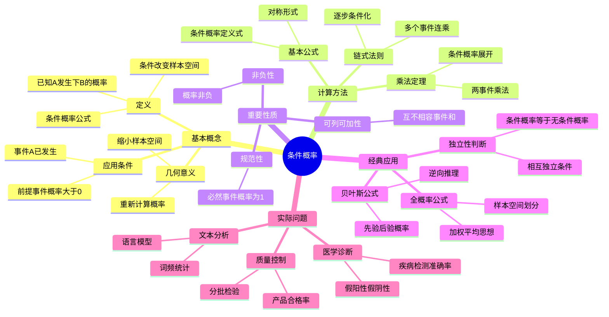

# 条件概率详解

**课程来源**: 概率论与数理统计  
**内容整理**: 基于课堂讲义  

## 📊 知识体系思维导图

---

## 第一部分：条件概率基本概念

### 1.1 条件概率的定义

**定义**: 设A、B是两个事件，且P(A) > 0，则称
$$P(B|A) = \frac{P(AB)}{P(A)}$$
为在事件A发生的条件下事件B发生的**条件概率**。

> **💡 物理意义**: 条件概率表示在已知事件A发生的前提下，事件B发生的可能性大小。
> 
> **🔧 实际理解**: 
> - 分子P(AB)：A和B同时发生的概率
> - 分母P(A)：事件A发生的概率
> - 结果：在A发生的"新样本空间"中，B发生的概率
> 
> **❓ 为什么要除以P(A)**: 因为已知A发生，相当于将样本空间缩小到A，需要重新标准化概率。

### 1.2 条件概率的几何解释

从几何角度看，条件概率可以理解为：
- **原样本空间**: 整个样本空间Ω
- **条件样本空间**: 事件A对应的区域
- **目标事件**: 在A的条件下，B∩A的相对大小

### 1.3 条件概率的基本性质

1. **非负性**: 对于任一事件B，有P(B|A) ≥ 0
2. **规范性**: 对于必然事件，有P(Ω|A) = 1
3. **可列可加性**: 设B₁, B₂, ..., Bₙ是两两互不相容的事件，则有
   $$P\left(\bigcup_{i=1}^{n} B_i \middle| A\right) = \sum_{i=1}^{n} P(B_i|A)$$

---

## 第二部分：乘法定理

### 2.1 基本乘法定理

**定理**: 设P(A) > 0，则有
$$P(AB) = P(A)P(B|A)$$

**推广形式**: 设P(B) > 0，则有
$$P(AB) = P(B)P(A|B)$$

> **💡 物理意义**: 两个事件同时发生的概率，等于其中一个事件发生的概率乘以在该事件发生条件下另一个事件发生的条件概率。

### 2.2 多个事件的乘法定理

对于n个事件A₁, A₂, ..., Aₙ，如果P(A₁A₂...Aₙ₋₁) > 0，则：
$$P(A_1A_2...A_n) = P(A_1)P(A_2|A_1)P(A_3|A_1A_2)...P(A_n|A_1A_2...A_{n-1})$$

> **🔧 实际应用**: 
> - **连续抽样**: 不放回抽样问题
> - **系统可靠性**: 串联系统故障分析
> - **医学诊断**: 多项检测的综合判断

---

## 第三部分：全概率公式

### 3.1 样本空间的划分

**定义**: 设B₁, B₂, ..., Bₙ是样本空间Ω的一个划分，即：
1. Bᵢ∩Bⱼ = ∅ (i ≠ j)
2. ⋃ᵢ₌₁ⁿ Bᵢ = Ω
3. P(Bᵢ) > 0 (i = 1,2,...,n)

### 3.2 全概率公式

**定理**: 设B₁, B₂, ..., Bₙ是样本空间Ω的一个划分，A为任一事件，则：
$$P(A) = \sum_{i=1}^{n} P(B_i)P(A|B_i)$$

> **💡 物理意义**: 全概率公式体现了"加权平均"的思想，事件A的概率等于在各种可能原因下发生A的概率的加权平均。
> 
> **🔧 实际应用**: 
> - **质量控制**: 不同生产线产品的总合格率
> - **市场分析**: 不同渠道销售的总成功率
> - **风险评估**: 不同情况下的总风险概率

### 3.3 全概率公式的应用示例

**例题**: 某工厂有三条生产线，产量分别占总产量的30%、50%、20%，合格率分别为90%、95%、85%。求产品的总合格率。

**解答**:
设A表示"产品合格"，B₁, B₂, B₃分别表示"来自第1、2、3条生产线"

已知：
- P(B₁) = 0.3, P(A|B₁) = 0.9
- P(B₂) = 0.5, P(A|B₂) = 0.95  
- P(B₃) = 0.2, P(A|B₃) = 0.85

由全概率公式：
$$P(A) = P(B_1)P(A|B_1) + P(B_2)P(A|B_2) + P(B_3)P(A|B_3)$$
$$= 0.3 × 0.9 + 0.5 × 0.95 + 0.2 × 0.85 = 0.915$$

---

## 第四部分：贝叶斯公式

### 4.1 贝叶斯公式的推导

由条件概率定义和全概率公式，可得：

**贝叶斯公式**: 设B₁, B₂, ..., Bₙ是样本空间Ω的一个划分，A为任一事件且P(A) > 0，则：
$$P(B_i|A) = \frac{P(B_i)P(A|B_i)}{\sum_{j=1}^{n} P(B_j)P(A|B_j)}$$

### 4.2 贝叶斯公式的意义

> **💡 核心思想**: 贝叶斯公式实现了"逆向推理"
> - **先验概率**: P(Bᵢ) - 在观察到A之前对Bᵢ的认知
> - **似然度**: P(A|Bᵢ) - 在Bᵢ条件下观察到A的可能性
> - **后验概率**: P(Bᵢ|A) - 观察到A之后对Bᵢ的修正认知

### 4.3 贝叶斯公式的应用

#### 应用1：医学诊断

**问题**: 某疾病在人群中的患病率为0.1%，检测的准确率为98%（即患病时检测为阳性的概率为98%，未患病时检测为阴性的概率为98%）。若某人检测结果为阳性，求其真正患病的概率。

**解答**:
设A="检测为阳性"，B="患病"

已知：
- P(B) = 0.001（先验概率）
- P(A|B) = 0.98（真阳性率）
- P(A|B̄) = 0.02（假阳性率）

由贝叶斯公式：
$$P(B|A) = \frac{P(B)P(A|B)}{P(B)P(A|B) + P(\bar{B})P(A|\bar{B})}$$
$$= \frac{0.001 × 0.98}{0.001 × 0.98 + 0.999 × 0.02} = \frac{0.00098}{0.02094} ≈ 0.047$$

**结论**: 即使检测为阳性，真正患病的概率仅约4.7%！

> **🎯 启示**: 当疾病患病率很低时，即使检测准确率很高，阳性结果的可靠性仍然较低。这说明了基础概率（先验概率）的重要性。

#### 应用2：垃圾邮件过滤

**原理**: 基于邮件中出现的关键词，判断邮件是否为垃圾邮件。

设A="邮件中包含某关键词"，B="邮件是垃圾邮件"

- P(B): 垃圾邮件的基础概率
- P(A|B): 垃圾邮件中包含该关键词的概率  
- P(A|B̄): 正常邮件中包含该关键词的概率

通过贝叶斯公式计算P(B|A)，判断邮件类型。

---

## 第五部分：事件的独立性

### 5.1 独立性的定义

**定义**: 设A、B是两个事件，如果
$$P(AB) = P(A)P(B)$$
则称事件A与B**相互独立**。

### 5.2 独立性的等价条件

当P(A) > 0, P(B) > 0时，以下条件等价：
1. P(AB) = P(A)P(B)
2. P(B|A) = P(B)
3. P(A|B) = P(A)

> **💡 物理意义**: 事件A的发生不影响事件B发生的概率，反之亦然。

### 5.3 多个事件的独立性

**两两独立**: 事件A₁, A₂, ..., Aₙ两两独立，是指其中任意两个事件都相互独立。

**相互独立**: 事件A₁, A₂, ..., Aₙ相互独立，是指对于任意k(2≤k≤n)和任意1≤i₁<i₂<...<iₖ≤n，都有：
$$P(A_{i_1}A_{i_2}...A_{i_k}) = P(A_{i_1})P(A_{i_2})...P(A_{i_k})$$

> **⚠️ 注意**: 两两独立不一定意味着相互独立！

---

## 📖 考试宝典

### 🔥 高频考点总结

#### 1. **条件概率基本计算**（必考，15-20分）
- **基本公式**: P(B|A) = P(AB)/P(A)
- **几何概率**: 利用面积比、长度比等计算
- **古典概率**: 利用排列组合计算
- **注意条件**: P(A) > 0

#### 2. **乘法定理应用**（常考，10-15分）
- **两事件**: P(AB) = P(A)P(B|A)
- **多事件**: 连续条件概率相乘
- **实际问题**: 不放回抽样、连续试验

#### 3. **全概率公式**（必考，20-25分）
- **样本空间划分**: 完备事件组
- **加权平均思想**: ∑P(Bᵢ)P(A|Bᵢ)
- **实际应用**: 多渠道、多原因问题

#### 4. **贝叶斯公式**（必考，20-25分）
- **逆向推理**: 从结果推原因
- **先验后验**: 概率的更新
- **实际应用**: 医学诊断、质量检测

#### 5. **事件独立性**（常考，10-15分）
- **独立性判断**: P(AB) = P(A)P(B)
- **条件概率判断**: P(B|A) = P(B)
- **独立性应用**: 简化计算

### ⚡ 快速解题技巧

1. **看到"已知...条件下"** → 想到条件概率P(B|A)
2. **看到"同时发生"** → 想到乘法定理P(AB) = P(A)P(B|A)
3. **看到"多种原因"** → 想到全概率公式
4. **看到"逆向推理"** → 想到贝叶斯公式
5. **看到"互不影响"** → 想到独立性P(AB) = P(A)P(B)
6. **看到"分批、分组"** → 想到样本空间划分

### 🎯 标准答题模板

#### **条件概率计算题标准格式**：
1. **明确事件定义**（设A表示...，B表示...）
2. **写出已知条件**（P(A)=...，P(B|A)=...）
3. **选择合适公式**（条件概率、全概率、贝叶斯）
4. **代入数值计算**（逐步计算，不跳步）
5. **检查结果合理性**（概率值在[0,1]区间）

---

## ⚠️ 易错点数据库

### 🚨 概念类易错点

#### 1. **条件概率定义混淆**
- ❌ **错误**：P(B|A) = P(A|B)
- ✅ **正确**：P(B|A) = P(AB)/P(A) ≠ P(A|B)
- **易错原因**：混淆条件和结论的位置

#### 2. **全概率公式应用错误**
- ❌ **错误**：忘记检查划分的完备性
- ✅ **正确**：确保∑P(Bᵢ) = 1且Bᵢ互不相容
- **检查要点**：划分是否遗漏或重复

#### 3. **贝叶斯公式理解错误**
- ❌ **错误**：混淆先验概率和后验概率
- ✅ **正确**：
  - 先验：P(Bᵢ) - 事前概率
  - 后验：P(Bᵢ|A) - 事后修正概率

#### 4. **独立性判断错误**
- ❌ **错误**：认为互不相容等同于相互独立
- ✅ **正确**：
  - 互不相容：P(AB) = 0
  - 相互独立：P(AB) = P(A)P(B)

### 🚨 计算类易错点

#### 1. **分母为零错误**
- ❌ **错误**：P(A) = 0时仍计算P(B|A)
- ✅ **正确**：条件概率要求P(A) > 0
- **注意**：先检查条件事件概率是否为正

#### 2. **概率值超出范围**
- ❌ **错误**：计算结果P > 1或P < 0
- ✅ **正确**：概率值必须在[0,1]区间
- **检查**：计算完成后验证结果合理性

#### 3. **贝叶斯公式计算错误**
- ❌ **错误**：分母只考虑一项
- ✅ **正确**：分母是全概率公式的结果
- **公式**：P(Bᵢ|A) = P(Bᵢ)P(A|Bᵢ)/∑P(Bⱼ)P(A|Bⱼ)

### 🎯 实际应用易错点

#### 1. **事件定义不清**
- **问题**：事件A、B定义模糊或重叠
- **后果**：整个计算过程错误
- **解决**：明确定义每个事件的含义

#### 2. **条件理解错误**
- **问题**：误解题目中的条件关系
- **后果**：选错公式或计算方向
- **解决**：仔细分析因果关系

#### 3. **数据对应错误**
- **问题**：题目数据与事件对应错误
- **后果**：代入错误的概率值
- **解决**：制作对应关系表

---

## 📋 速查手册

### 🔧 核心公式速查表

| **类型** | **公式** | **适用条件** |
|---------|----------|-------------|
| **条件概率** | P(B\|A) = P(AB)/P(A) | P(A) > 0 |
| **乘法定理** | P(AB) = P(A)P(B\|A) | P(A) > 0 |
| **全概率公式** | P(A) = ∑P(Bᵢ)P(A\|Bᵢ) | {Bᵢ}构成完备事件组 |
| **贝叶斯公式** | P(Bᵢ\|A) = P(Bᵢ)P(A\|Bᵢ)/∑P(Bⱼ)P(A\|Bⱼ) | P(A) > 0 |
| **独立性** | P(AB) = P(A)P(B) | A、B相互独立 |
| **独立性等价** | P(B\|A) = P(B) | P(A) > 0，A、B独立 |

### 📊 常见应用场景速查表

| **应用场景** | **特征** | **常用方法** |
|-------------|----------|-------------|
| **医学诊断** | 疾病检测、准确率 | 贝叶斯公式 |
| **质量控制** | 多生产线、合格率 | 全概率公式 |
| **抽样问题** | 不放回抽样 | 乘法定理 |
| **可靠性分析** | 系统故障 | 独立性、乘法定理 |
| **信息过滤** | 垃圾邮件、关键词 | 贝叶斯公式 |
| **市场分析** | 多渠道、成功率 | 全概率公式 |

### 🎯 解题步骤检查清单

#### **条件概率问题**
- [ ] 明确定义各个事件
- [ ] 确定已知条件和求解目标
- [ ] 检查条件事件概率是否大于0
- [ ] 选择合适的公式
- [ ] 计算过程逐步清晰
- [ ] 验证结果在[0,1]区间

#### **全概率公式问题**
- [ ] 确定样本空间的划分
- [ ] 检查划分的完备性和互斥性
- [ ] 确认各部分概率和为1
- [ ] 正确应用加权平均思想
- [ ] 验证最终结果

#### **贝叶斯公式问题**
- [ ] 区分先验概率和后验概率
- [ ] 正确理解因果关系
- [ ] 计算分母（全概率）
- [ ] 应用贝叶斯公式
- [ ] 解释结果的实际意义

---

## 💪 分层次例题体系

### 🟢 第一层：基础理解题（送分题，必须全对）

#### 例题1-1：条件概率基本计算
**【题目】** 掷一枚均匀骰子，已知点数大于3，求点数为偶数的概率。

**【解答】**
设A="点数大于3"={4,5,6}，B="点数为偶数"={2,4,6}

P(A) = 3/6 = 1/2
P(AB) = P({4,6}) = 2/6 = 1/3

P(B|A) = P(AB)/P(A) = (1/3)/(1/2) = 2/3

#### 例题1-2：乘法定理应用
**【题目】** 盒中有5个红球，3个白球。不放回地连续取2个球，求第一个是红球、第二个是白球的概率。

**【解答】**
设A₁="第一个是红球"，A₂="第二个是白球"

P(A₁) = 5/8
P(A₂|A₁) = 3/7（第一个取走红球后，剩余7个球中3个白球）

P(A₁A₂) = P(A₁)P(A₂|A₁) = (5/8) × (3/7) = 15/56

### 🟡 第二层：应用计算题（拉开差距）

#### 例题2-1：全概率公式应用
**【题目】** 某工厂有甲、乙、丙三个车间，产量分别占总产量的25%、35%、40%，废品率分别为5%、4%、2%。求该厂产品的废品率。

**【解答】**
设A="产品是废品"，B₁、B₂、B₃分别表示"来自甲、乙、丙车间"

已知：
- P(B₁) = 0.25, P(A|B₁) = 0.05
- P(B₂) = 0.35, P(A|B₂) = 0.04  
- P(B₃) = 0.40, P(A|B₃) = 0.02

由全概率公式：
P(A) = P(B₁)P(A|B₁) + P(B₂)P(A|B₂) + P(B₃)P(A|B₃)
     = 0.25×0.05 + 0.35×0.04 + 0.40×0.02
     = 0.0125 + 0.014 + 0.008
     = 0.0345

#### 例题2-2：贝叶斯公式应用
**【题目】** 承接上题，若发现一件废品，求它来自甲车间的概率。

**【解答】**
由贝叶斯公式：
P(B₁|A) = P(B₁)P(A|B₁)/P(A)
        = (0.25 × 0.05)/0.0345
        = 0.0125/0.0345
        ≈ 0.362

### 🔴 第三层：综合分析题（拔高题）

#### 例题3-1：复杂贝叶斯推理
**【题目】** 某地区有两种出租车：蓝色占85%，绿色占15%。夜间发生交通事故，目击者声称肇事车辆是绿色的。已知在类似的光线条件下，目击者正确识别颜色的概率为80%。求肇事车辆真的是绿色的概率。

**【深度分析】**
这是一个经典的贝叶斯推理问题，涉及证人可靠性。

设B="车辆是绿色"，A="目击者说是绿色"

已知：
- P(B) = 0.15（先验概率）
- P(B̄) = 0.85
- P(A|B) = 0.8（正确识别绿色）
- P(A|B̄) = 0.2（错误识别蓝色为绿色）

应用贝叶斯公式：
P(B|A) = P(B)P(A|B)/[P(B)P(A|B) + P(B̄)P(A|B̄)]
       = (0.15 × 0.8)/(0.15 × 0.8 + 0.85 × 0.2)
       = 0.12/(0.12 + 0.17)
       = 0.12/0.29
       ≈ 0.414

**结论**: 即使目击者声称是绿色车，真正是绿色车的概率仅约41.4%。

**深入思考**: 这个结果说明了基础概率的重要性。由于绿色车本身就很少（15%），即使有80%准确率的证词，后验概率仍然不高。

---

## 🏆 考试冲刺要点

### **必背公式**
1. P(B|A) = P(AB)/P(A)
2. P(AB) = P(A)P(B|A)
3. P(A) = ∑P(Bᵢ)P(A|Bᵢ)
4. P(Bᵢ|A) = P(Bᵢ)P(A|Bᵢ)/∑P(Bⱼ)P(A|Bⱼ)
5. P(AB) = P(A)P(B)（独立性）

### **关键概念**
- 条件概率改变了样本空间
- 全概率公式体现加权平均思想
- 贝叶斯公式实现逆向推理
- 独立性简化概率计算

### **解题技巧**
- 明确定义事件
- 理清因果关系
- 检查计算条件
- 验证结果合理性

### **常见陷阱**
- 条件概率的方向性
- 独立性与互不相容的区别
- 贝叶斯公式分母的完整性
- 概率值的范围检查

---

## 总结

条件概率是概率论的核心概念之一，它不仅在数学理论中占据重要地位，在实际应用中也有广泛价值。掌握条件概率，特别是全概率公式和贝叶斯公式，对于理解现实世界中的不确定性问题具有重要意义。

**核心要点**:
1. **条件概率**改变了我们观察问题的"视角"
2. **全概率公式**提供了"分而治之"的思想
3. **贝叶斯公式**实现了从结果到原因的推理
4. **独立性**简化了复杂问题的计算

这些概念和方法不仅在概率统计中重要，在机器学习、人工智能、决策分析等现代科学技术领域都有重要应用。
