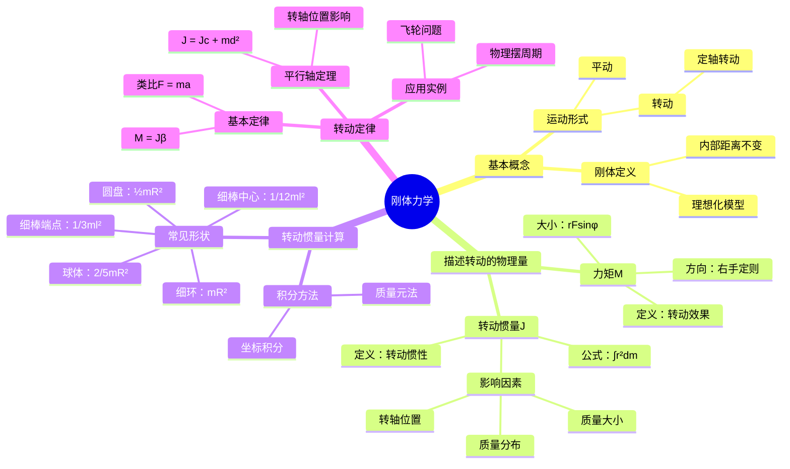

# 刚体力学 (Rigid Body Mechanics)

**课程来源**: 《大学物理与实验一》  
**授课**: 曹喻霖  
**学校**: 深圳职业技术大学

## 🎯 案例导入：赛车的设计哲学——集中化质量 (Mass Centralization)

为了获得更灵活的操控性，工程师在设计赛车时不仅要减轻总质量，更重要的是要减小**转动惯量**。这通过将发动机、油箱等大质量部件尽可能靠近车辆的质心来实现。反之，若将质量向车辆两端分散，则会急剧增大转动惯量，影响操控。

**物理意义**: 转动惯量是刚体转动惯性的量度，质量分布越集中，转动惯量越小，转动状态越容易改变。

**实际应用**: 这一原理不仅用于赛车设计，还广泛应用于陀螺仪、飞轮储能、花样滑冰等领域。

**为什么这样做**: 根据转动定律 $M = J\beta$，在相同力矩作用下，转动惯量越小，角加速度越大，响应越快。

---

## 一、刚体的基本概念

### 1. 刚体 (Rigid Body)

- **定义**: 一种理想化的物理模型，指在运动过程中，其内部任意两点间的距离都保持不变的物体。

**物理意义**: 刚体是对实际物体的理想化抽象，忽略了物体的形变，便于分析其整体运动规律。

**实际应用**: 当物体的形变相对于其整体运动可以忽略时，都可以视为刚体，如转动的轮子、摆动的杆等。

**为什么引入刚体概念**: 实际物体在力的作用下都会发生形变，但当形变很小时，可以忽略形变的影响，简化问题的分析。

- **特点**: 刚体可以看作是一种特殊的质点组。

### 2. 刚体的基本运动形式

- **平动 (Translation)**: 刚体中所有点的运动轨迹都保持完全相同。

**物理意义**: 平动时刚体上任意两点的连线方向保持不变，可以用质心的运动来描述整个刚体的运动。

**实际应用**: 电梯的升降、汽车在直道上的行驶等。

- **转动 (Rotation)**: 刚体中所有的点都围绕同一直线（转轴）作圆周运动。最基本、最常见的是定轴转动。

**物理意义**: 转动是刚体特有的运动形式，需要用角量（角位移、角速度、角加速度）来描述。

**实际应用**: 车轮的转动、地球的自转、机械中齿轮的转动等。

**为什么重点研究定轴转动**: 定轴转动是最简单的转动形式，转轴固定不动，便于分析和计算。

---

## 二、刚体的定轴转动

### 1. 特征

- **转轴**: 刚体围绕一个固定的轴转动。
- **转动平面**: 刚体上所有的质点都在各自垂直于转轴的平面上作圆周运动。
- **实例**: 自行车轮的转动、机床齿轮的转动。

### 2. 描述定轴转动的物理量

#### 力矩 (Torque)

- **定义**: 力对物体产生的转动效果的物理量。力矩是矢量。

**物理意义**: 力矩是使物体产生角加速度的原因，类似于力是使物体产生线加速度的原因。

**实际应用**: 扳手拧螺丝、开门、方向盘转向等都涉及力矩的应用。

**为什么引入力矩**: 在转动问题中，力的作用效果不仅取决于力的大小，还取决于力臂的长度和力的方向。

- **大小**: $M = rF \sin \phi$，其中 $\phi$ 是位置矢量 $\vec{r}$ 与力 $\vec{F}$ 的夹角。

**物理意义**: 
- $r$ 是转轴到力作用点的距离
- $F \sin \phi$ 是力在垂直于位置矢量方向上的分量
- 只有垂直分量才对转动有贡献

**实际应用**: 使用扳手时，垂直于扳手施力效果最好，这就是 $\sin \phi = 1$ 的情况。

- **方向**: 遵循右手螺旋定则。

#### 转动惯量 (Moment of Inertia, J)

- **定义**: 衡量刚体转动惯性大小的物理量。

**物理意义**: 转动惯量是刚体转动中的"惯性质量"，类似于平动中的质量，反映了刚体对转动状态改变的阻抗能力。

**实际应用**: 飞轮储能利用大转动惯量来储存能量；花样滑冰运动员收缩手臂减小转动惯量来增加转速。

**为什么转动惯量重要**: 在转动定律 $M = J\beta$ 中，转动惯量决定了在给定力矩下物体的角加速度。

- **决定因素**: 取决于刚体的质量、质量分布以及转轴的位置。

**物理意义**: 
- 质量越大，转动惯量越大
- 质量分布离转轴越远，转动惯量越大
- 转轴位置不同，转动惯量不同

**实际应用**: 这解释了为什么赛车要将质量集中在质心附近，为什么滑冰运动员要收缩手臂来加速转动。

- **计算公式**: 对于质量连续分布的刚体，转动惯量为 $J = \int r^2 dm$。

**物理意义**: 
- $r$ 是质量元 $dm$ 到转轴的距离
- $r^2$ 表明距离的影响是平方关系，远离转轴的质量对转动惯量贡献更大

- **单位**: kg·m² (千克·米²)。

---

## 三、转动惯量的计算

### 【例题 1：均匀细棒的转动惯量】

**问题**: 求质量为 $m$、长为 $l$ 的均匀细长棒，分别对通过棒中心和通过端点且与棒垂直的轴的转动惯量。

**解题步骤**:
1. 设棒的线密度为 $\lambda = m/l$。
2. 在距离转轴 $x$ 处取一质量元 $dm = \lambda dx$。
3. 根据公式 $J = \int x^2 dm = \int x^2 \lambda dx$ 进行积分。

**解答**:

- **转轴通过棒中心**: 积分区间为 $[-l/2, l/2]$。

$$J_c = \int_{-l/2}^{l/2} x^2 \lambda dx = \frac{1}{12}\lambda l^3 = \frac{1}{12}ml^2$$

- **转轴通过棒端点**: 积分区间为 $[0, l]$。

$$J_{end} = \int_0^l x^2 \lambda dx = \frac{1}{3}\lambda l^3 = \frac{1}{3}ml^2$$

**物理意义**: 通过端点的转动惯量是通过中心的4倍，说明转轴位置对转动惯量有显著影响。

### 常用形状刚体的转动惯量

| 刚体 | 转轴位置 | 转动惯量 J |
|------|----------|------------|
| **细环** (半径R) | 通过中心对称轴 | $mR^2$ |
| **细棒** (棒长l) | 通过中心与棒垂直 | $\frac{1}{12}ml^2$ |
|  | 通过一端与棒垂直 | $\frac{1}{3}ml^2$ |
| **圆平板** (半径R) | 通过中心与板面垂直 | $\frac{1}{2}mR^2$ |
| **球体** (半径R) | 通过球心 | $\frac{2}{5}mR^2$ |
| **薄球壳** (半径R) | 通过球心 | $\frac{2}{3}mR^2$ |

**记忆技巧**: 
- 质量分布越集中（如细棒中心），系数越小
- 质量分布越分散（如细环），系数越大
- 球体比球壳系数小，因为内部质量更集中

---

## 四、刚体定轴转动定律

### 1. 定轴转动定律

- **内容**: 刚体作定轴转动时，所受的合外力矩 $M$ 等于其转动惯量 $J$ 与角加速度 $\beta$ 的乘积。

**物理意义**: 这是牛顿第二定律在转动中的表现形式，力矩是产生角加速度的原因。

**实际应用**: 电机启动、刹车制动、陀螺仪控制等都遵循这一定律。

**为什么形式相似**: 转动和平动在数学形式上具有对应关系，这体现了物理规律的统一性。

- **公式**: $M = J\beta$。

- **类比**: 该定律在形式上与牛顿第二定律 $F = ma$ 相似。

| 平动 | 转动 |
|------|------|
| 力 F | 力矩 M |
| 质量 m | 转动惯量 J |
| 加速度 a | 角加速度 β |

### 【例题 2：物理摆的周期】

**问题**: 质量为 $m$、长度为 $l$ 的均匀细棒，绕其上端点 O 作小角度摆动，求其振动周期。

**解题步骤**:

1. **受力分析**: 细棒只受重力，重力作用点在质心（棒的中心），力臂为 $\frac{l}{2} \sin θ$。

2. **力矩**: 重力矩 $M = -mg(\frac{l}{2} \sin θ)$。负号表示力矩方向与角位移 $θ$ 方向相反。

**物理意义**: 负号表示恢复力矩，总是试图使摆回到平衡位置。

3. **转动惯量**: 绕端点转动的转动惯量为 $J = \frac{1}{3}ml^2$。

4. **列转动定律**: $M = J\beta \Rightarrow -mg\frac{l}{2} \sin θ = \frac{1}{3}ml^2 \frac{d^2θ}{dt^2}$。

5. **小角度近似**: 当 $θ$ 很小时, $\sin θ ≈ θ$。方程简化为 $\frac{d^2θ}{dt^2} = -\frac{3g}{2l}θ$。

**为什么可以小角度近似**: 当 $θ < 5°$ 时，$\sin θ$ 与 $θ$ 的差别小于1%，可以忽略。

6. **求解周期**: 这是角简谐振动的标准方程，角频率 $ω = \sqrt{\frac{3g}{2l}}$，周期 $T = \frac{2π}{ω} = 2π\sqrt{\frac{2l}{3g}}$。

**物理意义**: 物理摆的周期与摆长的平方根成正比，与重力加速度的平方根成反比。

### 2. 平行轴定律

- **内容**: 刚体对任一转轴的转动惯量 $J$，等于刚体对通过质心的、与该轴平行的转轴的转动惯量 $J_c$，加上刚体质量 $m$ 与两平行轴之间距离 $d$ 的平方的积。

**物理意义**: 这个定律说明了转轴位置对转动惯量的影响，离质心越远，转动惯量越大。

**实际应用**: 在工程设计中，通过改变转轴位置来调节系统的转动惯量。

**为什么有 $md^2$ 项**: 这一项代表了将整个质量集中在质心处、距离新转轴为 $d$ 时的转动惯量贡献。

- **公式**: $J = J_c + md^2$。

### 【例题 3 & 4：概念应用】

**问题1**: 一半铁一半木的杆，绕 a, b, c (a在木头端，b在中心，c在铁头端) 哪个轴转动惯量最大？

- **解答**: 绕 a 轴（木头端）的转动惯量最大。因为转动惯量不仅与质量有关，还与质量的分布有关 ($J = \int r^2 dm$)。当转轴在较轻的一端时，质量较大的部分（铁）离转轴的距离 $r$ 更大，对转动惯量的贡献也更大。

**物理意义**: 这说明了质量分布的重要性，远离转轴的质量对转动惯量的贡献是平方关系。

**问题2**: 质量、直径相同的圆盘飞轮A和圆环飞轮B，以相同角速度转动，在相同阻力矩作用下，谁先停下来？

- **解答**: 圆盘飞轮A先停下来。因为圆环的质量全部分布在边缘，其转动惯量 $J_B = mR^2$ 大于质量分布在整个面上的圆盘的转动惯量 $J_A = \frac{1}{2}mR^2$。根据 $M = J\beta$，在相同阻力矩 $M$ 下，转动惯量 $J$ 大的角加速度 $\beta$ 小，即转速变得更慢，需要更长时间才能停下。

**物理意义**: 转动惯量大的物体具有更强的"转动惯性"，更难改变其转动状态。

**实际应用**: 飞轮储能系统正是利用这一原理，通过大转动惯量来维持稳定的转动。

---

## 🧠 Mermaid思维导图

---

## 💡 理论与实践深度结合

### 转动惯量的物理本质

**物理意义**: 转动惯量是刚体转动中的"惯性质量"，它不仅取决于物体的总质量，更重要的是取决于质量相对于转轴的分布。

**实际应用**: 
- **花样滑冰**: 运动员收缩手臂时减小了转动惯量，根据角动量守恒，转速会增加
- **飞轮储能**: 将质量集中在外缘以获得大转动惯量，提高储能效率
- **汽车设计**: 发动机飞轮设计要平衡储能和响应速度的需求

**为什么是 $r^2$ 关系**: 这来源于转动动能 $E_k = \frac{1}{2}J\omega^2$ 与平动动能 $E_k = \frac{1}{2}mv^2$ 的对应关系，其中 $v = r\omega$。

### 转动定律的深层理解

**物理意义**: $M = J\beta$ 不仅是数学公式，它揭示了转动中力矩、转动惯量和角加速度的因果关系。

**实际应用**:
- **电机控制**: 通过调节力矩来控制转速变化
- **制动系统**: 刹车盘的设计要考虑制动力矩和车轮转动惯量
- **陀螺仪**: 利用大转动惯量保持方向稳定

**为什么与牛顿定律相似**: 这体现了物理规律的统一性和对称性，平动和转动在数学形式上完全对应。

### 平行轴定理的工程意义

**物理意义**: $J = J_c + md^2$ 中的 $md^2$ 项表明，即使是点质量，只要离开转轴，就会对转动惯量有贡献。

**实际应用**:
- **机械设计**: 通过改变转轴位置来调节系统的转动特性
- **建筑工程**: 梁的弯曲刚度计算中的类似原理
- **体育运动**: 体操运动员调整身体姿态来控制转动

**为什么距离是平方关系**: 这源于转动动能的表达式，距离的平方关系使得远离转轴的质量对转动惯量的影响急剧增大。

---

## 🎯 考试宝典

### 必背公式清单
1. **转动惯量定义**: $J = \int r^2 dm$
2. **转动定律**: $M = J\beta$
3. **平行轴定理**: $J = J_c + md^2$
4. **力矩定义**: $M = rF\sin\phi$
5. **常见形状转动惯量**:
   - 细环: $J = mR^2$
   - 圆盘: $J = \frac{1}{2}mR^2$
   - 细棒(中心): $J = \frac{1}{12}ml^2$
   - 细棒(端点): $J = \frac{1}{3}ml^2$
   - 球体: $J = \frac{2}{5}mR^2$

### 解题关键步骤
1. **确定转轴位置** - 这决定了使用哪个转动惯量公式
2. **分析受力情况** - 找出所有作用在物体上的力
3. **计算力矩** - 注意力臂的确定和方向的判断
4. **应用转动定律** - $M = J\beta$ 是核心
5. **检查单位和数量级** - 转动惯量单位是 kg·m²

### 常考题型
1. **转动惯量计算** - 积分法和查表法
2. **转动定律应用** - 力矩平衡和动力学问题
3. **平行轴定理** - 不同转轴的转动惯量比较
4. **物理摆周期** - 小角度近似和简谐振动
5. **概念理解题** - 转动惯量的影响因素

---

## ⚠️ 易错点数据库

### 概念理解错误
1. **转动惯量只与质量有关** ❌
   - 正确理解: 转动惯量与质量、形状、尺寸、转轴位置都有关
   - 记忆要点: $J = \int r^2 dm$ 中的 $r$ 是关键

2. **力矩就是力乘以距离** ❌
   - 正确理解: 力矩 = 力 × 力臂，力臂是垂直距离
   - 记忆要点: $M = rF\sin\phi$，注意 $\sin\phi$ 的作用

3. **转动定律中的M是单个力的力矩** ❌
   - 正确理解: M是合外力矩，要考虑所有力矩的矢量和
   - 记忆要点: 类比牛顿第二定律中的F是合外力

### 计算错误
1. **平行轴定理使用错误**
   - 常见错误: 忘记 $md^2$ 项或者d的含义不清
   - 正确做法: d是两平行轴间的距离，必须先知道质心轴的转动惯量

2. **转动惯量公式记混**
   - 常见错误: 细棒中心和端点的公式搞反
   - 记忆技巧: 端点的系数(1/3)是中心系数(1/12)的4倍

3. **单位换算错误**
   - 常见错误: 角度单位(度与弧度)、长度单位混用
   - 注意事项: 转动惯量单位是 kg·m²，角速度用 rad/s

### 物理图像理解错误
1. **力矩方向判断错误**
   - 常见错误: 不会用右手定则判断力矩方向
   - 解决方法: 多练习右手定则，注意正负号的物理意义

2. **小角度近似条件不清**
   - 常见错误: 不知道什么时候可以用 $\sin\theta \approx \theta$
   - 记忆要点: 一般要求 $\theta < 5°$ (约0.087弧度)

---

## 📚 速查手册

### 快速判断技巧
1. **转动惯量大小比较**:
   - 相同质量和尺寸: 质量分布越分散，转动惯量越大
   - 细环 > 圆盘 > 球体 (相同质量和半径)

2. **力矩效果判断**:
   - 力臂越长，效果越好
   - 力与位置矢量垂直时效果最好 ($\sin\phi = 1$)

3. **转轴位置影响**:
   - 离质心越远，转动惯量越大
   - 通过质心的轴转动惯量最小

### 常用数值
- $\pi^2 \approx 9.87$
- 小角度: $5° \approx 0.087$ 弧度
- 重力加速度: $g = 9.8$ m/s²

### 解题检查清单
- [ ] 转轴位置是否确定正确
- [ ] 转动惯量公式是否选对
- [ ] 力矩计算是否包含所有力
- [ ] 力矩方向是否判断正确
- [ ] 单位是否统一
- [ ] 数量级是否合理

---

## 💪 分层次例题体系

### 🟢 第一层：基础理解题（送分题，必须全对）

#### 例题1-1：概念辨析（必考点）
**【题目】** 关于刚体和转动惯量，下列说法正确的是（ ）
A. 刚体是绝对不变形的物体
B. 转动惯量只与物体的质量有关
C. 转动惯量的单位是 kg·m²
D. 同一刚体对所有轴的转动惯量都相同

**【标准解答】** C

**【解题要点】**
- 刚体是理想化模型，实际物体都会变形
- 转动惯量与质量、形状、尺寸、转轴位置都有关
- 转动惯量单位：kg·m²（质量×长度²）
- 不同转轴的转动惯量不同

**【易错提醒】**
❌ 不要认为刚体是真实存在的
❌ 不要忽略质量分布和转轴位置的影响
❌ 注意单位中长度是平方

#### 例题1-2：基础公式应用（送分题）
**【题目】** 质量为2kg的均匀细棒，长度为1.0m，求：
(1) 对通过中心垂直于棒的轴的转动惯量
(2) 对通过一端垂直于棒的轴的转动惯量

**【标准解题步骤】**
第一步：识别几何形状和转轴位置
- 均匀细棒，质量m = 2kg，长度l = 1.0m

第二步：选择正确公式
(1) 通过中心：$J_c = \frac{1}{12}ml^2$
(2) 通过一端：$J_e = \frac{1}{3}ml^2$

第三步：代入数值计算
(1) $J_c = \frac{1}{12} × 2 × (1.0)^2 = \frac{1}{6} = 0.167$ kg·m²
(2) $J_e = \frac{1}{3} × 2 × (1.0)^2 = \frac{2}{3} = 0.667$ kg·m²

**【得分要点】**
- 正确识别转轴位置 (2分)
- 选择正确公式 (2分)
- 数值计算准确 (2分)
- 单位标注正确 (1分)

#### 例题1-3：力矩计算（高频考点）
**【题目】** 如图所示，在距离转轴0.5m处施加大小为10N的力，力与位置矢量的夹角为30°，求力矩的大小。

**【标准解答】**
$$M = rF\sin\phi = 0.5 × 10 × \sin30° = 0.5 × 10 × 0.5 = 2.5 \text{ N·m}$$

**【关键点】**
- 力矩公式：$M = rF\sin\phi$
- r是转轴到力作用点的距离
- φ是位置矢量与力的夹角
- 只有力的垂直分量对转动有贡献

### 🟡 第二层：应用计算题（拉开差距）

#### 例题2-1：平行轴定理应用（高频考点）
**【题目】** 质量为1.0kg的均匀圆盘，半径为0.2m，求对距离圆心0.15m处平行轴的转动惯量。

**【解题模板】**
第一步：计算对质心轴的转动惯量
$$J_c = \frac{1}{2}mR^2 = \frac{1}{2} × 1.0 × (0.2)^2 = 0.02 \text{ kg·m}^2$$

第二步：应用平行轴定理
$$J = J_c + md^2 = 0.02 + 1.0 × (0.15)^2 = 0.02 + 0.0225 = 0.0425 \text{ kg·m}^2$$

**【关键公式记忆】**
- 平行轴定理：$J = J_c + md^2$
- 必须先知道质心轴的转动惯量
- d是两平行轴间的距离

**【易错点】**
❌ 忘记加上 $md^2$ 项
❌ 不清楚d的含义
❌ 没有先计算质心轴转动惯量

#### 例题2-2：转动定律应用
**【题目】** 质量为0.5kg、半径为0.1m的均匀圆盘，在恒定力矩3.0N·m作用下从静止开始转动，求：
(1) 角加速度  (2) 2秒后的角速度

**【解题思路】**
第一步：计算转动惯量
$$J = \frac{1}{2}mR^2 = \frac{1}{2} × 0.5 × (0.1)^2 = 0.0025 \text{ kg·m}^2$$

第二步：应用转动定律求角加速度
$$M = J\beta \Rightarrow \beta = \frac{M}{J} = \frac{3.0}{0.0025} = 1200 \text{ rad/s}^2$$

第三步：计算2秒后的角速度
$$\omega = \omega_0 + \beta t = 0 + 1200 × 2 = 2400 \text{ rad/s}$$

**【转动定律要点】**
- 转动定律：$M = J\beta$
- 类比牛顿第二定律：$F = ma$
- M是合外力矩，J是转动惯量，β是角加速度

#### 例题2-3：物理摆周期计算
**【题目】** 长度为1.0m、质量为2.0kg的均匀细棒，绕其一端作小角度摆动，求振动周期。

**【解题步骤】**
第一步：确定转动惯量
绕端点转动：$J = \frac{1}{3}ml^2 = \frac{1}{3} × 2.0 × (1.0)^2 = 0.667$ kg·m²

第二步：分析受力和力矩
重力作用在质心（棒的中点），力臂为 $\frac{l}{2}\sin\theta$
重力矩：$M = -mg\frac{l}{2}\sin\theta$

第三步：列转动方程
$$M = J\beta \Rightarrow -mg\frac{l}{2}\sin\theta = J\frac{d^2\theta}{dt^2}$$

第四步：小角度近似
当θ很小时，$\sin\theta ≈ \theta$：
$$\frac{d^2\theta}{dt^2} = -\frac{mgl}{2J}\theta = -\frac{3g}{2l}\theta$$

第五步：求解周期
角频率：$\omega = \sqrt{\frac{3g}{2l}} = \sqrt{\frac{3 × 9.8}{2 × 1.0}} = 3.83$ rad/s
周期：$T = \frac{2\pi}{\omega} = \frac{2\pi}{3.83} = 1.64$ s

**【物理摆关键点】**
- 重力矩提供恢复力矩
- 小角度近似：$\sin\theta ≈ \theta$
- 这是简谐振动问题

### 🔴 第三层：综合分析题（拔高题）

#### 例题3-1：复合系统转动惯量
**【题目】** 如图所示，一个复合系统由均匀圆盘（质量M=2.0kg，半径R=0.3m）和两个质点（质量各为m=0.5kg）组成，质点分别位于圆盘边缘的相对两点。求整个系统对通过圆盘中心垂直于盘面轴的转动惯量。

**【深度分析】**
第一步：系统分解
- 圆盘：对自身中心轴的转动惯量
- 两个质点：可视为质量集中在距离轴心R处的点质量

第二步：分别计算各部分转动惯量
圆盘转动惯量：
$$J_{盘} = \frac{1}{2}MR^2 = \frac{1}{2} × 2.0 × (0.3)^2 = 0.09 \text{ kg·m}^2$$

两个质点的转动惯量：
$$J_{质点} = 2 × mR^2 = 2 × 0.5 × (0.3)^2 = 0.09 \text{ kg·m}^2$$

第三步：计算总转动惯量
$$J_{总} = J_{盘} + J_{质点} = 0.09 + 0.09 = 0.18 \text{ kg·m}^2$$

**【深入思考】**
1. **叠加原理**：复合系统的转动惯量等于各部分转动惯量之和
2. **质点处理**：质点的转动惯量就是 $mr^2$
3. **对称性**：两个质点关于转轴对称，简化了计算

#### 例题3-2：转动中的能量问题
**【题目】** 质量为1.0kg、半径为0.2m的均匀圆盘，在恒定力矩2.0N·m作用下从静止开始转动3.0s。求：
(1) 3秒后的角速度和转动动能
(2) 力矩所做的功

**【能量分析】**
第一步：基本参数计算
转动惯量：$J = \frac{1}{2}mR^2 = \frac{1}{2} × 1.0 × (0.2)^2 = 0.02$ kg·m²
角加速度：$\beta = \frac{M}{J} = \frac{2.0}{0.02} = 100$ rad/s²

第二步：运动学计算
3秒后的角速度：
$$\omega = \beta t = 100 × 3.0 = 300 \text{ rad/s}$$

3秒内转过的角度：
$$\theta = \frac{1}{2}\beta t^2 = \frac{1}{2} × 100 × (3.0)^2 = 450 \text{ rad}$$

第三步：能量计算
转动动能：
$$E_k = \frac{1}{2}J\omega^2 = \frac{1}{2} × 0.02 × (300)^2 = 900 \text{ J}$$

力矩做功：
$$W = M\theta = 2.0 × 450 = 900 \text{ J}$$

**【能量关系验证】**
根据动能定理：$W = \Delta E_k = E_k - 0 = 900$ J ✓

**【物理意义深入理解】**
1. **转动动能**：$E_k = \frac{1}{2}J\omega^2$，类比平动动能 $E_k = \frac{1}{2}mv^2$
2. **功能关系**：力矩做的功等于转动动能的增加
3. **能量守恒**：在转动问题中同样适用

#### 例题3-3：转动惯量的实验测定
**【题目】** 某同学设计实验测定不规则物体的转动惯量。实验装置如图：物体可绕水平轴转动，用细绳绕在轴上，绳的另一端挂质量为m的重物。已知轴的半径为r，重物从静止开始下降高度h用时t。求物体的转动惯量。

**【实验分析】**
第一步：运动学分析
重物做匀加速直线运动：
$$h = \frac{1}{2}at^2 \Rightarrow a = \frac{2h}{t^2}$$

绳子不打滑，线速度与角速度关系：
$$v = r\omega, \quad a = r\beta$$

因此角加速度：
$$\beta = \frac{a}{r} = \frac{2h}{rt^2}$$

第二步：动力学分析
对重物：$mg - T = ma$
对转动物体：$Tr = J\beta$

第三步：联立求解
从第一个方程：$T = mg - ma = m(g - a)$
代入第二个方程：
$$m(g - a)r = J\beta$$
$$J = \frac{m(g - a)r}{\beta} = \frac{m(g - \frac{2h}{t^2})r}{\frac{2h}{rt^2}} = \frac{mr^2(gt^2 - 2h)}{2h}$$

**【实验设计思想】**
1. **间接测量**：通过测量重物的运动来推断转动物体的转动惯量
2. **约束条件**：绳子不打滑保证了线运动和角运动的关系
3. **动力学方法**：利用牛顿定律和转动定律建立方程组

### 📊 例题难度分布建议

| 难度层次 | 题目数量 | 考试占比 | 复习重点 |
|---------|---------|----------|----------|
| **基础理解题** | 10-12题 | 30-40% | 概念理解、公式记忆 |
| **应用计算题** | 8-10题 | 45-55% | 转动定律、平行轴定理 |
| **综合分析题** | 3-5题 | 10-20% | 复合系统、能量分析 |

### 🎯 专项训练计划

#### **第一周：概念强化**
- **目标**：掌握基本概念和公式
- **内容**：
  - 刚体概念和转动惯量定义
  - 常见形状的转动惯量公式
  - 力矩的计算和方向判断
- **练习**：每天3-4道概念题

#### **第二周：计算提升**
- **目标**：熟练掌握计算方法
- **内容**：
  - 平行轴定理的应用
  - 转动定律的应用
  - 物理摆和复摆问题
- **练习**：每天2-3道计算题

#### **第三周：综合训练**
- **目标**：解决复杂的转动问题
- **内容**：
  - 复合系统转动惯量
  - 转动中的能量问题
  - 实验设计和数据分析
- **练习**：每天1-2道综合题

### 🏆 考试冲刺要点

#### **必背公式**
1. $J = \int r^2 dm$（转动惯量定义）
2. $M = J\beta$（转动定律）
3. $J = J_c + md^2$（平行轴定理）
4. $M = rF\sin\phi$（力矩定义）
5. 常见形状转动惯量公式

#### **关键数值**
- 细环系数：1
- 圆盘系数：1/2
- 细棒（中心）：1/12
- 细棒（端点）：1/3
- 球体系数：2/5

#### **解题技巧**
- 先确定转轴位置
- 正确选择转动惯量公式
- 注意力矩的方向和大小
- 检查单位和数量级

#### **常见陷阱**
- 转动惯量公式记混
- 平行轴定理使用错误
- 力矩计算中忽略角度
- 单位换算错误

---

## 总结

刚体力学是经典力学的重要组成部分，它将牛顿力学从质点扩展到有形状和大小的物体。通过引入转动惯量、力矩等概念，我们可以完整地描述和分析刚体的转动运动。

**核心要点**:
1. **转动惯量**是刚体转动中的"惯性质量"，不仅与质量有关，更与质量分布有关
2. **转动定律** $M = J\beta$ 是转动动力学的基本定律
3. **平行轴定理**揭示了转轴位置对转动惯量的影响
4. 转动和平动在数学形式上具有完美的对应关系

这些概念和定律不仅在物理学中重要，在工程技术、体育运动、日常生活中都有广泛应用。掌握刚体力学，有助于我们更好地理解和分析现实世界中的转动现象。
