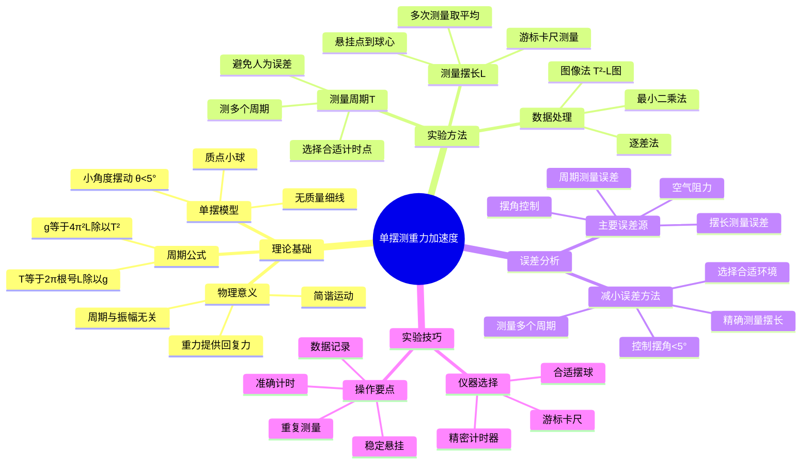

# 专题1-3：用单摆测量重力加速度的实验研究

本笔记旨在总结利用单摆测量本地重力加速度 `g` 的实验原理、方法、数据处理与分析。

## 📊 知识体系思维导图

---

## [内容摘要]

重力加速度 `g` 指地面附近物体受地球引力作用而在真空中下落的加速度。本实验介绍利用单摆的周期性来测量重力加速度 `g` 的经典方法。

## [基本理论知识]

### 1. 单摆 (Simple Pendulum)

单摆是一个理想化的物理模型，由一根无质量且不可伸缩的细线悬挂一个质点构成。当摆角 $θ$ 很小（通常认为小于 $5°$）时，单摆的运动可近似视为简谐运动。

> **❓ 为什么要求摆角小于5°**: 
> 
> **💡 物理原理**: 在小角度近似下，$\sin θ ≈ θ$（弧度制），这使得回复力与位移成正比，满足简谐运动条件。
> 
> **🔧 实际影响**: 
> - 当 $θ = 5°$ 时，$\sin 5° = 0.0872$，而 $5° = 0.0873$ 弧度，误差仅0.1%
> - 当 $θ = 15°$ 时，$\sin 15° = 0.2588$，而 $15° = 0.2618$ 弧度，误差达1.2%
> - 摆角过大会导致周期变长，测得的g值偏小
> 
> **🎯 实验要求**: 严格控制初始摆角在5°以内，确保测量精度。

### 2. 单摆周期公式

单摆的振动周期 `T` 与摆长 `L` 和重力加速度 `g` 之间的关系为：

$$
T = 2\pi\sqrt{\frac{L}{g}}
$$

> **💡 物理意义**: 这个公式表明单摆周期只依赖于摆长和重力加速度，与摆球质量和摆动幅度（小角度时）无关。这体现了重力场的普遍性质。
> 
> **🔧 实际应用**: 利用这个关系，我们可以通过测量周期和摆长来精确测定当地的重力加速度。
> 
> **❓ 为什么周期与质量无关**: 因为重力和惯性都与质量成正比，两者的比值（加速度）与质量无关，这正是等效原理的体现。

其中，摆长 `L` 是指从悬挂点到小球球心的距离。

> **❓ 为什么摆长要到球心**: 因为在物理分析中，我们把小球看作质点，所有质量集中在球心，重力的作用点也在球心。

通过变换上式，可以得到重力加速度的计算公式：

$$
g = \frac{4\pi^2 L}{T^2}
$$

> **💡 物理意义**: 这是实验测量重力加速度的基本公式，将不易直接测量的加速度转化为易于精确测量的长度和时间。
> 
> **🔧 实际应用**: 通过多次测量周期T和精确测量摆长L，可以得到当地重力加速度的精确值。

## [实验装置]

单摆、毫米刻度尺、游标卡尺、秒表。

## [实验内容与步骤]

### 1. 测量摆线长 L'

用毫米刻度尺测量从悬挂点到小球上端的摆线长度 $L'$，重复测量6次以求平均值。

### 2. 测量小球直径 D

用游标卡尺在不同方向测量小球的直径 `D`，重复测量6次以求平均值。

### 3. 计算有效摆长 L

有效摆长是从悬挂点到球心的距离，计算公式为：

$$
L = \overline{L'} + \frac{\overline{D}}{2}
$$

> **💡 物理意义**: 有效摆长是从悬挂点到摆球质心的距离，这是决定单摆周期的关键参数。
> 
> **🔧 实际操作技巧**: 
> - **测量摆线长**: 用米尺测量时要保持垂直，避免视差，选择摆线与支架接触的最高点作为悬挂点
> - **测量球直径**: 用游标卡尺在不同方向测量，确保测量的是最大直径
> - **多次测量**: 每个量都要测量6次取平均值，减小随机误差
> 
> **❓ 为什么要加上D/2**: 因为我们测量的是到摆球表面的距离，而物理上的摆长是到质心（球心）的距离。
> 
> **⚠️ 常见错误**: 忽略摆球半径，直接用摆线长作为摆长，这会导致系统误差。

### 4. 测量振动周期 T

将单摆从平衡位置拉开一个很小的角度（$ θ < 5° $），释放后待其稳定摆动。当小球经过平衡位置（速度最大）时开始计时，测量单摆连续完成 **50** 次全振动所需的时间 `t`。

- 单次振动周期：

$$
T = \frac{t}{50}
$$

> **💡 物理意义**: 周期是单摆完成一次完整振动所需的时间，是反映摆动快慢的基本物理量。
> 
> **🔧 实际操作技巧**: 
> - **选择计时点**: 在平衡位置开始计时，因为此处速度最大，位置最容易判断
> - **测量多个周期**: 测量50个周期而不是1个，可以大大减小计时误差
> - **等待稳定**: 释放摆球后要等几个周期，待摆动稳定后再开始计时
> - **重复测量**: 重复测量6次，每次都重新释放摆球
> 
> **❓ 为什么要测量50个周期**: 
> - 单个周期约2秒，人工计时误差约±0.2秒，相对误差10%
> - 50个周期约100秒，计时误差仍约±0.2秒，相对误差降至0.2%
> - 误差减小了50倍！
> 
> **❓ 为什么在平衡位置开始计时**: 因为平衡位置速度最大，摆球通过最快，便于准确判断时刻。在最高点速度为零，很难准确判断转向时刻。

## [数据记录与处理]

### 方法一：单次测量计算法 (固定摆长)

此方法在固定摆长下进行多次测量，取平均值计算 `g` 并进行不确定度分析。

**表 1：固定摆长测量数据记录表**

| 测量次数 | 摆线长 $L'$ (cm) | 小球直径 $D$ (cm) | 50次周期时间 $t$ (s) |
| :---: | :---: | :---: | :---: |
| 1 | | | |
| 2 | | | |
| 3 | | | |
| 4 | | | |
| 5 | | | |
| 6 | | | |
| **平均值** | | | |
| **不确定度** | | | |

1. **计算重力加速度 `g`**:

$$
g = \frac{4\pi^2 \overline{L}}{\overline{T}^2} = 4\pi^2 \frac{\overline{L}}{(\overline{t}/50)^2}
$$

2. **不确定度与结果表示**:
   - 计算 `L` 和 `t` 的不确定度 $u(L)$ 和 $u(t)$。
   - 根据不确定度传播公式计算 $u_c(g)$：

$$
u_c(g) = \overline{g} \cdot \sqrt{\left(\frac{u_c(L)}{L}\right)^2 + \left(2 \frac{u_c(t)}{t}\right)^2}
$$

   - 最终结果表示为：$g = \overline{g} \pm U$ (其中 $U = K u_c(g)$, K通常取2)

---

### 方法二：作图法（线性回归）

此方法通过改变摆长 `L`，测量多组对应的周期 `T`，利用 $T^2 - L$ 关系图来求解 `g`，是处理多组数据的首选方法。

**表 2：不同摆长对应的周期测量记录表**

| 摆长 $L$ (cm) | 小球直径 $D$ (cm) | 50次周期时间 $t$ (s) | 周期 $T = t/50$ (s) | 周期平方 $T^2$ (s²) |
| :---: | :---: | :---: | :---: | :---: |
| 50.00 | | | | |
| 60.00 | | | | |
| 70.00 | | | | |
| 80.00 | | | | |
| 90.00 | | | | |
| 100.00 | | | | |

1. **数据处理**:
   - 将周期公式整理为线性形式：

$$
T^2 = \frac{4\pi^2}{g} L
$$

   - 该式表明 $T^2$ 与 $L$ 呈线性关系 $y = kx$，其中 $y = T^2$, $x = L$，斜率 $k = \frac{4\pi^2}{g}$。

2. **绘制图像**:
   - 以 $T^2$ 为纵轴，$L$ 为横轴，建立坐标系。
   - 将表2中的 $(L, T^2)$ 数据点描在坐标纸上。
   - 使用最小二乘法（或直尺）对数据点进行线性拟合，得到一条通过原点的直线。

3. **求解 `g`**:
   - 在拟合直线上选取两个相距较远的点，计算其斜率 `k`。
   - 根据斜率 `k` 计算重力加速度 `g`：

$$
g = \frac{4\pi^2}{k}
$$

## [实验后的思考题]

1. 查找重力加速度的其他测量方法（如自由落体法、气垫导轨法等），并写出其中一种的测量原理。

2. 思考并列举单摆在生活或科技中的其他用途（如摆钟、地震仪模型等）。

---

## 📖 考试宝典

### 🔥 高频考点总结

#### 1. **单摆周期公式**（必考，15-20分）
- **基本公式**：$T = 2\pi\sqrt{\frac{L}{g}}$
- **变形公式**：$g = \frac{4\pi^2 L}{T^2}$
- **线性化**：$T^2 = \frac{4\pi^2}{g} L$（作图法的基础）
- **关键条件**：小角度摆动（θ < 5°）

#### 2. **摆长的确定**（必考，10-15分）
- **有效摆长**：$L = L' + \frac{D}{2}$
- **L'**：悬挂点到球上端距离
- **D/2**：摆球半径
- **物理意义**：悬挂点到球心的距离

#### 3. **周期测量技巧**（常考，8-12分）
- **测量50个周期**：减小计时误差
- **平衡位置计时**：速度最大，易于判断
- **小角度要求**：保证简谐运动条件
- **周期计算**：$T = \frac{t}{50}$

#### 4. **不确定度分析**（必考，15-20分）
- **相对不确定度**：$\frac{u_c(g)}{g} = \sqrt{\left(\frac{u_c(L)}{L}\right)^2 + \left(2\frac{u_c(T)}{T}\right)^2}$
- **注意系数2**：来自$g \propto T^{-2}$
- **主要误差源**：摆长测量、周期测量

#### 5. **作图法处理**（常考，10-15分）
- **线性关系**：$T^2 - L$图
- **斜率意义**：$k = \frac{4\pi^2}{g}$
- **求解方法**：$g = \frac{4\pi^2}{k}$

### ⚡ 快速解题技巧

1. **看到"单摆测g"** → 想到$T = 2\pi\sqrt{\frac{L}{g}}$
2. **看到"摆长测量"** → 想到$L = L' + \frac{D}{2}$
3. **看到"50个周期"** → 想到$T = \frac{t}{50}$
4. **看到"小角度"** → 想到θ < 5°的条件
5. **看到"作图法"** → 想到$T^2 - L$线性关系
6. **看到"不确定度"** → 想到T的系数是2

### 🎯 标准答题模板

#### **单摆测g计算题标准格式**：
1. **写出周期公式**（$T = 2\pi\sqrt{\frac{L}{g}}$）
2. **变形得g公式**（$g = \frac{4\pi^2 L}{T^2}$）
3. **计算有效摆长**（$L = L' + \frac{D}{2}$）
4. **计算周期**（$T = \frac{t}{50}$）
5. **代入数值计算g**
6. **不确定度分析**（如果要求）
7. **结果表达**（带单位和不确定度）

---

## ⚠️ 易错点数据库

### 🚨 概念类易错点

#### 1. **摆长定义混淆**
- ❌ **错误**：摆长就是摆线长度L'
- ✅ **正确**：摆长是悬挂点到球心距离$L = L' + \frac{D}{2}$
- **易错原因**：忽略摆球是有体积的，不是质点

#### 2. **小角度条件理解错误**
- ❌ **错误**：认为小角度只是为了方便计算
- ✅ **正确**：小角度是简谐运动的必要条件
- **后果**：角度过大导致周期变长，g值偏小

#### 3. **周期测量方法错误**
- ❌ **错误**：测量1个周期的时间
- ✅ **正确**：测量50个周期再除以50
- **原因**：减小人工计时的相对误差

#### 4. **计时起点选择错误**
- ❌ **错误**：在最高点开始计时
- ✅ **正确**：在平衡位置开始计时
- **原因**：平衡位置速度最大，便于准确判断

### 🚨 计算类易错点

#### 1. **不确定度传播系数错误**
- ❌ **错误**：$\frac{u_c(g)}{g} = \sqrt{\left(\frac{u_c(L)}{L}\right)^2 + \left(\frac{u_c(T)}{T}\right)^2}$
- ✅ **正确**：$\frac{u_c(g)}{g} = \sqrt{\left(\frac{u_c(L)}{L}\right)^2 + \left(2\frac{u_c(T)}{T}\right)^2}$
- **易错原因**：忘记T的指数是-2，系数应该是2

#### 2. **作图法斜率计算错误**
- ❌ **错误**：直接用斜率k作为g值
- ✅ **正确**：$g = \frac{4\pi^2}{k}$
- **易错原因**：忘记斜率与g的关系

#### 3. **单位换算错误**
- ❌ **错误**：摆长用cm，时间用s，直接计算
- ✅ **正确**：统一单位，摆长用m
- **后果**：结果数量级错误

#### 4. **周期计算错误**
- ❌ **错误**：$T = t$（直接用总时间）
- ✅ **正确**：$T = \frac{t}{50}$（除以周期数）
- **易错原因**：忘记题目给的是多个周期的总时间

### 🎯 实验操作易错点

#### 1. **摆角控制不当**
- **问题**：初始摆角过大（>5°）
- **后果**：不满足简谐运动条件，周期变长
- **解决**：用量角器或标尺控制摆角

#### 2. **计时不准确**
- **问题**：在摆球运动过程中随意开始计时
- **后果**：引入较大的随机误差
- **解决**：等摆动稳定后，在平衡位置开始计时

#### 3. **摆长测量不准**
- **问题**：测量时摆线不垂直或有弯曲
- **后果**：摆长偏小，g值偏小
- **解决**：确保摆线自然下垂，测量垂直距离

### 🔍 考试陷阱识别

1. **公式陷阱**：
   - 给出$T^2 = \frac{4\pi^2}{g}L$，求g时忘记倒数
   - 不确定度传播时遗漏系数2

2. **数值陷阱**：
   - π²的数值（≈9.87）
   - 单位换算（cm→m）

3. **概念陷阱**：
   - 摆长与摆线长的区别
   - 50个周期与1个周期的区别

4. **实验陷阱**：
   - 小角度条件的重要性
   - 计时起点的选择

---

## 📋 速查手册

### 🔧 核心公式速查表

| **物理量** | **公式** | **说明** |
|-----------|----------|----------|
| **单摆周期** | $T = 2\pi\sqrt{\frac{L}{g}}$ | 小角度条件下 |
| **重力加速度** | $g = \frac{4\pi^2 L}{T^2}$ | 基本计算公式 |
| **有效摆长** | $L = L' + \frac{D}{2}$ | 悬挂点到球心 |
| **周期测量** | $T = \frac{t}{n}$ | n为测量的周期数 |
| **线性化** | $T^2 = \frac{4\pi^2}{g}L$ | 作图法基础 |
| **斜率关系** | $k = \frac{4\pi^2}{g}$ | $T^2-L$图斜率 |
| **不确定度传播** | $\frac{u_c(g)}{g} = \sqrt{\left(\frac{u_c(L)}{L}\right)^2 + \left(2\frac{u_c(T)}{T}\right)^2}$ | 注意系数2 |

### 📏 实验参数速查表

| **参数** | **典型值** | **要求** |
|---------|-----------|----------|
| **摆长L** | 0.5-1.0 m | 便于测量和计时 |
| **摆角θ** | < 5° | 简谐运动条件 |
| **测量周期数** | 50个 | 减小计时误差 |
| **单个周期** | 1.4-2.0 s | 便于人工计时 |
| **摆球直径** | 2-3 cm | 不能忽略半径 |
| **重力加速度** | 9.8 m/s² | 理论参考值 |

### 🔢 常用数值速查表

| **常数** | **精确值** | **近似值** | **用途** |
|---------|-----------|-----------|----------|
| **π** | 3.14159 | 3.14 | 周期公式 |
| **π²** | 9.8696 | 9.87 | 计算g值 |
| **4π²** | 39.478 | 39.5 | 直接计算 |
| **2π** | 6.2832 | 6.28 | 周期系数 |

### 📊 误差分析速查表

| **误差源** | **典型大小** | **影响** | **减小方法** |
|-----------|-------------|----------|-------------|
| **摆长测量** | ±0.1 cm | 直接影响g | 精确测量，多次平均 |
| **周期测量** | ±0.2 s | 影响较大（平方关系） | 测多个周期 |
| **摆角控制** | ±1° | 系统误差 | 严格控制<5° |
| **空气阻力** | 很小 | 可忽略 | 选择合适环境 |

### ⏰ 实验时间分配建议

| **步骤** | **建议时间** | **要点** |
|---------|-------------|----------|
| **装置调试** | 10分钟 | 确保摆线垂直，摆球稳定 |
| **摆长测量** | 15分钟 | 测量L'和D，各6次 |
| **周期测量** | 30分钟 | 每组测量50个周期，重复6次 |
| **数据处理** | 20分钟 | 计算平均值和不确定度 |
| **作图分析** | 15分钟 | 如果采用作图法 |

### 🎯 考前必背清单

#### **公式必背**（开考前默写）
1. $T = 2\pi\sqrt{\frac{L}{g}}$
2. $g = \frac{4\pi^2 L}{T^2}$
3. $L = L' + \frac{D}{2}$
4. $T = \frac{t}{50}$
5. $T^2 = \frac{4\pi^2}{g}L$

#### **数值必背**
- π² ≈ 9.87
- 4π² ≈ 39.5
- 小角度条件：θ < 5°

#### **实验要点**
- 摆长到球心
- 测50个周期
- 平衡位置计时
- 小角度摆动
- 不确定度系数2

#### **检查要点**
- [ ] 摆长是否包含球半径
- [ ] 周期是否除以50
- [ ] 角度是否小于5°
- [ ] 不确定度系数是否正确
- [ ] 单位是否统一（m, s）

---

## 💪 分层次例题体系

### 🟢 第一层：基础理解题（送分题，必须全对）

#### 例题1-1：概念辨析（必考点）
**【题目】** 关于单摆测重力加速度实验，下列说法正确的是（ ）
A. 摆长就是悬线的长度
B. 摆角越大，测量越准确
C. 应该测量一个周期的时间来提高精度
D. 单摆周期与摆球质量无关

**【标准解答】** D

**【解题要点】**
- 摆长 = 悬线长 + 摆球半径（到球心的距离）
- 摆角要小于5°（简谐运动条件）
- 测量多个周期减小计时误差
- 周期公式$T = 2\pi\sqrt{\frac{L}{g}}$与质量m无关

**【易错提醒】**
❌ 不要忘记摆球半径
❌ 不要认为摆角越大越好
❌ 不要只测一个周期

#### 例题1-2：基础计算（送分题）
**【题目】** 单摆摆长L=1.00m，测得50个周期的时间t=100.2s，求：
(1) 周期T  (2) 重力加速度g

**【标准解题步骤】**
第一步：计算周期
$$T = \frac{t}{50} = \frac{100.2}{50} = 2.004 \text{ s}$$

第二步：应用周期公式
$$T = 2\pi\sqrt{\frac{L}{g}} \Rightarrow g = \frac{4\pi^2 L}{T^2}$$

第三步：代入数值计算
$$g = \frac{4\pi^2 \times 1.00}{(2.004)^2} = \frac{39.48}{4.016} = 9.83 \text{ m/s}^2$$

**【得分要点】**
- 周期计算正确 (2分)
- 公式应用正确 (2分)
- 数值计算准确 (3分)
- 单位标注正确 (1分)

#### 例题1-3：摆长计算（高频考点）
**【题目】** 用米尺测得悬线长L'=99.5cm，用游标卡尺测得摆球直径D=2.4cm，求有效摆长。

**【标准解答】**
$$L = L' + \frac{D}{2} = 99.5 + \frac{2.4}{2} = 99.5 + 1.2 = 100.7 \text{ cm} = 1.007 \text{ m}$$

**【关键点】**
- 有效摆长 = 悬线长 + 摆球半径
- 单位要统一（通常用米）
- 摆球半径 = 直径÷2

### 🟡 第二层：应用计算题（拉开差距）

#### 例题2-1：不确定度分析（高频考点）
**【题目】** 单摆实验中，摆长L=(1.000±0.002)m，周期T=(2.00±0.02)s，求重力加速度g及其不确定度。

**【解题模板】**
第一步：计算g的最佳值
$$g = \frac{4\pi^2 L}{T^2} = \frac{4\pi^2 \times 1.000}{(2.00)^2} = 9.87 \text{ m/s}^2$$

第二步：应用不确定度传播公式
$$\frac{u_c(g)}{g} = \sqrt{\left(\frac{u(L)}{L}\right)^2 + \left(2\frac{u(T)}{T}\right)^2}$$

第三步：代入数值计算
$$\frac{u_c(g)}{g} = \sqrt{\left(\frac{0.002}{1.000}\right)^2 + \left(2 \times \frac{0.02}{2.00}\right)^2} = \sqrt{(0.002)^2 + (0.02)^2} = 0.020$$

第四步：计算绝对不确定度
$$u_c(g) = 9.87 \times 0.020 = 0.20 \text{ m/s}^2$$

第五步：写出最终结果
$$g = (9.87 \pm 0.20) \text{ m/s}^2, k=2$$

**【关键公式记忆】**
- 注意T的系数是2：来自$g \propto T^{-2}$
- 相对不确定度公式：$\left[\frac{u_c(g)}{g}\right]^2 = \left[\frac{u(L)}{L}\right]^2 + \left[2\frac{u(T)}{T}\right]^2$

**【易错点】**
❌ 忘记T的系数2
❌ 混淆相对和绝对不确定度
❌ 单位不统一

#### 例题2-2：作图法处理数据
**【题目】** 改变摆长测得以下数据，用作图法求重力加速度。

| 摆长L(m) | 0.50 | 0.60 | 0.70 | 0.80 | 0.90 | 1.00 |
|----------|------|------|------|------|------|------|
| 周期T(s) | 1.42 | 1.55 | 1.68 | 1.79 | 1.90 | 2.01 |

**【解题思路】**
第一步：线性化处理
$$T^2 = \frac{4\pi^2}{g}L$$
这是$y = kx$的形式，其中$y = T^2$，$x = L$，斜率$k = \frac{4\pi^2}{g}$

第二步：计算T²值
| L(m) | 0.50 | 0.60 | 0.70 | 0.80 | 0.90 | 1.00 |
|------|------|------|------|------|------|------|
| T²(s²)| 2.02 | 2.40 | 2.82 | 3.20 | 3.61 | 4.04 |

第三步：用最小二乘法求斜率
$$k = \frac{\overline{LT^2} - \bar{L}\overline{T^2}}{\overline{L^2} - \bar{L}^2} = 4.00 \text{ s}^2/\text{m}$$

第四步：计算重力加速度
$$g = \frac{4\pi^2}{k} = \frac{39.48}{4.00} = 9.87 \text{ m/s}^2$$

**【作图要点】**
- 以L为横轴，T²为纵轴
- 直线应通过原点
- 斜率的物理意义：$k = \frac{4\pi^2}{g}$

#### 例题2-3：实验条件分析
**【题目】** 某同学做单摆实验时发现周期比理论值偏大，可能的原因是（ ）
A. 摆角太小  B. 摆长测量偏小  C. 存在空气阻力  D. 悬点不稳定

**【分析过程】**
根据$T = 2\pi\sqrt{\frac{L}{g}}$：

- 选项A：摆角太小不影响周期（在5°范围内）
- 选项B：L偏小 → T偏小，与题意不符
- 选项C：空气阻力使实际周期略大于理论值 ✓
- 选项D：悬点不稳定影响测量精度，但不系统性影响周期

**【标准解答】** C

### 🔴 第三层：综合分析题（拔高题）

#### 例题3-1：实验设计与优化
**【题目】** 设计一个单摆实验方案，要求测得的重力加速度相对误差小于0.5%。已知：米尺精度±0.5mm，游标卡尺精度±0.02mm，秒表精度±0.01s，摆长约1m。

**【解题思路】**
第一步：误差来源分析
- 摆长测量：$u(L) = \sqrt{u^2(L') + u^2(D/2)}$
- 周期测量：$u(T) = \frac{u(t)}{n}$（n为测量周期数）

第二步：摆长不确定度计算
- 悬线长：$u(L') = \frac{0.5}{\sqrt{3}} = 0.29$ mm
- 球半径：$u(D/2) = \frac{0.02}{2\sqrt{3}} = 0.006$ mm
- 合成：$u(L) = \sqrt{(0.29)^2 + (0.006)^2} = 0.29$ mm

第三步：周期不确定度要求
设测量n个周期，则：
$$\frac{u(T)}{T} = \frac{0.01}{nT} = \frac{0.01}{n \times 2.0} = \frac{0.005}{n}$$

第四步：总不确定度要求
$$\frac{u_c(g)}{g} = \sqrt{\left(\frac{0.29 \times 10^{-3}}{1.0}\right)^2 + \left(2 \times \frac{0.005}{n}\right)^2} < 0.005$$

第五步：求解n值
$$\sqrt{(0.00029)^2 + \left(\frac{0.01}{n}\right)^2} < 0.005$$
$$\frac{0.01}{n} < 0.005 \Rightarrow n > 2$$

**【优化方案】**
- 测量至少3个周期（建议50个周期）
- 用游标卡尺精确测量摆球直径
- 控制摆角在3°以内
- 重复测量6次取平均值

**【评分标准】**
- 误差分析完整 (4分)
- 计算过程正确 (3分)
- 优化建议合理 (2分)
- 实验可操作性 (1分)

#### 例题3-2：系统误差分析与修正
**【题目】** 某同学用单摆测重力加速度，发现所有测量结果都比标准值9.80 m/s²偏小约2%。分析可能原因并提出修正方法。

**【深度分析】**
第一步：系统误差可能原因
1. **摆长测量偏小**
   - 原因：未计入摆球半径，或悬点位置确定错误
   - 影响：$g \propto L$，L偏小导致g偏小

2. **周期测量偏大**  
   - 原因：摆角过大，不满足简谐运动条件
   - 影响：$g \propto T^{-2}$，T偏大导致g偏小

3. **空气阻力影响**
   - 原因：实际周期略大于理论值
   - 影响：阻尼使周期增大

第二步：定量分析
设真实值为$g_0 = 9.80$ m/s²，测量值为$g_m = 9.60$ m/s²
相对误差：$\frac{g_m - g_0}{g_0} = -2\%$

第三步：修正方法
1. **摆长修正**：精确测量到球心距离
2. **周期修正**：严格控制摆角<5°
3. **环境修正**：考虑空气阻力和浮力影响
4. **仪器修正**：校准测量仪器

第四步：修正公式
考虑空气阻力的修正：
$$g_{修正} = g_{测量} \times \left(1 + \frac{\rho_{空气}}{\rho_{摆球}}\right)$$

**【实验改进建议】**
- 使用更长的摆（减小相对误差）
- 真空环境或密度修正
- 精密计时设备
- 温度补偿（热胀冷缩）

### 📊 例题难度分布建议

| 难度层次 | 题目数量 | 考试占比 | 复习重点 |
|---------|---------|----------|----------|
| **基础理解题** | 12-15题 | 35-45% | 概念理解、基础计算 |
| **应用计算题** | 8-12题 | 40-50% | 不确定度、作图法 |
| **综合分析题** | 3-5题 | 10-20% | 实验设计、误差分析 |

### 🎯 专项训练计划

#### **第一周：概念强化**
- **目标**：掌握基本概念和公式
- **内容**：
  - 单摆周期公式推导和应用
  - 摆长的正确理解和计算
  - 小角度近似的物理意义
- **练习**：每天3-5道概念题

#### **第二周：计算提升**
- **目标**：熟练掌握计算方法
- **内容**：
  - 不确定度传播计算
  - 作图法数据处理
  - 多组数据的统计分析
- **练习**：每天2-3道计算题

#### **第三周：综合应用**
- **目标**：培养分析和解决问题能力
- **内容**：
  - 实验方案设计
  - 系统误差分析
  - 实验条件优化
- **练习**：每天1-2道综合题

### 🏆 考试冲刺要点

#### **必背公式**
1. $T = 2\pi\sqrt{\frac{L}{g}}$
2. $g = \frac{4\pi^2 L}{T^2}$  
3. $L = L' + \frac{D}{2}$
4. $T = \frac{t}{n}$（n个周期）
5. $\left[\frac{u_c(g)}{g}\right]^2 = \left[\frac{u(L)}{L}\right]^2 + \left[2\frac{u(T)}{T}\right]^2$

#### **关键数值**
- π² ≈ 9.87
- 标准重力加速度：9.80 m/s²
- 小角度条件：θ < 5°

#### **实验要点**
- 摆长到球心
- 测多个周期（通常50个）
- 平衡位置开始计时
- 严格控制摆角
- 重复测量取平均

---
