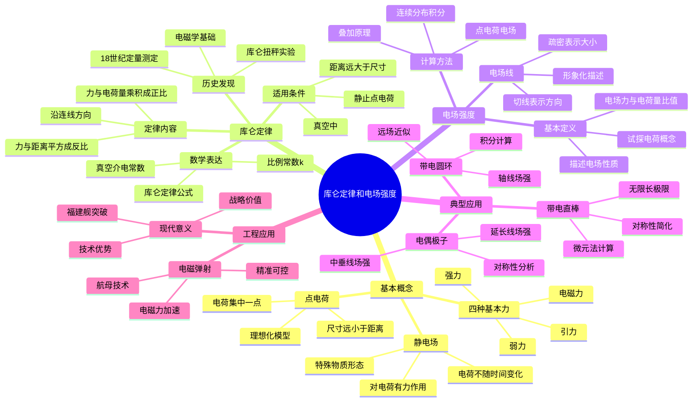

# 库仑定律和电场强度详解

**课程来源**: 大学物理与实验一  
**授课教师**: 曹喻霖  
**学校**: 深圳职业技术大学  
**整理时间**: 2024-10-13

## 📊 知识体系思维导图



---

## 第一部分：电磁弹射技术应用

### 1.1 现代航母的动力革命

**电磁弹射技术原理**: 利用电磁力进行加速，将飞机以极高的速度从航母甲板上弹射出去，从而提高舰载机的起飞效率。

> **💡 技术突破**: 
> - **福建舰成就**: 我国成为全球少数掌握电磁弹射技术的国家之一
> - **舰载机升级**: 歼-15T、歼-35与空警-600已完成电磁弹射起飞
> - **系统验证**: 2025年顺利完成起降训练，验证了系统稳定性
> 
> **🔧 技术优势**: 
> - **动力革新**: 电磁力直接驱动，响应速度快，能量利用率高
> - **适应性强**: 灵活调节弹射力度，适用多种类型舰载机
> - **高效维护**: 无高温高压管路，故障率低，运维成本低
> 
> **❓ 为什么选择电磁**: 相比蒸汽弹射，电磁弹射实现了精准可控的加速过程，代表了航母技术的发展方向。

### 1.2 与传统蒸汽弹射的对比

| 特性 | 电磁弹射 | 蒸汽弹射 |
|------|----------|----------|
| **驱动方式** | 电磁力直接驱动 | 蒸汽活塞驱动 |
| **响应速度** | 快速响应 | 相对较慢 |
| **能量利用率** | 高效利用 | 能量损失较大 |
| **控制精度** | 精准可控 | 控制相对粗糙 |
| **适应性** | 适用多种机型 | 适应性有限 |
| **维护成本** | 低维护成本 | 高维护成本 |
| **系统复杂度** | 电子控制系统 | 机械蒸汽系统 |

---

## 第二部分：静电场基础理论

### 2.1 宇宙四种基本力

**基本力系统**: 宇宙存在四种基本力，它们支配着所有物理现象。

| 基本力 | 作用范围 | 相对强度 | 主要表现 |
|--------|----------|----------|----------|
| **强力** | 原子核内 | 1 | 核子结合 |
| **电磁力** | 长程力 | 10⁻² | 电荷相互作用 |
| **弱力** | 短程力 | 10⁻⁶ | 放射性衰变 |
| **引力** | 长程力 | 10⁻³⁹ | 万有引力 |

**万有引力定律对比**:
$$F = G\frac{m_1 m_2}{r^2}$$

其中G为万有引力常数，$G = 6.67 \times 10^{-11} \text{ N·m}^2/\text{kg}^2$

### 2.2 静电场的基本概念

**定义**: 静电场是电荷量q不随时间变化的电场，即$\frac{dq}{dt} = 0$。

> **💡 物理本质**: 
> - **物质形态**: 静电场是存在于电荷周围的特殊物质形态
> - **基本特征**: 对置于其中的静止电荷有力的作用
> - **空间性质**: 电场具有能量和动量，是物质的一种形式
> 
> **🔧 重要特点**: 
> - **长程作用**: 电场力可以在远距离上发生作用
> - **叠加性**: 多个电荷产生的电场可以叠加
> - **方向性**: 电场是矢量场，每点都有确定的方向
> 
> **❓ 为什么引入电场概念**: 电场概念解决了"超距作用"的困惑，提供了电荷间相互作用的媒介。

---

## 第三部分：库仑定律

### 3.1 库仑定律的表述

**定律内容**: 在真空中，两个静止的点电荷$q_1$和$q_2$之间的相互作用力，其大小与电荷量的乘积成正比，与它们之间距离r的平方成反比。力的方向沿着它们的连线，同号电荷相斥，异号电荷相吸。

**数学表达式**:
$$\vec{F} = k\frac{q_1 q_2}{r^2}\hat{r}$$

或写成：
$$\vec{F} = \frac{1}{4\pi\varepsilon_0}\frac{q_1 q_2}{r^2}\hat{r}$$

**重要常数**:
- 库仑常数：$k = \frac{1}{4\pi\varepsilon_0} \approx 9.00 \times 10^9 \text{ N·m}^2/\text{C}^2$
- 真空介电常数：$\varepsilon_0 = 8.85 \times 10^{-12} \text{ C}^2/(\text{N·m}^2)$

### 3.2 库仑定律的发现历程

**历史背景**: 由法国科学家库仑在18世纪通过精密的扭秤实验首次定量测定。

**实验装置**: 
- **扭秤结构**: 利用石英丝的扭转来测量微小的力
- **测量原理**: 通过扭转角度的变化来确定电荷间的作用力
- **精度突破**: 首次实现了电力的定量测量

**科学意义**:
- 为电磁学的定量研究奠定了基础
- 确立了电荷作为物理量的基本地位
- 开启了电磁学的定量时代

### 3.3 库仑定律的适用条件

**基本条件**:
1. **真空环境**: 定律严格适用于真空中的情况
2. **静止电荷**: 电荷必须处于静止状态
3. **点电荷**: 电荷的尺寸必须远小于它们之间的距离

**近似应用**:
当带电体的尺寸远小于它们之间的距离时，可以近似看作点电荷使用。

**判断标准**: 
$$\frac{d}{r} \ll 1$$
其中d为带电体的特征尺寸，r为它们之间的距离。

### 3.4 库仑定律的理论地位

> **💡 基础地位**: 
> - **静电学基础**: 库仑定律是静电学的基本定律
> - **微观解释**: 原子、分子、固体和液体的结构都与库仑力有关
> - **化学本质**: 化学作用的微观本质主要是库仑力
> 
> **🔧 应用范围**: 
> - **原子结构**: 电子与原子核的相互作用
> - **分子结合**: 离子键、共价键的形成机制
> - **固体性质**: 晶体结构的稳定性
> 
> **❓ 为什么如此重要**: 库仑定律揭示了电荷间相互作用的定量规律，是理解物质微观结构的关键。

---

## 第四部分：电场强度

### 4.1 电场强度的定义

**引入背景**: 为了描述电场的性质，需要引入一个物理量来定量表征电场的强弱和方向。

**试探电荷**: 电量和几何尺寸都足够小的电荷，用于探测电场性质而不影响原电场分布。

**定义式**: 电场中某点的电场强度$\vec{E}$定义为置于该点的试探电荷所受的电场力$\vec{F}$与其电荷量q的比值：

$$\vec{E} = \frac{\vec{F}}{q}$$

**单位**: 牛顿/库仑 (N/C) 或 伏特/米 (V/m)

### 4.2 点电荷的电场强度

**推导过程**: 
设点电荷Q在真空中产生电场，试探电荷q置于距离Q为r的P点。

根据库仑定律：
$$\vec{F} = \frac{1}{4\pi\varepsilon_0}\frac{Qq}{r^2}\hat{r}$$

因此电场强度：
$$\vec{E} = \frac{\vec{F}}{q} = \frac{1}{4\pi\varepsilon_0}\frac{Q}{r^2}\hat{r}$$

**重要特点**:
- 电场强度只与源电荷Q和位置r有关
- 与试探电荷q无关
- 方向：正电荷产生的电场方向向外，负电荷向内

### 4.3 电场强度的叠加原理

**叠加原理**: 空间某一点的总电场强度等于各个点电荷单独存在时在该点产生的电场强度的矢量和。

$$\vec{E} = \sum_{i=1}^{n} \vec{E_i} = \sum_{i=1}^{n} \frac{1}{4\pi\varepsilon_0}\frac{q_i}{r_i^2}\hat{r_i}$$

**应用方法**:

#### 4.3.1 点电荷组
对于离散的点电荷系统，直接进行矢量求和：

```
步骤：
1. 计算每个点电荷在该点产生的电场强度
2. 确定各电场强度的方向
3. 进行矢量合成
```

#### 4.3.2 连续带电体
对于连续分布的电荷，通过积分计算：

$$\vec{E} = \int d\vec{E} = \int \frac{1}{4\pi\varepsilon_0}\frac{dq}{r^2}\hat{r}$$

其中dq为电荷微元，积分的具体形式由电荷分布决定。

### 4.4 电场线

**定义**: 电场线是用于形象化描述电场分布的假想曲线。

**基本性质**:
1. **起止规律**: 电场线从正电荷出发，终止于负电荷
2. **切线方向**: 曲线上任一点的切线方向表示该点电场强度的方向
3. **疏密程度**: 电场线的疏密程度表示电场强度的相对大小
4. **不相交**: 电场线在空间中不相交（奇点除外）

**典型电场线分布**:

| 电荷分布 | 电场线特征 | 物理意义 |
|----------|------------|----------|
| **单个正电荷** | 径向向外发散 | 各向同性排斥 |
| **单个负电荷** | 径向向内汇聚 | 各向同性吸引 |
| **等量异号电荷** | 从正电荷到负电荷 | 电偶极子场 |
| **等量同号电荷** | 相互排斥分布 | 排斥效应 |

---

## 第五部分：典型电场计算

### 5.1 电偶极子的电场

**电偶极子**: 由相距很近的等量异号电荷组成的系统。

**重要参数**:
- 电偶极矩：$\vec{p} = q\vec{l}$（从负电荷指向正电荷）
- 电荷间距：$l$
- 电荷量：$\pm q$

#### 5.1.1 延长线上的电场

**几何设置**: 考虑电偶极子延长线上距离中心为x的P点。

**计算过程**:
正电荷在P点产生的电场：
$$E_+ = \frac{1}{4\pi\varepsilon_0}\frac{q}{(x-l/2)^2}$$

负电荷在P点产生的电场：
$$E_- = -\frac{1}{4\pi\varepsilon_0}\frac{q}{(x+l/2)^2}$$

合电场强度：
$$E = E_+ + E_- = \frac{1}{4\pi\varepsilon_0}\frac{q}{(x-l/2)^2} - \frac{1}{4\pi\varepsilon_0}\frac{q}{(x+l/2)^2}$$

**远场近似** (当$x \gg l$时)：
$$E \approx \frac{1}{4\pi\varepsilon_0}\frac{2p}{x^3}$$

#### 5.1.2 中垂线上的电场

**几何设置**: 考虑电偶极子中垂线上距离中心为y的P点。

**对称性分析**: 由于对称性，平行于电偶极子方向的电场分量相互抵消。

**计算结果**:
$$E = \frac{1}{4\pi\varepsilon_0}\frac{p}{(y^2 + l^2/4)^{3/2}}$$

**远场近似** (当$y \gg l$时)：
$$E \approx \frac{1}{4\pi\varepsilon_0}\frac{p}{y^3}$$

### 5.2 均匀带电直棒的电场

**问题设置**: 长度为2l、总电量为Q的均匀带电直棒，求其中垂面上的电场分布。

**解题方法**: 采用微元法和对称性分析。

#### 5.2.1 建立坐标系
以棒的中点为原点，棒沿x轴方向，求y轴上P点的电场。

#### 5.2.2 微元分析
取微元dx，其电荷量：
$$dq = \lambda dx = \frac{Q}{2l}dx$$

微元在P点产生的电场强度大小：
$$dE = \frac{1}{4\pi\varepsilon_0}\frac{dq}{r^2} = \frac{1}{4\pi\varepsilon_0}\frac{\lambda dx}{x^2 + y^2}$$

#### 5.2.3 对称性分析
由于对称性，x方向的电场分量相互抵消，只需考虑y方向分量：
$$dE_y = dE \cos\theta = dE \frac{y}{\sqrt{x^2 + y^2}}$$

#### 5.2.4 积分计算
$$E_y = \int_{-l}^{l} \frac{1}{4\pi\varepsilon_0}\frac{\lambda y dx}{(x^2 + y^2)^{3/2}}$$

$$E_y = \frac{\lambda y}{4\pi\varepsilon_0} \int_{-l}^{l} \frac{dx}{(x^2 + y^2)^{3/2}}$$

**积分结果**:
$$E = \frac{1}{4\pi\varepsilon_0}\frac{Q}{y\sqrt{l^2 + y^2}}$$

**极限情况**:
- 当$l \to \infty$（无限长直棒）：$E = \frac{\lambda}{2\pi\varepsilon_0 y}$
- 当$y \gg l$（远场近似）：$E \approx \frac{1}{4\pi\varepsilon_0}\frac{Q}{y^2}$（点电荷场）

### 5.3 均匀带电圆环的电场

**问题设置**: 半径为a、总电量为Q的均匀带电圆环，求其轴线上的电场分布。

#### 5.3.1 对称性分析
由于圆环的轴对称性，垂直于轴线方向的电场分量相互抵消，只有轴线方向的分量。

#### 5.3.2 微元法计算
取圆环上微元dl，其电荷量：
$$dq = \lambda dl = \frac{Q}{2\pi a}dl$$

微元到轴线上P点的距离：
$$r = \sqrt{x^2 + a^2}$$

微元在P点产生的电场强度：
$$dE = \frac{1}{4\pi\varepsilon_0}\frac{dq}{r^2} = \frac{1}{4\pi\varepsilon_0}\frac{Q dl}{2\pi a(x^2 + a^2)}$$

轴线方向分量：
$$dE_x = dE \cos\theta = dE \frac{x}{\sqrt{x^2 + a^2}}$$

#### 5.3.3 积分求解
$$E_x = \int_0^{2\pi a} \frac{1}{4\pi\varepsilon_0}\frac{Q x dl}{2\pi a(x^2 + a^2)^{3/2}}$$

$$E = \frac{1}{4\pi\varepsilon_0}\frac{Qx}{(x^2 + a^2)^{3/2}}$$

**特殊情况讨论**:
- 圆环中心（x=0）：$E = 0$
- 远场近似（$x \gg a$）：$E \approx \frac{1}{4\pi\varepsilon_0}\frac{Q}{x^2}$（点电荷场）
- 圆环平面上（x=0，但不在中心）：需要重新计算

---

## 📖 考试宝典

### 🔥 高频考点总结

#### 1. **库仑定律基本应用**（必考，20-25分）
- **公式记忆**：$F = k\frac{q_1q_2}{r^2}$，注意矢量性质
- **适用条件**：真空、静止、点电荷条件的判断
- **力的叠加**：多个点电荷对某电荷的合力计算
- **平衡问题**：三个或多个电荷的平衡条件

#### 2. **电场强度概念与计算**（必考，25-30分）
- **定义理解**：$\vec{E} = \frac{\vec{F}}{q}$的物理意义
- **点电荷电场**：$E = k\frac{Q}{r^2}$的方向判断
- **叠加原理**：矢量叠加的计算方法
- **电场线性质**：电场线的画法和物理意义

#### 3. **连续分布电荷的电场**（必考，25-30分）
- **微元法**：dq的选取和积分区间的确定
- **对称性分析**：利用对称性简化计算
- **典型分布**：直棒、圆环、圆盘、球面等
- **极限讨论**：远场近似和特殊位置的场强

#### 4. **电偶极子**（常考，15-20分）
- **基本概念**：电偶极矩的定义和方向
- **场强分布**：延长线和中垂线上的场强公式
- **远场近似**：$r \gg l$时的近似表达式
- **实际应用**：分子的电偶极矩

#### 5. **综合应用**（常考，10-15分）
- **电场中的力和运动**：带电粒子在电场中的运动
- **电场能量**：电场储存的能量计算
- **导体静电平衡**：导体表面电场的性质
- **电场与其他物理量的关系**：电势、电容等

### ⚡ 快速解题技巧

1. **看到"点电荷"** → 想到库仑定律$F = k\frac{q_1q_2}{r^2}$
2. **看到"电场强度"** → 想到定义式$E = \frac{F}{q}$
3. **看到"多个电荷"** → 想到叠加原理，矢量求和
4. **看到"连续分布"** → 想到微元法，$dE = k\frac{dq}{r^2}$
5. **看到"对称分布"** → 想到利用对称性简化计算
6. **看到"无限长"或"无限大"** → 想到极限情况的处理
7. **看到"远场"或"$r \gg$"** → 想到近似为点电荷
8. **看到"轴线"或"中垂线"** → 想到特殊位置的对称性

### 🎯 标准答题模板

#### **库仑定律计算题标准格式**：
1. **明确研究对象**（确定哪些电荷，哪个受力电荷）
2. **建立坐标系**（选择合适的坐标系）
3. **应用库仑定律**（计算各个电荷的作用力）
4. **矢量合成**（按矢量法则求合力）
5. **检验结果**（检查量纲、方向、极限情况）

#### **电场强度计算题标准格式**：
1. **分析电荷分布**（点电荷、线分布、面分布等）
2. **选择计算方法**（直接公式、叠加原理、微元法）
3. **建立坐标系**（便于积分和对称性分析）
4. **利用对称性**（简化计算，确定场强方向）
5. **执行积分**（设置积分限，计算定积分）
6. **讨论特殊情况**（极限情况、特殊位置等）

---

## ⚠️ 易错点数据库

### 🚨 概念类易错点

#### 1. **库仑定律适用条件理解错误**
- ❌ **错误**：认为库仑定律适用于所有带电体
- ✅ **正确**：只适用于真空中的静止点电荷
- **易错原因**：忽略了"点电荷"和"真空"的限制条件

#### 2. **电场强度方向判断错误**
- ❌ **错误**：认为电场强度方向就是电场力方向
- ✅ **正确**：电场强度方向是正试探电荷受力方向
- **关键点**：负电荷受到的电场力与电场强度方向相反

#### 3. **电场线性质理解错误**
- ❌ **错误**：认为电场线是真实存在的
- ✅ **正确**：电场线是为了形象描述电场而引入的假想线
- **注意**：电场线不能相交，密度表示场强大小

#### 4. **试探电荷概念混淆**
- ❌ **错误**：认为试探电荷可以是任意电荷
- ✅ **正确**：试探电荷必须足够小，不影响原电场分布
- **原因**：大的试探电荷会改变原有的电场分布

### 🚨 计算类易错点

#### 1. **矢量叠加计算错误**
- ❌ **错误**：直接将电场强度大小相加
- ✅ **正确**：必须按矢量法则进行叠加
- **方法**：建立坐标系，分别计算各分量后合成

#### 2. **微元法积分设置错误**
- ❌ **错误**：微元选择不当或积分限设置错误
- ✅ **正确**：根据对称性选择合适的微元和积分变量
- **技巧**：画图分析，明确积分区域和变量关系

#### 3. **对称性分析不彻底**
- ❌ **错误**：没有充分利用对称性简化计算
- ✅ **正确**：先分析对称性，确定哪些分量为零
- **好处**：可以大大简化计算过程

#### 4. **极限情况讨论遗漏**
- ❌ **错误**：只给出一般公式，不讨论特殊情况
- ✅ **正确**：讨论远场、近场等极限情况
- **意义**：验证公式正确性，理解物理本质

### 🎯 应用类易错点

#### 1. **电偶极子场强公式混淆**
- **问题**：延长线和中垂线上的公式记混
- **解决**：记住延长线上是$\frac{2p}{r^3}$，中垂线上是$\frac{p}{r^3}$

#### 2. **连续分布积分变量选择错误**
- **问题**：积分变量选择不当，导致积分复杂
- **解决**：根据对称性和几何关系选择最简单的变量

#### 3. **单位制混淆**
- **问题**：SI制和高斯制的公式混用
- **解决**：统一使用SI制，记住$k = \frac{1}{4\pi\varepsilon_0}$

---

## 📋 速查手册

### 🔧 核心公式速查表

| **物理量** | **公式** | **适用条件** |
|-----------|----------|-------------|
| **库仑力** | $F = k\frac{q_1q_2}{r^2}$ | 真空中静止点电荷 |
| **电场强度** | $E = \frac{F}{q}$ | 定义式，普遍适用 |
| **点电荷电场** | $E = k\frac{Q}{r^2}$ | 点电荷产生的电场 |
| **电偶极子延长线** | $E = \frac{2kp}{r^3}$ | $r \gg l$，延长线上 |
| **电偶极子中垂线** | $E = \frac{kp}{r^3}$ | $r \gg l$，中垂线上 |
| **无限长直线** | $E = \frac{\lambda}{2\pi\varepsilon_0 r}$ | 无限长均匀带电直线 |
| **带电圆环轴线** | $E = \frac{kQx}{(x^2+a^2)^{3/2}}$ | 圆环轴线上 |

### 📊 重要常数速查表

| **常数名称** | **符号** | **数值** | **单位** |
|-------------|----------|----------|----------|
| **库仑常数** | k | $9.00 \times 10^9$ | N·m²/C² |
| **真空介电常数** | $\varepsilon_0$ | $8.85 \times 10^{-12}$ | C²/(N·m²) |
| **元电荷** | e | $1.60 \times 10^{-19}$ | C |
| **电子质量** | $m_e$ | $9.11 \times 10^{-31}$ | kg |
| **质子质量** | $m_p$ | $1.67 \times 10^{-27}$ | kg |

### 🔢 典型计算模板

#### 多点电荷电场叠加模板
```
1. 建立坐标系，确定各电荷位置
2. 计算每个电荷在目标点的电场强度
   E_i = k|q_i|/r_i² (大小)
   方向：正电荷背离，负电荷指向
3. 将各电场强度分解为分量
   E_ix = E_i cos θ_i
   E_iy = E_i sin θ_i
4. 分别求和各分量
   E_x = ΣE_ix, E_y = ΣE_iy
5. 合成总电场强度
   E = √(E_x² + E_y²)
   θ = arctan(E_y/E_x)
```

#### 连续分布电场积分模板
```
1. 分析电荷分布的对称性
2. 建立适当的坐标系
3. 选择微元dq，确定其位置
4. 写出微元电场强度dE
5. 利用对称性确定积分方向
6. 设置积分限，执行积分
7. 讨论特殊情况和极限
```

### ⏰ 解题时间分配建议

| **题型** | **建议时间** | **关键步骤** |
|---------|-------------|-------------|
| **概念选择题** | 2-3分钟 | 理解概念，注意细节 |
| **库仑定律计算** | 8-12分钟 | 建立坐标系，矢量合成 |
| **电场强度叠加** | 10-15分钟 | 分析对称性，分量计算 |
| **连续分布积分** | 15-25分钟 | 微元选择，积分计算 |
| **综合应用题** | 20-30分钟 | 多知识点结合，分步求解 |

### 🎯 考前必背清单

#### **基本概念必背**
- 库仑定律：$F = k\frac{q_1q_2}{r^2}$，真空静止点电荷
- 电场强度：$E = \frac{F}{q}$，描述电场性质的物理量
- 叠加原理：电场强度的矢量叠加
- 电场线：从正电荷出发，终止于负电荷

#### **重要公式必背**
- 点电荷电场：$E = k\frac{Q}{r^2}$
- 电偶极子远场：延长线$\frac{2kp}{r^3}$，中垂线$\frac{kp}{r^3}$
- 无限长直线：$E = \frac{\lambda}{2\pi\varepsilon_0 r}$
- 库仑常数：$k = 9.00 \times 10^9$ N·m²/C²

#### **解题方法必背**
- 矢量叠加：建坐标系，分量计算，合成结果
- 微元法：选微元，写dE，利用对称性，执行积分
- 对称性分析：确定场强方向，简化计算
- 极限讨论：远场近似，特殊位置验证

#### **检查要点**
- [ ] 公式使用是否正确
- [ ] 矢量性质是否考虑
- [ ] 对称性是否充分利用
- [ ] 积分限是否设置正确
- [ ] 结果的量纲是否正确
- [ ] 特殊情况是否合理

---

## 💪 分层次例题体系

### 🟢 第一层：基础理解题（送分题，必须全对）

#### 例题1-1：库仑定律基本应用
**【题目】** 真空中有两个点电荷，$q_1 = +2.0 \times 10^{-6}$ C，$q_2 = -3.0 \times 10^{-6}$ C，相距r = 0.1 m。求它们之间的相互作用力。

**【标准解答】**
根据库仑定律：
$$F = k\frac{|q_1||q_2|}{r^2} = 9.0 \times 10^9 \times \frac{2.0 \times 10^{-6} \times 3.0 \times 10^{-6}}{(0.1)^2}$$

$$F = 9.0 \times 10^9 \times \frac{6.0 \times 10^{-12}}{0.01} = 5.4 \text{ N}$$

**【解题要点】**
- 库仑定律公式中用电荷量的绝对值
- 力的方向：异号电荷相互吸引
- 注意单位统一和有效数字

#### 例题1-2：电场强度定义
**【题目】** 在电场中某点放入电荷量为$q = +2.0 \times 10^{-8}$ C的试探电荷，受到的电场力为$F = 4.0 \times 10^{-3}$ N，方向向右。求该点的电场强度。

**【标准解答】**
根据电场强度定义：
$$E = \frac{F}{q} = \frac{4.0 \times 10^{-3}}{2.0 \times 10^{-8}} = 2.0 \times 10^5 \text{ N/C}$$

方向：向右（与正试探电荷受力方向相同）

**【解题要点】**
- 电场强度方向与正电荷受力方向相同
- 电场强度只与电场本身有关，与试探电荷无关
- 注意科学记数法的运算

#### 例题1-3：点电荷电场
**【题目】** 点电荷$Q = +5.0 \times 10^{-6}$ C在真空中产生电场，求距离该电荷0.2 m处的电场强度。

**【标准解答】**
$$E = k\frac{Q}{r^2} = 9.0 \times 10^9 \times \frac{5.0 \times 10^{-6}}{(0.2)^2}$$

$$E = 9.0 \times 10^9 \times \frac{5.0 \times 10^{-6}}{0.04} = 1.125 \times 10^6 \text{ N/C}$$

方向：背离正电荷，沿径向向外

**【解题要点】**
- 正电荷产生的电场方向背离电荷
- 负电荷产生的电场方向指向电荷
- 电场强度大小与距离平方成反比

### 🟡 第二层：应用计算题（拉开差距）

#### 例题2-1：电场强度叠加
**【题目】** 如图所示，在x轴上x = -a处放置电荷$q_1 = +Q$，在x = +a处放置电荷$q_2 = -Q$。求原点O处的电场强度。

**【解题思路】**
这是典型的电偶极子问题，需要用矢量叠加原理。

**【标准解答】**
建立坐标系，以O为原点，x轴向右为正方向。

$q_1$在O点产生的电场强度：
$$E_1 = k\frac{Q}{a^2}$$
方向：沿x轴正方向

$q_2$在O点产生的电场强度：
$$E_2 = k\frac{Q}{a^2}$$
方向：沿x轴正方向（负电荷产生的电场指向电荷）

合电场强度：
$$E = E_1 + E_2 = 2k\frac{Q}{a^2}$$
方向：沿x轴正方向

**【关键点】**
- 正确判断各电场的方向
- 利用矢量叠加原理
- 注意电偶极子中心的场强特点

#### 例题2-2：三电荷平衡问题
**【题目】** 三个点电荷$q_1$、$q_2$、$q_3$共线，$q_2$位于$q_1$和$q_3$之间。若三个电荷都处于平衡状态，证明：$\frac{q_1}{q_3} = \left(\frac{r_{12}}{r_{23}}\right)^2$

**【解题思路】**
利用库仑定律和力的平衡条件。

**【标准解答】**
设$q_1$在x = 0处，$q_2$在x = $r_{12}$处，$q_3$在x = $r_{12} + r_{23}$处。

对$q_2$的受力分析：
来自$q_1$的力：$F_{12} = k\frac{|q_1||q_2|}{r_{12}^2}$
来自$q_3$的力：$F_{32} = k\frac{|q_3||q_2|}{r_{23}^2}$

平衡条件：$F_{12} = F_{32}$
$$k\frac{|q_1||q_2|}{r_{12}^2} = k\frac{|q_3||q_2|}{r_{23}^2}$$

化简得：
$$\frac{|q_1|}{|q_3|} = \left(\frac{r_{12}}{r_{23}}\right)^2$$

由于$q_1$和$q_3$必须同号（否则$q_2$无法平衡），所以：
$$\frac{q_1}{q_3} = \left(\frac{r_{12}}{r_{23}}\right)^2$$

#### 例题2-3：均匀带电半圆环的电场
**【题目】** 半径为R、总电荷量为Q的均匀带电半圆环，求其圆心处的电场强度。

**【解题思路】**
利用微元法和对称性分析。

**【标准解答】**
建立坐标系：以圆心为原点，半圆环在上半平面。

取微元：角度为dθ的微元，电荷量为：
$$dq = \frac{Q}{\pi}d\theta$$

微元在圆心产生的电场强度：
$$dE = k\frac{dq}{R^2} = k\frac{Q}{\pi R^2}d\theta$$

方向：从微元指向圆心

分量分析：
$$dE_x = dE\cos\theta = k\frac{Q}{\pi R^2}\cos\theta d\theta$$
$$dE_y = dE\sin\theta = k\frac{Q}{\pi R^2}\sin\theta d\theta$$

积分计算：
$$E_x = \int_0^\pi k\frac{Q}{\pi R^2}\cos\theta d\theta = k\frac{Q}{\pi R^2}[\sin\theta]_0^\pi = 0$$

$$E_y = \int_0^\pi k\frac{Q}{\pi R^2}\sin\theta d\theta = k\frac{Q}{\pi R^2}[-\cos\theta]_0^\pi = k\frac{2Q}{\pi R^2}$$

因此：
$$E = \frac{2kQ}{\pi R^2}$$
方向：沿y轴负方向（指向半圆环）

### 🔴 第三层：综合分析题（拔高题）

#### 例题3-1：电场中的力学问题
**【题目】** 质量为m、电荷量为+q的小球，用长为l的绝缘细线悬挂在点电荷+Q的正下方。平衡时细线与竖直方向成θ角。求点电荷Q与小球间的距离。

**【深度分析】**
这是电场力与重力、张力的平衡问题，需要综合运用库仑定律和力学平衡条件。

**【标准解答】**
建立坐标系：以悬挂点为原点，竖直向下为y轴正方向。

几何关系：
- 小球到悬挂点距离：l
- 小球到点电荷Q的水平距离：$l\sin\theta$
- 小球到点电荷Q的竖直距离：设为h
- 小球到点电荷Q的距离：$r = \sqrt{(l\sin\theta)^2 + h^2}$

受力分析：
1. 重力：$mg$（向下）
2. 张力：$T$（沿细线向上）
3. 电场力：$F_e = k\frac{Qq}{r^2}$（沿小球与Q的连线，排斥）

平衡条件：
水平方向：$T\sin\theta = F_e\cos\alpha$
竖直方向：$T\cos\theta = mg$

其中$\cos\alpha = \frac{l\sin\theta}{r}$

由平衡条件得：
$$\tan\theta = \frac{F_e\cos\alpha}{mg} = \frac{k\frac{Qq}{r^2} \cdot \frac{l\sin\theta}{r}}{mg}$$

化简：
$$\tan\theta = \frac{kQql\sin\theta}{mgr^3}$$

$$r^3 = \frac{kQql}{mg\tan\theta} = \frac{kQql\cos\theta}{mg\sin\theta}$$

因此：
$$r = \left(\frac{kQql\cos\theta}{mg\sin\theta}\right)^{1/3}$$

**【物理洞察】**
- 当θ增大时，电场力增大，说明Q增大或距离减小
- 当θ = 0时，电场力为零，符合物理直觉
- 该问题展示了电场力与机械力的相互作用

#### 例题3-2：变分布电荷的电场
**【题目】** 半径为R的圆盘，电荷面密度为$\sigma = \sigma_0\cos\phi$（φ为从某一直径开始的角度）。求圆盘中心的电场强度。

**【创新解法】**
这是一个电荷密度非均匀分布的问题，需要巧妙运用对称性。

**【标准解答】**
建立坐标系：以圆盘中心为原点，x轴沿φ = 0的方向。

对称性分析：
电荷分布关于x轴对称，因此y方向的电场分量为零。

微元选择：
取角度为dφ、径向宽度为dr的微元，面积为：
$$dS = r \cdot dr \cdot d\phi$$

微元电荷量：
$$dq = \sigma(r,\phi) \cdot dS = \sigma_0\cos\phi \cdot r \cdot dr \cdot d\phi$$

微元在中心产生的电场：
由于所有微元到中心的距离都是r，且方向各不相同，需要分量分析。

x方向分量：
$$dE_x = k\frac{dq}{r^2}\cos\phi = k\frac{\sigma_0\cos\phi \cdot r \cdot dr \cdot d\phi}{r^2}\cos\phi$$
$$= k\sigma_0\cos^2\phi \frac{dr \cdot d\phi}{r}$$

积分计算：
$$E_x = \int_0^R \int_0^{2\pi} k\sigma_0\cos^2\phi \frac{dr \cdot d\phi}{r}$$

注意到$\int_0^{2\pi}\cos^2\phi d\phi = \pi$

$$E_x = k\sigma_0\pi \int_0^R \frac{dr}{r}$$

这个积分发散！说明我们的方法有问题。

**【正确方法】**
应该将圆盘分解为同心圆环，每个圆环的电荷分布为$\sigma_0\cos\phi$。

对于半径为r的圆环，其在中心产生的电场为零（因为$\cos\phi$分布的对称性）。

因此，整个圆盘在中心的电场强度为：
$$\vec{E} = 0$$

**【深层理解】**
这个结果看似反直觉，但体现了电荷分布对称性的重要作用。$\cos\phi$分布虽然不均匀，但其对称性导致中心处电场为零。

#### 例题3-3：电场强度的积分应用
**【题目】** 无限长直线上电荷线密度为$\lambda(x) = \lambda_0 e^{-|x|/a}$，求y轴上距离原点为b的P点的电场强度。

**【高级分析】**
这是一个电荷密度按指数规律变化的问题，需要处理复杂的积分。

**【标准解答】**
建立坐标系：直线沿x轴，P点在(0, b)。

微元分析：
取x处的微元dx，电荷量：
$$dq = \lambda(x)dx = \lambda_0 e^{-|x|/a}dx$$

微元到P点的距离：
$$r = \sqrt{x^2 + b^2}$$

微元在P点产生的电场强度：
$$d\vec{E} = k\frac{dq}{r^2}\hat{r} = k\frac{\lambda_0 e^{-|x|/a}dx}{x^2 + b^2}\hat{r}$$

分量分析：
$$dE_x = dE\cos\theta = k\frac{\lambda_0 e^{-|x|/a}dx}{x^2 + b^2} \cdot \frac{-x}{\sqrt{x^2 + b^2}}$$

$$dE_y = dE\sin\theta = k\frac{\lambda_0 e^{-|x|/a}dx}{x^2 + b^2} \cdot \frac{b}{\sqrt{x^2 + b^2}}$$

由于电荷分布关于y轴对称，$E_x = 0$。

y方向积分：
$$E_y = \int_{-\infty}^{\infty} k\frac{\lambda_0 e^{-|x|/a}b dx}{(x^2 + b^2)^{3/2}}$$

$$= 2\int_0^{\infty} k\frac{\lambda_0 e^{-x/a}b dx}{(x^2 + b^2)^{3/2}}$$

这个积分可以通过变量替换$x = b\tan\phi$来计算：

$$E_y = \frac{2k\lambda_0}{b}\int_0^{\pi/2} e^{-b\tan\phi/a}\cos\phi d\phi$$

最终结果（需要特殊函数）：
$$E_y = \frac{k\lambda_0}{a}K_1\left(\frac{b}{a}\right)$$

其中$K_1$是第一类修正贝塞尔函数。

**【物理意义】**
- 当$b \ll a$时，$E_y \approx \frac{k\lambda_0}{b}$（类似无限长均匀直线）
- 当$b \gg a$时，$E_y \approx \frac{k\lambda_0 a}{b^2}$（类似点电荷）

---

## 🏆 考试冲刺要点

### **必背公式**
1. 库仑定律：$F = k\frac{q_1q_2}{r^2}$
2. 电场强度：$E = \frac{F}{q} = k\frac{Q}{r^2}$
3. 叠加原理：$\vec{E} = \sum\vec{E_i}$
4. 库仑常数：$k = 9.00 \times 10^9$ N·m²/C²

### **必背概念**
1. 静电场：电荷量不随时间变化的电场
2. 点电荷：尺寸远小于研究距离的带电体
3. 试探电荷：不影响原电场分布的小电荷
4. 电场线：形象描述电场的假想曲线

### **解题方法**
- 库仑定律：注意矢量性，同号相斥异号相吸
- 电场叠加：建坐标系，分量计算，矢量合成
- 连续分布：微元法，对称性分析，积分计算
- 特殊情况：利用极限和对称性验证结果

### **常见陷阱**
- 忽略电场和电场力的矢量性质
- 混淆电场强度方向和电场力方向
- 微元法中积分变量选择不当
- 对称性分析不充分导致计算复杂

---

## 总结

库仑定律和电场强度是电磁学的基础，它们不仅具有重要的理论价值，更在现代科技中有广泛应用。

**核心要点**:
1. **库仑定律**：揭示了电荷间相互作用的定量规律，是静电学的基石
2. **电场强度**：描述电场性质的核心物理量，体现了场的概念
3. **叠加原理**：处理复杂电荷分布的基本方法，体现了线性性质
4. **实际应用**：从原子结构到现代电磁弹射技术，都基于这些基本原理

掌握库仑定律和电场强度的概念、计算方法和应用，是学好电磁学的关键，也是理解现代科技发展的基础。通过系统学习和大量练习，能够深入理解电场的本质和规律。
