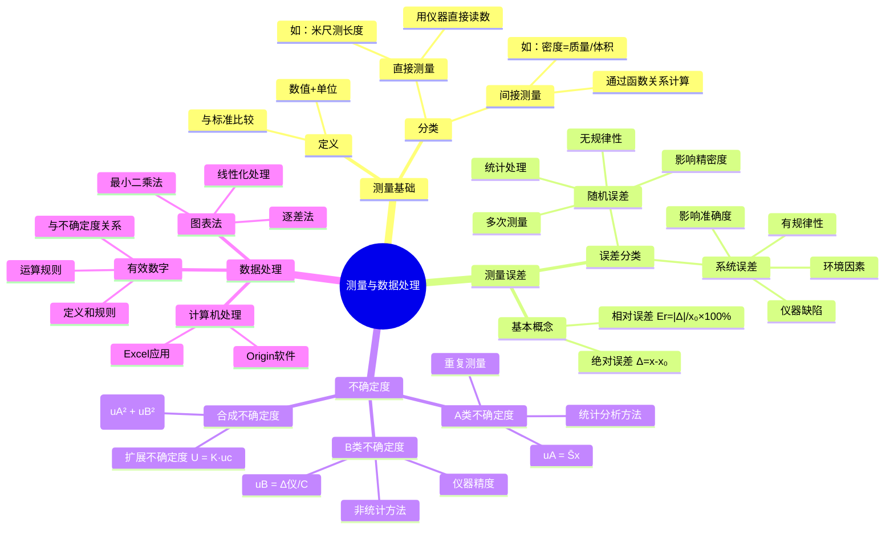

# 物理实验中的测量与数据处理

本笔记涵盖了物理实验中常用的测量、误差分析、不确定度以及数据处理技术等基本概念。

## 📊 知识体系思维导图

---

## 1. 测量 (Measurement)

- **定义**: 将待测的物理量与一个作为标准的计量单位进行比较的过程。测量结果包括数值和单位两部分。

- **分类**:
  - **直接测量 (Direct Measurement)**: 直接用仪器得到待测量的值（例如，用米尺测量长度）。
  - **间接测量 (Indirect Measurement)**: 通过一个或几个直接测量的量，根据已知的函数关系计算出待测量物理量的值。

## 2. 测量误差 (Measurement Error)

- **定义**: 测量值 ($x$) 与其客观存在的真值 ($x_0$) 之间的差异。
  - **误差 (Error)**: $\Delta = x - x_0$

- **绝对误差 (Absolute Error)**: 表示误差的大小。
  
  > **💡 物理意义**: 绝对误差直接反映测量值偏离真值的程度，单位与被测量相同。
  > 
  > **🔧 实际应用**: 在实验中，绝对误差帮助我们判断测量的可靠性。例如，用米尺测量长度时，如果绝对误差为±0.5mm，说明真实长度在测量值±0.5mm范围内。

- **相对误差 (Relative Error)**: 绝对误差与真值（或其最佳估计值）的比值，通常以百分数表示。
  - $E_r = \frac{|\Delta|}{x_0} \times 100\%$
  
  > **💡 物理意义**: 相对误差消除了量纲影响，便于比较不同物理量测量的精确程度。
  > 
  > **🔧 实际应用**: 相对误差越小，测量越精确。例如，测量1m长度误差1mm的相对误差是0.1%，而测量1cm长度误差1mm的相对误差是10%，显然前者更精确。
  > 
  > **❓ 为什么要用相对误差**: 因为绝对误差的大小往往与被测量的大小有关，相对误差能更好地反映测量的相对精度。

### 误差的分类

1. **系统误差 (Systematic Error)**: 在相同条件下重复测量时，误差的大小和符号保持恒定或按一定规律变化。它影响测量的准确性，主要来源于仪器缺陷、环境因素或不完善的测量方法。

   > **💡 物理意义**: 系统误差具有确定性和重现性，是由固定因素引起的偏差。
   > 
   > **🔧 实际应用**: 
   > - **仪器零点偏移**: 天平未调零导致所有测量都偏大或偏小
   > - **环境影响**: 温度变化使金属尺膨胀，导致长度测量系统偏差
   > - **方法缺陷**: 单摆实验中忽略空气阻力和摆线质量
   > 
   > **❓ 为什么要识别系统误差**: 因为系统误差可以通过校正、改进方法或环境控制来减小或消除，而随机误差只能通过统计方法处理。

2. **随机误差 (Random Error)**: 在重复测量中，误差的大小和符号会发生不可预知的变化。它由许多微小、无法控制的因素引起。通过多次测量并进行统计分析可以减小其影响。对于 $n$ 次测量 ($x_1, x_2, ..., x_n$)，真值的最佳估计是算术平均值。

   - **算术平均值 (Arithmetic Mean)**: $\bar{x} = \frac{1}{n} \sum_{i=1}^{n} x_i$
   
     > **💡 物理意义**: 算术平均值是真值的最佳估计，当随机误差服从正态分布时，平均值的期望值等于真值。
     > 
     > **🔧 实际应用**: 多次测量同一物理量后取平均值，可以有效减小随机误差的影响。
     > 
     > **❓ 为什么取平均值**: 因为随机误差正负相间，多次测量的平均值能使正负误差相互抵消。

   - **标准差 (Standard Deviation)**: 
     
     $$
     S_x = \sqrt{\frac{1}{n-1} \sum_{i=1}^{n} (x_i - \bar{x})^2}
     $$
     
     > **💡 物理意义**: 标准差表征单次测量值相对于平均值的分散程度，反映测量的精密度。
     > 
     > **🔧 实际应用**: 标准差越小，说明测量越稳定，重现性越好。
     > 
     > **❓ 为什么分母是n-1**: 这是贝塞尔校正，因为用样本平均值代替总体平均值会低估方差，n-1校正能给出无偏估计。

   - **平均值的标准差 (Standard Error of the Mean)**: 
     
     $$
     S_{\bar{x}} = \frac{S_x}{\sqrt{n}} = \sqrt{\frac{1}{n(n-1)} \sum_{i=1}^{n} (x_i - \bar{x})^2}
     $$
     
     > **💡 物理意义**: 平均值的标准差表征平均值作为真值估计的不确定程度。
     > 
     > **🔧 实际应用**: 这是A类不确定度的基础，用于评估重复测量的统计不确定度。
     > 
     > **❓ 为什么除以√n**: 因为n个独立随机变量的平均值的方差是单个变量方差的1/n，所以标准差是1/√n。

## 3. 测量不确定度 (Uncertainty in Measurement)

不确定度是与测量结果相关联的一个参数，用以表征合理地赋予被测量之值的分散性。

### 不确定度的分量

1. **A类不确定度 ($u_A$) (Type A Uncertainty)**: 用统计分析的方法评定的不确定度分量，即对一系列重复观测值进行统计处理得到。它对应于平均值的标准差。
   - $u_A = S_{\bar{x}} = \sqrt{\frac{1}{n(n-1)} \sum_{i=1}^{n} (x_i - \bar{x})^2}$
   
   > **💡 物理意义**: A类不确定度反映了由随机因素引起的测量分散性，体现了重复测量的统计特性。
   > 
   > **🔧 实际应用**: 当我们重复测量同一物理量时，每次结果略有不同，A类不确定度量化了这种变化程度。
   > 
   > **❓ 为什么要重复测量**: 因为单次测量无法评估随机误差，只有通过多次测量的统计分析才能获得可靠的不确定度评估。

2. **B类不确定度 ($u_B$) (Type B Uncertainty)**: 用非统计分析的方法评定的不确定度分量。其信息来源包括仪器说明书、校准证书或手册数据等。通常根据仪器的极限误差 ($\Delta_{inst}$) 来估算。
   - $u_B = \frac{\Delta_{inst}}{C}$
   - 除数 $C$ 取决于误差的概率分布：
     - **正态分布**: $C$ 通常与置信水平有关（例如 $C = 3$ 对应约99.7%的置信概率）。
     - **均匀分布（矩形分布）**: $C = \sqrt{3}$。这在评估数字仪表示值或模拟仪器分度值时很常见。
   
   > **💡 物理意义**: B类不确定度反映了由仪器精度限制、环境条件等非随机因素引起的不确定性。
   > 
   > **🔧 实际应用**: 
   > - **游标卡尺**: 分度值0.02mm，按均匀分布，$u_B = \frac{0.02}{\sqrt{3}} = 0.012mm$
   > - **数字万用表**: 说明书给出±0.1%读数±1个字，需要根据具体情况计算
   > 
   > **❓ 为什么要区分分布类型**: 不同的误差分布对应不同的概率密度函数，影响标准不确定度的计算。均匀分布假设误差在区间内等概率出现，正态分布假设误差集中在中心附近。

#### 常用仪器的误差限与置信系数

**实验室常用的部分仪器的误差限**：

| 仪器名称 | 测量范围/规格 | 误差限 $\Delta_{仪}$ |
|---------|-------------|-------------------|
| **千分尺（螺旋测微计）** | 测量范围0～100mm | $\Delta_{仪} = 0.004mm$ |
| **游标卡尺** | $\Delta_{仪} = $ 分度值，例如50分度的游标卡尺 | $\Delta_{仪} = 0.02mm$ |
| **米尺** | $\Delta_{仪} = $ 分度值/2 | $\Delta_{仪} = 0.5mm$（米尺的分度值为1mm） |
| **物理天平** | $\Delta_{仪} = $ 天平感量 | $\Delta_{仪} = 0.05g$ |

**置信系数 C 的取值**：

| 仪器名称 | 误差分布类型 | C取值 |
|---------|-------------|-------|
| **千分尺** | 正态分布 | 3 |
| **游标卡尺** | 均匀分布 | $\sqrt{3}$ |
| **米尺** | 正态分布 | 3 |
| **物理天平** | 正态分布 | 3 |
| **秒表** | 近似均匀分布 | $\sqrt{3}$ |
| **电表** | 近似均匀分布 | $\sqrt{3}$ |
| **电阻箱** | 近似均匀分布 | $\sqrt{3}$ |

### 合成与扩展不确定度

- **合成标准不确定度 ($u_c$) (Combined Standard Uncertainty)**: 当测量结果由多个独立的量计算得出时，合成不确定度是各个独立不确定度分量平方和的平方根。
  - 对于包含A类和B类分量的直接测量：$u_c = \sqrt{u_A^2 + u_B^2}$
  - **不确定度传播公式**: 对于间接测量量 $y = f(x_1, x_2, ..., x_N)$，其合成不确定度为：
    
    $$
    u_c^2(y) = \sum_{i=1}^{N} \left(\frac{\partial f}{\partial x_i}\right)^2 u^2(x_i)
    $$
    
  - **常见不确定度传播公式**：

#### 1) 加法和减法运算

对于 $y = x_1 + x_2$ 或 $y = x_1 - x_2$：

- **最佳值**: $y = \bar{x_1} + \bar{x_2}$ 或 $y = \bar{x_1} - \bar{x_2}$
- **不确定度**: $u_c^2(y) = u_c^2(x_1) + u_c^2(x_2)$

#### 2) 乘法和除法运算

对于 $y = x_1 \cdot x_2$ 或 $y = \frac{x_1}{x_2}$：

- **最佳值**: $y = \bar{x_1} \cdot \bar{x_2}$ 或 $y = \frac{\bar{x_1}}{\bar{x_2}}$
- **相对不确定度**: $\left[\frac{u_c(y)}{y}\right]^2 = \left[\frac{u_c(x_1)}{\bar{x_1}}\right]^2 + \left[\frac{u_c(x_2)}{\bar{x_2}}\right]^2$

#### 3) 幂函数运算

对于 $y = x^n$：

- **最佳值**: $y = \bar{x}^n$
- **相对不确定度**: $\left[\frac{u_c(y)}{y}\right]^2 = \left[n \cdot \frac{u_c(x)}{\bar{x}}\right]^2$

- **扩展不确定度 ($U$) (Expanded Uncertainty)**: 给出一个包含真值的可能区间。它由合成标准不确定度乘以一个**包含因子 ($K$)** 得到。
  - $U = K u_c$
  - 包含因子 $K$ 的取值取决于所需的置信水平。在大学物理实验中，通常取 $K = 2$，对应约95.5%的置信概率。

### 测量结果的表示

一个完整的测量结果应表示为：
- **结果 = $\bar{x} \pm U$** (附单位)
- 也可报告其相对不确定度：$E_r = \frac{U}{|\bar{x}|} \times 100\%$

#### 实际计算示例

**例题3**: 用50分度的游标卡尺重复测量一长度L，得到六次测量的结果（单位：mm）：
139.70, 139.72, 139.68, 139.70, 139.74, 139.72

**解**：

1. **计算平均值**：
   
   $$
   \bar{L} = \frac{1}{n} \sum_{i=1}^{n} L_i = 139.71 \text{ (mm)}
   $$

2. **计算A类不确定度**：
   
   $$
   u_A = \sqrt{\frac{\sum (L_i - \bar{L})^2}{n(n-1)}} = 0.0086 \text{ (mm)}
   $$

3. **计算B类不确定度**：

   $$
   u_B = \frac{\Delta_{仪}}{\sqrt{3}} = \frac{0.02}{\sqrt{3}} = 0.012 \text{ (mm)}
   $$

4. **合成不确定度**：
   
   $$
   u_c = \sqrt{u_A^2 + u_B^2} = 0.015 \text{ (mm)}
   $$

5. **扩展不确定度**：
   
   $$
   U = 2u_c = 0.030 \text{ (mm)}
   $$

**测量结果表达式**：

$$
L = \bar{L} \pm U = (139.710 \pm 0.030) \text{ (mm)}, k = 2
$$

## 4. 有效数字 (Significant Figures)

- **定义**: 指测量结果中具有实际意义的数字，由所有准确数字加上最后一位估读的存疑数字组成。

- **运算规则**:
  1. **加减运算随各数字中小数位最少者**
  2. **乘除运算随各数字中有效数位最少者**

- **不确定度与有效数字**: 不确定度 ($U$) 通常只取一到两位有效数字。测量结果的最佳估计值 ($\bar{x}$) 的末位应与不确定度的末位对齐。

#### 间接测量量的计算按照有效数字的运算规则来处理

**例题4**: 用50分度的游标卡尺重复测量一球的直径，并已得到以下结果（单位：mm），写出该球体积的表达式。

**解**：

已知：$\bar{D} = \frac{1}{n} \sum_{i=1}^{n} D_i = 139.71 \text{ (mm)}$，$u_c = \sqrt{u_A^2 + u_B^2} = 0.015 \text{ (mm)}$

球的体积：

$$
\bar{V} = \frac{1}{6}\pi\bar{D}^3 = \frac{1}{6}\pi D^3 = 1.42780 \times 10^6 \text{ (mm}^3\text{)}
$$

相对不确定度：

$$
\frac{u_c(V)}{\bar{V}} = 3 \cdot \frac{u_c(D)}{\bar{D}} = 0.000322
$$

绝对不确定度：

$$
u_c(V) = 4.6 \times 10^2 \text{ (mm}^3\text{)}
$$

扩展不确定度：

$$
U(V) = 2u_c(V) = 9.2 \times 10^2 \text{ (mm}^3\text{)}
$$

**最终结果**：

$$
V = \bar{V} \pm U(V) = (1.42780 \pm 0.00092) \times 10^6 \text{ (mm}^3\text{)}, k = 2
$$

### 测量结果表示的补充说明

1. **物理量必须有单位。**

2. **间接测量量的计算按照有效数字的运算规则来处理。**

3. **中间运算过程中，不确定度$u_A$、$u_B$、$u_C$、$U$取两位。**

4. **采用"四舍六入五凑偶"的规则。**

5. **最后结果中物理量的数值的最后一位要和不确定度的位数对齐。**

## 5. 实验数据处理的常用方法

### 1. 列表法 (Tabulation)

系统地记录和组织数据，表格应包含明确的标题、带单位的表头和格式规范的数据。

### 2. 作图法 (Graphical Method)

通过绘制图形直观地展示物理量之间的关系，并利用直线的斜率、截距等求解物理量。

### 3. 最小二乘法 (Method of Least Squares)

一种通过最小化误差平方和来寻求数据最佳函数匹配的数学方法，是进行线性拟合最精确的方法。

#### 1) 线性拟合

对于一组实验数据 $(x_i, y_i)$，如果它们满足线性关系 $y = ax + b$，则最佳拟合直线的斜率 $a$ 和截距 $b$ 可以通过以下公式计算：

- **斜率 $a$**:

$$
a = \frac{\sum_{i=1}^{n} (x_i - \bar{x})(y_i - \bar{y})}{\sum_{i=1}^{n} (x_i - \bar{x})^2} = \frac{\overline{xy} - \bar{x}\bar{y}}{\overline{x^2} - \bar{x}^2}
$$

- **截距 $b$**:

$$
b = \bar{y} - a\bar{x}
$$

其中 $\bar{x}$, $\bar{y}$, $\overline{x^2}$, $\overline{xy}$ 分别为 $x_i$, $y_i$, $x_i^2$, $x_i y_i$ 的算术平均值。

#### 2) 相关系数

相关系数 $r$ 是衡量变量 $x$ 和 $y$ 之间线性关系密切程度的统计量。

- **公式**:

$$
r = \frac{\sum (x_i - \bar{x})(y_i - \bar{y})}{\sqrt{\sum (x_i - \bar{x})^2 \sum (y_i - \bar{y})^2}}
$$

- **含义**:
  - $|r|$ 的取值范围在 $0$ 和 $1$ 之间。
  - 当 $|r|$ 越接近 $1$，表示 $x$ 和 $y$ 的线性关系越强。
  - 当 $|r|$ 越接近 $0$，表示 $x$ 和 $y$ 的线性关系越弱，甚至不成立。
  - $r > 0$ 为正相关，$r < 0$ 为负相关。

### 4. 逐差法 (Successive Difference Method)

逐差法是一种处理自变量等间隔变化数据的有效方法。

- **适用条件**:
  1. 因变量 $y$ 是自变量 $x$ 的多项式函数。
  2. 自变量 $x$ 为等间距变化。

- **方法**:
将测得的 $2m$ 个数据分为前后两组，对应项相减，得到 $m$ 个差值 $(\Delta y)_i$。

$$
(\Delta y)_i = y_{i+m} - y_i, \quad (i = 1, 2, …, m)
$$

若 $y = a_y x + b_y$，则斜率 $a_y$ 的最佳值可由下式求得：

$$
\bar{a}_y = \frac{1}{m} \frac{\sum (\Delta y)_i}{\Delta x}
$$

其中 $\Delta x$ 为两组对应数据自变量的差值。
截距 $b_y$ 的最佳值为：

$$
\bar{b}_y = \bar{y} - \bar{a}_y \bar{x}
$$

- **优点**: 充分利用了全部测量数据，增大了测量区间，可以有效减小随机误差。

### 5. 用计算机进行数据处理

在现代实验技术中，计算机被广泛应用于数据处理。

- **优点**: 速度快、精度高、功能强大。
- **应用**: 可以方便地进行平均值、标准差、函数计算、最小二乘拟合、作图等复杂运算，极大提高了数据处理的效率和准确性。可以利用现有软件或编写简单程序来完成。

---

## 📖 考试宝典

### 🔥 高频考点总结

#### 1. **不确定度计算**（必考，20-25分）
- **A类不确定度**：统计方法，公式 $u_A = S_{\bar{x}} = \frac{S_x}{\sqrt{n}}$
- **B类不确定度**：仪器精度，公式 $u_B = \frac{\Delta_{仪}}{C}$
- **合成不确定度**：$u_c = \sqrt{u_A^2 + u_B^2}$
- **扩展不确定度**：$U = K \cdot u_c$（通常K=2）

#### 2. **不确定度传播**（必考，15-20分）
- **加减法**：$u_c^2(y) = u_c^2(x_1) + u_c^2(x_2)$
- **乘除法**：$\left[\frac{u_c(y)}{y}\right]^2 = \left[\frac{u_c(x_1)}{x_1}\right]^2 + \left[\frac{u_c(x_2)}{x_2}\right]^2$
- **幂函数**：$\left[\frac{u_c(y)}{y}\right]^2 = \left[n \cdot \frac{u_c(x)}{x}\right]^2$

#### 3. **有效数字**（必考，8-12分）
- **加减法**：看小数位数最少的
- **乘除法**：看有效数字位数最少的
- **不确定度**：通常取1-2位有效数字
- **结果表达**：测量值末位与不确定度末位对齐

#### 4. **数据处理方法**（常考，10-15分）
- **最小二乘法**：线性拟合的标准方法
- **逐差法**：等间距数据的有效处理
- **相关系数**：评价线性关系的强弱

### ⚡ 快速解题技巧

1. **看到"重复测量多次"** → 想到A类不确定度
2. **看到"仪器精度/分度值"** → 想到B类不确定度
3. **看到"间接测量"** → 想到传播公式
4. **看到"密度=质量/体积"** → 想到乘除法传播
5. **看到"面积=长×宽"** → 想到乘法传播
6. **看到"体积=4πr³/3"** → 想到幂函数传播

### 🎯 标准答题模板

#### **不确定度计算题标准格式**：
1. **写已知条件**（整理数据）
2. **计算平均值**（$\bar{x} = \frac{1}{n}\sum x_i$）
3. **计算A类不确定度**（统计公式）
4. **确定B类不确定度**（查表或给定）
5. **合成不确定度**（$u_c = \sqrt{u_A^2 + u_B^2}$）
6. **扩展不确定度**（$U = 2u_c$）
7. **规范表达结果**（$x = \bar{x} \pm U$，k=2）

---

## ⚠️ 易错点数据库

### 🚨 计算类易错点

#### 1. **不确定度传播公式混淆**
- ❌ **错误**：乘除法用绝对不确定度直接相加
- ✅ **正确**：乘除法用相对不确定度的平方和开根号
- **记忆口诀**：加减绝对，乘除相对

#### 2. **A类不确定度计算错误**
- ❌ **错误**：$u_A = S_x$（用标准差）
- ✅ **正确**：$u_A = S_{\bar{x}} = \frac{S_x}{\sqrt{n}}$（用平均值的标准差）
- **易错原因**：忘记除以√n

#### 3. **B类不确定度的C值选择**
- ❌ **错误**：所有仪器都用C=3
- ✅ **正确**：
  - 游标卡尺：C = √3（均匀分布）
  - 螺旋测微器：C = 3（正态分布）
  - 米尺：C = 3（正态分布）

#### 4. **有效数字处理错误**
- ❌ **错误**：中间过程就取有效数字
- ✅ **正确**：最后结果才取有效数字，中间过程多保留1-2位
- ❌ **错误**：不确定度取很多位
- ✅ **正确**：不确定度通常只取1-2位有效数字

#### 5. **幂函数传播系数遗漏**
- ❌ **错误**：$V = \frac{4}{3}\pi r^3$，忘记r的指数3
- ✅ **正确**：$\frac{u_c(V)}{V} = 3 \cdot \frac{u_c(r)}{r}$

### 🎯 概念类易错点

#### 1. **系统误差与随机误差混淆**
- **系统误差**：有规律、影响准确度、可校正
- **随机误差**：无规律、影响精密度、统计处理
- **易错点**：认为多次测量可以消除系统误差

#### 2. **准确度与精密度概念**
- **准确度**：测量值接近真值的程度
- **精密度**：重复测量结果的一致性
- **易错点**：认为精密度高就是准确度高

#### 3. **直接测量与间接测量**
- **直接测量**：用仪器直接读数
- **间接测量**：通过函数关系计算
- **易错点**：用天平称质量算密度，认为密度是直接测量

### 🔍 考试陷阱识别

1. **单位陷阱**：
   - mm与m的转换（1mm = 10⁻³m）
   - cm³与m³的转换（1cm³ = 10⁻⁶m³）

2. **公式陷阱**：
   - 相对不确定度要平方后相加再开根号
   - 传播公式中的偏导数系数

3. **数值陷阱**：
   - 科学计数法的指数
   - 有效数字的位数判断

4. **表达陷阱**：
   - 结果必须带单位
   - 不确定度与测量值末位对齐
   - 包含因子k的标注

---

## 📋 速查手册

### 🔧 常用公式速查表

| **物理量** | **公式** | **适用条件** |
|-----------|----------|-------------|
| **A类不确定度** | $u_A = \frac{S_x}{\sqrt{n}}$ | 重复测量n≥3 |
| **B类不确定度** | $u_B = \frac{\Delta_{仪}}{C}$ | 仪器精度已知 |
| **合成不确定度** | $u_c = \sqrt{u_A^2 + u_B^2}$ | 直接测量 |
| **扩展不确定度** | $U = K \cdot u_c$ | K通常取2 |
| **加减法传播** | $u_c^2(y) = u_c^2(x_1) + u_c^2(x_2)$ | $y = x_1 ± x_2$ |
| **乘除法传播** | $\left[\frac{u_c(y)}{y}\right]^2 = \left[\frac{u_c(x_1)}{x_1}\right]^2 + \left[\frac{u_c(x_2)}{x_2}\right]^2$ | $y = x_1 × x_2$ 或 $y = \frac{x_1}{x_2}$ |
| **幂函数传播** | $\frac{u_c(y)}{y} = n \cdot \frac{u_c(x)}{x}$ | $y = x^n$ |
| **标准差** | $S_x = \sqrt{\frac{\sum(x_i-\bar{x})^2}{n-1}}$ | 单次测量精密度 |
| **平均值标准差** | $S_{\bar{x}} = \frac{S_x}{\sqrt{n}}$ | 平均值精密度 |

### 📏 常用仪器精度速查表

| **仪器名称** | **精度 $\Delta_{仪}$** | **C值** | **$u_B$计算** |
|-------------|---------------------|---------|---------------|
| **游标卡尺（0.02mm）** | 0.02mm | $\sqrt{3}$ | $u_B = \frac{0.02}{\sqrt{3}} = 0.012mm$ |
| **游标卡尺（0.05mm）** | 0.05mm | $\sqrt{3}$ | $u_B = \frac{0.05}{\sqrt{3}} = 0.029mm$ |
| **螺旋测微器** | 0.004mm | 3 | $u_B = \frac{0.004}{3} = 0.0013mm$ |
| **米尺** | 0.5mm | 3 | $u_B = \frac{0.5}{3} = 0.17mm$ |
| **物理天平** | 0.05g | 3 | $u_B = \frac{0.05}{3} = 0.017g$ |
| **秒表** | 0.01s | $\sqrt{3}$ | $u_B = \frac{0.01}{\sqrt{3}} = 0.0058s$ |

### 🔢 常用数值速查表

| **常数** | **数值** | **用途** |
|---------|----------|----------|
| **π** | 3.14159 | 圆周率计算 |
| **π²** | 9.8696 | 单摆周期公式 |
| **√2** | 1.414 | 几何计算 |
| **√3** | 1.732 | B类不确定度 |
| **e** | 2.718 | 指数函数 |
| **ln10** | 2.303 | 对数转换 |

### 📊 有效数字判断速查

| **情况** | **规则** | **示例** |
|---------|----------|----------|
| **整数末尾的0** | 不是有效数字 | 1200（2位） |
| **小数中的0** | 是有效数字 | 1.02（3位） |
| **科学计数法** | 看系数 | $1.23×10^4$（3位） |
| **加减运算** | 看小数位 | 1.2 + 1.23 = 2.4 |
| **乘除运算** | 看有效位数 | 1.2 × 1.234 = 1.5 |

### ⏰ 考试时间分配建议

| **题型** | **建议时间** | **分值占比** | **策略** |
|---------|-------------|-------------|----------|
| **选择题** | 15-20分钟 | 20-30% | 快速判断，不纠结 |
| **填空题** | 10-15分钟 | 15-25% | 直接计算，注意单位 |
| **计算题** | 50-60分钟 | 40-50% | 步骤完整，公式清楚 |
| **分析题** | 15-20分钟 | 10-15% | 逻辑清晰，表达规范 |
| **检查** | 5-10分钟 | - | 重点检查单位和数值 |

### 🎯 考前必背清单

#### **公式必背**（开考前5分钟默写）
1. $u_A = \frac{S_x}{\sqrt{n}}$
2. $u_B = \frac{\Delta_{仪}}{C}$
3. $u_c = \sqrt{u_A^2 + u_B^2}$
4. 加减法：$u_c^2(y) = u_c^2(x_1) + u_c^2(x_2)$
5. 乘除法：$\left[\frac{u_c(y)}{y}\right]^2 = \left[\frac{u_c(x_1)}{x_1}\right]^2 + \left[\frac{u_c(x_2)}{x_2}\right]^2$

#### **数值必背**
- √3 = 1.732
- π² = 9.87
- 游标卡尺C = √3，螺旋测微器C = 3

#### **检查要点**
- [ ] 单位是否正确
- [ ] 有效数字是否合理
- [ ] 不确定度是否与测量值末位对齐
- [ ] 是否标注k值
- [ ] 公式是否用对

---

## 💪 分层次例题体系

### 🟢 第一层：基础理解题（送分题，必须全对）

#### 例题1-1：概念辨析（必考点）
**【题目】** 下列关于系统误差和随机误差的说法，正确的是（ ）
A. 系统误差可以通过多次测量求平均值来消除
B. 随机误差具有单向性，总是使测量结果偏大或偏小  
C. 系统误差影响测量的准确度，随机误差影响测量的精密度
D. 系统误差和随机误差都可以通过改进测量方法完全消除

**【标准解答】** C

**【解题要点】**
- 系统误差：有规律、影响准确度、可校正但难以完全消除
- 随机误差：无规律、影响精密度、可通过统计方法减小
- 准确度 vs 精密度：接近真值 vs 测量一致性

**【易错提醒】** 
❌ 不要认为多次测量能消除系统误差
❌ 不要混淆准确度和精密度的概念

#### 例题1-2：基础计算（送分题）
**【题目】** 用游标卡尺测量某物体长度6次，结果为：
50.24, 50.26, 50.22, 50.25, 50.23, 50.25 (mm)
游标卡尺分度值为0.02mm。求：
(1) 平均值 (2) A类不确定度 (3) B类不确定度

**【标准解题步骤】**
第一步：计算平均值
$$\bar{L} = \frac{1}{6}(50.24+50.26+50.22+50.25+50.23+50.25) = 50.25 \text{ mm}$$

第二步：计算A类不确定度
$$u_A = \sqrt{\frac{\sum(L_i-\bar{L})^2}{n(n-1)}} = \sqrt{\frac{0.0014}{30}} = 0.0068 \text{ mm}$$

第三步：计算B类不确定度
$$u_B = \frac{\Delta_{仪}}{\sqrt{3}} = \frac{0.02}{\sqrt{3}} = 0.012 \text{ mm}$$

**【得分要点】**
- 计算过程要有公式 (2分)
- 数值计算正确 (3分)  
- 最终结果表达规范 (2分)

#### 例题1-3：有效数字判断（高频考点）
**【题目】** 下列数据的有效数字位数正确的是（ ）
A. 0.0250 (3位)    B. 1200 (4位)    C. 3.14×10⁴ (3位)    D. 0.00500 (3位)

**【标准解答】** C, D

**【判断规则速记】**
- 小数点前的0不算：0.0250 → 3位
- 整数末尾的0要看情况：1200 → 2位（除非特别说明）
- 科学计数法看系数：3.14×10⁴ → 3位
- 小数点后的0算：0.00500 → 3位

### 🟡 第二层：应用计算题（拉开差距）

#### 例题2-1：不确定度传播（高频考点）
**【题目】** 用天平测得物体质量m=(25.43±0.02)g，用游标卡尺测得其体积V=(12.50±0.05)cm³，求物体密度及其不确定度。

**【解题模板】**
第一步：写出物理公式
$$\rho = \frac{m}{V}$$

第二步：计算密度最佳值
$$\bar{\rho} = \frac{25.43}{12.50} = 2.034 \text{ g/cm}^3$$

第三步：用传播公式计算不确定度
$$\frac{u_c(\rho)}{\rho} = \sqrt{\left(\frac{u(m)}{m}\right)^2 + \left(\frac{u(V)}{V}\right)^2}$$

第四步：代入数值
$$\frac{u_c(\rho)}{\rho} = \sqrt{\left(\frac{0.02}{25.43}\right)^2 + \left(\frac{0.05}{12.50}\right)^2} = 0.0042$$

第五步：计算绝对不确定度
$$u_c(\rho) = 2.034 \times 0.0042 = 0.0085 \text{ g/cm}^3$$

第六步：写出最终结果
$$\rho = (2.034 \pm 0.009) \text{ g/cm}^3, k=2$$

**【关键公式记忆】**
- 乘除法用相对不确定度：$\left[\frac{u_c(y)}{y}\right]^2 = \left[\frac{u(x_1)}{x_1}\right]^2 + \left[\frac{u(x_2)}{x_2}\right]^2$
- 这是考试必考公式，要熟练掌握！

**【易错点】**
❌ 忘记用相对不确定度
❌ 最终结果有效数字位数不对
❌ 忘记标注k值

#### 例题2-2：复合不确定度计算
**【题目】** 测量圆柱体体积，直径D=(2.50±0.02)cm，高度h=(5.00±0.05)cm，求体积及其不确定度。

**【解题思路】**
第一步：写出体积公式
$$V = \frac{\pi D^2 h}{4}$$

第二步：用传播公式
$$\frac{u_c(V)}{V} = \sqrt{\left(2\frac{u(D)}{D}\right)^2 + \left(\frac{u(h)}{h}\right)^2}$$

第三步：代入计算
- $\frac{u(D)}{D} = \frac{0.02}{2.50} = 0.008$
- $\frac{u(h)}{h} = \frac{0.05}{5.00} = 0.010$
- $\frac{u_c(V)}{V} = \sqrt{(2×0.008)^2 + (0.010)^2} = 0.019$

**【注意事项】**
⚠️ D的系数是2（因为D²的指数）
⚠️ 要区分直径和半径

### 🔴 第三层：综合分析题（拔高题）

#### 例题3-1：实验设计与误差分析
**【题目】** 设计一个实验方案测量某不规则物体的密度，要求相对不确定度小于1%。已知：电子天平精度±0.001g，量筒最小分度1mL，物体质量约50g，体积约20cm³。

**【解题思路】**
第一步：选择测量方法
- 方法：天平测质量，排水法测体积
- 原理：$\rho = \frac{m}{V}$

第二步：分析误差来源
- 质量测量：B类不确定度 $u_B(m) = \frac{0.001}{\sqrt{3}} = 0.0006$ g
- 体积测量：B类不确定度 $u_B(V) = \frac{1}{\sqrt{3}} = 0.58$ cm³

第三步：估算相对不确定度
$$\frac{u_c(\rho)}{\rho} = \sqrt{\left(\frac{0.0006}{50}\right)^2 + \left(\frac{0.58}{20}\right)^2} = 0.029 = 2.9\%$$

第四步：优化方案
- 问题：体积测量误差太大
- 改进：使用更精密的量筒（0.1mL分度）
- 重新计算：$u_B(V) = \frac{0.1}{\sqrt{3}} = 0.058$ cm³
- 新的相对不确定度：0.3% < 1% ✓

**【评分标准】**
- 方案合理性 (3分)
- 误差分析完整性 (4分)
- 计算正确性 (2分)
- 优化建议 (1分)

#### 例题3-2：数据处理综合题
**【题目】** 某同学用逐差法处理单摆实验数据，测得不同摆长对应的周期如下表。要求用逐差法求重力加速度，并分析哪个摆长的测量对结果影响最大。

| 摆长L(cm) | 50.0 | 60.0 | 70.0 | 80.0 | 90.0 | 100.0 |
|-----------|------|------|------|------|------|-------|
| 周期T(s)  | 1.42 | 1.55 | 1.68 | 1.79 | 1.90 | 2.01  |

**【解题步骤】**
第一步：应用逐差法
- 将数据分为两组：前3个和后3个
- 计算差值：$\Delta T_i = T_{i+3} - T_i$
- $\Delta T_1 = 1.79 - 1.42 = 0.37$ s
- $\Delta T_2 = 1.90 - 1.55 = 0.35$ s  
- $\Delta T_3 = 2.01 - 1.68 = 0.33$ s

第二步：利用线性关系
$$T^2 = \frac{4\pi^2}{g}L$$
$$2T\Delta T = \frac{4\pi^2}{g}\Delta L$$

第三步：计算g值
- $\Delta L = 30.0$ cm = 0.30 m
- 取平均：$\overline{\Delta T} = 0.35$ s，$\overline{T} = 1.68$ s
- $g = \frac{4\pi^2 \Delta L}{2\overline{T}\overline{\Delta T}} = 9.85$ m/s²

第四步：灵敏度分析
- 对于$g = \frac{4\pi^2 L}{T^2}$，灵敏系数：
- $\frac{\partial g}{\partial L} = \frac{4\pi^2}{T^2}$
- $\frac{\partial g}{\partial T} = -\frac{8\pi^2 L}{T^3}$
- 影响最大的是周期测量，且摆长越长影响越大

**【深度分析】**
- 逐差法的优势：充分利用数据，减小随机误差
- 实验改进建议：增加测量次数，提高计时精度
- 系统误差识别：检查是否存在零点偏移

### 📊 例题难度分布建议

| 难度层次 | 题目数量 | 考试占比 | 复习时间分配 |
|---------|---------|----------|-------------|
| **基础理解题** | 15-20题 | 30-40% | 30% |
| **应用计算题** | 10-15题 | 40-50% | 50% |
| **综合分析题** | 5-8题 | 15-25% | 20% |

### 🎯 刷题策略

#### **第一阶段：基础巩固（1-2周）**
- 目标：概念清晰，基础计算熟练
- 方法：每天5道基础题，重复练习
- 重点：公式记忆、概念辨析、简单计算

#### **第二阶段：能力提升（2-3周）**  
- 目标：掌握解题方法，提高计算速度
- 方法：每天3道应用题，总结解题模板
- 重点：不确定度传播、数据处理、误差分析

#### **第三阶段：综合冲刺（1周）**
- 目标：应对复杂问题，培养分析能力
- 方法：每天1-2道综合题，注重思路
- 重点：实验设计、方案优化、深度分析

---

## 总结

物理实验中的测量与数据处理是实验物理学的基础，涉及：

1. **测量理论**：理解直接测量与间接测量的区别
2. **误差分析**：掌握系统误差和随机误差的特点及处理方法
3. **不确定度评定**：学会A类、B类不确定度的计算和合成
4. **有效数字**：正确处理测量结果的数字表示
5. **数据处理方法**：熟练运用各种数据处理技术，特别是最小二乘法和逐差法

这些知识和技能对于进行高质量的物理实验和科学研究具有重要意义。
