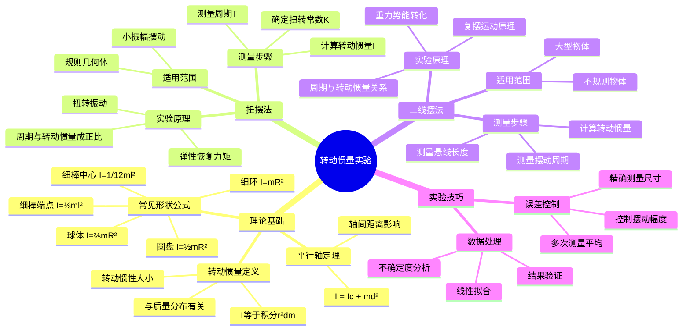

# 专题1-4: 转动惯量的实验研究

本笔记旨在总结和阐述测量刚体转动惯量的两种主要实验方法：**扭摆法**和**三线摆法**。

## 📊 知识体系思维导图

---

## [基本理论知识]

### 1. 转动惯量 (Moment of Inertia)

转动惯量 ($I$) 是衡量刚体转动惯性大小的物理量，其数值取决于物体的质量、形状、尺寸以及转轴的位置。其定义式为：

$$
I = \int r^2 dm
$$

其中 $dm$ 是质量微元，$r$ 是该微元到转轴的垂直距离。

> **💡 物理意义**: 转动惯量是转动中的"惯性质量"，类似于平动中的质量。它表征物体对转动状态改变的阻抗能力。
> 
> **🔧 实际应用**: 
> - **汽车设计**: 发动机飞轮的转动惯量影响发动机的平稳性
> - **体育运动**: 花样滑冰运动员收拢手臂减小转动惯量，增加转速
> - **机械工程**: 陀螺仪利用大转动惯量保持稳定方向
> 
> **❓ 为什么是r²而不是r**: 因为转动动能是$\frac{1}{2}I\omega^2$，而质量微元的转动动能是$\frac{1}{2}dm \cdot v^2 = \frac{1}{2}dm \cdot (r\omega)^2$，所以转动惯量必须包含$r^2$项。

### 2. 常用刚体的转动惯量

对于形状规则的均质物体，其绕特定转轴的转动惯量有固定公式：

**表 1-4-1 常用形状刚体的转动惯量**

| 刚体形状 | 转轴位置 | 转动惯量 $I$ |
| :--- | :--- | :--- |
| 细环 (半径R) | 通过中心对称轴 | $mR^2$ |
| 圆平板 (半径R) | 通过中心垂直板面 | $\frac{1}{2}mR^2$ |
| 细棒 (棒长l) | 通过一端与棒垂直 | $\frac{1}{3}ml^2$ |
| | 通过中心与棒垂直 | $\frac{1}{12}ml^2$ |
| 球体 (半径R) | 通过球心 | $\frac{2}{5}mR^2$ |
| 薄球壳 (半径R) | 通过球心 | $\frac{2}{3}mR^2$ |

### 3. 刚体定轴转动定律

该定律是转动力学中的"牛顿第二定律"，表明刚体角加速度 $β$ 与所受合外力矩 $M$ 成正比：

$$
M = Iβ
$$

### 4. 平行轴定理 (Parallel-Axis Theorem)

刚体对于任一转轴的转动惯量 $I$，等于该刚体对通过质心且与之平行的转轴的转动惯量 $I_c$ 加上刚体质量 $m$ 与两平行轴之间距离 $d$ 平方之积。

$$
I = I_c + md^2
$$

> **💡 物理意义**: 平行轴定理表明，物体对任意轴的转动惯量等于对质心轴的转动惯量加上"质量×距离²"项。距离轴越远，转动惯量越大。
> 
> **🔧 实际应用**: 
> - **工程设计**: 计算偏心轮、连杆等复杂形状物体的转动惯量
> - **实验分析**: 从已知的标准形状推算实际测量轴的转动惯量
> - **体育分析**: 解释为什么伸展手臂时转动更困难
> 
> **❓ 为什么有md²项**: 可以把物体看作质量m集中在质心的质点，这个质点到新轴的距离是d，所以贡献$md^2$的转动惯量。
> 
> **🎯 实验验证**: 通过改变转轴位置测量不同的转动惯量，验证平行轴定理的正确性。

---

## 方法一：扭摆法 (Torsion Pendulum)

扭摆法利用弹性扭转恢复力矩使物体进行扭转振动，通过测量振动周期来确定其转动惯量。

### [实验原理]

扭摆的恢复力矩 $M$ 与扭转角 $θ$ 成正比：$M = -Kθ$（$K$ 为扭转常数）。根据定轴转动定律，可得扭摆的运动方程为简谐振动：

$$
\frac{d^2θ}{dt^2} = -\frac{K}{I}θ = -ω^2θ
$$

其振动周期为：

$$
T = 2\pi\sqrt{\frac{I}{K}}
$$

> **💡 物理意义**: 扭摆实验将转动惯量的测量转化为周期的测量，利用了简谐振动的规律性。
> 
> **🔧 实际应用**: 
> - **精密测量**: 扭摆法精度高，适合测量规则几何体的转动惯量
> - **材料研究**: 通过测量不同材料的扭转常数研究弹性性质
> - **质量分布分析**: 比较理论值和实验值，验证质量分布的均匀性
> 
> **❓ 为什么是简谐振动**: 因为恢复力矩与角位移成正比且方向相反，这正是简谐振动的特征。
> 
> **❓ 为什么要知道K值**: 因为公式中有两个未知量I和K，必须先通过标准物体确定K值，才能测量未知物体的I值。

整理可得转动惯量的计算公式：

$$
I = \frac{KT^2}{4\pi^2}
$$

其中 $I$ 是摆上所有物体的总转动惯量。

### [实验步骤]

本实验使用 **FB729 智能型转动惯量综合实验仪**。

#### 1. 测定扭转常数 K

测量空载物盘的周期 $T_0$ 和放置已知转动惯量 $I_1'$ 的塑料圆柱时的周期 $T_1$。

- 空载物盘时：$I_0 = \frac{KT_0^2}{4\pi^2}$
- 加塑料圆柱时：$I_0 + I_1' = \frac{KT_1^2}{4\pi^2}$

联立两式可得扭转常数 $K$：

$$
K = 4\pi^2 \frac{I_1'}{T_1^2 - T_0^2}
$$

其中 $I_0$ 是载物盘的转动惯量，$I_1'$ 是塑料圆柱的理论转动惯量 $I_1' = \frac{1}{8}mD^2$。

#### 2. 测量待测物体的转动惯量

将待测物体（如金属圆筒、细杆等）放置在载物盘上，测出其总振动周期 $T_x$。则待测物体的转动惯量 $I_x$ 为：

$$
I_x = \frac{KT_x^2}{4\pi^2} - I_0
$$

#### 3. 验证平行轴定理

将两个质量均为 $m$ 的小圆柱对称放置在细杆上，使其质心到转轴的距离为 $x$。测出系统的振动周期 $T_x$。

- 实验值：$I' = \frac{KT_x^2}{4\pi^2} - I_0'$ （$I_0'$ 为细杆+中心方块的转动惯量）
- 理论值：$I' = I_c' + 2mx^2$ （$I_c'$ 为小圆柱在杆中心时的转动惯量）

通过改变 $x$ 值，验证理论与实验是否相符。

### [数据记录示例]

**表 1-4-2 转动惯量测定实验数据记录参考表**

| 物体名称 | 几何尺寸 ($10^{-2}$m) | 周期 (s) | 转动惯量理论值 ($10^{-4}kg \cdot m^2$) | 转动惯量实验值 ($10^{-4}kg \cdot m^2$) |
| :--- | :--- | :--- | :--- | :--- |
| **载物盘** | / | $T_0$ | / | $I_0 = KT_0^2/(4\pi^2)$ |
| **塑料圆柱** | D | $T_1$ | $I_1' = \frac{1}{8}mD^2$ | $I_1 = KT_1^2/(4\pi^2) - I_0$ |
| **金属圆筒** | $D_{外}$, $D_{内}$ | $T_2$ | $I_2' = \frac{1}{8}m(D_{外}^2 + D_{内}^2)$ | $I_2 = KT_2^2/(4\pi^2) - I_0$ |
| ... | ... | ... | ... | ... |

---

## 方法二：三线摆法 (Trifilar Pendulum)

三线摆由一个均匀圆盘（悬盘）和三根等长的悬线组成，通过测量其扭转振动的周期来确定转动惯量。

### [实验原理]

当悬盘扭转一个微小角度 $θ_{max}$ 时，其质心会升高一个微小高度 $h$。根据机械能守恒定律，系统减少的势能转化为转动动能：

$$
m_0 gh = \frac{1}{2}Iω_{max}^2
$$

经过复杂的几何推导（略），可以得到转动惯量与周期的关系式：

$$
I = \frac{m_0 gRr}{4\pi^2 H} T^2
$$

其中：
- $m_0$：悬盘质量
- $R, r$：悬盘和上盘的悬点分布圆半径
- $H$：上下盘之间的垂直距离
- $T$：扭转振动周期

### [实验步骤]

1. **调节水平**：调节底脚螺钉，使三线摆的上盘和悬盘均处于水平状态。

2. **测量参数**：用游标卡尺和米尺测量 $R, r, H$ 等几何参数。

3. **测悬盘周期 $T_0$**：轻轻转动悬盘，使其做往复扭转运动。测量50次全振动的时间，计算空悬盘的周期 $T_0$，进而求出其转动惯量 $I_0$。

4. **测待测物体转动惯量 $I_1$**：将被测物体（如圆环）同心地放在悬盘上，测出总系统的振动周期 $T_1$。总转动惯量为 $I_{总} = I_0 + I_1$。

5. **计算 $I_1$**：

$$
I_1 = I_{总} - I_0 = \frac{(m_0 + m_1)gRr}{4\pi^2 H} T_1^2 - \frac{m_0 gRr}{4\pi^2 H} T_0^2
$$

### [数据记录示例]

**表 1-4-5 三线摆参数测量表**

| 项目 | 上圆盘悬孔间距离 $a$ | 悬盘悬线长度 $l$ | 圆盘直径 $D$ | 待测圆环内外径 $D_{外}, D_{内}$ |
| :--- | :---: | :---: | :---: | :---: |
| **测量值** | cm | cm | cm | cm |

**表 1-4-4 各测量刚体质量和摆动周期**

| 摆动系统 | 质量 | 50次振动时间 $t$ (s) | 周期 $T$ (s) |
| :--- | :--- | :--- | :--- |
| **悬盘** | $m_0$ | | |
| **悬盘+圆环** | $m_0 + m_1$ | | |
| **悬盘+圆柱体** | $m_0 + m_2$ | | |

### [实验后的思考题]

1. 转动惯量还可以用哪些方法测量？（如：复摆法、单摆法、落体法等）

2. 工程上主要用什么方法测量零部件的转动惯量？

3. 尝试自行设计一种测量转动惯量的方法。

---

## 📖 考试宝典

### 🔥 高频考点总结

#### 1. **转动惯量定义与公式**（必考，15-20分）
- **基本定义**：$I = \int r^2 dm$
- **物理意义**：转动中的"惯性质量"
- **常用公式**：
  - 细环：$I = mR^2$
  - 圆盘：$I = \frac{1}{2}mR^2$
  - 细棒（端点）：$I = \frac{1}{3}ml^2$
  - 细棒（中心）：$I = \frac{1}{12}ml^2$
  - 球体：$I = \frac{2}{5}mR^2$

#### 2. **平行轴定理**（必考，15-20分）
- **公式**：$I = I_c + md^2$
- **物理意义**：轴越远离质心，转动惯量越大
- **应用**：计算偏心轴的转动惯量
- **实验验证**：改变小物体在杆上的位置

#### 3. **扭摆法原理**（常考，12-18分）
- **周期公式**：$T = 2\pi\sqrt{\frac{I}{K}}$
- **转动惯量**：$I = \frac{KT^2}{4\pi^2}$
- **扭转常数**：$K = 4\pi^2 \frac{I_1'}{T_1^2 - T_0^2}$
- **测量步骤**：先测K值，再测未知物体

#### 4. **三线摆法原理**（常考，12-18分）
- **基本公式**：$I = \frac{mgRr}{4\pi^2 H} T^2$
- **能量转换**：重力势能↔转动动能
- **几何参数**：R（悬盘半径）、r（上盘半径）、H（高度）
- **适用范围**：不规则物体、大型物体

#### 5. **不确定度分析**（必考，10-15分）
- **扭摆法**：主要来自周期T和几何尺寸测量
- **三线摆法**：几何参数R、r、H的测量精度
- **传播公式**：根据具体公式推导

### ⚡ 快速解题技巧

1. **看到"转动惯量"** → 想到$I = \int r^2 dm$
2. **看到"平行轴"** → 想到$I = I_c + md^2$
3. **看到"扭摆周期"** → 想到$T = 2\pi\sqrt{\frac{I}{K}}$
4. **看到"三线摆"** → 想到能量守恒和几何关系
5. **看到"圆盘、圆环"** → 想到对应的标准公式
6. **看到"验证实验"** → 想到理论值与实验值比较

### 🎯 标准答题模板

#### **转动惯量计算题标准格式**：
1. **写出基本定义**（$I = \int r^2 dm$）
2. **选择适当方法**（扭摆法或三线摆法）
3. **写出相关公式**（周期公式、计算公式）
4. **代入数值计算**（注意单位统一）
5. **不确定度分析**（如果要求）
6. **与理论值比较**（验证实验合理性）

---

## ⚠️ 易错点数据库

### 🚨 概念类易错点

#### 1. **转动惯量公式混淆**
- ❌ **错误**：所有圆形物体都用$I = mR^2$
- ✅ **正确**：
  - 细环（质量集中在边缘）：$I = mR^2$
  - 圆盘（质量均匀分布）：$I = \frac{1}{2}mR^2$
  - 球体（三维分布）：$I = \frac{2}{5}mR^2$
- **记忆技巧**：质量越集中在外围，系数越大

#### 2. **平行轴定理理解错误**
- ❌ **错误**：$I = I_c + d^2$（忘记质量m）
- ✅ **正确**：$I = I_c + md^2$
- **物理意义**：$md^2$项表示把质量m集中在质心时的贡献

#### 3. **扭摆法中K值的确定**
- ❌ **错误**：认为K是常数，可以直接使用
- ✅ **正确**：K需要通过标准物体实验确定
- **原因**：不同装置的弹性系数不同

#### 4. **三线摆法的适用条件**
- ❌ **错误**：认为只能测量圆形物体
- ✅ **正确**：可以测量任意形状物体的转动惯量
- **优势**：特别适合不规则物体

### 🚨 计算类易错点

#### 1. **扭转常数K的计算错误**
- ❌ **错误**：$K = 4\pi^2 \frac{I_1'}{T_1^2}$
- ✅ **正确**：$K = 4\pi^2 \frac{I_1'}{T_1^2 - T_0^2}$
- **易错原因**：忘记减去空载周期的平方

#### 2. **三线摆公式中参数混淆**
- ❌ **错误**：R和r的位置颠倒
- ✅ **正确**：R是悬盘半径，r是上盘半径
- **检查方法**：通常R > r

#### 3. **单位换算错误**
- ❌ **错误**：直径D和半径R不区分
- ✅ **正确**：公式中用的是半径R = D/2
- **后果**：结果相差4倍

#### 4. **周期测量处理错误**
- ❌ **错误**：直接用总时间t作为周期
- ✅ **正确**：周期$T = \frac{t}{n}$（n为振动次数）

### 🎯 实验操作易错点

#### 1. **扭摆法摆动幅度控制**
- **问题**：摆动角度过大
- **后果**：不满足小角度近似，周期公式不成立
- **解决**：控制初始角度在10°以内

#### 2. **三线摆水平调节不当**
- **问题**：上盘或悬盘不水平
- **后果**：摆动不稳定，周期测量不准
- **解决**：仔细调节底脚螺钉

#### 3. **几何参数测量不准确**
- **问题**：测量R、r、H时读数错误
- **后果**：直接影响最终结果
- **解决**：多次测量取平均，注意测量点的选择

#### 4. **物体放置不当**
- **问题**：待测物体与转轴不同心
- **后果**：引入额外的转动惯量
- **解决**：确保物体几何中心与转轴重合

### 🔍 考试陷阱识别

1. **公式陷阱**：
   - 转动惯量公式的系数（1/2, 1/3, 2/5等）
   - 平行轴定理中的$md^2$项

2. **数值陷阱**：
   - 直径与半径的区别
   - 内径、外径的正确使用

3. **概念陷阱**：
   - 扭转常数K的物理意义
   - 三线摆中各参数的几何意义

4. **实验陷阱**：
   - 空载测量的重要性
   - 小角度摆动的条件

---

## 📋 速查手册

### 🔧 核心公式速查表

| **方法** | **基本公式** | **适用条件** |
|---------|-------------|-------------|
| **转动惯量定义** | $I = \int r^2 dm$ | 通用定义 |
| **平行轴定理** | $I = I_c + md^2$ | 轴平行于质心轴 |
| **扭摆法** | $T = 2\pi\sqrt{\frac{I}{K}}$ | 小角度摆动 |
| **扭摆转动惯量** | $I = \frac{KT^2}{4\pi^2}$ | 已知K值 |
| **扭转常数** | $K = 4\pi^2 \frac{I_1'}{T_1^2 - T_0^2}$ | 标准物体标定 |
| **三线摆** | $I = \frac{mgRr}{4\pi^2 H} T^2$ | 小角度扭转 |

### 📏 常用形状转动惯量速查表

| **形状** | **转轴位置** | **转动惯量公式** | **系数记忆** |
|---------|-------------|-----------------|-------------|
| **细环** | 通过中心垂直 | $I = mR^2$ | 质量全在边缘 |
| **圆盘** | 通过中心垂直 | $I = \frac{1}{2}mR^2$ | 质量均匀分布 |
| **细棒** | 通过一端垂直 | $I = \frac{1}{3}ml^2$ | 端点轴 |
| **细棒** | 通过中心垂直 | $I = \frac{1}{12}ml^2$ | 中心轴 |
| **球体** | 通过球心 | $I = \frac{2}{5}mR^2$ | 三维分布 |
| **薄球壳** | 通过球心 | $I = \frac{2}{3}mR^2$ | 表面分布 |
| **圆筒** | 通过中心轴 | $I = \frac{1}{2}m(R_1^2 + R_2^2)$ | 内外半径 |

### 🔢 实验参数典型值

| **参数** | **扭摆法** | **三线摆法** | **单位** |
|---------|-----------|-------------|----------|
| **周期范围** | 1-3 s | 2-5 s | s |
| **摆动角度** | < 10° | < 15° | 度 |
| **测量次数** | 50次振动 | 50次振动 | 次 |
| **几何尺寸** | cm级 | cm-dm级 | m |
| **质量范围** | 10-500 g | 100-2000 g | kg |

### 📊 误差分析速查表

| **误差源** | **扭摆法** | **三线摆法** | **减小方法** |
|-----------|-----------|-------------|-------------|
| **周期测量** | 主要误差源 | 主要误差源 | 测多个周期 |
| **几何尺寸** | 直径、长度 | R、r、H | 多次测量平均 |
| **质量测量** | 较小影响 | 直接影响 | 精密天平 |
| **摆动幅度** | 小角度近似 | 小角度近似 | 严格控制 |
| **装置稳定** | 扭转轴稳定 | 水平调节 | 仔细调试 |

### ⏰ 实验时间分配建议

| **步骤** | **扭摆法时间** | **三线摆法时间** | **要点** |
|---------|---------------|----------------|----------|
| **装置调试** | 10分钟 | 15分钟 | 确保稳定 |
| **参数测量** | 15分钟 | 20分钟 | 几何尺寸 |
| **K值标定** | 20分钟 | - | 扭摆法特有 |
| **周期测量** | 30分钟 | 25分钟 | 多次测量 |
| **数据处理** | 15分钟 | 20分钟 | 计算分析 |

### 🎯 考前必背清单

#### **公式必背**（开考前默写）
1. $I = \int r^2 dm$（定义）
2. $I = I_c + md^2$（平行轴定理）
3. $T = 2\pi\sqrt{\frac{I}{K}}$（扭摆周期）
4. $I = \frac{KT^2}{4\pi^2}$（扭摆转动惯量）
5. $I = \frac{mgRr}{4\pi^2 H} T^2$（三线摆）

#### **常用系数必背**
- 细环：1
- 圆盘：1/2
- 细棒端点：1/3
- 细棒中心：1/12
- 球体：2/5

#### **实验要点**
- 小角度摆动
- 测多个周期
- 几何参数准确
- 同心放置
- K值标定

#### **检查要点**
- [ ] 公式系数是否正确
- [ ] 直径半径是否区分
- [ ] 平行轴定理是否有$md^2$
- [ ] 周期是否除以振动次数
- [ ] 单位是否统一

---

## 💪 分层次例题体系

### 🟢 第一层：基础理解题（送分题，必须全对）

#### 例题1-1：概念辨析（必考点）
**【题目】** 关于转动惯量，下列说法正确的是（ ）
A. 转动惯量只与物体质量有关
B. 转动惯量的单位是 kg·m²
C. 同一物体对不同轴的转动惯量相同
D. 转动惯量可以为负值

**【标准解答】** B

**【解题要点】**
- 转动惯量与质量、形状、尺寸、转轴位置都有关
- 单位：kg·m²（质量×长度²）
- 不同轴的转动惯量不同（平行轴定理）
- 转动惯量恒为正值（$I = \int r^2 dm$）

**【易错提醒】**
❌ 不要认为转动惯量只与质量有关
❌ 不要混淆不同转轴的转动惯量
❌ 注意单位是kg·m²，不是kg·m

#### 例题1-2：基础公式应用（送分题）
**【题目】** 质量为2kg的均匀细棒，长度为1.2m，求：
(1) 对通过中心垂直于棒的轴的转动惯量
(2) 对通过一端垂直于棒的轴的转动惯量

**【标准解题步骤】**
第一步：识别几何形状和转轴位置
- 细棒，质量m = 2kg，长度l = 1.2m

第二步：应用标准公式
(1) 通过中心：$I_c = \frac{1}{12}ml^2$
$$I_c = \frac{1}{12} \times 2 \times (1.2)^2 = \frac{1}{12} \times 2 \times 1.44 = 0.24 \text{ kg·m}^2$$

(2) 通过一端：$I_e = \frac{1}{3}ml^2$
$$I_e = \frac{1}{3} \times 2 \times (1.2)^2 = \frac{1}{3} \times 2 \times 1.44 = 0.96 \text{ kg·m}^2$$

**【得分要点】**
- 正确选择公式 (2分)
- 数值代入正确 (2分)
- 计算结果准确 (2分)
- 单位标注正确 (1分)

#### 例题1-3：平行轴定理应用（高频考点）
**【题目】** 质量为0.5kg的均匀圆盘，半径为0.2m，求对距离圆心0.1m处平行轴的转动惯量。

**【标准解答】**
第一步：计算对质心轴的转动惯量
$$I_c = \frac{1}{2}mR^2 = \frac{1}{2} \times 0.5 \times (0.2)^2 = 0.01 \text{ kg·m}^2$$

第二步：应用平行轴定理
$$I = I_c + md^2 = 0.01 + 0.5 \times (0.1)^2 = 0.01 + 0.005 = 0.015 \text{ kg·m}^2$$

**【关键点】**
- 平行轴定理：$I = I_c + md^2$
- d是两平行轴间的距离
- 必须先知道质心轴的转动惯量

### 🟡 第二层：应用计算题（拉开差距）

#### 例题2-1：扭摆法测转动惯量（高频考点）
**【题目】** 用扭摆法测量圆盘的转动惯量。空载时周期T₀=1.5s，放上已知转动惯量I₁=2.0×10⁻⁴ kg·m²的标准圆柱后周期T₁=2.0s，放上待测圆盘后周期T₂=2.5s。求：
(1) 扭转常数K  (2) 待测圆盘的转动惯量

**【解题模板】**
第一步：建立基本方程
$$T = 2\pi\sqrt{\frac{I}{K}}$$

第二步：列出三个方程
- 空载：$T_0 = 2\pi\sqrt{\frac{I_0}{K}}$
- 加标准件：$T_1 = 2\pi\sqrt{\frac{I_0 + I_1}{K}}$
- 加待测件：$T_2 = 2\pi\sqrt{\frac{I_0 + I_2}{K}}$

第三步：计算扭转常数K
$$K = 4\pi^2 \frac{I_1}{T_1^2 - T_0^2} = 4\pi^2 \frac{2.0 \times 10^{-4}}{(2.0)^2 - (1.5)^2} = 4\pi^2 \frac{2.0 \times 10^{-4}}{1.75} = 4.5 \times 10^{-4} \text{ N·m}$$

第四步：计算待测转动惯量
$$I_2 = \frac{K(T_2^2 - T_0^2)}{4\pi^2} = \frac{4.5 \times 10^{-4} \times [(2.5)^2 - (1.5)^2]}{4\pi^2} = 4.0 \times 10^{-4} \text{ kg·m}^2$$

**【关键公式记忆】**
- 扭转常数：$K = 4\pi^2 \frac{I_1}{T_1^2 - T_0^2}$
- 待测转动惯量：$I_x = \frac{K(T_x^2 - T_0^2)}{4\pi^2}$

**【易错点】**
❌ 忘记减去空载周期T₀
❌ 混淆标准件和待测件
❌ 单位换算错误

#### 例题2-2：三线摆法测转动惯量
**【题目】** 用三线摆测量圆环的转动惯量。已知：悬盘质量m₀=0.8kg，圆环质量m₁=0.3kg，R=15cm，r=5cm，H=80cm。测得悬盘周期T₀=2.1s，加上圆环后周期T₁=2.4s。求圆环的转动惯量。

**【解题思路】**
第一步：写出三线摆基本公式
$$I = \frac{mgRr}{4\pi^2 H} T^2$$

第二步：分别计算悬盘和总系统的转动惯量
悬盘：$I_0 = \frac{m_0 gRr}{4\pi^2 H} T_0^2$
总系统：$I_{总} = \frac{(m_0 + m_1)gRr}{4\pi^2 H} T_1^2$

第三步：计算圆环转动惯量
$$I_1 = I_{总} - I_0 = \frac{gRr}{4\pi^2 H}[(m_0 + m_1)T_1^2 - m_0 T_0^2]$$

第四步：代入数值
$$I_1 = \frac{9.8 \times 0.15 \times 0.05}{4\pi^2 \times 0.8}[(0.8 + 0.3) \times (2.4)^2 - 0.8 \times (2.1)^2]$$
$$= 0.00234 \times [1.1 \times 5.76 - 0.8 \times 4.41] = 0.00234 \times 2.808 = 6.6 \times 10^{-3} \text{ kg·m}^2$$

**【三线摆要点】**
- 几何参数R、r、H要准确测量
- 质量包括悬盘和待测物体
- 注意单位统一（m、kg、s）

#### 例题2-3：验证平行轴定理
**【题目】** 在细杆上对称放置两个小圆柱（质量各为m=0.1kg），改变其到转轴的距离x，测得系统周期如下表。验证平行轴定理并求小圆柱对质心轴的转动惯量。

| 距离x(cm) | 5 | 10 | 15 | 20 | 25 |
|-----------|---|----|----|----|----|
| 周期T(s)  | 1.8 | 2.0 | 2.3 | 2.7 | 3.2 |

**【解题步骤】**
第一步：建立理论关系
根据平行轴定理：$I = I_0' + 2(I_c + mx^2)$
其中$I_0'$是细杆+中心部分的转动惯量，$I_c$是小圆柱对自身质心轴的转动惯量

第二步：利用$T^2 \propto I$关系
$$T^2 = \frac{4\pi^2}{K}(I_0' + 2I_c + 2mx^2)$$
这是$T^2$与$x^2$的线性关系

第三步：数据处理
| x²(cm²) | 25 | 100 | 225 | 400 | 625 |
|---------|----|----|-----|-----|-----|
| T²(s²)  | 3.24 | 4.00 | 5.29 | 7.29 | 10.24 |

第四步：线性拟合求斜率
斜率 $k = \frac{4\pi^2 \times 2m}{K}$，可以验证线性关系并求出相关参数

**【验证要点】**
- $T^2$与$x^2$应呈线性关系
- 斜率与质量m成正比
- 截距对应x=0时的转动惯量

### 🔴 第三层：综合分析题（拔高题）

#### 例题3-1：实验方案设计与比较
**【题目】** 要测量一个不规则物体的转动惯量，可选择扭摆法或三线摆法。已知物体质量约2kg，最大尺寸约30cm。分析两种方法的适用性，设计最优实验方案。

**【解题思路】**
第一步：方法比较分析

**扭摆法**
- 优点：精度高，适合规则物体，操作简便
- 缺点：需要标定扭转常数，物体需能稳定放置在载物盘上
- 适用条件：物体尺寸不超过载物盘，质量分布相对均匀

**三线摆法**
- 优点：适用范围广，特别适合不规则物体，不需要预先标定
- 缺点：几何参数测量要求高，悬挂稳定性要求高
- 适用条件：物体可以稳定悬挂，质心位置明确

第二步：针对题目条件分析
- 物体：不规则，质量2kg，尺寸30cm
- 扭摆法可能问题：物体可能超出载物盘范围，不规则形状难以稳定放置
- 三线摆法优势：适合不规则物体，悬挂方式灵活

第三步：推荐方案（三线摆法）
1. **悬挂方式设计**：在物体质心附近设置悬挂点
2. **参数测量**：精确测量R、r、H，多次测量取平均
3. **周期测量**：测量50个周期，重复6次
4. **误差控制**：控制摆动角度<10°，确保悬挂稳定

第四步：实验流程
1. 调节三线摆水平
2. 测量几何参数R、r、H
3. 测量悬盘周期T₀
4. 悬挂待测物体，测量总周期T₁
5. 计算转动惯量并进行不确定度分析

**【评分标准】**
- 方法比较全面 (3分)
- 分析针对性强 (3分)
- 实验方案可行 (2分)
- 误差分析合理 (2分)

#### 例题3-2：复杂系统转动惯量计算
**【题目】** 一个复合摆由均匀圆盘（质量M=1.0kg，半径R=0.2m）和细杆（质量m=0.5kg，长度L=0.8m）组成，细杆一端固定在圆盘边缘。求整个系统对通过圆盘中心垂直于盘面轴的转动惯量。

**【深度分析】**
第一步：系统分解
- 圆盘：对自身中心轴的转动惯量
- 细杆：需要用平行轴定理计算对圆盘中心轴的转动惯量

第二步：圆盘转动惯量
$$I_{盘} = \frac{1}{2}MR^2 = \frac{1}{2} \times 1.0 \times (0.2)^2 = 0.02 \text{ kg·m}^2$$

第三步：细杆转动惯量计算
细杆质心到转轴距离：$d = R + \frac{L}{2} = 0.2 + 0.4 = 0.6$ m

细杆对自身质心轴：$I_{杆,c} = \frac{1}{12}mL^2 = \frac{1}{12} \times 0.5 \times (0.8)^2 = 0.0267 \text{ kg·m}^2$

细杆对圆盘中心轴：$I_{杆} = I_{杆,c} + md^2 = 0.0267 + 0.5 \times (0.6)^2 = 0.207 \text{ kg·m}^2$

第四步：总转动惯量
$$I_{总} = I_{盘} + I_{杆} = 0.02 + 0.207 = 0.227 \text{ kg·m}^2$$

**【深入思考】**
1. **质心位置计算**：复合系统的质心不在圆盘中心
2. **转轴选择影响**：不同转轴位置会得到不同结果
3. **实际测量验证**：理论计算需要实验验证
4. **误差来源分析**：几何尺寸测量、质量分布均匀性假设

#### 例题3-3：转动惯量测量的系统误差分析
**【题目】** 某同学用扭摆法测量圆盘转动惯量，理论值为$I_{理} = 1.25 \times 10^{-3}$ kg·m²，实验值为$I_{实} = 1.18 \times 10^{-3}$ kg·m²。分析可能的系统误差来源并提出改进措施。

**【系统误差分析】**
第一步：误差大小计算
相对误差：$\frac{I_{实} - I_{理}}{I_{理}} = \frac{1.18 - 1.25}{1.25} = -5.6\%$

第二步：可能的系统误差来源
1. **几何尺寸测量**
   - 圆盘半径测量偏小
   - 质量测量准确性
   - 厚度不均匀性

2. **扭转常数K的确定**
   - 标准件转动惯量不准确
   - 空载转动惯量被忽略
   - 摩擦阻尼影响

3. **周期测量**
   - 摆动幅度过大
   - 计时起点选择不当
   - 环境振动干扰

4. **理论模型假设**
   - 圆盘质量分布不均匀
   - 忽略了支撑结构的影响
   - 空气阻力的影响

第三步：改进措施
1. **提高测量精度**
   - 使用更精密的测量工具
   - 多次测量取平均值
   - 控制环境条件

2. **完善实验方法**
   - 准确标定扭转常数
   - 考虑空载转动惯量
   - 控制摆动幅度

3. **理论修正**
   - 考虑实际质量分布
   - 修正环境影响
   - 验证理论假设

**【实验优化建议】**
- 使用标准质量块验证天平精度
- 多方向测量圆盘直径
- 检查圆盘质量分布均匀性
- 在无风环境中进行实验

### 📊 例题难度分布建议

| 难度层次 | 题目数量 | 考试占比 | 复习重点 |
|---------|---------|----------|----------|
| **基础理解题** | 10-12题 | 30-40% | 公式记忆、概念理解 |
| **应用计算题** | 8-10题 | 45-55% | 实验方法、数据处理 |
| **综合分析题** | 3-5题 | 10-20% | 方案设计、误差分析 |

### 🎯 专项训练计划

#### **第一周：理论基础**
- **目标**：掌握转动惯量基本概念和公式
- **内容**：
  - 转动惯量定义和物理意义
  - 常见形状的转动惯量公式
  - 平行轴定理的理解和应用
- **练习**：每天4-5道基础题

#### **第二周：实验方法**
- **目标**：熟练掌握两种测量方法
- **内容**：
  - 扭摆法的原理和计算
  - 三线摆法的原理和应用
  - 数据处理和误差分析
- **练习**：每天2-3道计算题

#### **第三周：综合提升**
- **目标**：培养分析和解决复杂问题的能力
- **内容**：
  - 复杂系统转动惯量计算
  - 实验方案设计和优化
  - 系统误差分析和修正
- **练习**：每天1-2道综合题

### 🏆 考试冲刺要点

#### **必背公式**
1. $I = \int r^2 dm$（定义）
2. $I = I_c + md^2$（平行轴定理）
3. $T = 2\pi\sqrt{\frac{I}{K}}$（扭摆周期）
4. $I = \frac{mgRr}{4\pi^2 H} T^2$（三线摆）
5. 常见形状公式（细环、圆盘、细棒、球体）

#### **关键数值**
- 细环系数：1
- 圆盘系数：1/2
- 细棒（端点）：1/3
- 细棒（中心）：1/12
- 球体系数：2/5

#### **实验要点**
- 扭摆法：先测K值，控制摆动幅度
- 三线摆法：精确测量几何参数，确保水平
- 平行轴定理：注意轴间距离的测量
- 数据处理：多次测量，统计分析

---
