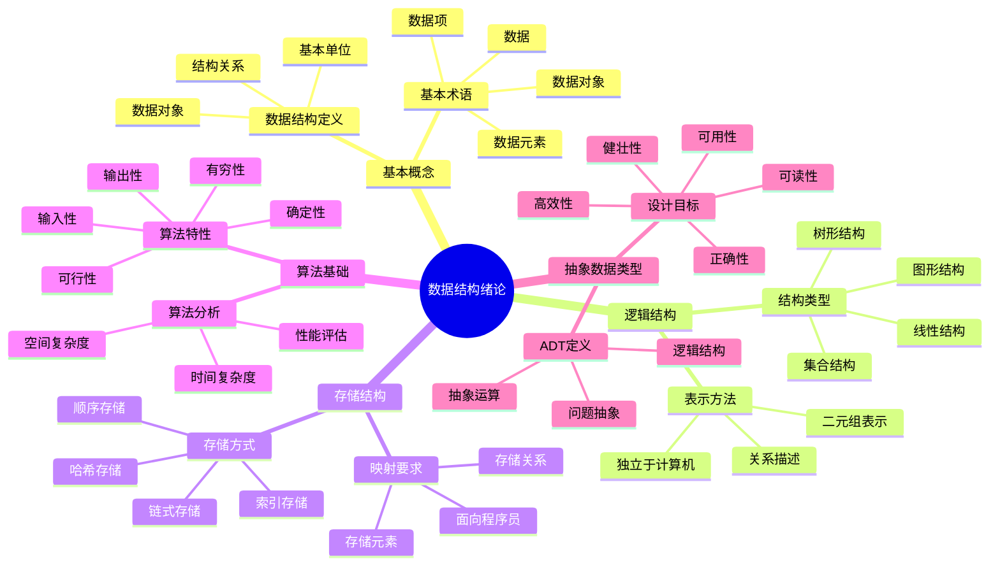

# 数据结构绪论详解

**课程来源**: 数据结构与算法  
**适用专业**: 计算机科学与技术、软件工程  
**整理时间**: 2024-10-13

## 📊 知识体系思维导图



---

## 第一部分：数据结构基本概念

### 1.1 什么是数据结构

**定义**: 数据结构是带有结构的数据元素的集合，它指的是所涉及的数据元素以及它们之间的关系。

$$\text{数据结构} = \text{数据对象} + \text{结构}$$

> **💡 核心思想**: 数据结构不仅关注数据本身，更重要的是数据之间的关系和组织方式。
> 
> **🔧 解决问题的步骤**: 
> 1. 分析问题，确定数据模型
> 2. 设计相应的算法
> 3. 编写、运行并调试程序
> 
> **❓ 为什么需要数据结构**: 合适的数据结构能够提高算法效率，简化程序设计，是程序设计的基础。

### 1.2 基本概念术语

| 术语 | 定义 | 举例 |
|------|------|------|
| **数据** | 能输入到计算机中并被程序处理的符号集合 | 数字、字符、图像、声音 |
| **数据元素** | 数据的基本单位，通常作为一个整体处理 | 学生记录、员工信息 |
| **数据项** | 具有独立含义的数据最小单位，也称为域 | 学号、姓名、年龄 |
| **数据对象** | 性质相同的有限个数据元素的集合 | 所有学生、所有整数 |

> **💡 层次关系**: 数据 ⊃ 数据对象 ⊃ 数据元素 ⊃ 数据项
> 
> **🔧 实际理解**: 
> - 数据项是原子级别，不可再分
> - 数据元素由若干数据项组成
> - 数据对象是同类数据元素的集合
> - 数据是所有信息的总称

### 1.3 数据结构的三个方面

数据结构研究的核心内容包括三个方面：

#### 1.3.1 逻辑结构
**定义**: 指数据元素之间的逻辑关系，独立于计算机。

**表示方法**: 通常用二元组 B=(D, R) 表示
- D: 数据元素的集合
- R: 关系的集合

#### 1.3.2 存储结构（物理结构）
**定义**: 指数据元素及其关系在计算机存储器中的存储方式。

#### 1.3.3 数据运算
**定义**: 指施加在该数据上的操作。
- 运算的定义基于逻辑结构
- 运算的实现基于存储结构

---

## 第二部分：逻辑结构分类

### 2.1 逻辑结构的四种基本类型

#### 2.1.1 集合结构
**特点**: 元素之间除了"同属于一个集合"外，没有其他关系。

```
{a, b, c, d}  // 元素间无特定关系
```

#### 2.1.2 线性结构
**特点**: 有且仅有一个开始元素和终端元素，所有元素最多只有一个前驱和一个后继。

```
a → b → c → d  // 一对一的线性关系
```

**典型例子**: 数组、链表、栈、队列

#### 2.1.3 树形结构
**特点**: 有且仅有一个开始元素（根结点），但可以有多个终端元素。除根结点外，每个元素有且仅有一个前驱，但可以有多个后继。

```
    a
   / \
  b   c
 /   / \
d   e   f
```

**典型例子**: 二叉树、B树、堆

#### 2.1.4 图形结构
**特点**: 每个元素可以有多个前驱和多个后继。

```
  a ←→ b
  ↕   ↗ ↕
  c ←→ d
```

**典型例子**: 无向图、有向图、网络

> **💡 结构复杂度递增**: 集合 < 线性 < 树形 < 图形
> 
> **🔧 选择原则**: 根据问题的实际关系选择合适的逻辑结构

---

## 第三部分：存储结构

### 3.1 存储结构的基本要求

将逻辑结构映射到存储器时，需要满足两个要求：
1. **存储所有元素**
2. **存储元素间的关系**

### 3.2 四种基本存储结构

#### 3.2.1 顺序存储结构
**特点**: 所有元素存放在一片地址连续的存储单元中，逻辑上相邻的元素在物理上也相邻。

```python
# 顺序存储示例
array = [a, b, c, d]  # 内存地址连续
# 地址: 1000, 1004, 1008, 1012
```

**优点**:
- 随机访问，时间复杂度O(1)
- 存储密度高，无额外指针开销
- 便于实现各种算法

**缺点**:
- 插入删除需要移动元素，时间复杂度O(n)
- 需要预分配空间，可能造成浪费

#### 3.2.2 链式存储结构
**特点**: 数据元素可以存放在任意的存储单元中，通过指针来反映元素间的逻辑关系。

```python
# 链式存储示例
class Node:
    def __init__(self, data):
        self.data = data    # 数据域
        self.next = None    # 指针域

# a → b → c → d → NULL
```

**优点**:
- 插入删除方便，时间复杂度O(1)
- 动态分配空间，无空间浪费
- 适合频繁修改的场景

**缺点**:
- 不支持随机访问，查找时间复杂度O(n)
- 需要额外指针空间，存储密度低
- 指针操作复杂，容易出错

#### 3.2.3 索引存储结构
**特点**: 建立索引表，通过索引快速定位数据。

```python
# 索引存储示例
index_table = [
    (key1, address1),
    (key2, address2),
    (key3, address3)
]
```

#### 3.2.4 哈希（散列）存储结构
**特点**: 通过哈希函数计算存储地址。

```python
# 哈希存储示例
def hash_function(key):
    return key % table_size

address = hash_function(key)
```

---

## 第四部分：抽象数据类型(ADT)

### 4.1 数据类型与抽象数据类型

**数据类型**: 是一组性质相同的值的集合和定义在此集合上的一组操作的总称。

**抽象数据类型(ADT)**: 指从问题中抽象出的数据逻辑结构和运算，不考虑具体实现。

$$\text{ADT} = \text{逻辑结构} + \text{抽象运算}$$

### 4.2 ADT的描述格式

```
ADT 抽象数据类型名 {
    数据对象: <数据对象的定义>
    数据关系: <数据关系的定义>  
    基本操作: <基本操作的定义>
} ADT 抽象数据类型名
```

**示例：线性表ADT**
```
ADT List {
    数据对象: D = {ai | ai ∈ ElemSet, i=1,2,...,n, n≥0}
    数据关系: R1 = {<ai-1, ai> | ai-1, ai ∈ D, i=2,...,n}
    基本操作:
        InitList(&L)
        ListInsert(&L, i, e)
        ListDelete(&L, i, &e)
        ListLength(L)
        GetElem(L, i)
} ADT List
```

---

## 第五部分：算法基础

### 5.1 算法的定义与特性

**定义**: 算法是对特定问题求解步骤的一种描述，是指令的有限序列。

**五个重要特性**:

| 特性 | 含义 | 说明 |
|------|------|------|
| **有穷性** | 算法在执行有限步骤后会自动结束 | 不会无限循环 |
| **确定性** | 算法的每一步都有确定的含义 | 不会出现二义性 |
| **可行性** | 每一步都可以通过基本运算完成 | 在有限时间内完成 |
| **输入性** | 算法有零个或多个输入 | 外部提供的数据 |
| **输出性** | 算法至少有一个或多个输出 | 处理结果 |

> **💡 算法vs程序**: 
> - 算法是解决问题的方法和步骤
> - 程序是算法在特定语言中的实现
> - 算法更抽象，程序更具体

### 5.2 算法设计目标

**五个设计目标**:
1. **正确性**: 算法能够正确解决问题
2. **可使用性**: 算法易于理解和使用
3. **可读性**: 代码清晰，便于维护
4. **健壮性**: 能处理异常情况
5. **高效性**: 时间性能好，存储需求低

---

## 第六部分：算法分析

### 6.1 时间复杂度分析

#### 6.1.1 算法频度T(n)
**定义**: 一个算法中所有原操作的执行次数，T(n)与算法的执行时间成正比。

#### 6.1.2 时间复杂度O(f(n))
**定义**: 为了便于比较，通常只关注T(n)的最高阶，忽略低阶项和常系数。

$$T(n) = O(f(n))$$

**示例**:
```python
# 算法频度分析示例
def example_algorithm(n):
    count = 0                    # 1次
    for i in range(n):          # n次
        for j in range(n):      # n²次
            count += 1          # n²次
    return count                # 1次

# T(n) = 1 + n + n² + n² + 1 = 2n² + n + 2
# 时间复杂度: O(n²)
```

#### 6.1.3 常见时间复杂度

按效率从高到低排序：
$$O(1) < O(\log_2 n) < O(n) < O(n\log_2 n) < O(n^2) < O(n^3) < O(2^n) < O(n!)$$

| 复杂度 | 名称 | 示例算法 |
|--------|------|----------|
| O(1) | 常数阶 | 数组按索引访问 |
| O(log n) | 对数阶 | 二分查找 |
| O(n) | 线性阶 | 线性查找 |
| O(n log n) | 线性对数阶 | 归并排序、快速排序 |
| O(n²) | 平方阶 | 冒泡排序、选择排序 |
| O(2ⁿ) | 指数阶 | 汉诺塔问题 |

#### 6.1.4 最好、最坏和平均时间复杂度

- **最好时间复杂度**: 算法在最理想情况下的执行时间
- **最坏时间复杂度**: 算法在最不利情况下的执行时间  
- **平均时间复杂度**: 所有可能输入的期望运行时间

**示例：线性查找**
```python
def linear_search(arr, target):
    for i in range(len(arr)):
        if arr[i] == target:
            return i
    return -1

# 最好情况：O(1) - 第一个元素就是目标
# 最坏情况：O(n) - 目标在最后或不存在
# 平均情况：O(n/2) = O(n)
```

### 6.2 空间复杂度分析

**定义**: 算法在运行过程中临时占用的存储空间大小的量度。

$$S(n) = O(g(n))$$

**分析要点**:
- 只考察算法临时变量所占空间
- 不包括输入数据所占空间
- 不包括程序代码所占空间

**示例**:
```python
def recursive_factorial(n):
    if n <= 1:
        return 1
    return n * recursive_factorial(n-1)

# 空间复杂度：O(n) - 递归调用栈深度为n
```

---

## 📖 考试宝典

### 🔥 高频考点总结

#### 1. **基本概念辨析**（必考，15-20分）
- **数据结构定义**：数据对象 + 结构关系
- **基本术语**：数据、数据元素、数据项、数据对象的区别
- **三个方面**：逻辑结构、存储结构、数据运算
- **ADT概念**：抽象数据类型的组成要素

#### 2. **逻辑结构分类**（必考，10-15分）
- **四种类型**：集合、线性、树形、图形结构
- **特点对比**：前驱后继关系的不同
- **典型实例**：每种结构的代表性数据结构
- **复杂度递增**：结构复杂程度的递增关系

#### 3. **存储结构分析**（常考，15-20分）
- **四种方式**：顺序、链式、索引、哈希存储
- **优缺点对比**：时间空间性能的权衡
- **适用场景**：根据应用需求选择存储方式
- **实现细节**：各种存储方式的具体实现

#### 4. **算法分析**（必考，20-25分）
- **时间复杂度**：大O记号、常见复杂度等级
- **空间复杂度**：临时空间的计算方法
- **复杂度计算**：循环、递归算法的分析方法
- **最好最坏平均**：三种情况的区别和计算

#### 5. **算法特性**（常考，8-12分）
- **五个特性**：有穷性、确定性、可行性、输入性、输出性
- **设计目标**：正确性、可用性、可读性、健壮性、高效性
- **评价标准**：算法好坏的判断依据

### ⚡ 快速解题技巧

1. **看到"逻辑结构"** → 想到四种基本类型
2. **看到"存储结构"** → 想到顺序vs链式的权衡
3. **看到"时间复杂度"** → 想到循环嵌套层数
4. **看到"空间复杂度"** → 想到递归深度或辅助数组
5. **看到"ADT"** → 想到逻辑结构+抽象运算
6. **看到"算法特性"** → 想到五个基本特性
7. **看到"最坏情况"** → 想到最不利的输入

### 🎯 标准答题模板

#### **概念辨析题标准格式**：
1. **明确定义**（准确说出概念的定义）
2. **关键特征**（列出概念的主要特点）
3. **举例说明**（用具体例子加深理解）
4. **对比分析**（与相关概念进行比较）

#### **复杂度分析题标准格式**：
1. **确定基本操作**（找出算法中的关键操作）
2. **分析执行次数**（计算基本操作的执行频度）
3. **求出复杂度**（用大O记号表示）
4. **考虑不同情况**（最好、最坏、平均情况）

---

## ⚠️ 易错点数据库

### 🚨 概念类易错点

#### 1. **数据结构定义理解错误**
- ❌ **错误**：认为数据结构就是数据的存储方式
- ✅ **正确**：数据结构 = 数据对象 + 结构关系
- **易错原因**：忽略了结构关系的重要性

#### 2. **逻辑结构与存储结构混淆**
- ❌ **错误**：认为数组就是线性结构
- ✅ **正确**：数组是线性结构的顺序存储实现
- **关键区别**：逻辑结构是抽象的，存储结构是具体的

#### 3. **ADT理解错误**
- ❌ **错误**：认为ADT就是数据类型
- ✅ **正确**：ADT强调抽象，不考虑具体实现
- **核心特点**：逻辑结构 + 抽象运算

#### 4. **算法特性记忆错误**
- ❌ **错误**：遗漏某个特性或理解错误
- ✅ **正确**：五个特性缺一不可
- **记忆技巧**：有穷确定可行，输入输出齐全

### 🚨 分析类易错点

#### 1. **时间复杂度计算错误**
- ❌ **错误**：T(n) = n² + n + 1，所以O(n² + n + 1)
- ✅ **正确**：只保留最高阶项，O(n²)
- **注意事项**：忽略低阶项和常系数

#### 2. **循环嵌套分析错误**
- ❌ **错误**：两层循环就是O(n²)
- ✅ **正确**：要看循环变量的变化范围
- **分析方法**：仔细分析每层循环的执行次数

#### 3. **递归复杂度分析错误**
- ❌ **错误**：只看递归调用次数
- ✅ **正确**：要考虑每次调用的工作量
- **分析技巧**：画出递归树，分析总工作量

#### 4. **空间复杂度理解错误**
- ❌ **错误**：把输入数据空间也算进去
- ✅ **正确**：只算算法运行时的额外空间
- **注意区分**：输入空间 vs 辅助空间

### 🎯 应用类易错点

#### 1. **存储结构选择错误**
- **问题**：不根据应用场景选择合适的存储结构
- **解决**：分析操作特点，权衡时间空间性能

#### 2. **算法设计目标理解偏差**
- **问题**：只关注正确性，忽略其他目标
- **解决**：综合考虑五个设计目标

#### 3. **复杂度分析不全面**
- **问题**：只分析时间复杂度，忽略空间复杂度
- **解决**：时间空间复杂度都要考虑

---

## 📋 速查手册

### 🔧 核心概念速查表

| 概念 | 定义 | 关键特征 |
|------|------|----------|
| **数据结构** | 数据对象 + 结构关系 | 不仅有数据，更有关系 |
| **逻辑结构** | 数据元素间的逻辑关系 | 独立于计算机，面向用户 |
| **存储结构** | 数据在内存中的存储方式 | 依赖于计算机，面向程序员 |
| **ADT** | 逻辑结构 + 抽象运算 | 强调抽象，不考虑实现 |
| **算法** | 解决问题的步骤序列 | 有穷、确定、可行、有输入输出 |

### 📊 逻辑结构分类速查表

| 结构类型 | 关系特点 | 典型例子 | 前驱后继 |
|---------|----------|----------|----------|
| **集合结构** | 无特定关系 | 数学集合 | 无 |
| **线性结构** | 一对一关系 | 数组、链表、栈、队列 | 最多一个前驱和后继 |
| **树形结构** | 一对多关系 | 二叉树、B树 | 一个前驱，多个后继 |
| **图形结构** | 多对多关系 | 图、网络 | 多个前驱和后继 |

### 🔢 时间复杂度等级速查表

| 复杂度 | 名称 | n=10 | n=100 | n=1000 | 典型算法 |
|--------|------|------|-------|--------|----------|
| O(1) | 常数阶 | 1 | 1 | 1 | 数组访问 |
| O(log n) | 对数阶 | 3 | 7 | 10 | 二分查找 |
| O(n) | 线性阶 | 10 | 100 | 1000 | 线性查找 |
| O(n log n) | 线性对数阶 | 30 | 700 | 10000 | 归并排序 |
| O(n²) | 平方阶 | 100 | 10000 | 1000000 | 冒泡排序 |
| O(2ⁿ) | 指数阶 | 1024 | 2¹⁰⁰ | 2¹⁰⁰⁰ | 汉诺塔 |

### ⏰ 解题时间分配建议

| **题型** | **建议时间** | **关键步骤** |
|---------|-------------|-------------|
| **概念选择题** | 2-3分钟 | 准确理解概念，排除干扰项 |
| **结构分类题** | 3-5分钟 | 分析元素间关系特点 |
| **复杂度计算** | 8-12分钟 | 找基本操作，分析执行次数 |
| **ADT设计题** | 10-15分钟 | 明确数据对象、关系、运算 |
| **算法分析题** | 15-20分钟 | 全面分析时间空间复杂度 |

### 🎯 考前必背清单

#### **基本概念必背**
- 数据结构 = 数据对象 + 结构
- 三个方面：逻辑结构、存储结构、数据运算
- 四种逻辑结构：集合、线性、树形、图形
- 四种存储结构：顺序、链式、索引、哈希

#### **算法特性必背**
- 有穷性：有限步骤后结束
- 确定性：每步含义确定
- 可行性：基本运算可完成
- 输入性：零个或多个输入
- 输出性：一个或多个输出

#### **复杂度分析必背**
- 时间复杂度：T(n) = O(f(n))
- 空间复杂度：S(n) = O(g(n))
- 常见等级：O(1) < O(log n) < O(n) < O(n²) < O(2ⁿ)
- 分析方法：找基本操作，计算执行次数

#### **检查要点**
- [ ] 概念定义是否准确
- [ ] 逻辑结构分类是否正确
- [ ] 存储结构特点是否清楚
- [ ] 复杂度分析是否完整
- [ ] 算法特性是否齐全

---

## 💪 分层次例题体系

### 🟢 第一层：基础理解题（送分题，必须全对）

#### 例题1-1：基本概念辨析
**【题目】** 关于数据结构，下列说法正确的是（ ）
A. 数据结构就是数据的存储结构
B. 数据结构 = 数据对象 + 结构
C. 逻辑结构就是存储结构
D. 数据结构只研究数据元素

**【标准解答】** B

**【解题要点】**
- 数据结构包含数据对象和结构关系两部分
- 逻辑结构和存储结构是不同层面的概念
- 数据结构研究数据元素及其关系
- 存储结构只是数据结构的一个方面

#### 例题1-2：逻辑结构分类
**【题目】** 下列数据结构中，属于线性结构的是（ ）
A. 二叉树  B. 图  C. 栈  D. 集合

**【标准解答】** C

**【解题要点】**
- 线性结构：一对一关系，有唯一前驱和后继
- 栈是线性结构的特殊形式（受限的线性表）
- 二叉树是树形结构（一对多关系）
- 图是图形结构（多对多关系）
- 集合是集合结构（无特定关系）

#### 例题1-3：算法特性判断
**【题目】** 算法必须具备的特性不包括（ ）
A. 有穷性  B. 确定性  C. 高效性  D. 可行性

**【标准解答】** C

**【解题要点】**
- 算法的五个基本特性：有穷性、确定性、可行性、输入性、输出性
- 高效性是算法设计的目标，不是必备特性
- 即使效率不高，只要满足五个特性就是算法

### 🟡 第二层：应用计算题（拉开差距）

#### 例题2-1：时间复杂度分析
**【题目】** 分析下列算法的时间复杂度：

```python
def algorithm(n):
    count = 0
    i = 1
    while i <= n:
        j = 1
        while j <= i:
            count += 1
            j += 1
        i += 1
    return count
```

**【解题思路】**
分析嵌套循环的执行次数：

外层循环：i从1到n，执行n次
内层循环：j从1到i，执行i次

总执行次数：
$$T(n) = \sum_{i=1}^{n} i = \frac{n(n+1)}{2} = \frac{n^2 + n}{2}$$

**【标准解答】**
时间复杂度为O(n²)

**【分析要点】**
- 识别嵌套循环结构
- 分析每层循环的执行次数
- 计算总的执行次数
- 用大O记号表示复杂度

#### 例题2-2：存储结构选择
**【题目】** 对于以下应用场景，选择最合适的存储结构：
1. 频繁进行随机访问的数组操作
2. 需要频繁插入删除的动态列表
3. 需要快速查找的字典结构

**【解题思路】**
根据操作特点选择存储结构：

1. **频繁随机访问** → 顺序存储
   - 支持O(1)时间的随机访问
   - 内存连续，缓存友好

2. **频繁插入删除** → 链式存储
   - 插入删除操作O(1)时间
   - 动态分配，无空间浪费

3. **快速查找** → 哈希存储
   - 平均O(1)时间查找
   - 适合键值对存储

#### 例题2-3：ADT设计
**【题目】** 为"学生成绩管理"设计抽象数据类型。

**【解题思路】**
按照ADT标准格式设计：

```
ADT StudentGrade {
    数据对象: 
        D = {(id, name, score) | id∈StudentID, name∈String, score∈[0,100]}
    
    数据关系: 
        R = {<si, sj> | si, sj ∈ D, 按学号排序}
    
    基本操作:
        InitGrade(&G)           // 初始化成绩表
        AddStudent(&G, s)       // 添加学生成绩
        DeleteStudent(&G, id)   // 删除学生成绩
        UpdateScore(&G, id, score) // 更新成绩
        QueryStudent(G, id)     // 查询学生信息
        GetAverage(G)          // 计算平均分
        SortByScore(&G)        // 按成绩排序
} ADT StudentGrade
```

### 🔴 第三层：综合分析题（拔高题）

#### 例题3-1：复杂算法分析
**【题目】** 分析快速排序算法的时间复杂度，包括最好、最坏和平均情况。

**【深度分析】**
快速排序的递归关系分析：

**最好情况**：每次划分都均匀
- 递归关系：T(n) = 2T(n/2) + O(n)
- 解得：T(n) = O(n log n)

**最坏情况**：每次划分极不均匀（已排序数组）
- 递归关系：T(n) = T(n-1) + O(n)
- 解得：T(n) = O(n²)

**平均情况**：随机划分
- 数学期望分析：E[T(n)] = O(n log n)

```python
def quick_sort_analysis(arr, low, high):
    if low < high:
        # 划分操作：O(n)
        pivot = partition(arr, low, high)
        
        # 递归调用：取决于划分质量
        quick_sort_analysis(arr, low, pivot-1)    # T(k)
        quick_sort_analysis(arr, pivot+1, high)   # T(n-k-1)
    
    # 总时间：T(n) = T(k) + T(n-k-1) + O(n)
```

**【关键洞察】**
- 算法性能高度依赖于输入数据的特征
- 随机化可以避免最坏情况
- 实际应用中平均性能接近最好情况

#### 例题3-2：数据结构设计优化
**【题目】** 设计一个支持以下操作的数据结构，要求所有操作的时间复杂度都是O(1)：
- insert(x)：插入元素x
- delete(x)：删除元素x  
- getRandom()：等概率返回任意一个元素

**【创新解法】**
使用动态数组 + 哈希表的组合设计：

```python
class RandomizedSet:
    def __init__(self):
        self.data = []          # 动态数组存储元素
        self.indices = {}       # 哈希表：元素 → 索引
    
    def insert(self, x):
        """O(1)时间插入"""
        if x in self.indices:
            return False
        
        self.data.append(x)
        self.indices[x] = len(self.data) - 1
        return True
    
    def delete(self, x):
        """O(1)时间删除"""
        if x not in self.indices:
            return False
        
        # 关键技巧：与最后一个元素交换
        last_element = self.data[-1]
        idx = self.indices[x]
        
        # 交换元素
        self.data[idx] = last_element
        self.indices[last_element] = idx
        
        # 删除最后一个元素
        self.data.pop()
        del self.indices[x]
        return True
    
    def getRandom(self):
        """O(1)时间随机获取"""
        import random
        return random.choice(self.data)
```

**【设计思想】**
- **空间换时间**：用额外的哈希表换取O(1)删除
- **巧妙交换**：删除时与末尾元素交换，避免数组移动
- **随机访问**：数组支持O(1)随机访问

---

## 🏆 考试冲刺要点

### **必背概念**
1. 数据结构 = 数据对象 + 结构
2. 三个方面：逻辑结构、存储结构、数据运算
3. 四种逻辑结构及其特点
4. 算法的五个特性
5. ADT = 逻辑结构 + 抽象运算

### **必背分析方法**
1. 时间复杂度：找基本操作，分析执行次数
2. 空间复杂度：分析辅助空间使用
3. 最好最坏平均：考虑不同输入情况
4. 存储结构选择：根据操作特点权衡

### **解题技巧**
- 概念题：准确理解定义，注意细节差别
- 分析题：画图辅助，分步骤计算
- 设计题：先抽象再具体，考虑完整性
- 选择题：排除法，抓住关键特征

### **常见陷阱**
- 混淆逻辑结构与存储结构
- 复杂度分析不考虑最高阶
- 算法特性记忆不全
- ADT设计缺少某个要素

---

## 总结

数据结构绪论是整个课程的基础，它建立了数据结构研究的基本框架和分析方法。

**核心要点**:
1. **概念体系**：理解数据结构的基本概念和术语
2. **分类方法**：掌握逻辑结构和存储结构的分类
3. **分析工具**：学会算法复杂度的分析方法
4. **设计思想**：理解抽象数据类型的设计理念

通过系统学习绪论内容，为后续学习各种具体的数据结构和算法奠定坚实的理论基础。掌握这些基本概念和分析方法，是成为优秀程序员的必备素养。
