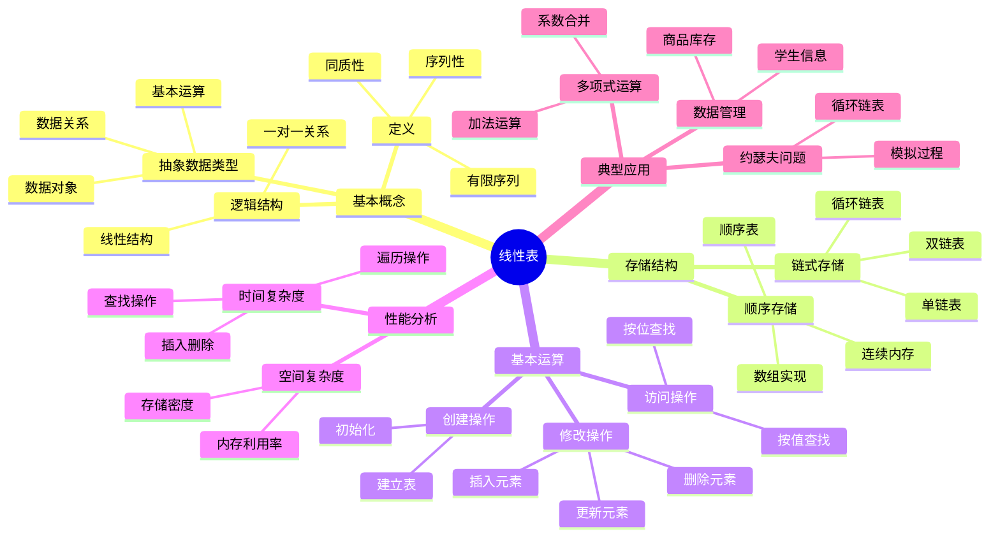

# 线性表详解

**课程来源**: 数据结构与算法  
**适用专业**: 计算机科学与技术、软件工程  
**整理时间**: 2024-10-13

## 📊 知识体系思维导图



---

## 第一部分：线性表基本概念

### 1.1 线性表的定义

**定义**: 线性表是具有相同特性的数据元素的一个有限序列。

> **💡 核心特征**: 
> - **有限性**: 线性表由有限个数据元素构成
> - **同质性**: 所有数据元素类型相同
> - **序列性**: 数据元素与位置相关，每个元素都有唯一的序号
> 
> **🔧 逻辑结构表示**: 
> (a₀, a₁, …, aᵢ, aᵢ₊₁, …, aₙ₋₁)
> 
> **❓ 为什么叫"线性"**: 因为数据元素之间存在一对一的线性关系，除了第一个和最后一个元素外，每个元素都有唯一的前驱和后继。

### 1.2 线性表的抽象数据类型(ADT)

**数据对象**: D = {aᵢ | 0 ≤ i ≤ n-1, n ≥ 0}

**数据关系**: r = {<aᵢ, aᵢ₊₁> | aᵢ, aᵢ₊₁ ∈ D, i = 0, …, n-2}

**基本运算**:

| 运算 | 功能描述 | 时间复杂度 |
|------|----------|------------|
| CreateList(a) | 由数组a建立线性表 | O(n) |
| Add(e) | 在表末尾添加元素e | O(1) |
| getsize() | 求线性表长度 | O(1) |
| GetElem(i) | 获取序号为i的元素 | O(1)/O(n) |
| SetElem(i, e) | 设置序号为i的元素值 | O(1)/O(n) |
| GetNo(e) | 查找值为e的元素序号 | O(n) |
| Insert(i, e) | 在序号i处插入元素e | O(n) |
| Delete(i) | 删除序号为i的元素 | O(n) |
| display() | 输出所有元素 | O(n) |

---

## 第二部分：顺序存储结构

### 2.1 顺序表的结构与实现

**定义**: 顺序表使用一段地址连续的存储单元依次存储线性表的数据元素。

```python
class SqList:                    # 顺序表类
    def __init__(self):          # 构造方法
        self.initcapacity = 5    # 初始容量
        self.capacity = self.initcapacity  # 当前容量
        self.data = [None] * self.capacity  # 存储数组
        self.size = 0            # 当前元素个数
    
    def GetElem(self, i):        # 获取元素
        if 0 <= i < self.size:
            return self.data[i]
        else:
            raise IndexError("索引超出范围")
    
    def Insert(self, i, e):      # 插入元素
        if self.size >= self.capacity:
            self._resize()       # 扩容
        
        # 元素后移
        for j in range(self.size, i, -1):
            self.data[j] = self.data[j-1]
        
        self.data[i] = e
        self.size += 1
    
    def Delete(self, i):         # 删除元素
        if 0 <= i < self.size:
            # 元素前移
            for j in range(i, self.size-1):
                self.data[j] = self.data[j+1]
            self.size -= 1
        else:
            raise IndexError("索引超出范围")
```

> **💡 存储特点**: 
> - **随机访问**: 可以通过下标直接访问任意元素
> - **存储密度高**: 存储密度为1（无额外指针开销）
> - **内存连续**: 便于CPU缓存优化
> 
> **🔧 扩容策略**: 
> - 当数组满时，通常扩容为原来的1.5倍或2倍
> - 扩容操作的平均时间复杂度为O(1)（摊还分析）

### 2.2 顺序表的基本运算

#### 2.2.1 插入运算分析

**算法步骤**:
1. 判断插入位置是否合法
2. 判断是否需要扩容
3. 将插入位置及之后的元素后移
4. 在指定位置插入新元素
5. 表长度加1

**时间复杂度分析**:
- 最好情况：在表尾插入，O(1)
- 最坏情况：在表头插入，O(n)
- 平均情况：O(n/2) = O(n)

#### 2.2.2 删除运算分析

**算法步骤**:
1. 判断删除位置是否合法
2. 将删除位置之后的元素前移
3. 表长度减1

**时间复杂度分析**:
- 最好情况：删除表尾元素，O(1)
- 最坏情况：删除表头元素，O(n)
- 平均情况：O(n/2) = O(n)

---

## 第三部分：链式存储结构

### 3.1 单链表

**定义**: 通过一系列结点来存储元素，每个结点包含数据域和指针域。

```python
class LinkNode:                  # 单链表结点类
    def __init__(self, data=None):
        self.data = data         # 数据域
        self.next = None         # 指针域

class LinkList:                  # 单链表类
    def __init__(self):
        self.head = LinkNode()   # 头结点（哑结点）
        self.head.next = None
    
    def CreateListF(self, a):    # 头插法建表
        for x in a:
            s = LinkNode(x)
            s.next = self.head.next
            self.head.next = s
    
    def CreateListR(self, a):    # 尾插法建表
        t = self.head           # t指向尾结点
        for x in a:
            s = LinkNode(x)
            t.next = s
            t = s
    
    def GetElem(self, i):       # 按位查找
        p = self.head.next
        j = 0
        while p is not None and j < i:
            p = p.next
            j += 1
        return p.data if p else None
    
    def Insert(self, i, e):     # 插入元素
        p = self.head
        j = 0
        # 找到第i-1个结点
        while p is not None and j < i:
            p = p.next
            j += 1
        
        if p is None:
            raise IndexError("插入位置不合法")
        
        s = LinkNode(e)
        s.next = p.next
        p.next = s
```

> **💡 链表特点**: 
> - **动态分配**: 内存按需分配，无需预先确定大小
> - **插入删除高效**: 在已知位置插入/删除只需O(1)时间
> - **存储密度低**: 需要额外的指针空间
> 
> **🔧 头结点的作用**: 
> - 简化边界条件处理
> - 统一插入删除操作
> - 避免特殊处理第一个结点

### 3.2 双链表

**定义**: 每个结点有两个指针域，分别指向前驱和后继结点。

```python
class DLinkNode:                 # 双链表结点类
    def __init__(self, data=None):
        self.data = data         # 数据域
        self.next = None         # 后继指针
        self.prior = None        # 前驱指针

class DLinkList:                 # 双链表类
    def __init__(self):
        self.head = DLinkNode()  # 头结点
        self.head.next = None
        self.head.prior = None
    
    def Insert(self, i, e):      # 插入元素
        p = self.head
        j = 0
        while p.next is not None and j < i:
            p = p.next
            j += 1
        
        s = DLinkNode(e)
        s.next = p.next
        if p.next is not None:
            p.next.prior = s
        s.prior = p
        p.next = s
```

### 3.3 循环链表

**定义**: 最后一个结点的指针指向第一个结点，形成环形结构。

**应用案例：约瑟夫问题**

```python
def Josephus(n, m):              # 约瑟夫问题求解
    # 建立循环单链表
    head = LinkNode(1)
    p = head
    for i in range(2, n+1):
        s = LinkNode(i)
        p.next = s
        p = s
    p.next = head               # 形成环
    
    # 模拟报数过程
    p = head
    while p.next != p:          # 当只剩一个结点时停止
        # 报数m-1次
        for i in range(m-1):
            p = p.next
        
        # 删除报数为m的结点
        print(f"出列: {p.next.data}")
        p.next = p.next.next
    
    print(f"最后剩余: {p.data}")
```

---

## 第四部分：性能比较与选择

### 4.1 时间复杂度比较

| 操作 | 顺序表 | 单链表 | 说明 |
|------|--------|--------|------|
| **按位查找** | O(1) | O(n) | 顺序表支持随机访问 |
| **按值查找** | O(n) | O(n) | 都需要顺序遍历 |
| **插入操作** | O(n) | O(1)* | *链表需先找到位置 |
| **删除操作** | O(n) | O(1)* | *链表需先找到位置 |
| **遍历操作** | O(n) | O(n) | 时间复杂度相同 |

### 4.2 空间复杂度比较

| 特性 | 顺序表 | 链表 |
|------|--------|------|
| **存储密度** | 1 | < 1 |
| **内存利用** | 可能浪费 | 按需分配 |
| **额外开销** | 无 | 指针空间 |

### 4.3 选择原则

**选择顺序表的情况**:
- 频繁进行随机访问
- 对存储空间要求严格
- 表长度相对稳定
- 主要操作是查找

**选择链表的情况**:
- 频繁进行插入删除操作
- 表长度变化很大
- 不需要随机访问
- 内存空间充足

---

## 📖 考试宝典

### 🔥 高频考点总结

#### 1. **线性表基本概念**（必考，15-20分）
- **定义特征**：有限性、同质性、序列性
- **逻辑结构**：线性结构，一对一关系
- **基本运算**：增删改查操作及其复杂度
- **抽象数据类型**：ADT的三要素

#### 2. **顺序表存储结构**（必考，20-25分）
- **存储方式**：连续内存空间，数组实现
- **基本运算实现**：插入、删除算法及复杂度分析
- **扩容机制**：动态数组的扩容策略
- **优缺点分析**：随机访问vs插入删除效率

#### 3. **链表存储结构**（必考，25-30分）
- **单链表**：结点结构、基本运算实现
- **双链表**：双向指针的优势和实现
- **循环链表**：环形结构的特点和应用
- **建表方法**：头插法vs尾插法的区别

#### 4. **算法设计与分析**（常考，15-20分）
- **时间复杂度分析**：最好、最坏、平均情况
- **空间复杂度分析**：存储密度、额外空间
- **算法优化**：减少元素移动、提高效率
- **应用问题**：多项式运算、约瑟夫问题

#### 5. **比较与选择**（常考，10-15分）
- **性能对比**：时间、空间复杂度比较
- **适用场景**：根据应用需求选择存储结构
- **优缺点分析**：各种存储结构的特点
- **实际应用**：具体问题的结构选择

### ⚡ 快速解题技巧

1. **看到"随机访问"** → 想到顺序表O(1)查找
2. **看到"频繁插入删除"** → 想到链表O(1)操作
3. **看到"头插法"** → 想到元素顺序相反
4. **看到"尾插法"** → 想到需要尾指针
5. **看到"循环问题"** → 想到循环链表
6. **看到"双向遍历"** → 想到双链表
7. **看到"约瑟夫问题"** → 想到循环链表模拟

### 🎯 标准答题模板

#### **线性表算法设计题标准格式**：
1. **分析问题**（理解题意，确定输入输出）
2. **选择结构**（根据操作特点选择存储结构）
3. **设计算法**（写出伪代码或程序代码）
4. **复杂度分析**（分析时间和空间复杂度）
5. **算法验证**（举例验证算法正确性）

---

## ⚠️ 易错点数据库

### 🚨 概念类易错点

#### 1. **线性表定义理解错误**
- ❌ **错误**：认为线性表就是数组
- ✅ **正确**：线性表是逻辑结构，可以用不同物理结构实现
- **易错原因**：混淆逻辑结构与存储结构

#### 2. **头结点作用理解错误**
- ❌ **错误**：认为头结点存储第一个数据元素
- ✅ **正确**：头结点是哑结点，不存储数据，简化操作
- **关键点**：头结点的next指针指向第一个数据结点

#### 3. **时间复杂度分析错误**
- ❌ **错误**：认为链表插入删除总是O(1)
- ✅ **正确**：链表插入删除在已知位置时是O(1)，查找位置需要O(n)
- **注意**：要区分"在已知位置"和"在指定位置"

#### 4. **存储密度概念混淆**
- ❌ **错误**：认为链表存储密度高
- ✅ **正确**：顺序表存储密度为1，链表存储密度小于1
- **原因**：链表需要额外的指针空间

### 🚨 编程实现易错点

#### 1. **数组越界错误**
- ❌ **错误**：不检查数组边界就访问元素
- ✅ **正确**：访问前检查索引范围 0 ≤ i < size
- **防范**：养成边界检查的习惯

#### 2. **链表指针操作错误**
- ❌ **错误**：s.next = p.next; p.next = s（可能丢失结点）
- ✅ **正确**：先保存p.next，再修改指针
- **技巧**：画图辅助理解指针操作

#### 3. **内存泄漏问题**
- ❌ **错误**：删除结点后不释放内存
- ✅ **正确**：删除结点后及时释放内存
- **注意**：Python有垃圾回收，但C/C++需要手动释放

#### 4. **循环链表判断条件错误**
- ❌ **错误**：用p != NULL作为循环条件
- ✅ **正确**：用p.next != head作为循环条件
- **关键**：理解循环链表的终止条件

### 🎯 算法设计易错点

#### 1. **插入位置理解错误**
- **问题**：混淆"在第i个位置插入"和"插入后成为第i个元素"
- **解决**：明确题目要求，统一编号规则（从0开始或从1开始）

#### 2. **边界条件处理不当**
- **问题**：忽略空表、单元素表等特殊情况
- **解决**：设计算法时考虑所有边界情况

#### 3. **算法效率优化忽视**
- **问题**：能用O(n)解决的问题用了O(n²)算法
- **解决**：分析问题特点，选择最优算法策略

---

## 📋 速查手册

### 🔧 核心操作复杂度速查表

| 操作类型 | 顺序表 | 单链表 | 双链表 | 循环链表 |
|---------|--------|--------|--------|----------|
| **按位查找** | O(1) | O(n) | O(n) | O(n) |
| **按值查找** | O(n) | O(n) | O(n) | O(n) |
| **头部插入** | O(n) | O(1) | O(1) | O(1) |
| **尾部插入** | O(1)* | O(n) | O(1)** | O(n) |
| **中间插入** | O(n) | O(n) | O(n) | O(n) |
| **头部删除** | O(n) | O(1) | O(1) | O(1) |
| **尾部删除** | O(1) | O(n) | O(1)** | O(n) |
| **中间删除** | O(n) | O(n) | O(n) | O(n) |

*需要动态数组支持  **需要尾指针

### 📊 存储结构特性对比表

| 特性 | 顺序表 | 链表 |
|------|--------|------|
| **存储方式** | 连续内存 | 离散内存 |
| **存储密度** | 1 | < 1 |
| **随机访问** | 支持 | 不支持 |
| **内存分配** | 静态/动态 | 动态 |
| **缓存友好** | 是 | 否 |
| **实现复杂度** | 简单 | 中等 |

### 🔢 常用算法模板

#### 顺序表插入模板
```python
def insert(self, i, e):
    if i < 0 or i > self.size:
        raise IndexError("插入位置不合法")
    
    if self.size >= self.capacity:
        self._resize()  # 扩容
    
    # 元素后移
    for j in range(self.size, i, -1):
        self.data[j] = self.data[j-1]
    
    self.data[i] = e
    self.size += 1
```

#### 链表插入模板
```python
def insert(self, i, e):
    p = self.head
    j = 0
    
    # 找到第i-1个结点
    while p is not None and j < i:
        p = p.next
        j += 1
    
    if p is None:
        raise IndexError("插入位置不合法")
    
    s = LinkNode(e)
    s.next = p.next
    p.next = s
```

### ⏰ 解题时间分配建议

| **题型** | **建议时间** | **关键步骤** |
|---------|-------------|-------------|
| **概念选择题** | 2-3分钟 | 理解概念，排除干扰 |
| **复杂度分析** | 5-8分钟 | 分析最好最坏平均情况 |
| **算法填空题** | 8-12分钟 | 理解算法逻辑，注意边界 |
| **算法设计题** | 15-25分钟 | 分析问题，设计算法，验证 |
| **综合应用题** | 20-30分钟 | 选择结构，完整实现 |

### 🎯 考前必背清单

#### **基本概念必背**
- 线性表三个特性：有限性、同质性、序列性
- ADT三要素：数据对象、数据关系、基本运算
- 存储密度 = 数据元素所占空间 / 结点所占空间

#### **复杂度必背**
- 顺序表：查找O(1)，插入删除O(n)
- 链表：查找O(n)，插入删除O(1)*（已知位置）
- 建表：头插法O(n)，尾插法O(n)

#### **算法要点必背**
- 顺序表插入：后移元素，注意扩容
- 顺序表删除：前移元素，注意边界
- 链表插入：先连后断，s.next=p.next; p.next=s
- 链表删除：保存结点，p.next=p.next.next

#### **应用场景必背**
- 频繁随机访问 → 顺序表
- 频繁插入删除 → 链表
- 需要双向遍历 → 双链表
- 循环处理 → 循环链表

---

## 💪 分层次例题体系

### 🟢 第一层：基础理解题（送分题，必须全对）

#### 例题1-1：基本概念辨析
**【题目】** 关于线性表，下列说法正确的是（ ）
A. 线性表的元素个数必须是固定的
B. 线性表中所有元素的数据类型必须相同
C. 线性表只能用数组来实现
D. 线性表的第一个元素没有前驱，最后一个元素没有后继

**【标准解答】** B、D

**【解题要点】**
- 线性表具有有限性，但长度可以变化
- 同质性要求所有元素类型相同
- 可以用顺序存储或链式存储实现
- 线性关系：除首尾元素外，每个元素有唯一前驱和后继

#### 例题1-2：时间复杂度分析
**【题目】** 对于长度为n的顺序表，在第i个位置插入一个元素的时间复杂度是（ ）
A. O(1)  B. O(i)  C. O(n-i)  D. O(n)

**【标准解答】** D

**【解题要点】**
- 需要移动第i到第n-1个位置的元素
- 移动元素个数为n-i
- 最坏情况在表头插入，移动n个元素
- 平均情况移动n/2个元素，仍为O(n)

#### 例题1-3：存储结构选择
**【题目】** 以下应用中最适合使用链表的是（ ）
A. 需要频繁按下标访问元素
B. 需要频繁在中间位置插入删除元素
C. 元素个数固定且需要节省存储空间
D. 需要对元素进行二分查找

**【标准解答】** B

**【解题要点】**
- A：顺序表支持O(1)随机访问
- B：链表插入删除效率高（已知位置时）
- C：顺序表存储密度高，更节省空间
- D：二分查找需要随机访问，适合顺序表

### 🟡 第二层：应用计算题（拉开差距）

#### 例题2-1：顺序表算法实现
**【题目】** 设计算法，将顺序表L中所有值为x的元素删除。

**【解题思路】**
使用双指针技术，避免多次移动元素：

```python
def delete_x(L, x):
    """删除顺序表中所有值为x的元素"""
    i = 0  # 慢指针，指向下一个要填入的位置
    j = 0  # 快指针，遍历整个数组
    
    while j < L.size:
        if L.data[j] != x:
            L.data[i] = L.data[j]
            i += 1
        j += 1
    
    L.size = i  # 更新表长
```

**【算法分析】**
- 时间复杂度：O(n)，只需遍历一次
- 空间复杂度：O(1)，原地操作
- 优势：避免了多次元素移动

#### 例题2-2：链表算法实现
**【题目】** 设计算法，将单链表L逆置。

**【解题思路】**
使用三个指针进行迭代逆置：

```python
def reverse_list(L):
    """逆置单链表"""
    if L.head.next is None:  # 空表
        return
    
    prev = None
    curr = L.head.next
    
    while curr is not None:
        next_temp = curr.next  # 保存下一个结点
        curr.next = prev       # 逆置指针
        prev = curr           # 移动prev
        curr = next_temp      # 移动curr
    
    L.head.next = prev        # 头结点指向新的第一个结点
```

**【算法分析】**
- 时间复杂度：O(n)
- 空间复杂度：O(1)
- 关键：保存下一个结点，避免链表断裂

#### 例题2-3：循环链表应用
**【题目】** 用循环链表解决约瑟夫问题：n个人围成圆圈，从第1个人开始报数，报到m的人出列，求最后剩余的人的编号。

**【解题思路】**
```python
def josephus(n, m):
    """约瑟夫问题求解"""
    # 建立循环链表
    head = LinkNode(1)
    p = head
    for i in range(2, n+1):
        s = LinkNode(i)
        p.next = s
        p = s
    p.next = head  # 形成环
    
    # 模拟报数过程
    p = head
    while p.next != p:  # 直到只剩一个结点
        # 找到第m-1个结点
        for i in range(m-2):
            p = p.next
        
        # 删除第m个结点
        print(f"出列: {p.next.data}")
        p.next = p.next.next
    
    return p.data  # 返回最后剩余的编号
```

### 🔴 第三层：综合分析题（拔高题）

#### 例题3-1：多项式相加算法
**【题目】** 用链表实现两个一元多项式的相加运算。

**【深度分析】**
多项式可以用链表表示，每个结点包含系数和指数：

```python
class PolyNode:
    def __init__(self, coef=0, exp=0):
        self.coef = coef  # 系数
        self.exp = exp    # 指数
        self.next = None

class Polynomial:
    def __init__(self):
        self.head = PolyNode()  # 头结点
    
    def add_poly(self, other):
        """多项式相加"""
        result = Polynomial()
        p1 = self.head.next
        p2 = other.head.next
        p3 = result.head
        
        while p1 and p2:
            if p1.exp > p2.exp:
                # p1的指数大，直接复制p1
                s = PolyNode(p1.coef, p1.exp)
                p3.next = s
                p3 = s
                p1 = p1.next
            elif p1.exp < p2.exp:
                # p2的指数大，直接复制p2
                s = PolyNode(p2.coef, p2.exp)
                p3.next = s
                p3 = s
                p2 = p2.next
            else:
                # 指数相等，系数相加
                coef_sum = p1.coef + p2.coef
                if coef_sum != 0:  # 系数不为0才保留
                    s = PolyNode(coef_sum, p1.exp)
                    p3.next = s
                    p3 = s
                p1 = p1.next
                p2 = p2.next
        
        # 处理剩余项
        while p1:
            s = PolyNode(p1.coef, p1.exp)
            p3.next = s
            p3 = s
            p1 = p1.next
        
        while p2:
            s = PolyNode(p2.coef, p2.exp)
            p3.next = s
            p3 = s
            p2 = p2.next
        
        return result
```

**【算法特点】**
- 时间复杂度：O(m+n)，m和n分别是两个多项式的项数
- 空间复杂度：O(m+n)，需要创建新的多项式
- 核心思想：类似于归并排序的合并过程

#### 例题3-2：复杂数据结构设计
**【题目】** 设计一个支持O(1)时间插入、删除和查找最小值的数据结构。

**【创新解法】**
使用辅助栈来维护最小值：

```python
class MinStack:
    def __init__(self):
        self.data_stack = []    # 数据栈
        self.min_stack = []     # 最小值栈
    
    def push(self, x):
        """插入元素"""
        self.data_stack.append(x)
        
        # 更新最小值栈
        if not self.min_stack or x <= self.min_stack[-1]:
            self.min_stack.append(x)
    
    def pop(self):
        """删除栈顶元素"""
        if not self.data_stack:
            return None
        
        x = self.data_stack.pop()
        
        # 如果删除的是最小值，同时更新最小值栈
        if x == self.min_stack[-1]:
            self.min_stack.pop()
        
        return x
    
    def get_min(self):
        """获取最小值"""
        return self.min_stack[-1] if self.min_stack else None
```

**【设计思想】**
- 空间换时间：用额外的栈空间换取O(1)的时间复杂度
- 同步维护：在主栈操作的同时维护最小值栈
- 优化策略：最小值栈只在必要时压入元素

---

## 🏆 考试冲刺要点

### **必背概念**
1. 线性表三特性：有限性、同质性、序列性
2. 存储结构：顺序存储vs链式存储
3. 时间复杂度：查找、插入、删除操作
4. 空间复杂度：存储密度、额外开销

### **必背算法**
1. 顺序表插入删除算法
2. 链表基本操作算法
3. 链表建表算法（头插法、尾插法）
4. 经典应用算法（逆置、合并、查找）

### **解题技巧**
- 画图辅助理解指针操作
- 注意边界条件处理
- 选择合适的存储结构
- 分析算法时间空间复杂度

### **常见陷阱**
- 混淆逻辑结构与存储结构
- 忽略头结点的作用
- 指针操作顺序错误
- 边界条件考虑不全

---

## 总结

线性表是数据结构的基础，掌握线性表的概念、存储结构和基本操作对后续学习至关重要。

**核心要点**:
1. **概念理解**：线性表是逻辑结构，可以有多种物理实现
2. **存储选择**：根据应用需求选择顺序存储或链式存储
3. **算法设计**：注重效率分析和边界条件处理
4. **实际应用**：将理论知识应用到具体问题求解中

通过系统学习和大量练习，能够熟练掌握线性表的各种操作，为学习更复杂的数据结构打下坚实基础。
