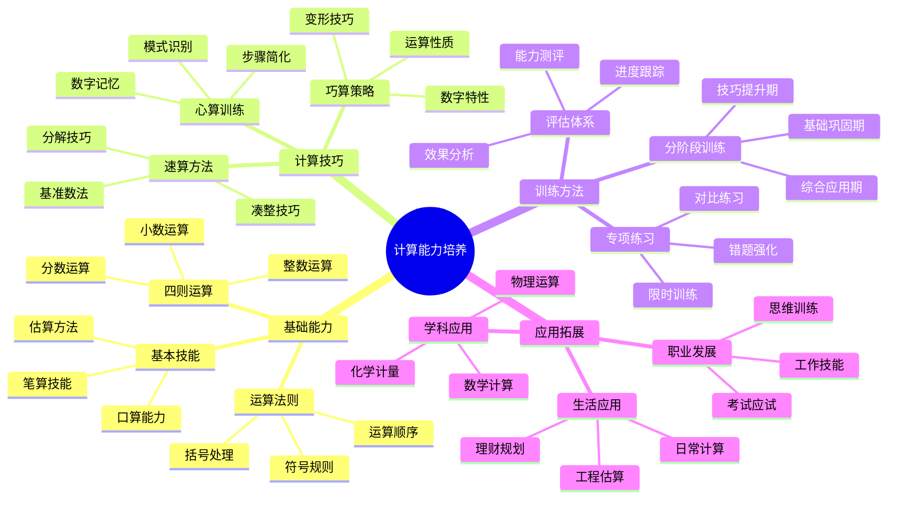

# 计算能力培养指南详解

**课程来源**: 数学基础能力训练  
**适用对象**: 大学生、高中生、数学学习者  
**整理时间**: 2024-10-13

## 📊 知识体系思维导图



---

## 第一部分：计算能力基础理论

### 1.1 计算能力的定义与重要性

**定义**: 计算能力是指准确、快速地进行数学运算的能力，包括基本运算、复杂计算和数值估算等多个层面。

> **💡 核心价值**: 
>
> - **学习基础**: 数学学习的基本功，影响后续所有数学课程
> - **思维工具**: 培养逻辑思维和数学直觉的重要途径
> - **实用技能**: 日常生活和工作中不可缺少的基本能力
>
> **🔧 能力构成**: 
> - **准确性**: 计算结果的正确率
> - **速度**: 完成计算的效率
> - **灵活性**: 选择合适方法的能力
> - **稳定性**: 在不同情况下保持水平的能力
>
> **❓ 为什么重要**: 计算能力是数学思维的载体，扎实的计算基础能够释放更多认知资源用于高层次思考。

### 1.2 计算能力发展阶段

**发展层次**:

| 阶段 | 特征 | 目标 | 评价标准 |
|------|------|------|----------|
| **机械运算** | 按步骤执行 | 准确完成基本运算 | 正确率>90% |
| **熟练运算** | 自动化处理 | 快速准确计算 | 速度+准确率 |
| **灵活运算** | 策略选择 | 优化计算路径 | 效率最大化 |
| **创造运算** | 方法创新 | 发现新的计算技巧 | 独创性应用 |

### 1.3 计算错误的类型与原因

**常见错误类型**:

#### 1.3.1 概念性错误
- 运算法则理解错误
- 数学概念混淆
- 符号意义不清

#### 1.3.2 程序性错误
- 运算步骤颠倒
- 中间过程遗漏
- 算法执行错误

#### 1.3.3 注意力错误
- 抄写数字错误
- 符号看错或写错
- 计算过程中分心

---

## 第二部分：基础运算能力训练

### 2.1 整数运算强化

#### 2.1.1 加法运算训练

**基础练习**:
```
单项训练（每日100题）：
123 + 456 = 579
789 + 234 = 1023
567 + 890 = 1457
345 + 678 = 1023
234 + 567 = 801

进阶训练（每日50题）：
12345 + 67890 = 80235
99999 + 11111 = 111110
87654 + 43210 = 130864
56789 + 98765 = 155554
13579 + 24680 = 38259

挑战训练（每日20题）：
123456 + 789012 = 912468
987654 + 321098 = 1308752
456789 + 654321 = 1111110
```

**加法速算技巧详解**:

**1. 凑整技巧**:
```
基本原理：将接近整十、整百的数先凑整，再调整
例1: 97 + 38 = (100-3) + 38 = 100 + 35 = 135
例2: 89 + 76 = (90-1) + 76 = 90 + 75 = 165
例3: 156 + 297 = 156 + (300-3) = 456 - 3 = 453
例4: 194 + 298 = (200-6) + (300-2) = 500 - 8 = 492

练习题组：
98 + 47 = ?    答案：145
89 + 56 = ?    答案：145
197 + 395 = ?  答案：592
296 + 198 = ?  答案：494
```

**2. 分组凑整法**:
```
多个数相加时的技巧
例：47 + 36 + 53 + 64 + 28 + 72
= (47+53) + (36+64) + (28+72)
= 100 + 100 + 100 = 300

练习：
25 + 38 + 75 + 62 + 19 + 81 = ?
答案：(25+75) + (38+62) + (19+81) = 100+100+100 = 300
```

**3. 基准数法**:
```
当多个数都接近某个基准数时使用
例：计算 98 + 97 + 99 + 101 + 103 + 102
以100为基准：6×100 + (-2-3-1+1+3+2) = 600 + 0 = 600

练习：
195 + 203 + 198 + 202 + 197 + 205 = ?
以200为基准：6×200 + (-5+3-2+2-3+5) = 1200 + 0 = 1200
```

**4. 左右脑协调训练**:
```
训练方法：
- 左手写被加数，右手写加数
- 同时进行两组加法运算
- 交替进行横式和竖式计算

例题：
组1：123 + 456    组2：789 + 234
组1：567 + 890    组2：345 + 678
```

#### 2.1.2 乘法运算训练

**基础乘法表扩展**:
```
标准乘法表熟练度测试（必须3秒内完成）:
7×8=56, 9×6=54, 8×7=56, 6×9=54, 9×9=81
8×8=64, 7×7=49, 6×6=36, 9×7=63, 8×9=72

扩展乘法表（11-19的乘法）:
11×11=121, 12×12=144, 13×13=169, 14×14=196, 15×15=225
16×16=256, 17×17=289, 18×18=324, 19×19=361

11的乘法规律：
11×12=132, 11×13=143, 11×14=154, 11×15=165
11×16=176, 11×17=187, 11×18=198, 11×19=209

特殊数字乘法专项训练:
25×4=100, 25×8=200, 25×12=300, 25×16=400
125×8=1000, 125×16=2000, 125×24=3000
```

**两位数乘法技巧详解**:

**1. 十字相乘法（标准方法）**:
```
原理：AB × CD = (A×C)×100 + (A×D + B×C)×10 + (B×D)

详细步骤：
23 × 45
步骤1：2×4=8 (百位)
步骤2：2×5+3×4=10+12=22 (十位)
步骤3：3×5=15 (个位)
步骤4：800+220+15=1035

练习题组：
34 × 26 = ?
步骤：3×2=6, 3×6+4×2=18+8=26, 4×6=24
结果：600+260+24=884

42 × 37 = ?
步骤：4×3=12, 4×7+2×3=28+6=34, 2×7=14
结果：1200+340+14=1554
```

**2. 接近整数的乘法技巧**:
```
当两数都接近某个整数时：
98×97 = (100-2)(100-3) = 10000-300-200+6 = 9506
102×103 = (100+2)(100+3) = 10000+300+200+6 = 10506

一般公式：(a+m)(a+n) = a² + a(m+n) + mn

练习：
99×98 = (100-1)(100-2) = 10000-200-100+2 = 9702
101×102 = (100+1)(100+2) = 10000+200+100+2 = 10302
```

**3. 平方数快速计算**:
```
尾数为5的平方：
25² = 2×(2+1)×100 + 25 = 2×3×100 + 25 = 625
35² = 3×(3+1)×100 + 25 = 3×4×100 + 25 = 1225
45² = 4×(4+1)×100 + 25 = 4×5×100 + 25 = 2025
65² = 6×(6+1)×100 + 25 = 6×7×100 + 25 = 4225

接近50的平方：
49² = (50-1)² = 2500 - 100 + 1 = 2401
51² = (50+1)² = 2500 + 100 + 1 = 2601
48² = (50-2)² = 2500 - 200 + 4 = 2304
52² = (50+2)² = 2500 + 200 + 4 = 2704
```

**4. 特殊数字乘法技巧**:
```
乘以11的技巧（两位数）：
23×11 = 2_3 → 2(2+3)3 = 253
47×11 = 4_7 → 4(4+7)7 = 4(11)7 = 517 (进位)
89×11 = 8_9 → 8(8+9)9 = 8(17)9 = 979 (进位)

乘以11的技巧（三位数）：
123×11 = 1_2_3 → 1(1+2)(2+3)3 = 1353
456×11 = 4_5_6 → 4(4+5)(5+6)6 = 4(9)(11)6 = 5016 (进位)

乘以25的技巧：
36×25 = 36×(100÷4) = 3600÷4 = 900
48×25 = 48×(100÷4) = 4800÷4 = 1200

乘以125的技巧：
24×125 = 24×(1000÷8) = 24000÷8 = 3000
56×125 = 56×(1000÷8) = 56000÷8 = 7000
```

#### 2.1.3 除法运算训练

**整除性判断**:
```
被2整除: 末位是偶数
被3整除: 各位数字和能被3整除
被4整除: 末两位能被4整除
被5整除: 末位是0或5
被9整除: 各位数字和能被9整除
```

**长除法详解与优化**:

**1. 长除法基本步骤**:
```
以 2847 ÷ 23 为例详细说明：

步骤分解：
    123
   ____
23)2847
   23↓     (23×1=23, 28-23=5)
   ---
    54     (下拉4，得54)
    46     (23×2=46, 54-46=8)
    ---
     87    (下拉7，得87)
     69    (23×3=69, 87-69=18)
     ---
     18    (余数)

完整过程：
第一步：28÷23=1...5 (商1，余5)
第二步：54÷23=2...8 (商2，余8)  
第三步：87÷23=3...18 (商3，余18)
结果：2847÷23=123...18
```

**2. 试商技巧详解**:
```
技巧1：首位估商法
例：5678÷89
看前两位：56÷8≈7，但要验证
89×7=623 > 567，所以商6
89×6=534 < 567 ✓，余33

技巧2：四舍五入估商
例：3456÷78
78≈80，3456÷80≈43
验证：78×43=3354，78×44=3432
所以商44，余24

技巧3：倍数关系估商
例：1234÷37
37×30=1110，37×40=1480
1234在两者之间，所以商3X
37×33=1221，37×34=1258
所以商33，余13
```

**3. 长除法速算技巧**:
```
技巧1：除数接近整十数
例：4567÷98 ≈ 4567÷100 = 45.67
精确计算：98×46=4508，4567-4508=59
所以商46，余59

技巧2：被除数分解
例：2400÷25 = 2400÷(100÷4) = 2400×4÷100 = 96

技巧3：同时扩大缩小
例：125÷2.5 = 1250÷25 = 50

技巧4：利用因数分解
例：1728÷12 = 1728÷(3×4) = (1728÷3)÷4 = 576÷4 = 144
```

**4. 常见除法类型专项训练**:
```
A. 整除练习（每日50题）：
144÷12=12, 256÷16=16, 999÷37=27
180÷15=12, 240÷20=12, 350÷25=14
420÷35=12, 540÷45=12, 630÷42=15

B. 有余数除法（每日40题）：
2847÷23=123...18, 5678÷89=63...71
1234÷56=22...2, 9876÷123=80...36
4567÷78=58...41, 3456÷67=51...39

C. 小数除法（每日30题）：
12.6÷3=4.2, 15.75÷2.5=6.3
144÷1.2=120, 0.96÷0.8=1.2
```

**5. 除法验算方法**:
```
方法1：乘法验算
2847÷23=123...18
验算：123×23+18=2829+18=2847 ✓

方法2：估算验算
5678÷89≈5600÷90≈62
实际结果63接近估算，合理

方法3：逆向验算
如果商是63，那么63×89=5607
5678-5607=71，所以余数是71

方法4：数字根验算
被除数数字根：5+6+7+8=26→2+6=8
除数数字根：8+9=17→1+7=8
商的数字根应该是：8÷8=1
实际商63的数字根：6+3=9
需要重新检查计算
```

**6. 长除法常见错误及纠正**:
```
错误1：试商过大
例：567÷23，试商3
23×3=69 > 56，应该试商2
纠正：先估算范围，再逐步调整

错误2：下拉数字错误
例：2847÷23，第二步应该下拉4得54
错误：直接用4计算
纠正：严格按步骤，逐位下拉

错误3：余数大于除数
例：87÷23=3...18
错误：如果余数≥23，说明商算小了
纠正：余数必须小于除数

错误4：小数点位置错误
例：12.6÷3=4.2
错误：得到42或0.42
纠正：小数点对齐，商的小数点位置要正确
```

**7. 长除法心算训练**:
```
Level 1：两位数÷一位数心算
84÷7=12, 96÷8=12, 72÷6=12
方法：利用乘法表逆推

Level 2：三位数÷两位数心算
144÷12=12, 156÷13=12, 168÷14=12
方法：估商+验证

Level 3：复杂除法心算
2400÷25 = 2400÷(100÷4) = 96
1250÷50 = 1250÷(100÷2) = 25
方法：转换为简单除法
```

### 2.2 分数运算专项训练

#### 2.2.1 分数基本概念强化

**分数的深层理解**:
```
1. 分数的三重含义：
   - 部分与整体：3/4表示4等份中的3份
   - 除法运算：3/4 = 3÷4 = 0.75
   - 比例关系：3:4的比值

2. 分数的等价性：
   1/2 = 2/4 = 3/6 = 4/8 = 5/10 = 0.5 = 50%
   
3. 分数的大小比较技巧：
   - 通分比较：2/3 vs 3/5 → 10/15 vs 9/15 → 2/3 > 3/5
   - 交叉相乘：2/3 vs 3/5 → 2×5 vs 3×3 → 10 > 9 → 2/3 > 3/5
   - 化小数比较：2/3≈0.667, 3/5=0.6 → 2/3 > 3/5
```

**分数性质深度训练**:
```
基本性质应用：
1. 约分练习（每日30题）：
   12/18 = 2/3, 15/25 = 3/5, 24/36 = 2/3
   48/72 = 2/3, 35/49 = 5/7, 63/81 = 7/9

2. 通分练习（每日20题）：
   1/3 + 1/4: 最小公倍数12 → 4/12 + 3/12 = 7/12
   2/5 + 3/7: 最小公倍数35 → 14/35 + 15/35 = 29/35

3. 假分数与带分数转换：
   7/3 = 2又1/3, 11/4 = 2又3/4, 13/5 = 2又3/5
   3又2/5 = 17/5, 4又1/3 = 13/3, 2又3/7 = 17/7
```

#### 2.2.2 分数运算法则详解

**加减法深度训练**:
```
同分母加减法（基础，每日50题）:
3/7 + 2/7 = 5/7, 5/8 - 3/8 = 2/8 = 1/4
7/9 + 1/9 = 8/9, 11/12 - 5/12 = 6/12 = 1/2

异分母加减法（核心，每日40题）:
方法1：通分法
1/2 + 1/3 = 3/6 + 2/6 = 5/6
2/3 - 1/4 = 8/12 - 3/12 = 5/12
3/5 + 2/7 = 21/35 + 10/35 = 31/35

方法2：交叉相乘法（适用于两个分数）
a/b + c/d = (ad + bc)/(bd)
1/2 + 1/3 = (1×3 + 1×2)/(2×3) = 5/6
2/3 - 1/4 = (2×4 - 1×3)/(3×4) = 5/12

复杂加减法练习：
1/2 + 1/3 + 1/6 = 3/6 + 2/6 + 1/6 = 6/6 = 1
2/3 + 1/4 - 1/6 = 8/12 + 3/12 - 2/12 = 9/12 = 3/4
```

**乘除法深度训练**:
```
分数乘法（每日30题）:
基本法则：分子相乘，分母相乘
3/4 × 2/5 = (3×2)/(4×5) = 6/20 = 3/10
5/7 × 3/8 = 15/56

约分技巧（先约分再相乘）:
6/7 × 14/9 = (6×14)/(7×9) = 84/63 = 4/3
更优方法：6/7 × 14/9 = (6×2)/(1×9) = 12/9 = 4/3

分数除法（每日25题）:
基本法则：除以一个分数等于乘以它的倒数
2/3 ÷ 4/5 = 2/3 × 5/4 = 10/12 = 5/6
7/8 ÷ 3/4 = 7/8 × 4/3 = 28/24 = 7/6

混合运算练习：
(2/3 + 1/4) × 3/5 = (8/12 + 3/12) × 3/5 = 11/12 × 3/5 = 33/60 = 11/20
3/4 ÷ (1/2 + 1/6) = 3/4 ÷ (3/6 + 1/6) = 3/4 ÷ 4/6 = 3/4 × 6/4 = 18/16 = 9/8
```

**分数运算速算技巧**:
```
1. 分数与整数的乘法：
   3/4 × 8 = (3×8)/4 = 24/4 = 6
   5/6 × 12 = (5×12)/6 = 60/6 = 10

2. 分数的平方和立方：
   (2/3)² = 4/9, (3/4)² = 9/16, (1/2)³ = 1/8

3. 倒数的快速识别：
   2/3的倒数是3/2, 5/7的倒数是7/5
   带分数的倒数：2又1/3 = 7/3，倒数是3/7

4. 分数的估算：
   7/8 ≈ 1, 1/9 ≈ 0.1, 3/7 ≈ 0.4, 5/6 ≈ 0.8
```

### 2.3 小数运算精确训练

#### 2.3.1 小数的基本运算

**加减法对位**:
```
小数点对齐原则:
  12.34
+  5.678
---------
  18.018
```

**乘法运算**:
```
小数位数确定:
1.23 × 2.4 = ?
123 × 24 = 2952
小数位数: 2 + 1 = 3位
结果: 2.952
```

#### 2.3.2 小数与分数互化

**化分数为小数**:

```
方法1: 长除法
方法2: 分母化为10的幂次

例: 3/8 = 3×125/(8×125) = 375/1000 = 0.375
```

**化小数为分数**:
```
有限小数: 0.25 = 25/100 = 1/4
循环小数: 0.333... = 1/3
```

---

## 第三部分：计算技巧与策略

### 3.1 速算技巧大全

#### 3.1.1 乘法速算技巧

**平方数速算**:
```
尾数为5的平方:
25² = (2×3)×100 + 25 = 625
35² = (3×4)×100 + 25 = 1225
65² = (6×7)×100 + 25 = 4225
85² = (8×9)×100 + 25 = 7225
```

**接近整十数的乘法**:
```
99 × 97 = (100-1)(100-3) = 10000 - 300 - 100 + 3 = 9603
101 × 103 = (100+1)(100+3) = 10000 + 300 + 100 + 3 = 10403
```

**特殊数字乘法**:
```
乘以11的技巧:
23 × 11 = 2_3 → 2(2+3)3 = 253
47 × 11 = 4_7 → 4(4+7)7 = 4(11)7 = 517
89 × 11 = 8_9 → 8(8+9)9 = 8(17)9 = 979
```

#### 3.1.2 除法速算技巧

**除以特殊数字**:
```
÷25 = ×4÷100
÷125 = ×8÷1000
÷5 = ×2÷10
÷50 = ×2÷100
```

**估商技巧**:
```
被除数前几位÷除数前几位 = 估商
例: 2847 ÷ 23
估商: 28 ÷ 23 ≈ 1.2，所以商约为120
实际: 2847 ÷ 23 = 123.78...
```

### 3.2 巧算策略

#### 3.2.1 凑整策略

**加法凑整**:
```
47 + 36 + 53 + 64 = (47+53) + (36+64) = 100 + 100 = 200
89 + 78 + 11 + 22 = (89+11) + (78+22) = 100 + 100 = 200
```

**乘法凑整**:
```
25 × 37 × 4 = (25×4) × 37 = 100 × 37 = 3700
125 × 73 × 8 = (125×8) × 73 = 1000 × 73 = 73000
```

#### 3.2.2 分解与组合

**因数分解**:
```
36 × 25 = 36 × (100÷4) = 3600 ÷ 4 = 900
48 × 125 = 48 × (1000÷8) = 48000 ÷ 8 = 6000
```

**数字重组**:
```
123 × 456 可以重组为:
123 × 400 + 123 × 56
= 49200 + 6888 = 56088
```

#### 3.2.3 基准数法

**以整数为基准**:

```
计算: 97 + 98 + 99 + 101 + 102 + 103
以100为基准:
= 6×100 + (-3-2-1+1+2+3) = 600 + 0 = 600
```

**以平均数为基准**:
```
计算: 195 + 203 + 198 + 202
平均数约为200:
= 4×200 + (-5+3-2+2) = 800 - 2 = 798
```

### 3.3 心算能力培养

#### 3.3.1 心算基础训练体系

**数字记忆训练进阶**:
```
Level 1: 记忆3-4位数字（入门级）
训练内容：123, 456, 789, 234, 567
目标时间：观察3秒，复述准确率>95%
每日练习：50组数字

Level 2: 记忆5-6位数字（进阶级）
训练内容：12345, 67890, 23456, 78901
目标时间：观察5秒，复述准确率>90%
每日练习：30组数字

Level 3: 记忆7-8位数字（高级）
训练内容：1234567, 8901234, 5678901
目标时间：观察7秒，复述准确率>85%
每日练习：20组数字

Level 4: 记忆9-10位数字（专家级）
训练内容：123456789, 9876543210
目标时间：观察10秒，复述准确率>80%
每日练习：10组数字

记忆技巧：
1. 分组记忆：123-456-789
2. 节奏记忆：按2-3-2的节奏分组
3. 联想记忆：将数字与熟悉事物联系
4. 重复训练：每组数字重复3遍
```

**心算运算训练**:
```
两位数加法心算（每日100题）:
基础练习：23+45, 67+89, 34+56, 78+92
进阶练习：97+86, 89+78, 76+87, 98+79
挑战练习：99+99, 98+97, 89+96, 87+95

两位数减法心算（每日80题）:
基础练习：89-34, 76-25, 95-47, 83-36
进阶练习：100-23, 90-47, 80-39, 70-28
挑战练习：1000-234, 900-567, 800-389

两位数乘法心算（每日50题）:
基础练习：12×13, 14×15, 16×17, 18×19
进阶练习：23×24, 34×35, 45×46, 56×57
挑战练习：89×11, 78×12, 67×13, 56×14
```

**分步心算详解**:
```
23 × 15 的详细心算过程:
方法1（分解法）:
步骤1: 23 × 10 = 230
步骤2: 23 × 5 = 115
步骤3: 230 + 115 = 345

方法2（分配律）:
步骤1: (20 + 3) × 15
步骤2: 20 × 15 + 3 × 15
步骤3: 300 + 45 = 345

方法3（接近整数法）:
步骤1: 23 × (16 - 1)
步骤2: 23 × 16 - 23 × 1
步骤3: 368 - 23 = 345

练习题组：
34 × 26 = ?
方法选择：34 × (25 + 1) = 34 × 25 + 34 = 850 + 34 = 884
```

#### 3.3.2 心算技巧进阶训练

**数字分解心算系统**:
```
乘法分解策略：
47 × 26 = 47 × (20 + 6) = 47×20 + 47×6 = 940 + 282 = 1222

详细步骤训练：
1. 47 × 20 的心算：47 × 2 = 94, 94 × 10 = 940
2. 47 × 6 的心算：40 × 6 + 7 × 6 = 240 + 42 = 282
3. 940 + 282 的心算：940 + 280 + 2 = 1220 + 2 = 1222

类似练习：
38 × 24 = 38 × (20 + 4) = 760 + 152 = 912
56 × 37 = 56 × (40 - 3) = 2240 - 168 = 2072
```

**补数心算系统**:
```
加法补数技巧：
97 + 86 = (100-3) + (90-4) = 190 - 7 = 183

详细训练：
1. 识别补数：97→3, 86→4（到最近整十数的差）
2. 整数相加：100 + 90 = 190
3. 补数相减：190 - (3+4) = 190 - 7 = 183

减法补数技巧：
103 - 47 = (100 + 3) - 47 = 100 - 44 = 56

练习题组：
98 + 87 = (100-2) + (90-3) = 190 - 5 = 185
89 + 76 = (90-1) + (80-4) = 170 - 5 = 165
```

**心算验证技巧**:
```
1. 数字根验证法：
   例：234 × 567 = ?
   234的数字根：2+3+4=9
   567的数字根：5+6+7=18→1+8=9
   积的数字根应该是：9×9=81→8+1=9

2. 估算验证法：
   例：47 × 26 ≈ 50 × 25 = 1250
   精确计算：1222，与估算接近，合理

3. 奇偶性验证：
   奇数×奇数=奇数，偶数×偶数=偶数
   奇数×偶数=偶数

4. 尾数验证：
   例：23 × 45，尾数3×5=15，结果尾数应该是5
   实际：1035，尾数确实是5
```

**高级心算技巧**:
```
1. 三位数心算：
   123 × 4 = (100 + 23) × 4 = 400 + 92 = 492
   
2. 分数心算：
   3/4 + 2/5 = 15/20 + 8/20 = 23/20 = 1又3/20
   
3. 百分数心算：
   25% × 80 = 1/4 × 80 = 20
   
4. 平方根估算：
   √50 ≈ 7（因为7²=49接近50）
   √80 ≈ 9（因为9²=81接近80）
```

---

## 📖 考试宝典

### 🔥 高频考点总结

#### 1. **基础运算能力**（必备技能，100%要求）
- **整数四则运算**：准确率必须达到98%以上
- **分数运算**：通分、约分、四则运算熟练掌握
- **小数运算**：小数点对位、位数确定准确无误
- **混合运算**：运算顺序、括号处理正确

#### 2. **速算技巧应用**（提分关键，80%掌握）
- **特殊数字乘法**：11、25、125等的快速乘法
- **平方数计算**：尾数为5的平方、接近整数的平方
- **凑整技巧**：加法凑整、乘法凑整的灵活运用
- **分解组合**：因数分解、数字重组的策略选择

#### 3. **估算与验算**（保障准确，90%掌握）
- **数量级估算**：快速判断结果的合理性
- **验算方法**：逆运算验证、特殊值检验
- **错误识别**：常见计算错误的快速发现
- **结果检验**：利用数学性质验证答案

#### 4. **心算能力**（高级技能，60%掌握）
- **两位数心算**：加减乘除的心算技巧
- **分数心算**：简单分数运算的心算方法
- **估算心算**：快速估算复杂运算结果
- **数字记忆**：中间结果的短期记忆能力

#### 5. **应用计算**（综合能力，70%掌握）
- **实际问题计算**：结合具体情境的计算能力
- **多步骤运算**：复杂计算过程的规划与执行
- **精度控制**：根据需要确定计算精度
- **工具使用**：计算器等工具的合理使用

### ⚡ 快速解题技巧

1. **看到"25×"** → 想到凑4成100
2. **看到"125×"** → 想到凑8成1000
3. **看到"×11"** → 想到数字插入法
4. **看到"尾数5的平方"** → 想到十位数×(十位数+1)再加25
5. **看到"接近整数"** → 想到用补数或基准数法
6. **看到"复杂分数"** → 想到先约分再计算
7. **看到"多项加法"** → 想到凑整或分组
8. **看到"估算要求"** → 想到保留有效数字

### 🎯 标准解题模板

#### **复杂计算题标准格式**：
1. **观察分析**（识别数字特征和运算结构）
2. **策略选择**（选择最优的计算方法）
3. **分步计算**（按步骤清晰地进行运算）
4. **结果验证**（用估算或逆运算检验）
5. **答案表述**（按要求格式写出最终答案）

---

## ⚠️ 易错点数据库

### 🚨 概念类易错点

#### 1. **运算顺序理解错误**
- ❌ **错误**：2 + 3 × 4 = 20
- ✅ **正确**：2 + 3 × 4 = 2 + 12 = 14
- **易错原因**：忽略了先乘除后加减的运算顺序

#### 2. **负数运算符号错误**
- ❌ **错误**：(-2)² = -4
- ✅ **正确**：(-2)² = 4
- **关键区别**：(-2)²与-2²的区别

#### 3. **分数运算法则混淆**
- ❌ **错误**：1/2 + 1/3 = 2/5
- ✅ **正确**：1/2 + 1/3 = 3/6 + 2/6 = 5/6
- **易错原因**：分子分母分别相加

#### 4. **小数点位置错误**
- ❌ **错误**：1.2 × 0.3 = 3.6
- ✅ **正确**：1.2 × 0.3 = 0.36
- **关键点**：小数位数等于两因数小数位数之和

### 🚨 计算类易错点

#### 1. **进位退位错误**
- ❌ **错误**：567 + 789 = 1246
- ✅ **正确**：567 + 789 = 1356
- **防范措施**：逐位计算，注意进位

#### 2. **乘法分配律应用错误**
- ❌ **错误**：(a+b)² = a² + b²
- ✅ **正确**：(a+b)² = a² + 2ab + b²
- **注意事项**：分配律不适用于所有运算

#### 3. **约分不彻底**
- ❌ **错误**：6/9 = 2/3（正确但可继续约分）
- ✅ **更好**：6/9 = 2/3（已是最简分数）
- **要求**：约分到最简形式

#### 4. **估算精度控制不当**
- ❌ **错误**：397 × 203 ≈ 400 × 200 = 8000
- ✅ **正确**：397 × 203 ≈ 400 × 200 = 80000
- **关键**：保持数量级正确

### 🎯 心理类易错点

#### 1. **计算焦虑导致错误**
- **问题**：紧张时容易出现低级错误
- **解决**：平时多练习，建立自信心

#### 2. **注意力不集中**
- **问题**：抄错数字、看错符号
- **解决**：养成检查习惯，一步一确认

#### 3. **急于求成**
- **问题**：为了快速而牺牲准确性
- **解决**：先求准确，再求速度

---

## 📋 速查手册

### 🔧 核心技巧速查表

| **技巧类型** | **适用情况** | **方法** | **示例** |
|-------------|-------------|----------|----------|
| **凑整法** | 接近整数 | 补数计算 | 97+38=(100-3)+38=135 |
| **分解法** | 特殊因数 | 因数分解 | 25×37×4=(25×4)×37=3700 |
| **基准数法** | 多数接近某值 | 以基准计算偏差 | 98+99+101+102=4×100+0=400 |
| **十字相乘** | 两位数乘法 | 分位相乘组合 | 23×45=1035 |
| **平方技巧** | 尾数为5 | n5²=n(n+1)×100+25 | 25²=2×3×100+25=625 |

### 📊 常用数值速查表

| **特殊乘法** | **结果** | **特殊除法** | **技巧** |
|-------------|----------|-------------|----------|
| **11 × 两位数** | 数字插入法 | **÷25** | ×4÷100 |
| **25 × 偶数** | 偶数×25 | **÷125** | ×8÷1000 |
| **125 × 8的倍数** | 倍数×125 | **÷5** | ×2÷10 |
| **9 × 单位数** | (n-1)n | **÷9** | 各位数字和÷9 |

### 🔢 分数小数转换表

| **分数** | **小数** | **分数** | **小数** |
|---------|----------|---------|----------|
| **1/2** | 0.5 | **1/8** | 0.125 |
| **1/3** | 0.333... | **3/8** | 0.375 |
| **1/4** | 0.25 | **5/8** | 0.625 |
| **1/5** | 0.2 | **7/8** | 0.875 |
| **1/6** | 0.1666... | **1/9** | 0.111... |

### ⏰ 训练时间分配建议

| **训练阶段** | **每日时间** | **重点内容** | **目标** |
|-------------|-------------|-------------|----------|
| **基础期** | 30-45分钟 | 四则运算熟练 | 准确率>95% |
| **技巧期** | 45-60分钟 | 速算技巧掌握 | 速度提升50% |
| **应用期** | 60-90分钟 | 综合应用训练 | 灵活运用技巧 |
| **维持期** | 15-30分钟 | 保持训练 | 维持最佳状态 |

### 🎯 能力评估标准

#### **基础运算评估**
- **优秀**：准确率>98%，速度达标
- **良好**：准确率>95%，速度接近标准
- **及格**：准确率>90%，速度略慢
- **需提高**：准确率<90%或速度过慢

#### **技巧应用评估**
- **熟练**：能灵活选择最优方法
- **掌握**：能应用基本技巧
- **了解**：知道技巧但应用不熟练
- **不会**：不了解或不会应用技巧

---

## 💪 分层次训练体系

### 🟢 第一层：基础巩固训练（必须全对）

#### 训练1-1：整数四则运算强化训练
**【训练目标】** 达到整数运算98%准确率，建立坚实的计算基础。

**【第一周：加法专项训练】**
```
Day 1-2: 两位数加法（每日150题）
23 + 45 = 68, 67 + 89 = 156, 34 + 56 = 90
78 + 92 = 170, 45 + 67 = 112, 89 + 23 = 112

Day 3-4: 三位数加法（每日120题）
123 + 456 = 579, 789 + 234 = 1023, 567 + 890 = 1457
345 + 678 = 1023, 234 + 567 = 801, 456 + 789 = 1245

Day 5-7: 混合位数加法（每日100题）
12 + 345 = 357, 678 + 9 = 687, 1234 + 567 = 1801
89 + 1234 = 1323, 5678 + 90 = 5768, 123 + 4567 = 4690
```

**【第二周：减法专项训练】**
```
Day 8-9: 基础减法（每日150题）
89 - 34 = 55, 76 - 25 = 51, 95 - 47 = 48
100 - 23 = 77, 90 - 47 = 43, 80 - 39 = 41

Day 10-11: 借位减法（每日120题）
1000 - 234 = 766, 567 - 89 = 478, 890 - 456 = 434
2000 - 567 = 1433, 1500 - 678 = 822, 3000 - 789 = 2211

Day 12-14: 复杂减法（每日100题）
10000 - 2345 = 7655, 5000 - 1678 = 3322
8000 - 3456 = 4544, 6000 - 2789 = 3211
```

**【第三周：乘法专项训练】**
```
Day 15-16: 基础乘法（每日100题）
乘法表巩固：7×8, 9×6, 8×7, 6×9, 9×9
两位数×一位数：23×4, 45×6, 67×8, 89×3

Day 17-18: 两位数乘法（每日80题）
23 × 45 = 1035, 67 × 89 = 5963, 34 × 56 = 1904
78 × 92 = 7176, 45 × 67 = 3015, 89 × 23 = 2047

Day 19-21: 特殊乘法（每日60题）
25×4, 125×8, 11×23, 99×45, 101×67
```

**【第四周：除法专项训练】**
```
Day 22-23: 整除练习（每日100题）
144 ÷ 12 = 12, 256 ÷ 16 = 16, 999 ÷ 37 = 27
180 ÷ 15 = 12, 240 ÷ 20 = 12, 350 ÷ 25 = 14

Day 24-25: 长除法（每日80题）
2847 ÷ 23 = 123.78..., 5678 ÷ 89 = 63.78...
1234 ÷ 56 = 22.03..., 9876 ÷ 123 = 80.29...

Day 26-28: 综合复习（每日120题）
四则运算混合练习，重点攻克薄弱环节
```

**【训练标准与评估】**
```
时间标准：
- 两位数加减法：每题15秒
- 三位数加减法：每题30秒
- 两位数乘法：每题45秒
- 基础除法：每题60秒

准确率要求：
- 第一周：准确率>90%
- 第二周：准确率>93%
- 第三周：准确率>95%
- 第四周：准确率>98%

错题处理：
1. 立即分析错误原因
2. 同类型题目强化练习10题
3. 第二天重做错题
4. 连续3天无错误才算掌握
```

#### 训练1-2：分数运算基础
**【训练目标】** 熟练掌握分数的基本运算，准确率达到95%。

**【基础练习】**
```
分数加法：
1/2 + 1/3 = ?
2/5 + 3/7 = ?
3/4 + 5/6 = ?

分数减法：
3/4 - 1/2 = ?
5/6 - 2/3 = ?
7/8 - 3/5 = ?

分数乘法：
2/3 × 3/4 = ?
5/7 × 2/5 = ?
3/8 × 4/9 = ?

分数除法：
2/3 ÷ 1/2 = ?
5/8 ÷ 3/4 = ?
7/9 ÷ 2/3 = ?
```

**【关键技能】**
- 快速找最小公倍数进行通分
- 熟练约分到最简形式
- 掌握假分数与带分数的转换

#### 训练1-3：小数运算精确训练
**【训练目标】** 小数运算准确无误，特别注意小数点位置。

**【精确练习】**
```
小数加减法：
12.34 + 5.678 = ?
20.5 - 13.67 = ?
0.125 + 0.375 = ?

小数乘法：
1.2 × 0.3 = ?
2.5 × 1.4 = ?
0.125 × 8 = ?

小数除法：
1.44 ÷ 1.2 = ?
0.75 ÷ 0.25 = ?
3.6 ÷ 0.4 = ?
```

### 🟡 第二层：技巧提升训练（拉开差距）

#### 训练2-1：速算技巧专项
**【训练目标】** 掌握常用速算技巧，计算速度提升50%以上。

**【技巧练习】**

**凑整技巧训练**：
```
加法凑整：
47 + 36 + 53 + 64 = ?
89 + 78 + 11 + 22 = ?
156 + 297 + 44 + 3 = ?

乘法凑整：
25 × 37 × 4 = ?
125 × 73 × 8 = ?
50 × 86 × 2 = ?
```

**特殊数字乘法**：
```
乘以11：
23 × 11 = ?
47 × 11 = ?
89 × 11 = ?

平方计算：
25² = ?
35² = ?
65² = ?
85² = ?
```

**【训练方法】**
- 每种技巧单独练习50题
- 混合技巧练习30题
- 与常规方法对比，体验速度差异

#### 训练2-2：心算能力培养
**【训练目标】** 培养两位数心算能力，提高数字敏感度。

**【心算练习】**
```
两位数加法心算：
47 + 38 = ?
59 + 67 = ?
84 + 29 = ?

两位数乘法心算：
23 × 15 = ?
34 × 12 = ?
45 × 11 = ?
```

**【训练步骤】**
1. **观察阶段**：看题目5秒，分析数字特征
2. **计算阶段**：闭眼心算，分步进行
3. **验证阶段**：用笔算验证心算结果
4. **提速阶段**：逐渐缩短心算时间

#### 训练2-3：估算与验算训练
**【训练目标】** 培养数感，快速判断计算结果的合理性。

**【估算练习】**
```
乘法估算：
397 × 203 ≈ ?
789 × 456 ≈ ?
234 × 567 ≈ ?

除法估算：
2847 ÷ 23 ≈ ?
5678 ÷ 89 ≈ ?
9876 ÷ 123 ≈ ?
```

**【验算方法】**
- 逆运算验证
- 数量级检查
- 特殊值代入
- 奇偶性判断

### 🔴 第三层：综合应用训练（拔高突破）

#### 训练3-1：复杂混合运算
**【训练目标】** 处理多步骤、多类型的复杂计算问题。

**【综合练习】**
```
混合运算：
(2.5 + 1/2) × (3/4 - 0.25) ÷ 1.5 = ?

分数复合运算：
(2/3 + 3/4) ÷ (5/6 - 1/2) × 3/5 = ?

多项式计算：
(x + 2)(x - 3) + (x - 1)² 当x = 5时的值

百分数应用：
某商品打8折后再打9折，相当于原价的几折？
```

**【解题策略】**
1. **整体规划**：先观察整个算式结构
2. **分步计算**：按运算顺序逐步进行
3. **中间检验**：每步结果都要验证合理性
4. **最终检查**：用估算验证最终答案

#### 训练3-2：实际应用计算
**【训练目标】** 将计算技能应用到实际问题中，培养应用意识。

**【应用问题】**
```
购物计算：
某超市苹果8.5元/kg，香蕉6.8元/kg，橙子12.3元/kg
买苹果2.5kg，香蕉1.8kg，橙子0.7kg，总共多少钱？

工程计算：
一个长方形房间长5.2m，宽3.8m，高2.7m
需要粉刷四面墙壁和天花板（扣除门窗面积8.5m²）
每平方米用涂料0.25kg，需要多少涂料？

理财计算：
本金10000元，年利率3.5%，复利计算
3年后本息和是多少？
```

#### 训练3-3：竞赛级计算挑战
**【训练目标】** 挑战高难度计算，培养计算的创造性和灵活性。

**【挑战题目】**
```
巧算挑战：
1 + 2 + 3 + ... + 100 = ?
1² + 2² + 3² + ... + 10² = ?
1×2 + 2×3 + 3×4 + ... + 99×100 = ?

数字规律：
找规律并计算第100项：
1, 4, 9, 16, 25, ...
1, 1, 2, 3, 5, 8, 13, ...

创新计算：
不用计算器，计算：
√(1234567890 × 1234567892 + 1)
```

**【解题思路】**
- 寻找数字规律和特殊性质
- 运用数学公式和定理
- 创造性地组合已知技巧
- 验证答案的合理性

---

## 🏆 考试冲刺要点

### **必背技巧**
1. **凑整法**：接近整数时用补数计算
2. **分解法**：利用特殊因数简化计算
3. **基准数法**：多个数接近某值时的快速计算
4. **特殊乘法**：11、25、125等的快速乘法技巧
5. **估算法**：快速判断结果合理性的方法

### **必练题型**
1. **基础四则运算**：保证98%以上准确率
2. **分数混合运算**：熟练掌握通分约分技巧
3. **小数精确计算**：注意小数点位置和有效数字
4. **百分数应用**：理解百分数的实际意义
5. **估算验算**：培养数感和检验能力

### **解题原则**
- **准确第一**：宁可慢一点也要保证正确
- **方法优化**：选择最适合的计算方法
- **步骤清晰**：计算过程条理分明
- **及时验证**：每步都要检查合理性

### **常见陷阱**
- 运算顺序错误
- 符号处理不当
- 小数点位置错误
- 分数约分不彻底
- 估算精度控制不当

---

## 第四部分：计算能力的实际应用与职业发展

### 4.1 学科应用中的计算能力

#### 4.1.1 数学学科应用
```
代数运算：
- 多项式展开：(2x+3)(x-1) = 2x²+x-3
- 因式分解：x²-5x+6 = (x-2)(x-3)
- 方程求解：2x+3=7 → x=2

几何计算：
- 面积计算：圆面积 π×r², 三角形面积 ½×底×高
- 体积计算：球体积 4/3×π×r³, 圆柱体积 π×r²×h
- 勾股定理：a²+b²=c²

概率统计：
- 排列组合：C(n,r) = n!/(r!(n-r)!)
- 概率计算：P(A∪B) = P(A)+P(B)-P(A∩B)
- 统计量计算：平均数、方差、标准差
```

#### 4.1.2 物理学科应用
```
力学计算：
- 速度：v = s/t
- 加速度：a = (v₂-v₁)/t
- 力：F = ma
- 功：W = F×s×cosθ

电学计算：
- 欧姆定律：V = IR
- 电功率：P = VI = I²R = V²/R
- 电容：C = Q/V
- 电阻串并联计算

热学计算：
- 热量：Q = cmΔT
- 理想气体：PV = nRT
- 热效率：η = W/Q
```

#### 4.1.3 化学学科应用
```
化学计量：
- 摩尔质量计算：M = m/n
- 浓度计算：c = n/V
- 化学方程式配平
- 反应产率计算

溶液配制：
- 稀释公式：c₁V₁ = c₂V₂
- 混合溶液浓度计算
- pH值计算：pH = -lg[H⁺]
- 缓冲溶液计算
```

### 4.2 生活应用中的计算技能

#### 4.2.1 日常消费计算
```
购物计算技巧：
1. 折扣计算：
   原价100元，打8折 = 100×0.8 = 80元
   连续打折：100×0.8×0.9 = 72元

2. 单价比较：
   商品A：500g装，价格15元，单价=15÷0.5=30元/kg
   商品B：750g装，价格20元，单价=20÷0.75=26.67元/kg

3. 优惠券使用：
   满100减20，相当于打8折
   买二送一，相当于打6.67折

4. 分期付款计算：
   总价12000元，分12期，每期1000元
   如有利息：月利率1%，实际每期=1000×(1+0.01)=1010元
```

#### 4.2.2 理财投资计算
```
储蓄计算：
1. 单利计算：
   本金10000元，年利率3%，3年后本息和
   = 10000×(1+0.03×3) = 10900元

2. 复利计算：
   本金10000元，年利率3%，3年后本息和
   = 10000×(1+0.03)³ = 10927.27元

3. 定期存款：
   每月存1000元，年利率2.5%，5年后总额
   = 1000×[(1+0.025/12)⁶⁰-1]÷(0.025/12) ≈ 63814元

投资收益计算：
1. 股票收益率：
   买入价10元，卖出价12元，收益率=(12-10)/10=20%

2. 基金定投：
   每月投入1000元，平均年收益率8%
   10年后总值 ≈ 183652元

3. 风险评估：
   投资组合：股票60%，债券40%
   预期收益率 = 0.6×10% + 0.4×4% = 7.6%
```

#### 4.2.3 工程与建筑计算
```
装修计算：
1. 面积计算：
   房间长5m，宽4m，面积=5×4=20m²
   墙面积=(5+4)×2×2.8-门窗面积

2. 材料用量：
   地砖规格60cm×60cm，面积0.36m²
   20m²房间需要地砖：20÷0.36≈56块（含损耗）

3. 成本预算：
   地砖单价50元/m²，人工费30元/m²
   总成本=20×(50+30)=1600元

工程计算：
1. 混凝土用量：
   基础尺寸10m×8m×0.3m，体积=24m³
   考虑损耗5%，实际需要24×1.05=25.2m³

2. 钢筋用量：
   每立方米混凝土配筋80kg
   总钢筋量=25.2×80=2016kg

3. 工期计算：
   总工程量1000工日，10人施工
   工期=1000÷10=100天
```

### 4.3 职业发展中的计算能力

#### 4.3.1 考试应试能力
```
数学考试策略：
1. 时间分配：
   120分钟考试，25道题
   平均每题4.8分钟，选择题3分钟，解答题8-10分钟

2. 分值分配：
   选择题：12题×5分=60分（保证准确率>90%）
   填空题：4题×5分=20分（保证准确率>85%）
   解答题：9题×70分（重点攻克前6题）

3. 答题顺序：
   先易后难，先熟悉后陌生
   选择填空→基础解答题→中等解答题→压轴题

公务员考试数量关系：
1. 快速估算：
   题目：某商品打8折后价格为96元，原价是多少？
   估算：96÷0.8≈100÷0.8=125，精确计算：96÷0.8=120

2. 特值法：
   工程问题设总工程量为特殊值（如最小公倍数）
   行程问题设速度或时间为特殊值

3. 排除法：
   利用选项特点快速排除不可能答案
   奇偶性、尾数法、数量级估算
```

#### 4.3.2 工作技能提升
```
财务会计：
1. 账目核算：
   借贷平衡：借方总额=贷方总额
   试算平衡：∑借方余额=∑贷方余额

2. 财务比率：
   资产负债率=负债总额/资产总额×100%
   流动比率=流动资产/流动负债
   净资产收益率=净利润/净资产×100%

3. 成本核算：
   单位成本=总成本/产量
   边际成本=Δ总成本/Δ产量
   盈亏平衡点=固定成本/(单价-变动成本)

数据分析：
1. 统计指标：
   平均增长率=[(期末值/期初值)^(1/n)-1]×100%
   标准差=√[∑(xi-x̄)²/n]
   相关系数r=∑[(xi-x̄)(yi-ȳ)]/√[∑(xi-x̄)²∑(yi-ȳ)²]

2. 趋势分析：
   同比增长率=(本期-同期)/同期×100%
   环比增长率=(本期-上期)/上期×100%
   移动平均法预测

3. 概率统计：
   置信区间估计
   假设检验
   回归分析
```

#### 4.3.3 创新思维培养
```
数学建模：
1. 问题抽象：
   将实际问题转化为数学问题
   确定变量、参数、约束条件
   建立数学模型

2. 模型求解：
   线性规划：目标函数+约束条件
   概率模型：随机变量分布
   优化模型：最值问题

3. 结果验证：
   模型检验：实际数据验证
   敏感性分析：参数变化影响
   模型改进：优化模型结构

算法思维：
1. 递推思想：
   斐波那契数列：F(n)=F(n-1)+F(n-2)
   动态规划：最优子结构

2. 分治思想：
   大问题分解为小问题
   归并排序、快速排序

3. 贪心思想：
   每步选择当前最优解
   最短路径、最小生成树
```

### 4.4 计算能力与人工智能时代

#### 4.4.1 计算能力的新定义
```
传统计算能力：
- 手工计算的准确性和速度
- 基本运算法则的熟练掌握
- 简单数学问题的解决

AI时代计算能力：
- 数学思维和逻辑推理
- 问题建模和算法设计
- 计算工具的合理使用
- 结果验证和误差分析

核心转变：
从"会算"到"会想"
从"算得快"到"算得巧"
从"手工计算"到"智能计算"
```

#### 4.4.2 与AI协作的计算策略
```
人机分工：
人类负责：
- 问题理解和建模
- 算法选择和优化
- 结果解释和应用
- 创新思维和直觉

AI负责：
- 大量数据计算
- 复杂算法执行
- 模式识别和预测
- 高精度数值计算

协作模式：
1. 人类设计，AI执行
2. AI辅助，人类决策
3. 人机交互，共同优化
```

## 总结

计算能力是数学学习的基石，也是现代社会不可缺少的核心技能。在人工智能时代，计算能力的内涵正在发生深刻变化，从单纯的运算技能转向数学思维和问题解决能力。

**核心要点**:

1. **基础为王**：扎实的基础运算能力是一切的前提，是数学思维的载体
2. **技巧为翼**：掌握速算技巧能够显著提高计算效率，释放认知资源
3. **练习为径**：系统性的大量练习是提高计算能力的根本途径
4. **应用为本**：将计算技能应用到实际问题中才能体现真正价值
5. **思维为魂**：培养数学思维和问题解决能力是未来发展的关键

**成功公式**：

```
现代计算能力 = 基础运算 × 速算技巧 × 数学思维 × 应用能力 × 持续学习
```

**发展路径**：

```
第一阶段：基础巩固（准确率>98%）
第二阶段：技巧掌握（速度提升50%+）
第三阶段：应用拓展（解决实际问题）
第四阶段：思维提升（创新和优化）
第五阶段：终身学习（适应时代发展）
```

记住：**熟能生巧，巧能生精，精能生神，神能生慧！** 

在这个快速变化的时代，计算能力不仅是一种技能，更是一种思维方式。通过科学的训练方法和持之以恒的努力，结合现代技术工具，你一定能够建立强大的计算能力，为学习、工作和人生发展奠定坚实的基础！🚀

**最后的建议**：
- 每天坚持练习，哪怕只有15分钟
- 在实际生活中寻找计算应用的机会
- 保持对数学和计算的兴趣和好奇心
- 拥抱新技术，但不忘基础能力的重要性
- 将计算能力作为终身学习的重要组成部分
