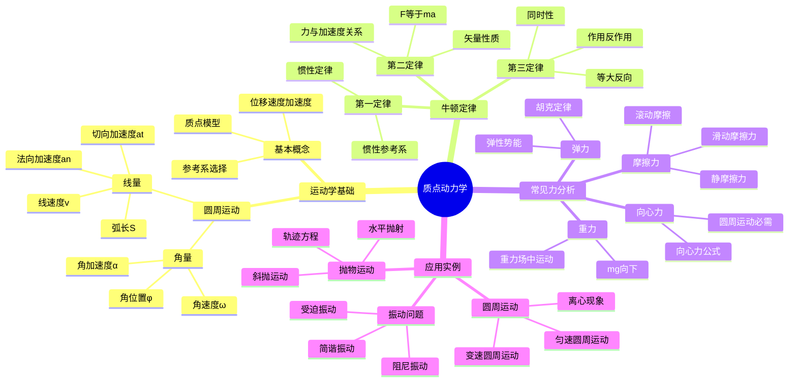

# 大学物理笔记：质点运动学与动力学

**课程来源**: 《大学物理与实验一》  
**授课**: 曹喻霖  
**学校**: 深圳职业技术大学

## 📊 知识体系思维导图

---

## 第一部分：质点运动学 (回顾与深化)

### 1.1 核心概念回顾

- **基本物理概念**: 质点、参照系、位移、速度、加速度
- **数学工具**: 坐标系、矢量、微积分

### 1.2 圆周运动 (Circular Motion)

**线量与角量**

- **角量**:
  - 角位置 (Angular Position): $\phi$
  - 角速度 (Angular Velocity): $\omega = \frac{d\phi}{dt}$
  - 角加速度 (Angular Acceleration): $\alpha = \frac{d\omega}{dt}$

  > **💡 物理意义**: 角量描述转动的快慢和变化，是转动运动的基本物理量。
  > 
  > **🔧 实际应用**: 汽车转速表显示的就是角速度，单位常用rpm（转/分钟）。

- **线量**:
  - 弧长 (Arc Length): S
  - 线速度 (Linear Velocity): $v = \frac{dS}{dt}$
  - 切向加速度 (Tangential Acceleration): $a_t = \frac{dv}{dt}$，反映速度大小的变化率
  - 法向加速度 (Normal Acceleration): $a_n = \frac{v^2}{R}$，反映速度方向的变化率

  > **💡 物理意义**: 线量描述圆周上各点的运动状态，是我们直接观察到的运动效果。
  > 
  > **🔧 实际应用**: 
  > - **切向加速度**: 汽车启动时轮胎上各点的切向加速度
  > - **法向加速度**: 过山车在圆形轨道上产生的向心加速度

- **两者关系**:
  - $S = \phi R$
  - $v = \omega R$
  - $a_t = \alpha R$

  > **❓ 为什么有这些关系**: 因为弧长等于角度乘以半径，对时间求导就得到速度和加速度的关系。
  > 
  > **🎯 实际意义**: 同一个转动物体，离轴越远的点线速度越大，这解释了为什么大齿轮带动小齿轮时小齿轮转得更快。

**【例题 1：圆周运动】**

- **题目**: 质点沿半径为 0.1m 的圆周运动，其角位置 $\phi = 2 + 4t^2$ (SI)。求 $t = 2s$ 时，质点的法向加速度 $a_n$ 和切向加速度 $a_t$。

- **解题思路**:
  1. 对角位置 $\phi(t)$ 求导得到角速度 $\omega(t)$ 和角加速度 $\alpha(t)$
  2. $\omega(t) = \frac{d\phi}{dt} = 8t$
  3. $\alpha(t) = \frac{d\omega}{dt} = 8$
  4. 代入 $t = 2s$ 求出瞬时值：$\omega(2) = 16 rad/s$, $\alpha(2) = 8 rad/s^2$
  5. 利用关系式计算 $a_n$ 和 $a_t$

- **解答**:
  - $a_n = \omega^2 R = (16)^2 \times 0.1 = 25.6 m/s^2$
  - $a_t = \alpha R = 8 \times 0.1 = 0.8 m/s^2$

---

## 第二部分：质点动力学 (Dynamics of Mass Point)

### 2.1 牛顿运动定律与常见力

- **牛顿三定律**:
  - **第一定律 (惯性定律)**: 物体保持静止或匀速直线运动状态，直到有外力改变这种状态
    
    > **💡 物理意义**: 定义了惯性概念，确立了惯性参考系的存在
    > 
    > **🔧 实际应用**: 汽车安全带、太空飞行器的惯性导航
    > 
    > **❓ 为什么重要**: 它不是第二定律的特例，而是确立了"无外力时的运动状态"这一基准
  
  - **第二定律** ($\vec{F} = m\vec{a}$): 物体的加速度与所受合外力成正比，与质量成反比
    
    > **💡 物理意义**: 建立了力、质量、加速度之间的定量关系，是动力学的核心
    > 
    > **🔧 实际应用**: 火箭推进、汽车制动距离计算、运动员训练
    > 
    > **❓ 为什么是矢量形式**: 因为力和加速度都有方向，必须考虑方向的一致性
  
  - **第三定律 (作用与反作用定律)**: 两物体间的作用力和反作用力大小相等、方向相反
    
    > **💡 物理意义**: 揭示了力的相互性，力总是成对出现的
    > 
    > **🔧 实际应用**: 火箭推进原理、走路时脚与地面的相互作用、游泳时手与水的相互作用
    > 
    > **❓ 为什么不会抵消**: 因为作用力和反作用力作用在不同物体上，不能简单相加

---

## 📖 考试宝典

### 🔥 高频考点总结

#### 1. **圆周运动角量与线量**（必考，15-20分）
- **角量定义**：
  - 角位置：$\phi$
  - 角速度：$\omega = \frac{d\phi}{dt}$
  - 角加速度：$\alpha = \frac{d\omega}{dt}$
- **线量定义**：
  - 线速度：$v = \frac{ds}{dt}$
  - 切向加速度：$a_t = \frac{dv}{dt}$
  - 法向加速度：$a_n = \frac{v^2}{R}$
- **转换关系**：$s = \phi R$，$v = \omega R$，$a_t = \alpha R$

#### 2. **牛顿三定律**（必考，20-25分）
- **第一定律**：惯性定律，定义惯性参考系
- **第二定律**：$\vec{F} = m\vec{a}$，矢量形式
- **第三定律**：作用力与反作用力，等大反向，作用在不同物体上

#### 3. **圆周运动动力学**（常考，15-20分）
- **向心力**：$F_c = m\frac{v^2}{R} = m\omega^2 R$
- **向心加速度**：$a_c = \frac{v^2}{R} = \omega^2 R$
- **力的来源**：重力、弹力、摩擦力等提供向心力

#### 4. **运动学公式应用**（常考，12-18分）
- **匀变速直线运动**：$v = v_0 + at$，$s = v_0t + \frac{1}{2}at^2$
- **匀变速圆周运动**：$\omega = \omega_0 + \alpha t$，$\phi = \omega_0 t + \frac{1}{2}\alpha t^2$
- **抛物运动**：水平和竖直方向分别处理

#### 5. **力的分析与合成**（必考，10-15分）
- **受力分析**：重力、弹力、摩擦力、向心力
- **力的合成**：矢量合成，分量法
- **平衡条件**：$\sum \vec{F} = 0$

### ⚡ 快速解题技巧

1. **看到"圆周运动"** → 想到角量与线量的转换关系
2. **看到"切向、法向"** → 想到$a_t = \alpha R$，$a_n = \frac{v^2}{R}$
3. **看到"牛顿定律"** → 想到$\vec{F} = m\vec{a}$的矢量性
4. **看到"向心力"** → 想到$F_c = m\frac{v^2}{R}$
5. **看到"作用反作用"** → 想到等大反向，不同物体
6. **看到"抛物运动"** → 想到水平匀速，竖直匀加速

### 🎯 标准答题模板

#### **圆周运动计算题标准格式**：
1. **建立坐标系**（选择合适的参考系）
2. **写出运动学关系**（角量与线量转换）
3. **求导得到所需量**（位置→速度→加速度）
4. **应用动力学定律**（$\vec{F} = m\vec{a}$）
5. **代入数值计算**（注意单位统一）
6. **检查结果合理性**（数量级、方向等）

---

## ⚠️ 易错点数据库

### 🚨 概念类易错点

#### 1. **角量与线量关系混淆**
- ❌ **错误**：认为$v = \omega$，$a = \alpha$
- ✅ **正确**：$v = \omega R$，$a_t = \alpha R$
- **易错原因**：忽略了半径R的作用

#### 2. **切向加速度与法向加速度**
- ❌ **错误**：认为圆周运动只有向心加速度
- ✅ **正确**：
  - 匀速圆周运动：只有法向加速度$a_n = \frac{v^2}{R}$
  - 变速圆周运动：既有切向加速度$a_t$又有法向加速度$a_n$
- **物理意义**：$a_t$改变速度大小，$a_n$改变速度方向

#### 3. **牛顿第三定律理解错误**
- ❌ **错误**：认为作用力和反作用力会相互抵消
- ✅ **正确**：作用在不同物体上，不能抵消
- **关键点**：同时性、等大、反向、不同物体

#### 4. **向心力的来源**
- ❌ **错误**：认为向心力是一种新的力
- ✅ **正确**：向心力是效果力，由重力、弹力、摩擦力等提供
- **实例**：地球绕太阳转动时，万有引力提供向心力

### 🚨 计算类易错点

#### 1. **角速度单位换算错误**
- ❌ **错误**：直接用rpm作为角速度
- ✅ **正确**：$\omega(rad/s) = \frac{2\pi \times n(rpm)}{60}$
- **常见错误**：1800 rpm ≠ 1800 rad/s

#### 2. **圆周运动中的加速度计算**
- ❌ **错误**：$a = \frac{v^2}{R}$（只考虑法向）
- ✅ **正确**：
  - 总加速度：$\vec{a} = \vec{a_t} + \vec{a_n}$
  - 大小：$|\vec{a}| = \sqrt{a_t^2 + a_n^2}$

#### 3. **牛顿第二定律的矢量性**
- ❌ **错误**：只考虑力的大小，忽略方向
- ✅ **正确**：$\vec{F} = m\vec{a}$，必须考虑方向
- **解题技巧**：建立坐标系，分量求解

#### 4. **抛物运动的处理**
- ❌ **错误**：把抛物运动当作一维运动
- ✅ **正确**：分解为水平匀速运动和竖直匀加速运动
- **关键**：$x = v_0 \cos\theta \cdot t$，$y = v_0 \sin\theta \cdot t - \frac{1}{2}gt^2$

### 🎯 实验操作易错点

#### 1. **参考系选择不当**
- **问题**：选择了非惯性参考系
- **后果**：牛顿定律不适用，出现虚拟力
- **解决**：选择惯性参考系（地面、实验室）

#### 2. **受力分析不完整**
- **问题**：遗漏某些力或多加了力
- **后果**：动力学方程错误
- **解决**：系统地分析每个接触点和场力

#### 3. **圆周运动中心的确定**
- **问题**：错误确定圆心位置
- **后果**：半径R计算错误，影响所有结果
- **解决**：仔细分析几何关系

### 🔍 考试陷阱识别

1. **单位陷阱**：
   - 角速度：rad/s vs rpm
   - 角度：弧度制 vs 角度制

2. **公式陷阱**：
   - $a_n = \frac{v^2}{R}$ vs $a_n = \omega^2 R$
   - 切向加速度与法向加速度的区别

3. **概念陷阱**：
   - 向心力不是一种基本力
   - 作用力与反作用力的对象

4. **计算陷阱**：
   - 矢量运算的方向性
   - 分量法的正负号

---

## 📋 速查手册

### 🔧 核心公式速查表

| **类别** | **公式** | **适用条件** |
|---------|----------|-------------|
| **角量定义** | $\omega = \frac{d\phi}{dt}$，$\alpha = \frac{d\omega}{dt}$ | 转动运动 |
| **线量定义** | $v = \frac{ds}{dt}$，$a_t = \frac{dv}{dt}$，$a_n = \frac{v^2}{R}$ | 圆周运动 |
| **角线转换** | $s = \phi R$，$v = \omega R$，$a_t = \alpha R$ | 刚体转动 |
| **牛顿第二定律** | $\vec{F} = m\vec{a}$ | 惯性参考系 |
| **向心力** | $F_c = m\frac{v^2}{R} = m\omega^2 R$ | 圆周运动 |
| **匀变速运动** | $v = v_0 + at$，$s = v_0t + \frac{1}{2}at^2$ | 直线运动 |
| **匀变速转动** | $\omega = \omega_0 + \alpha t$，$\phi = \omega_0 t + \frac{1}{2}\alpha t^2$ | 转动运动 |

### 📏 常用物理量单位速查表

| **物理量** | **符号** | **SI单位** | **常用单位** |
|-----------|----------|-----------|-------------|
| **角位置** | $\phi$ | rad | 度（°） |
| **角速度** | $\omega$ | rad/s | rpm, r/min |
| **角加速度** | $\alpha$ | rad/s² | - |
| **线速度** | $v$ | m/s | km/h |
| **加速度** | $a$ | m/s² | - |
| **力** | $F$ | N | kgf, lbf |
| **质量** | $m$ | kg | g, t |

### 🔢 常用数值速查表

| **常数** | **数值** | **用途** |
|---------|----------|----------|
| **重力加速度** | $g = 9.8 m/s^2$ | 重力计算 |
| **圆周率** | $\pi = 3.14159$ | 圆周运动 |
| **弧度换算** | $1 rad = 57.3°$ | 角度转换 |
| **转速换算** | $1 rpm = \frac{\pi}{30} rad/s$ | 角速度转换 |

### 📊 运动类型判断速查表

| **运动类型** | **特征** | **关键公式** |
|-------------|----------|-------------|
| **匀速直线运动** | $a = 0$ | $s = vt$ |
| **匀变速直线运动** | $a = 常数$ | $v^2 = v_0^2 + 2as$ |
| **匀速圆周运动** | $\omega = 常数$ | $a_n = \frac{v^2}{R}$ |
| **变速圆周运动** | $\alpha \neq 0$ | $a = \sqrt{a_t^2 + a_n^2}$ |
| **抛物运动** | 重力作用 | $x = v_0 \cos\theta \cdot t$ |

### ⏰ 解题时间分配建议

| **题型** | **建议时间** | **关键步骤** |
|---------|-------------|-------------|
| **概念选择题** | 2-3分钟 | 快速判断，理解概念 |
| **公式应用题** | 5-8分钟 | 选公式，代数值 |
| **圆周运动题** | 8-12分钟 | 建坐标系，分析受力 |
| **综合分析题** | 15-20分钟 | 分步骤，画图分析 |

### 🎯 考前必背清单

#### **公式必背**（开考前默写）
1. $v = \omega R$，$a_t = \alpha R$
2. $a_n = \frac{v^2}{R} = \omega^2 R$
3. $\vec{F} = m\vec{a}$
4. $F_c = m\frac{v^2}{R}$
5. $v^2 = v_0^2 + 2as$

#### **概念必背**
- 角量与线量的区别和联系
- 切向加速度与法向加速度
- 牛顿三定律的内容和应用
- 向心力的来源和计算

#### **单位换算**
- 1 rpm = π/30 rad/s
- 1 rad = 57.3°
- 重力加速度 g = 9.8 m/s²

#### **检查要点**
- [ ] 角量线量是否正确转换
- [ ] 受力分析是否完整
- [ ] 矢量方向是否正确
- [ ] 单位是否统一
- [ ] 数量级是否合理

---

## 💪 分层次例题体系

### 🟢 第一层：基础理解题（送分题，必须全对）

#### 例题1-1：概念辨析（必考点）
**【题目】** 关于圆周运动的角量和线量，下列说法正确的是（ ）
A. 角速度ω的单位是m/s
B. 线速度v = ωr，其中r是半径
C. 角加速度α = v/r
D. 切向加速度只改变速度方向

**【标准解答】** B

**【解题要点】**
- 角速度ω单位：rad/s
- 线速度与角速度关系：v = ωr
- 角加速度：α = dω/dt
- 切向加速度改变速度大小，法向加速度改变速度方向

**【易错提醒】**
❌ 不要混淆角量和线量的单位
❌ 不要混淆切向加速度和法向加速度的作用
❌ 注意半径r的作用

#### 例题1-2：基础计算（送分题）
**【题目】** 质点沿半径R=0.5m的圆周运动，角速度ω=4 rad/s，求：
(1) 线速度v  (2) 向心加速度an

**【标准解题步骤】**
第一步：计算线速度
$$v = \omega R = 4 \times 0.5 = 2.0 \text{ m/s}$$

第二步：计算向心加速度
$$a_n = \frac{v^2}{R} = \frac{(2.0)^2}{0.5} = 8.0 \text{ m/s}^2$$

或者：$$a_n = \omega^2 R = (4)^2 \times 0.5 = 8.0 \text{ m/s}^2$$

**【得分要点】**
- 公式选择正确 (2分)
- 数值代入正确 (2分)
- 计算结果准确 (2分)
- 单位标注正确 (1分)

#### 例题1-3：牛顿定律理解（高频考点）
**【题目】** 关于牛顿三定律，下列说法错误的是（ ）
A. 第一定律定义了惯性参考系
B. 第二定律F=ma中，F是合外力
C. 第三定律中作用力和反作用力作用在同一物体上
D. 第三定律中作用力和反作用力同时产生、同时消失

**【标准解答】** C

**【解题要点】**
- 第一定律：惯性定律，定义惯性参考系
- 第二定律：F是合外力，具有矢量性
- 第三定律：作用力和反作用力作用在不同物体上
- 作用力和反作用力具有同时性

**【关键理解】**
- 作用力和反作用力不会相互抵消（不同物体）
- 合外力为零时物体保持匀速直线运动或静止
- 力是矢量，要考虑方向

### 🟡 第二层：应用计算题（拉开差距）

#### 例题2-1：圆周运动动力学（高频考点）
**【题目】** 质量m=2kg的物体在水平面上做半径R=1m的匀速圆周运动，线速度v=3m/s。物体与地面间的动摩擦因数μ=0.2，求：
(1) 向心力大小  (2) 摩擦力的大小和方向

**【解题模板】**
第一步：分析受力情况
- 重力：mg（竖直向下）
- 支持力：N（竖直向上）
- 摩擦力：f（水平，提供向心力）

第二步：计算向心力
$$F_c = m\frac{v^2}{R} = 2 \times \frac{(3)^2}{1} = 18 \text{ N}$$

第三步：分析摩擦力
- 竖直方向：N = mg = 2 × 10 = 20 N
- 最大静摩擦力：f_max = μN = 0.2 × 20 = 4 N
- 所需向心力：18 N > 4 N

第四步：判断运动状态
由于所需向心力大于最大摩擦力，物体无法维持匀速圆周运动，会发生滑动。

**【关键分析】**
- 向心力必须由其他力提供
- 摩擦力有最大值限制
- 要判断运动的可能性

**【易错点】**
❌ 认为向心力是一种新的力
❌ 忽略摩擦力的最大值限制
❌ 不考虑运动的可能性

#### 例题2-2：变速圆周运动
**【题目】** 质点沿半径R=2m的圆周运动，角位置φ = 2t² + 3t（SI单位），求t=2s时：
(1) 角速度ω和角加速度α  (2) 切向加速度at和法向加速度an

**【解题思路】**
第一步：求角速度和角加速度
$$\omega = \frac{d\phi}{dt} = 4t + 3$$
$$\alpha = \frac{d\omega}{dt} = 4 \text{ rad/s}^2$$

第二步：计算t=2s时的数值
$$\omega(2) = 4 \times 2 + 3 = 11 \text{ rad/s}$$
$$\alpha(2) = 4 \text{ rad/s}^2$$

第三步：计算切向加速度和法向加速度
$$a_t = \alpha R = 4 \times 2 = 8 \text{ m/s}^2$$
$$a_n = \omega^2 R = (11)^2 \times 2 = 242 \text{ m/s}^2$$

第四步：计算总加速度
$$a = \sqrt{a_t^2 + a_n^2} = \sqrt{8^2 + 242^2} = 242.1 \text{ m/s}^2$$

**【重要概念】**
- 切向加速度：改变速度大小
- 法向加速度：改变速度方向
- 总加速度：矢量合成

#### 例题2-3：抛物运动分析
**【题目】** 从高度h=20m处水平抛出一物体，初速度v₀=10m/s，不计空气阻力，求：
(1) 飞行时间  (2) 水平射程  (3) 落地速度

**【解题步骤】**
第一步：建立坐标系
- x轴：水平方向（初速度方向）
- y轴：竖直向下为正

第二步：列出运动方程
- 水平方向：x = v₀t = 10t
- 竖直方向：y = ½gt² = 5t²

第三步：计算飞行时间
当y = h = 20m时：
$$20 = 5t^2 \Rightarrow t = 2 \text{ s}$$

第四步：计算水平射程
$$x = v_0 t = 10 \times 2 = 20 \text{ m}$$

第五步：计算落地速度
- 水平分量：vₓ = v₀ = 10 m/s
- 竖直分量：vᵧ = gt = 10 × 2 = 20 m/s
- 合速度：$$v = \sqrt{v_x^2 + v_y^2} = \sqrt{10^2 + 20^2} = 22.4 \text{ m/s}$$

**【抛物运动要点】**
- 水平方向匀速运动
- 竖直方向匀加速运动
- 两个方向相互独立

### 🔴 第三层：综合分析题（拔高题）

#### 例题3-1：复杂圆周运动分析
**【题目】** 如图所示，质量为m的小球用长度为L的轻绳悬挂，在竖直平面内做圆周运动。已知小球在最高点的速度为v₁，求：
(1) 小球在最高点时绳子的张力
(2) 小球在最低点的速度v₂
(3) 小球能完成完整圆周运动的最小速度条件

**【深度分析】**
第一步：最高点受力分析
- 重力：mg（向下）
- 绳子张力：T₁（向下，提供向心力）
- 向心力方程：$$mg + T_1 = m\frac{v_1^2}{L}$$
- 绳子张力：$$T_1 = m\frac{v_1^2}{L} - mg$$

第二步：能量守恒分析（最高点到最低点）
$$\frac{1}{2}mv_1^2 + mg(2L) = \frac{1}{2}mv_2^2$$
$$v_2^2 = v_1^2 + 4gL$$
$$v_2 = \sqrt{v_1^2 + 4gL}$$

第三步：完整圆周运动条件
在最高点，绳子张力T₁ ≥ 0：
$$m\frac{v_{1,min}^2}{L} - mg \geq 0$$
$$v_{1,min} = \sqrt{gL}$$

在最低点的最小速度：
$$v_{2,min} = \sqrt{v_{1,min}^2 + 4gL} = \sqrt{gL + 4gL} = \sqrt{5gL}$$

**【物理意义深入理解】**
1. **临界条件**：最高点绳子张力刚好为零
2. **能量转换**：动能与重力势能相互转换
3. **约束条件**：绳子只能提供拉力，不能提供推力

#### 例题3-2：多物体系统动力学
**【题目】** 如图所示，质量为M的楔形物体放在光滑水平面上，楔面倾角为θ，质量为m的小物体从楔面顶端由静止开始下滑。楔面与小物体间无摩擦。求小物体的加速度和楔形物体的加速度。

**【系统分析】**
第一步：选择参考系和坐标系
- 以地面为参考系
- 设楔形物体向右的加速度为A
- 设小物体相对楔面的加速度为a（沿楔面向下）

第二步：小物体的运动分析
小物体在地面参考系中的加速度：
- 水平分量：aₓ = A - a cos θ
- 竖直分量：aᵧ = a sin θ

第三步：受力分析
**小物体受力**：
- 重力：mg（竖直向下）
- 楔面支持力：N（垂直楔面向上）

**楔形物体受力**：
- 重力：Mg（竖直向下）
- 地面支持力：(M+m)g（竖直向上）
- 小物体压力：N（垂直楔面向下）

第四步：牛顿第二定律
**对小物体**：
- 沿楔面方向：mg sin θ = ma
- 垂直楔面方向：N = mg cos θ

**对楔形物体**：
- 水平方向：N sin θ = MA

第五步：求解加速度
从小物体沿楔面方向：$$a = g \sin \theta$$
从楔形物体水平方向：$$A = \frac{N \sin \theta}{M} = \frac{mg \cos \theta \sin \theta}{M}$$

**【深入思考】**
1. **相对运动**：小物体相对楔面和相对地面的运动不同
2. **约束条件**：两物体间的相互作用力
3. **守恒定律**：系统动量守恒（水平方向无外力）

#### 例题3-3：圆周运动的临界问题
**【题目】** 汽车在水平圆形跑道上行驶，跑道半径R=100m，汽车与地面间的动摩擦因数μ=0.6。求：
(1) 汽车安全行驶的最大速度
(2) 如果跑道有倾斜角θ=30°，汽车安全行驶的速度范围

**【临界分析】**
第一步：水平跑道分析
向心力由摩擦力提供：
$$f = \mu mg = m\frac{v_{max}^2}{R}$$
$$v_{max} = \sqrt{\mu gR} = \sqrt{0.6 \times 10 \times 100} = 24.5 \text{ m/s}$$

第二步：倾斜跑道分析
**受力分析**：
- 重力：mg
- 支持力：N（垂直路面）
- 摩擦力：f（沿路面，方向待定）

**力的分解**：
- 径向：N sin θ ± f cos θ = mv²/R
- 法向：N cos θ ± f sin θ = mg

第三步：临界条件分析
**最大速度**（摩擦力指向圆心）：
$$N \sin \theta + f \cos \theta = m\frac{v_{max}^2}{R}$$
$$N \cos \theta - f \sin \theta = mg$$
其中 f = μN

**最小速度**（摩擦力背离圆心）：
$$N \sin \theta - f \cos \theta = m\frac{v_{min}^2}{R}$$
$$N \cos \theta + f \sin \theta = mg$$

第四步：求解速度范围
解得：
$$v_{max} = \sqrt{gR \frac{\sin \theta + \mu \cos \theta}{\cos \theta - \mu \sin \theta}}$$
$$v_{min} = \sqrt{gR \frac{\sin \theta - \mu \cos \theta}{\cos \theta + \mu \sin \theta}}$$

**【工程应用思考】**
1. **安全设计**：公路弯道的设计原理
2. **临界条件**：摩擦力方向的改变
3. **实际因素**：天气、轮胎状况对安全的影响

### 📊 例题难度分布建议

| 难度层次 | 题目数量 | 考试占比 | 复习重点 |
|---------|---------|----------|----------|
| **基础理解题** | 12-15题 | 35-45% | 概念理解、公式应用 |
| **应用计算题** | 8-12题 | 40-50% | 圆周运动、牛顿定律 |
| **综合分析题** | 3-5题 | 10-20% | 复杂系统、临界问题 |

### 🎯 专项训练计划

#### **第一周：基础概念强化**
- **目标**：掌握角量线量关系和牛顿定律
- **内容**：
  - 圆周运动的基本概念和公式
  - 牛顿三定律的理解和应用
  - 向心力的来源和计算
- **练习**：每天4-5道概念题

#### **第二周：计算能力提升**
- **目标**：熟练掌握圆周运动和抛物运动
- **内容**：
  - 匀速和变速圆周运动计算
  - 抛物运动的分解和合成
  - 复杂受力情况的分析
- **练习**：每天3-4道计算题

#### **第三周：综合应用训练**
- **目标**：解决复杂的动力学问题
- **内容**：
  - 多物体系统的动力学分析
  - 临界条件和约束问题
  - 能量和动量的综合应用
- **练习**：每天2-3道综合题

### 🏆 考试冲刺要点

#### **必背公式**
1. $v = \omega R$，$a_t = \alpha R$
2. $a_n = \frac{v^2}{R} = \omega^2 R$
3. $\vec{F} = m\vec{a}$（矢量形式）
4. $F_c = m\frac{v^2}{R}$（向心力）
5. 抛物运动：$x = v_0 t$，$y = \frac{1}{2}gt^2$

#### **关键概念**
- 角量与线量的转换关系
- 切向加速度与法向加速度的区别
- 向心力的来源（不是新的力）
- 牛顿三定律的适用条件

#### **解题技巧**
- 建立合适的坐标系
- 正确进行受力分析
- 区分矢量和标量
- 注意临界条件的判断

#### **常见陷阱**
- 角速度单位换算（rpm ↔ rad/s）
- 向心力方向（指向圆心）
- 作用力与反作用力的对象
- 参考系的选择

---
